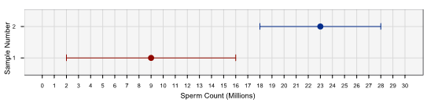
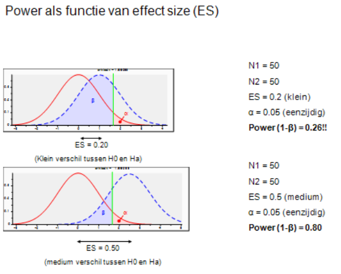

\vspace{20ex}

**Please prepare all exercises in this document for the tutorial meeting.**

Literature: Field (5th ed, 2018) Chapter. 2 & 3, Simmons, Nelson, & Simonsohn (2011)

If you use the old 4th edition of the textbook, please find the corresponding chapter numbers in this table:

| **4th** edition        | **5th** edition                     |
| ---------------------- | ----------------------------------- |
| Chapter 2              | Chapter 2 & 3                       |


\newpage

# Chapter 2 & 3

**(1A)**
We wanted to estimate the average amount of friends people have on Facebook in a Dutch population of Facebook-users between 18-25 years old. For this purpose we took a random sample of 11 people from this population and registered the number of friends that they had on Facebook. We calculated the mean for these data as 96.64 and the standard deviation as 61.27. Calculate a 95% confidence interval for the population mean.

**(1B)**
Recalculate the confidence interval assuming that the sample size was 56.

**(1C)**
What are the null and alternative hypotheses or the following questions?

1. Is there any relationship between the amount of gibberish (Dutch: *brabbeltaal*) that people speak and the amount of vodka jelly they’ve eaten?
2. Is the mean amount of chocolate eaten higher when writing statistics books then when not?

**(1D)**
Why do we use samples?

**(1E)**
What is the mean and how do we tell if it’s representative of our data?

**(1F)**
What is the difference between the standard deviation and the standard error?

**(1G)**
Assume you have for response times measured in seconds (e.g. the time a person needs to solve different puzzles): 18, 16, 18, 24.

Calculate by hand:

1. the sums of squares ($SS$)
2. the variance ($s^2$)
3. the standard deviation ($s$)
4. the standard error of the mean ($SE_{\overline{x}}$)

Use the table below for the intermediate calculations:

| Value $x_i$ | Mean $\overline{x}$ | Difference $(x_i-\overline{x})$ | Difference squared $(x_i-\overline{x})^2$ |
| ----------- | ------------------- | ------------------------------- | ----------------------------------------- |
| 18          | 19                  | $\ldots$                        | $\ldots$                                  |
| 16          | 19                  | $\ldots$                        | $\ldots$                                  |
| 18          | 19                  | $\ldots$                        | $\ldots$                                  |
| 24          | 19                  | $\ldots$                        | $\ldots$                                  |

Mean $\overline{x} =\frac1n \sum x_i = \frac{18+16+18+24}{4}=19$

\newpage
1. The sums of squares is $$SS = \sum(x_i-\overline{x})^2$$
2. The variance is the sum of squared errors divided by the degrees of freedom $(df=N -1)$:
$$s^2= \frac{\sum(x_i-\overline{x})^2}{N-1}$$
3. The standard deviation is square root of the variance: $$s = \sqrt{s^2}= \sqrt{\frac{\sum(x_i-\overline{x})^2}{N-1}}$$
4. The standard error of the mean is $$SE_{\overline{x}} = \frac{s}{\sqrt{N}}$$


**(1H)**
What do the sums of squares, variance, and standard deviation represent? How do they differ?

**(1I)**
What is a test statistic and what does it tell us?

**(1J)**
What are type I and type II errors?

**(1K)**
What is an effect size and how is it measured?

**(1L)**
What is statistical power?


\newpage
# Article of  Simmons, Nelson, & Simonsohn (2011)

**False-positive psychology, discussion about research ethics**


**(2A)**
What is meant by false positives in the paper by Simmons, Nelson, & Simonsohn (2011)?


**(2B)**
Why are false positives considered costly errors? (Name three undesired consequences of false positives)

**(2C)**
What is meant by researcher degrees of freedom?

**(2D)**
Explain why using too many researcher degrees of freedom may lead to false positive findings. Give an example of such “exploratory” research conduct that may lead to false positive findings.

**(2E)**
To be able to understand the problem of “flexibility in sample size”, we will first explain why the Power of a significance test of increases with the sample size. Consider the following figure from Field, p.59:

```{r, echo=FALSE, fig.align="center",  out.width = '100%'}

```

The above figure displays two 95% confidence intervals for the mean sperm count in Japanese quail (cf., Domjan, Blesbois, & Williams, 1998) in two different groups of $N = 200$ each, sample 1: wild quail and sample 2: experimentally stimulated quail (with the aim to enhance sperm release).

1. Explain how the 95% confidence intervals for the mean sperm count are computed.
2. Explain how the $H_0: \mu1 = \mu2$ can be tested with $\alpha = 0.05$ by inspecting the 95% confidence intervals.
3. For the above example, explain how a smaller sample of, say, $N = 20$ in each group, would decrease the likelihood of rejecting the $H_0: \mu1 = \mu2$, *given that the current difference between both means will stay the same*.


**(2F)**
Explain how striving for a high statistical power, but on the other hand striving for limited costs, may lead to “flexibility in sample size”.

**(2G)**
Why is it undesirable to keep adding participants to the sample until a significant result has been found?

**(2H)**
What recommendations do Simmons, Nelson, and Simonsohn (2011) have for (psychological) researchers?


\newpage\appendix

# Answers

## Chapter 2 & 3 


**Answer 1A**

The 95% CI is an interval constructed such that in 95% of samples the true value of the population mean will fall within its limits.

First we need to calculate the standard error
$$\sigma_{\overline{X}}=\frac{s}{\sqrt{N}}=\frac{61.27}{\sqrt{11}}=18.47$$

*Shall we use $z$-values or $t$-values to compute CI?*

* If we have a **large sample size**, we know from the central limit theorem that sampling distributions will be normally distributed. In this case we use simply the $z_{1-p \over 2} = z_{0.025} = \pm 1.96$.
* If we have a **small sample size**, we are not sure about normality and are more conservative. That is, we use instead $t_{n-1}$.

But what is small and what is large? Unfortunately, different textbooks make here different suggestions. E.g Field $5^{th}$ edition says that sample sizes larger 30 can be considered as large. Other textbooks or older Field editions use here different cutoff criteria, e.g. larger 60. 

With $n=11$, it's clearly a small sample size and we use $t$-values. To compute the margin of error for the mean, we need to find the appropriate value of $t$. To do so, we calulate the degrees of freedom $df=N-1$. With 11 data points the degrees of freedom is $df=10$. For a 95% confidence interval, we look up the value in the column labbeled ``Two-Tailed Test'', '0.05' in the table of the critical values of the $t$-distribution (see the Appendix of the Field book). The corresponding value is $t=2.23$

The confidence intervals ($CI$) are therefore:

* Lower bounder of the $CI = \overline{X}- (2.23 \times SE) = 96.64-(2.23\times 18.47) = 55.45$\footnote{Please note, your results might not be exactly the same. The results in the 
exercises might deviate slightly ($\pm0.2$) due to differences in the rounding and the precision of the underlying calculations.}

* Upper bounder of the $CI = \overline{X}+ (2.23 \times SE) = 96.64+(2.23\times 18.47) = 137.83$


\newpage 

**Answer  1B**

The new standard error is
$$\sigma_{\overline{X}}=\frac{s}{\sqrt{N}}=\frac{61.27}{\sqrt{56}}=8.19$$

Based on different suggestions, you might use $z$- or $t$-values (see above).

**If you decide to use $t$-values**, the appropriate value for $t$ with $df = N-1= 55$ can be read directly from the $t$-table in Field: $t(55) = 2.004 \approx 2.00$. If your $t$-table does not comprise a $t$-value for $df=55$ (e.g. older Field edition), you should use the conservative approximation of $t(50) = 2.01$.

The 95% CI for $N =56$ is: $$CI = \overline{X} \pm t(55) \times SE$$

* Lower bounder of the $CI = 96.64-(2.00\times 8.19) = 80.26$
* Upper bounder of the $CI = 96.64+(2.00\times 8.19) = 113.02$

**If you decide to use $z$-values**, as suggested in Field's $5^{th}$ edition, the 95% CI is:
$$CI = \overline{X} \pm z_{0.025}  \times SE$$

* Lower bounder of the $CI =  96.64-(1.96\times 8.19) = 80.58$
* Upper bounder of the $CI =  96.64+(1.96\times 8.19) = 112.69$


*Note*: The 95% CI of the mean is the smallest for $N =56$. That is, the “margin of error” ($t(df) \times SE$) of the mean is smaller in larger samples. This means that larger samples produce more reliable estimates of the population mean. That is, estimates in larger samples will show less variability across samples than estimates in smaller samples.


**Answer  1C**

Case 1

* **Null Hypothesis**: There will be no relationship between the amount of gibberish that people speak and the amount of vodka jelly they’ve eaten.
* **Alternative Hypothesis**: There will be a relationship between the amount of gibberish that people speak and the amount of vodka jelly they’ve eaten.

Case 2

* **Null Hypothesis**: There will be no difference in the mean amount of chocolateeaten when writing statistics textbooks compared to when not writing them.
* **Alternative Hypothesis**: The mean amount of chocolate eaten when writing statistics textbooks will be higher than when not writing them.

*Note*: It is important to distinguish between checking that a potential effect is in the `right'' direction (thus making one-sided prediction about the effect) and testing one-sided statistically. The latter, thus dividing the $p$-value from SPSS by two, is advised against because of the increased risk at type I error.


**Answer  1D**

We are usually interested in populations, but because we cannot collect data from every human being in the population, we collect data from a small subset of the population (known as a sample) and use these data to infer things about the population as a whole.

\newpage
**Answer  1E**

The mean is a simple statistical model of the center of a distribution of scores. A hypothetical estimate of the ‘typical’ score. We use the variance, or standard deviation, to tell us how accurately the mean represents our data. The standard deviation is a measure of how much error there is associated with the mean: the smaller the standard deviation, the more accurately the mean represents the data.


**Answer  1F**

The standard deviation tells us how much observations in our sample differ from the mean value within our sample. The standard error tells us not about how the sample mean represents the sample itself, but how well the sample mean represents the population mean. The standard error is the standard deviation of the sampling distribution of a statistic. For a given statistic (e.g. the mean) it tells us how much variability there is in this statistic across samples from the same population. Large values, therefore, indicate that a statistic from a given sample may not be an accurate reflection of the population from which the sample came.

**Answer  1G**

| Value $x_i$ | Mean $\overline{x}$ | Difference $(x_i-\overline{x})$ | Difference squared $(x_i-\overline{x})^2$ |
| ----------- | ------------------- | ------------------------------- | ----------------------------------------- |
| 18          | 19                  | -1                      | 1     |
| 16          | 19                  | -3                      | 9     |
| 18          | 19                  | -1                      | 1     |
| 24          | 19                  | 5                       | 25    |


\begin{align*}
SS  & = \sum(x_i-\overline{x})^2=36 \\
s^2 &= \frac{\sum(x_i-\overline{x})^2}{N-1}=\frac{36}{3}=12 \\
s   &= \sqrt{s^2}= \sqrt{12}=3.46 \\
SE_{\overline{x}} &= \frac{s}{\sqrt{N}}=\frac{3.46}{\sqrt{4}}=1.73
\end{align*}


**Answer  1H**

All of these measures tell us something about how well the mean fits the observed sample data. Large values (relative to the scale of measurement) suggest the mean is apoor fit of the observed scores, and small values suggest a good fit. They are, therefore, measures of dispersion with large values indicating a spread-out distribution of scores and small values showing a more tightly packed distribution. These measures all represent the same thing, but differ in how they express it. The sum of squared errors is a ‘total’ and is, therefore, affected by the number of data points. The variance is the ‘average’ variability but units squared. The standard deviation is the average variation but converted back to the original units of measurement. As such, the size of the standard deviation can be compared to the mean (because they are in the same units of measurement).


**Answer  1I**

A test statistic is a statistic for which we know how frequently different values occur. The observed value of such a statistic is typically used to test hypotheses, or to establish whether a model is a reasonable representation of what’s happening in the population.


**Answer  1J**

A Type I error occurs when we believe that there is a genuine effect in our population, when in fact there isn’t ($H_0$ is true). A Type II error occurs when we believe that there is no effect in the population when, in reality, there is ($H_a$ is true). There is a trade-off between both errors: if we lower the type I error risk (alpha) then we lower the probability of detecting a genuine effect (thus we increase the type II error risk).

|                           | **$H_0$ is true**       | **$H_a$ is true**       |
| ------------------------- | ----------------------- | ----------------------- |
| **$H_0$ is rejected**     | Type I error ($\alpha$) | Power ($1-\beta$)       |
|                           | *false positive*        | *correct decision*      |
|                           |                         |                         |
| **$H_0$ is not rejected** | $(1-\alpha$)            | Type II error ($\beta$) |
|                           | *correct decision*      | *false negative*        |


**Answer  1K**

An effect size is an objective and standardized measure of the magnitude of an observed effect. Measures include Cohen’s $d$, Pearson’s correlations coefficient $r$ and $\eta^2$ . An important advantage of effect sizes is, that they are not directly affected by sample size. In contrast, $p$-values tend to get smaller (for a given effect size) as the sample size increases.

*Note:* Effect sizes are standardized based on the standard deviation (for example, Cohen’s $d$ expresses the difference between two group means in units standard deviation), whereas test statistics divide the raw effect by the standard error. Thus, small effects can be statistically significant as long as the sample is large. As a consequence, statistically significant effects are not always practically relevant. It is recommend to report $p$-values, $CI$'s and effect size, because the three measures provide complementary information.


**Answer  1L**

Power is the probability that a test will detect an effect of a particular size (a value of 0.8 is a good level to aim for). Suggestion: explain the concept of statistical power by drawing both $H_0$ and $H_a$ on the white board and explain the concepts in the above table. E.g.:

```{r, echo=FALSE, fig.align="center",  out.width = '60%'}

```


## Article of  Simmons, Nelson, & Simonsohn (2011)

**False-positive psychology, discussion about research ethics**


**Answer  2A**

False positives are sample results that lead to rejecting the null hypothesis, while in fact there is no effect in the population. This is referred to as type I error (see previous exercise question 7.)


**Answer  2B**

In general Type I errors (false positives) are considered more undesirable than Type II errors (false negatives), because the (real and ethical) costs of implementing a new treatment or changing policy based on false effects are in general higher than (incorrectly) accepting the current treatment or policy.

See Simmons, Nelson, and Simonsohn (2011): “First, once they appear in the literature, false positives are particularly persistent. Because null results have many possible causes, failures to replicate previous findings are never conclusive. Furthermore, because it is uncommon for prestigious journals to publish null findings or exact replications, researchers have little incentive to even attempt them. Second, false positives waste resources: They inspire investment in fruitless research programs and can lead to ineffective policy changes. Finally, a field known for publishing false positives risks losing its credibility.”

**Answer  2C**

*Researcher degrees of freedom* refers to the flexibility of researchers in various aspects of data-collection, data-analysis and reporting results. Simmons, Nelson, and Simonsohn (2011) show by means of simulation studies that the false-positive rates exceeds the fixed level of 5% by far in case of flexibility in (a) choosing among dependent variables, (b) choosing sample size, (c) using covariates, and (d) reporting subsets of experimental conditions.


**Answer  2D**

The following information is meant to give you some idea of how to discuss the answer with the students.

To answer this question students must first realize what the $p$-value for a certain statistical test statistic (e.g. $t$-value) means. The $p$-value indicates the probability of finding the current sample result or more extreme when the null hypothesis is true. To decide whether we reject the null-hypothesis we compare the $p$-value of our test- statistic to the alpha of 0.05. If $p < 0.05$ we reject the null-hypothesis. When find a small $p$-value (say 0.006) we reject the null-hypothesis because we consider it unlikely that our sample statistic resulted from the $H_0$ population distribution (and thus we believe to have found a genuine effect). However, there still is a 5% risk to find our sample result given the $H_0$ population distribution, and thus to be wrong to reject $H_0$. Each time we conduct a significance test we take a 5% risk at rejecting $H_0$ falsely. Thus, all research conduct that is based on several (univariate) tests, each with a 5% type I error risk, e.g., “trying out” and then choosing among two dependent variables, or “trying out” and then choosing among several experimental conditions has an increased *overall* type I error risk.

One example of researchers degrees of freedom is, to include many variables in a predictive study, to include in the main analysis only those predictors that show significant correlations with the outcome. This is called the problem of *multiple testing*. For instance, we aim at predicting aggressive behavior in psychiatric patients but we have no fixed set of independent variables. Instead we include several psychological variables such as, psychotic complaints, impulse control, anger, anxiety, and intelligence, and subsequently use only those variables in the regression analysis that show a positive correlation with the dependent variable (aggressive behavior). The problem with “picking out” significant correlations from a correlation matrix is, that when in the population none of the predictors is correlated to the dependent variable, the overall probability of finding at least one significant correlation exceeds 5%. In fact it can be shown that for, in this example, 5 significance tests, the chance of finding at least one p-value < .05, when in fact all null-hypotheses are true is $1 - (.95)^5 = 0.23$. Thus, the overall risk to find a “false positive” correlation is 23% instead of 5%. If, subsequently, the researcher reports a regression model with only those predictors that were selected on the basis of correlating positively with the outcome variable, we have a regression model that is optimal given the sample, but might be too optimistic for the population of psychiatric patients. It is likely that in a new sample some of the selected predictors do not correlate significantly with the outcome, while other variables that were first discarded are now significantly correlated with the outcome.

*Tutor instruction*: the above example can be found in Nederlof et al. (2011), see assignments 1 and 2. We will discuss how such practice increases the true type I error rate.


**Answer  2E**

The 95% CI of the mean is the sample mean minus (lower boundary) or plus (upper boundary) the “margin of error” $(t(df) \times SE)$.

From Cumming and Finch (2005) we adopt the following three guidelines for the relationship between CIs and null hypothesis significance testing (see Field, 2013, p.71-72):

1. 95% CIs that just about touch end-to-end represent a $p$-value for testing $H_0: \mu1 = \mu2$ of approximately .01.
2. If there is a gap between the upper limit of one 95% CI and the lower limit of another then $p < .01$.
3. A $p$-value of .05 is represented by moderate overlap between the bars
(approximately half the value of the margin of error)

If two 95% $CI$’s of group means do not overlap, $H_0: \mu1 = \mu2$ can be rejected with $p < .01$. We say that it is highly unlikely that the two means come from the same population. When an experimental manipulation is successful, we expect to find that our samples have come from different populations. If the manipulation is unsuccessful, then we expect to find that the sample came from the same population. Thus, in this example, we would reject $H_0: \mu1 = \mu2$ and we would conclude that the experimental manipulation (enhancing quail sperm production) was successful.

Given, that everything else would stay the same: as the sample gets smaller, the standard error would get larger, and so would the margin of error of the sample mean. The CIs would widen and could potentially overlap. When the two CIs would overlap more than half the (average) margin of error (i.e. distance from the mean to the upper *or* lower limit), we would not reject $H_0: \mu1 = \mu2$.


**Answer  2F**

The above example shows that by increasing the sample size, we increase the likelihood of rejecting $H_0$. On the other hand, increasing the sample size also increases the costs. This could lead to a step-wise inclusion of extra “respondents”, where one keeps adding respondents, and in the meantime keeps testing $H_0$, where one stops when $H_0$ can be rejected. This “testing in the meantime while including extra respondents” is called conducting interim data analysis.


**Answer  2G**

This is undesirable because of the increased type I error risk associated with multiple testing (see explanation above).


**Answer 2H**

Discuss the following recommendations copied from Simmons et al.:

1. Authors must decide the rule for terminating data collection before data collection begins and report this rule in the article. Following this requirement may mean reporting the outcome of power calculations or disclosing arbitrary rules, such as “we decided to collect 100 observations” or “we decided to collect as many observations as we could before the end of the semester.” The rule itself is secondary, but it must be determined ex ante and be reported.

2. Authors must collect at least 20 observations per cell or else provide a compelling cost-of-data collection justification. This requirement offers extra protection for the first requirement. Samples smaller than 20 per cell are simply not powerful enough to detect most effects, and so there is usually no good reason to decide in advance to collect such a small number of observations. Smaller samples, it follows, are much more likely to reflect interim data analysis and a flexible termination rule. In addition, as Figure 1 (see, Simmons et al., 2011) shows, larger minimum sample sizes can lessen the impact of violating Requirement 1.

3. Authors must list all variables collected in a study. This requirement prevents researchers from reporting only a convenient subset of the many measures that were collected, allowing readers and reviewers to easily identify possible researcher degrees of freedom. Because authors are required to just list those variables rather than describe them in detail, this requirement increases the length of an article by only a few words per otherwise shrouded variable. We encourage authors to begin the list with “only,” to assure readers that the list is exhaustive (e.g., participants reported only their age and gender”).

4. Authors must report all experimental conditions, including failed manipulations. This requirement prevents authors from selectively choosing only to report the condition comparisons that yield results that are consistent with their hypothesis. As with the previous requirement, we encourage authors to include the word “only” (e.g., “participants were randomly assigned to one of only three conditions”).

5. If observations are eliminated, authors must also report what the statistical results are if those observations are included. This requirement makes transparent the extent to which a finding is reliant on the exclusion of observations, puts appropriate pressure on authors to justify the elimination of data, and encourages reviewers to explicitly consider whether such exclusions are warranted. Correctly interpreting a finding may require some data exclusions; this requirement is merely designed to draw attention to those results that hinge on ex post decisions about which data to exclude.

6. If an analysis includes a covariate, authors must report the statistical results of the analysis without the covariate. Reporting covariate-free results makes transparent the extent to which a finding is reliant on the presence of a covariate, puts appropriate pressure on authors to justify the use of the covariate, and encourages reviewers to consider whether including it is warranted. Some findings may be persuasive even if covariates are required for their detection, but one should place greater scrutiny on results that do hinge on covariates despite random assignment.
