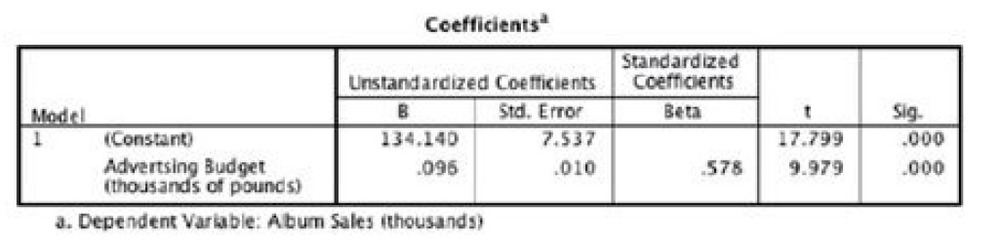
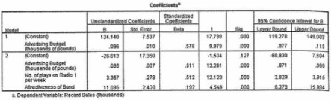
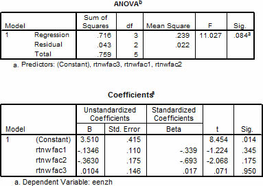
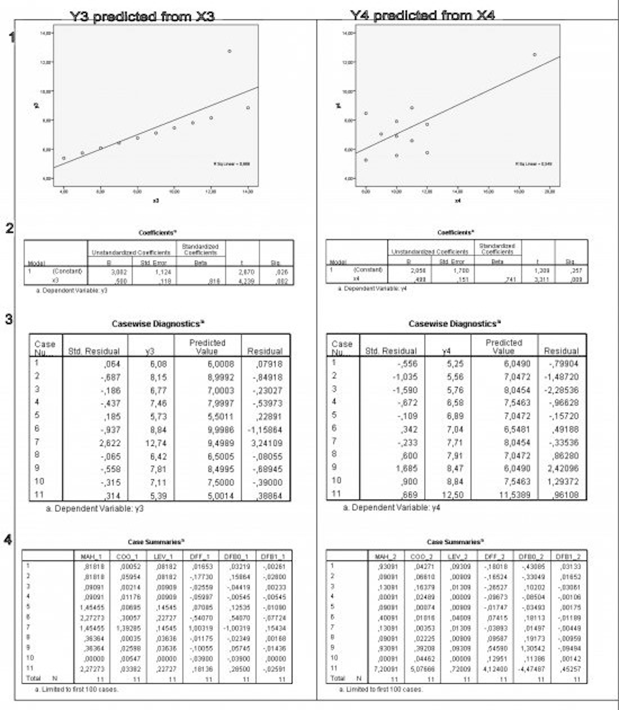
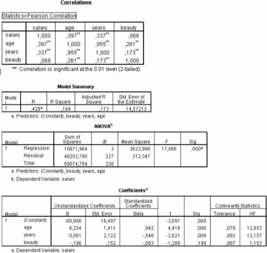
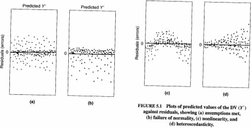
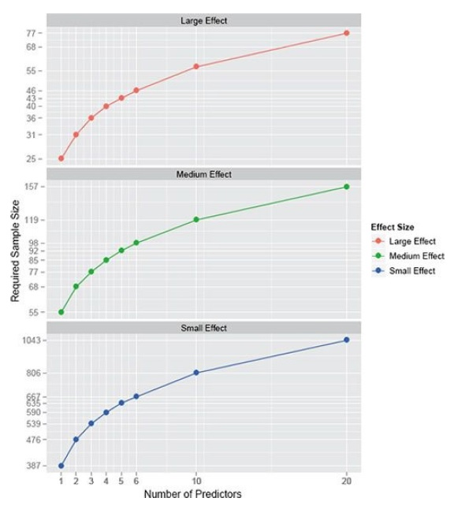
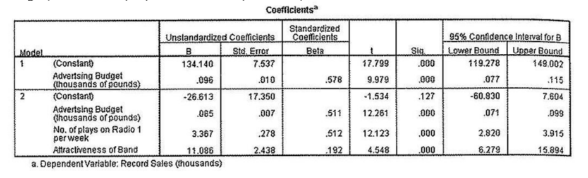
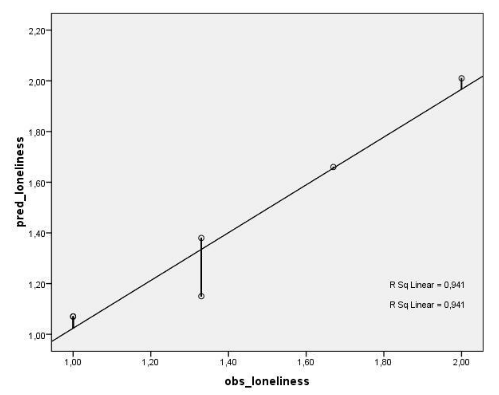

\vspace{10ex}

**Please prepare all exercises in this document for the tutorial meeting.**

Literature: Field (2018) Chapter. 9

If you use the old 4th edition of the textbook, please find the corresponding chapter numbers in this table:

| **4th** edition | **5th** edition           |
| --------------- | ------------------------- |
| Chapter 8       | Chapter 9  (but not 9.13) |

\newpage

# Chapter 9

## Regression

**(1A)**
Example: Imagine that I was interested in predicting physical and downloaded album sales (outcome: `record sales`) from the amount of money spent advertising that album (predictor: `advertising budget`).

The significance of regression coefficient in a regression model is tested with a t-test. How is the $t$ in SPSS output below calculated? Use the values in the table to see if you can get the same values as SPSS.


```{r, echo=FALSE, fig.align="center",  out.width = '70%'}

```


**(1B)**
If record sales (in number of records in the first week after release) can be predicted from money spent on advertising (in pounds) with the following regression equation:

$$\text{record sales}_i = 134.14 + 0.096 \times \text{advertising budget}_i $$

How many records would be sold in the first week after release if we spent 666000,- pounds on advertising?

**(1C)**
See the SPSS output below for Model 2, where record sales are predicted from advertising budget, number of plays on the radio per week, and attractiveness of the band:


```{r, echo=FALSE, fig.align="center",  out.width = '70%'}

```

Write down the regression equation for Model 2.

**(1D)**
Which factors are significant predictors of record sales?

**(1E)**
Think back to what the confidence interval of the mean represented. Can you describe what the confidence intervals for the regression coefficients $b$ represent? What can you conclude about the accuracy of the estimated $b$’s?

**(1F)**
Describe how you can test the null hypotheses concerning the regression coefficients $b$ with the 95% confidence intervals.

**(1G)**
Describe the difference between the unstandardized regression coefficients ($b$-values) and the standardized regression coefficients (beta-values).

**(1H)**
Name an advantage and a disadvantage of reporting the beta-values instead of the $b$-values.


## Prediction and quality of prediction in regression

The data below are a subsample ($N=6$) from a survey among adolescents with a farther, mother and at least one sibling, concerning the research question: what is the influence of relational factors (psychosocial support) on psychological wellbeing, for instance loneliness.

| Subject | Loneliness (`Eenzh`) | Parental support (`Rtnwfac1`) | Friend support (`Rtnwfac2`) | Convergence of goals (`Rtnwfac3`) |
| ------- | -------------------- | ----------------------------- | --------------------------- | --------------------------------- |
| 1       | 1.00                 | 5.00                          | 5.00                        | 4.63                              |
| 2       | 1.00                 | 5.00                          | 5.00                        | 4.29                              |
| 3       | 1.67                 | 4.50                          | 3.54                        | 3.54                              |
| 4       | 1.33                 | 4.78                          | 4.83                        | 4.08                              |
| 5       | 1.33                 | 4.50                          | 4.29                        | 2.90                              |
| 6       | 2.00                 | 2.42                          | 3.33                        | 3.29                              |


To predict loneliness from the three relational factors, multiple regression is conducted, which results in the following tables:

```{r, echo=FALSE, fig.align="center",  out.width = '70%'}

```


**(2A)**
Write down the general and the specific hypotheses of this study.

**(2B)**
Write down the regression model for predicting loneliness from the three relational factors.

**(2C)**
Compute for each subject the predicted loneliness scores and the residuals, based on the regression model and the observed loneliness scores above.

**(2D)**
Draw a scatterplot with the observed loneliness scores on the $x$-axis and the predicted scores on the $y$-axis. Point out the residuals and explain how $SS_E$ (the sum of squares of the residuals is calculated.

**(2E)**
Estimate by looking at the plot whether $R^2$ indicates a weak, moderate or strong effect size.

**(2F)**
Compute $R^2$ from the ANOVA table. Was your (educated) guess right?

**(2G)**
Based on the SPSS output, which decisions do you make concerning the hypotheses?

**(2H)**
Explain how is the $F$ is calculated.

**(2I)**
Reflect on the apparent contrast between the value of $R^2$ and the non-significance of the overall $F$-test.


##  Regression and casewise diagnostics: outliers and influential cases

In the two columns on the following page you find the outcomes of two different simple regression analyses: the first column shows the results of the regression analysis for predicting $Y_3$ from $X_3$; the second column shows the results of a different regression analysis for predicting $Y_4$ from $X_4$.

For each analysis you see on the next page four types of results:

1. a scatterplot depicting the individual scores on resp. $X_3$ and $Y_3$, and $X_4$ and $Y_4$;
2. a table with regression coefficients;
3. a table with “casewise diagnostics” that give information about the residuals in the sample;
4. a table with “case summaries” that give information about the possibly influential cases in the sample. The six columns of this latter table represent respectively, the Mahalanobis distances, the Cook’s distances, the leverages, `DFFit`, `DFBeta` ($b_0$), `DFBeta` ($b_1$).

**(3A)**
Write down the regression equation for the regression lines that are depicted in both scatterplots.

**(3B)**
Which of both regression equations describes the general pattern of the observed data best? Why?

**(3C)**
Describe what an outlier is according to Field, and name two ways to identify outliers in regression analysis.

**(3D)**
For both regression models, consider (3): the table with “casewise diagnostics” that give information about the residuals in the sample. First, write down the case numbers in each scatterplot an indicate for each case its residual.

**(3E)**
What is the difference between unstandardized and standardized residuals? What is the advantage of standardized residuals?

**(3F)**
Given the standardized residuals, which case(s) can be considered outlier(s) in each scatterplot?

**(3G)**
For both regression models, consider (4): the table with “case summaries” that give information about possibly influential cases in the sample. Give a short description of the first three columns in this table, which case(s) can be considered influential in each scatterplot according to these columns?

**(3H)**
Now consider the latter three columns of (4): the table with “case summaries”. Give a short description of these columns in this table, which case(s) can be considered influential in each scatterplot according to these columns?

**(3I)**
Does an influential case always have the largest residual?

**(3J)**
Name one way to deal with influential cases.

```{r, echo=FALSE, fig.align="center",  out.width = '100%'}

```


## Regression and multicollinearity

A fashion student was interested in factors that predicted the salaries of catwalk models. She collected data from 231 models (aged 12-25 years). For each model she asked them their salary per day on days when they were working (salary), their age (age), how many years they had worked as a model (years), and then got a panel of experts from modelling agencies to rate the attractiveness of each model as a percentage with 100% being perfectly attractive (beauty). The data are in the file Supermodel.sav. (see for a similar exercise Task 2.7.1)

See the SPSS output below, where salary is predicted from age, years as a model, and *attractiveness*:

```{r, echo=FALSE, fig.align="center",  out.width = '70%'}

```

**(4A)**
Write down the regression equation for the regression analysis above.

**(4B)**
Which factors are significant predictors of salary?

**(4C)**
Interpret the regression equation. Do you notice any counter-intuitive results, when you compare the regression coefficients with the inter-item correlations?

**(4D)**
Determine whether multicollinearity poses a problem for this regression analysis. Use three different statistics to identify multicollinearity.

**(4E)**
Name three problems that arise as a consequence of multicollinearity.

**(4F)**
Name two solutions to the problem of multicollinearity.

\newpage
The fashion student decides to discard the predictor `age` from the model. Instead she adds the predictor `intelligence` (measured with a standard IQ test) to the model. See the SPSS output below, where salary is predicted from `intelligence`, `years as a model`, and `attractiveness`:

```{r, echo=FALSE, fig.align="center",  out.width = '70%'}
knitr::include_graphics("picts/meeting2_spssout6.jpg")
```


**(4G)**
Write down the regression equation for the regression analysis above.

**(4H)**
Compare the $R$ square of the current analysis to the $R$ square of the previous analysis. Explain the difference based on the inter-item correlations.

**(4I)**
Compare the regression weight ($b$ coefficient) of years as a model in the current analysis to the regression weight ($b$ coefficient) of years as a model in the previous analysis. Try to give an explanation for this difference.

**(4J)**
Determine whether multicollinearity poses a problem for the current regression analysis. Use three different statistics to identify multicollinearity.

**(4K)**
Write a short report (see for an example of a short report MRA, slides lecture 2) for the regression analysis that predicts salary from intelligence, years as a model, and attractiveness.


\newpage

## Assumptions in regression

Consider the figures below. The figures are from Tabachnick, B.G., & Fidell, L.S. (2001). *Using multivariate statistics* ($4^\text{th}$ ed.). Boston: Allyn & Bacon.

```{r, echo=FALSE, fig.align="center",  out.width = '70%'}

```

**(5A)**
Describe what is plotted on the horizontal and vertical axes.

**(5B)**
What is the relation between a dot in a figure and a participant?

**(5C)**
Which assumptions are violated in figures b, c, and d, and why?

\newpage

## Sample size in regression

**(6A)**
Explain what it means if the overall model test in a regression equation (i.e. the $F$-test for $R^2$) has a power of .80.

**(6B)**
Why is a high power desirable?

**(6C)**
Determine with the figure below (Figure 9.9, Field, 2018) what the minimum sample size must be, to achieve a power of .80, for a regression model test with **5 predictors and a medium expected effect size**.

```{r, echo=FALSE, fig.align="center",  out.width = '70%'}

```

**(6D)**
What is the minimum sample size, to achieve a power of .80, for a regression model test with **5 predictors and a small expected effect size**. Explain the difference between c. and d. in required sample sizes.

**(6E)**
What is the minimum sample size, to achieve a power of .80, for a regression model test with **1 predictor and a medium expected effect size**. Explain the difference between c. and e. in required sample sizes.


\newpage
\appendix
# Answers

## Regression

**Answer 1A**

Using the values from SPSS output to calculate $t$ for the constant ($b_0$):

\begin{align*}
t &= \frac{b_\text{observed}-b_\text{expected}}{SE_b} \\
  & = \frac{b_\text{observed}}{SE_b} \\
  & = \frac{134.140}{7.537} = 17.79
\end{align*}

for the advertising budget (b1) we get: $t = \frac{0.096}{0.01} = 9.6$. This value is different to the one in the output ($t = 9.979$), because SPSS rounds values in the output to 3 decimal places, but calculates $t$ using unrounded values (usually this doesn’t make too much difference but in this case it does!). In this case the rounding has had quite an effect on the standard error (its value is 0.009632 but it has been rounded to 0.01). To obtain the unrounded values, double-click the table in the SPSS output and then double-click the value that you wish to see in full. You should find that $t = \frac{0.096124}{0.009632} = 9.979$.

**Answer 1B**

He would sell 198 (thousand) CDs in the first week after release. Note that both
the dependent variable and the predictor *advertising budget* are in units of
thousands.

**Answer 1C**

See the SPSS output below for Model 2, where record sales are predicted from advertising
budget, number of plays on the radio per week, and attractiveness of the band:

```{r, echo=FALSE, fig.align="center",  out.width = '70%'}

```

Regression equation for Model 2:

$$\text{sales}_i = -26.61 + 0.08\,\text{advertising}_i + 3.37\,\text{airplay}_i  + 11.09\,\text{attractivenes}_i $$

\newpage
**Answer 1D**

significant predictors of record sales: all three predictors are significant ($p < .001$)


**Answer 1E**

The 95% confidence intervals of the unstandardized beta values represent the boundaries that will contain the true (=population) value of b in 95% of all possible samples. The smaller the confidence interval, the more accurate the estimated $b$ will be.

In this model `advertising` and `airplay` have tight confidence intervals, and are the best predictors. The interval for `attractiveness` is wider (but still does not cross zero) indicating that the parameter for this variable is less accurate, but nevertheless significant.


**Answer 1F**

You can test the null hypotheses concerning the regression coefficients $b$ with the 95% confidence intervals by examining whether the interval crosses zero. In the case the interval crosses zero, the parameter is regarded not significant ($p > .05$).


**Answer 1G**

The difference between the unstandardized regression coefficients ($b$-values) and the standardized regression coefficients (Beta-values) is that they refer to either the unstandardized variables and or the standardized variables (i.e. $z$-scores). The standardized beta values tell us the number of standard deviations the outcome will change as a result of one standard deviation change in the predictor.


**Answer 1H**

An advantage of standardized beta-values is that, since they are all measured on the same (standardized) scale, they are comparable and can be used to judge the relative contribution of each predictor in explaining the dependent variable *given the predictors that are included in the regression equation* (Note that when a new predictor is added to the regression model all weights may change thus the relative contributions may change too).

A disadvantage of reporting beta-values is that we need to know the standard deviations of all variables to interpret these values literally.


\newpage

## Prediction and quality of prediction in regression

**Answer 2A**

* $H_0: \beta_\text{parental support} = \beta_\text{friend support} = \beta_\text{convergence of goals} = 0$
* $H_a: \text{not} H_0$

or

* $H_0: R^2 = 0$ (in the population)
* $H_a: R^2 \neq 0$ (in the population)

Specific hypotheses:

* $H_0: \beta_\text{parental support} = 0$
* $H_0: \beta_\text{friend support} = 0$
* $H_0: \beta_\text{convergence of goals} = 0$


**Answer 2B**

Regression model:
$$ \text{loneliness}_i = 3.510 - 0.13\,\text{parental support}_i - 0.36\,\text{friend support}_i + 0.01\,\text{convergence of goals}_i $$

**Answer 2C**

The predicted loneliness for each subject:

| Subject | Loneliness (*observed*) | Loneliness (*predicted*) | Unstandardized (*residual*) |
| ------- | ----------------------- | ------------------------ | --------------------------- |
| 1       | 1.00                    | 1.07                     | -0.07                       |
| 2       | 1.00                    | 1.07                     | -0.07                       |
| 3       | 1.67                    | 1.66                     | 0.01                        |
| 4       | 1.33                    | 1.15                     | 0.18                        |
| 5       | 1.33                    | 1.38                     | -0.05                       |
| 6       | 2.00                    | 2.01                     | -0.01                       |


\newpage

**Answer 2D**

```{r, echo=FALSE, fig.align="center",  out.width = '70%'}

```


**Answer 2E**

$R^2$ can be derived from the degree to which the points (in the scatter depicting
observed loneliness scores against predicted loneliness scores) lie on a straight
line. In this case the points nearly all lie on a straight line, therefore the effect
size will be strong.

**Answer 2F**

\begin{align*}
R^2 &= \frac{SS_\text{model}}{SS_\text{total}}  \quad\text{or}\quad R^2 = \frac{SS_\text{regression}}{SS_\text{total}} \\
  &= \frac{0.716}{0.759} = .94.
\end{align*}


**Answer 2G**

Neither the general hypothesis, nor the specific hypotheses are rejected.


**Answer 2H**

\begin{align*}
F &= \frac{MS_\text{model}}{MS_\text{residual}}  \quad\text{or}\quad R^2 = \frac{MS_\text{regression}}{MS_\text{residual}} \\
  &= \frac{0.239}{0.022} = 10.863 \quad (\approx 11.027)
\end{align*}

Note: Due to rounding in our calculation, we have here a slightly smaller $F$-value as one reported by SPSS.


\newpage
**Answer 2I**

The sample is small ($N=6$), therefore degrees of freedom residual are small ($df_\text{residual} = N-\text{number of predictors}-1 = 2$). From any $F$-table you can derive that in this case values of $F > 19.16$ are significant. Would $N$ have been 10, the same value of $F$ would have been significant with $p < .01$!


## Regression and casewise diagnostics: outliers and influential cases

**Answer 3A**

* Model 1: $Y_3 = 3.002 + 0.500 X_3$
* Model 2: $Y_4 = 2.056 + 0.499 X_4$

**Answer 3B**

The first model, since the main pattern in the first scatterplot is a positive linear relation. In the second scatterplot the main pattern shows a very smallcorrelation (about zero).

**Answer 3C**

An outlier is a score very different from the rest of the data. When we analyze
data we have to be aware of such values because they may bias the model we fit
to the data. Field describes two ways to look for cases that might bias the
regression model: residual and influence statistics. You need both types of
statistics, because an outlier does not necessarily show both a large residual and
a deviant influential value.


**Answer 3D**

Use resp. the $Y_3$ and $Y_4$ scores to fill in the casenumbers. NB. The outlier in
the first scatterplot is case number 7 and the outlier in the second scatterplot is
case number 11.


**Answer 3E**

Here, we look at the residuals. The casewise diagnostics table shows both unstandardized residuals (“Residual”), which are measured in the same units as the outcome variable, and standardized residuals (“Std. Residual”). The standardized residuals are computed by dividing the unstandardized residuals by their standard deviation, thereby converting the residuals into $z$-scores. An advantage of $z$-scores is that they are independent of the unit of measurement of the outcome variable. Thus we can compare residuals from different models, and we can use the known properties of $z$-scores (mean zero, standard deviation of 1) to judge what residual is large or even extreme.


**Answer 3F**

Field names three general rules, derived from the assumption of normally
distributed residuals:

1. standardized residuals with an absolute value greater than 3.29 (or 3 as an approximation) are cause for concern.
2. if more than 1% of the sample cases have a residual above 2.58 (or 2.5 as approximation) is cause for concern
3. if more than 5% of the sample cases have a residual above 1.96 (or 2 as approximation) is cause for concern.

The prediction of $Y_3$ from $X_3$ results in one large std. residual of 2.62 for case number 7. Given that we have only 11 observations (thus this case makes up $\frac1{11} = 9%$ of the sample), this residual is cause for concern.

The prediction of $Y_4$ from $X_4$ results in std. residuals that are all below 2. Thus, based on the residuals only we see no cause for concern here.


**Answer 3G**

The statistics in this table provide information about the impact each case has on the model’s ability to predict *all* cases, thus how each case influences the model as a whole. For Cook’s distances, leverages and Mahalanobis distances (i.e. the first three columns in the table). Rules of thumb described in Field for indentifying outliers that might be cause for concern are:

* **Cook's distance** can be thought of as a general measure of influence of a point on the values of the regression coefficients. Cook’s distances greater than 1 may be cause for concern according to Field.
* An observation with an outlying value on a predictor variable is called a point with high **leverage**. Points with high leverage can have a large effect on the estimate of regression coefficients. According to Field leverage values, l, greater than $2\times\frac{k + 1}{n}$ or $3\times\frac{k + 1}{n}$ (if you follow Stevens, 2002), where $k$ is the number of predictors and $n$ is the number of cases in the sample. Thus here, we are looking for leverage values greater than about $2\times\frac2{11} = 0.36$ through $3\times\frac2{11} = 0.55$.
* **Mahalanobis distance** is closely related to the leverage statistic, l, but has a
different scale: Mahalanobis distance = $(N-1)(l-\frac1N)$. It indicates the distance of cases from the means of the predictor variables. Field names a crude check: influential cases have values above 25 in large samples (500), above 15 in smaller samples (100), and above 11 in small samples (30).

According to these statistics, for the prediction of $Y_3$ from $X_3$ case number 7 is the most influential point with a Cook’s distance $> 1$. Since case number 7 is not an outlier on the predictor variable, it does not show a leverage value or Mahalanobis distance above the cutoff values. Note, that after removing case number 7 we have a perfect regression.

For the prediction of $Y_4$ from $X_4$ case number 11 is the most influential point with a Cook’s distance > 1. Since case number 11 is an outlier on the predictor variable, it also shows a leverage value above the cutoff value and a relatively extreme Mahalanobis distance. Note, that after removing case number 11 we have a nearly zero correlation.


**Answer 3H**

You can also consider more specific measures of influence that assess for each case how the regression coefficient is changed by including that case. Columns `DFB0` and `DFB1` indicate the difference in the regression coefficients $b_0$ and $b_1$ between the model for the complete sample and the model when a particular case is deleted. `DFF` indicates the difference between the current predicted value for a particular case and the predicted value for this case based on the model based on the rest of the cases.

From columns `DFB0` and `DFB1` it is clear that in the model that predicts $X_3$ from $Y_3$, case number 7 is the most influential, with the regression coefficient ($b_1$) changing from 0.50 to $(0.50 - 0.15) = 0.35$ after case number 7 is deleted. In the model that predicts $X_4$ from $Y_4$, case number 11 is by far the most influential, with the regression coefficient ($b_1$) changing from 0.499 to $(0.499 - 0.453) = 0.046$ after case number 11 is deleted.

Note that the values `DFB0` and `DFB1` are dependent on the unit of measurement of all variables. For instance, if the outcome ranges from 1 to 100 a `DFB1` of .3 will be considered small, but large if the outcome varies from 0 to 1.There SPSS also produces standardized version of the `DFB0` and `DFB1` values.


**Answer 3I**

No, see point 11 in the model that predicts $X_4$ from $Y_4$: it is an influential point, but it does not have a large residual.

**Answer 3J**

First describe why cases are extreme, thus identify the variables (or combination of variables) on which the cases are deviant. Subsequently decide, whether the outlier is due to

a) a typing error in the data entry (this might be something you can correct e.g. if you look up the original questionnaire),
b) the case is not really part of the population from which we intended to sample (for instance in a sample of patients suffering from anxiety complaints, some patients also suffer from psychosis), in that case the outlier can be deleted without loss of generalizability,
c) the case is part of the target population but with a rather extreme score pattern. To this latter problem suggested solutions are normalizing variable transformations, or manually change the scores on the variables for the outlying cases so that they are deviant, but not as deviant as before, or simply remove the case from the analysis. Note that any transformations, changes of scores, and deletions are reported in the Results section together with a rationale.


## Regression and multicollinearity

**Answer 4A**

$\text{salary} = -60.89 + 6.23\,\text{age} - 5.56\;\text{number of years as a model} -1.96\,\text{attractiveness}$


**Answer 4B**

age and number of years as a model


**Answer 4C**

The correlation of each predictor with salary is positive, yet some regression weights are negative.


**Answer 4D**

Three different ways to detect multicollinearity:

1. correlations between predictors (!) higher than .80 or .90
2. *VIF* of a predictor $> 10$
3. tolerance of a predictor $< .10$

The correlation between age and number of years as a model is .955, for a large part they measure the same thing. This is also indicated by the *VIF* and tolerance values of both variables.


**Answer 4E**

For the current analysis we have a problem because multicollinearity causes:

1. **Bouncing $b$’s (or untrustworthy b’s)** \newline
As regression coefficients reflect the unique contribution of each predictor in explaining the variance in the dependent variables, each b is corrected for the overlap (i.e. correlation) with other predictors. When predictors have high intercorrelations, this correction can have drastic effects on the value of $b$, it can even become negative for predictors that are positively correlated with the outcome (cf. the regression weight of the predictor `years as a model`). The fact that the regression weights are dependent on other predictors in the model is sometimes referred to as the problem of “bouncing betas".
2. **Limited size of $R$, given the number of predictors** \newline
Limited size of $R$ means that if you add a predictor to the regression model that is highly correlated with other predictors in the model, it does not add so much as it could have to the explanation of the variance in the outcome variable (as it overlaps with the other predictors for a large part)
3. **Difficulties with determining the importance of predictors** \newline
Difficulty with determining the importance of predictors refers to the bouncing $b$’s problem. When you add highly correlated predictors to a regression model, SPSS will correct the $b$’s for their mutual overlap. However this correction will lead to untrustworthy $b$’s (see the above). SPSS can’t help you in this case, you have to decide which predictor is theoretically the most meaningful and leave only this predictor in the model.


**Answer 4F**

If, for instance, two predictors are highly correlated, then omit one on theoretical grounds. If, for instance, a sets of predictors is highly inter-correlated, then consider combining the scores on these predictors into one or two “super” variables. A data analysis technique that can be used for this purpose is factor analysis (see Field chapter on factor analysis).


**Answer 4G**

$\text{salary} = -86.26 + 0.76\,\text{intelligence} + 2.79\,\text{years as a model} +.01\,\text{attractiveness}$

\newpage
**Answer 4H**

$R^2$  was .18 and equals .23 for the current analysis. The previous analysis included the predictor `age`, whereas the current analysis replaced this predictor with `intelligence.` Although both predictors have the same correlation with the outcome variable ($r = 0.397$). Intelligence has a larger unique contribution to explaining the variance in salary, since it has lower correlations with the other predictors in the model. This is reflected in a higher value of $R^2$  for the
second model.


**Answer 4I**

The regression weight of `years as a model` was negative and became positive after replacing the predictor age with intelligence. This is an illustration of the problem of bouncing $b$’s. Because years as a model is highly correlated with `age`, and the regression coefficients of both predictors are corrected for this correlation, the $b$ of `years as a model` had a counter intuitive sign (note that the correlation between `salary` and `years as a model` is positive). This problem does not occur when `intelligence` is included in the model, since `intelligence` and `years as a model` have a small to medium correlation. This latter situation is recommended for multiple regression models.

**Answer 4J**

According to the following criteria:

1. correlations between predictors (!) higher than .80 or .90
2. *VIF* of a predictor $> 10$
3. tolerance of a predictor $< .10$

Multicollinearity poses no problem for the current analysis


**Answer 4K**

*Short report for multiple regression analysis on Supermodel.sav data*

A model’s salary was predicted from her intelligence (IQ), number of years as a model, and attractiveness (%) using multiple regression analysis. Overall, the model accounts for 23.1% of the variance in salaries and is a significant fit of the data ($F(3,227) = 22.74, p < .001$). Intelligence is a significant predictor of salary ($t(227) = 5.88, p < .001$), where controlling for the other predictors in the model, an increase in intelligence was associated with an increase in salary ($b = 0.76$). Furthermore, number of years as a model is a significant predictor of salary ($t(227) = 4.58, p < .01$), where controlling for the other predictors in the model, an increase in number of years as a model was associated with a increase in salary ($b = 2.79$). Controlling for the other predictors in the model, attractiveness did not seem to predict salary ($t(227) = .05$, ns).

\newpage

## Assumptions in regression

**Answer 5A**

The horizontal axis represents the predicted scores on the outcome or dependent variable. The vertical axis represents the difference between the observed score and the predicted score for each individual (thus the residuals).


**Answer 5C**

Each dot represents one observation, or one participant.


**Answer 5D**

* In Figure a the ideal situation is depicted.
* Figure b shows a violation of the assumption of normally distributed residuals: there are several relatively extreme negative residuals (the distribution of residuals is left-skewed.
* Figure c shows a violation of the assumption of linearity: there is a curved trend in the data, instead of a linear trend.
* Figure d shows a violation of the assumption of homogeneous residual variance, that is it shows heteroscedasticity. The error variance increases with the outcome variable


## Sample size in regression

**Answer 6A**

A power of .80 means that there is a probability of .80 of rejecting the general null-hypothesis if a genuine effect exists (i.e. R square is indeed greater than 0).


**Answer 6B**

Because it makes it probable that a certain effect size can be ‘proven’ to be significant.


**Answer 6C**

90


**Answer 6D**

$> 500$ (roughly). Smaller effects require larger samples to be significant.


**Answer 6C**

60; less complex models (i.e. models with less parameters to be estimated) require smaller samples to be estimated with the same overall accuracy than more complex models.
