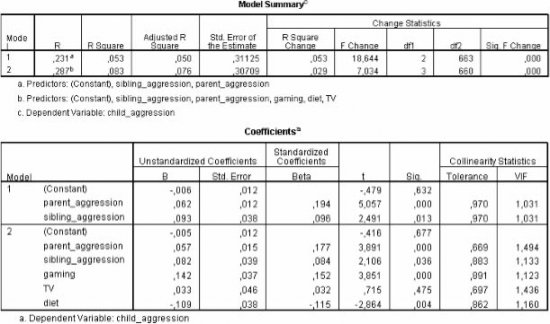
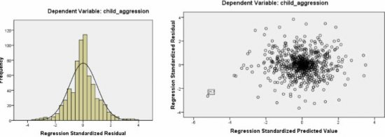
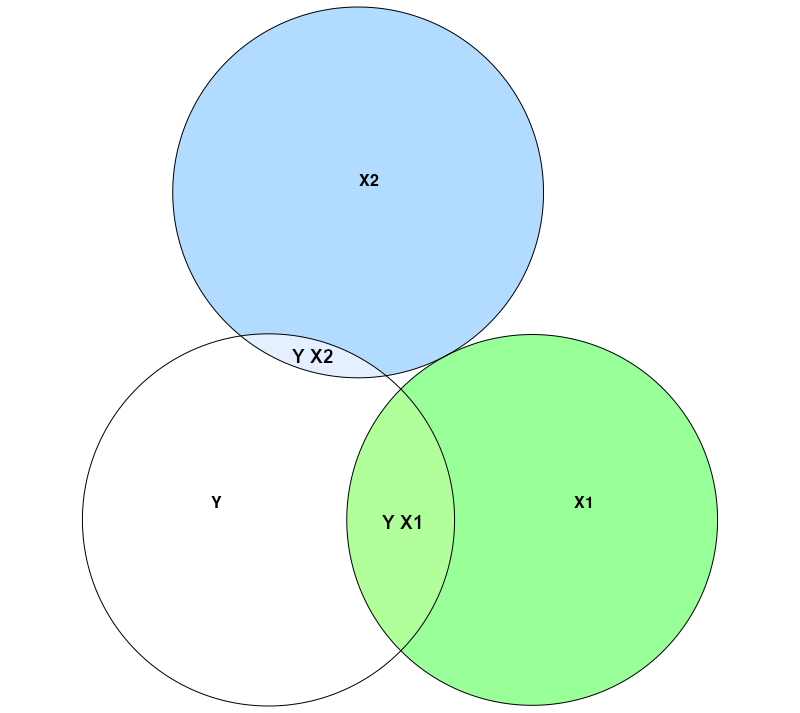

\vspace{10ex}

**Please prepare all exercises in this document for the tutorial meeting.**

Literature: Field (5th ed, 2018), Chapter 8 & 9


\newpage

# Chapter 8 & 9

## Hierarchical regression

A study was carried out to explore the relationship between aggression and several potential predicting factors in 666 children that had an older sibling. Variables measured were

1. `parent aggression` (with higher scores indicating more aggression)
2. `sibling aggression`
3. `computer gaming` (with higher scores indicating more time spend on gaming)
4. `TV` (with higher scores indicating more time spend watching TV)
5. `Diet` (with higher scores indicating a healthier diet).

Past research indicated that both `parent aggression` and `sibling aggression` were good predictors of the level of aggression in the younger child (`child agression`). All other variables were treated in an exploratory fashion.

Hierarchical regression analysis was conducted to predict `child aggression`. The predictors `parent aggression` and `sibling aggression` were entered in Block 1, and the remaining predictors were entered in Block 2. The SPSS-Output of this analysis is printed below.

```{r, echo=FALSE, fig.align="center",  out.width = '70%'}


```

**(1A)**
How much variance of `child aggression` is accounted for by the predictors `computer gaming`, `TV` and `Diet` after correcting for `parent aggression` and `sibling aggression`?

**(1B)**
Is the additional percentage of variance that is explained by the predictors in block 2 a significant improvement in explaining the variance in `child aggression`?

**(1C)**
Which predictor is significant in model 2 when we test each regression coefficient 2-sided with $\alpha = .05$?

**(1D)**
Which predictor in model 2 has the largest unique contribution towards predicting `child aggression`?

**(1E)**
What is the predicted `child aggression` expressed as standardized score ($z$-score) for an individual with the following $z$-scores on the five predictors?

* `parent aggression`: $z = 2$
* `sibling aggression`: $z = -1$
* `gaming`: $z = -1$
* `TV`: $z = 1$
* `diet`: $z = 0$

**(1F)**
Which assumptions of regression analysis can be tested with the two graphs that were presented in the above?

**(1G)**
Are these assumptions met?


## Hierarchical regression including dummy variables

The local government wants to evaluate 12 schools for secondary education in the district with respect to their performance. School performance is measured in a study as "average exam score of a pupil". Only students which took the same level of exams are analyzed together. Several sets of predictors have been measured as well:

* One set of predictors is related to **school performance in primary school**:
  * rating of pupil by head of the primary school,
  * national test result
  * number of duplicated years
* Another set of predictors concerns the **social background of pupils**:
  * status of job of father (scale of 1 to 7),
  * status of job of mother (scale of 1 to 7),
  * number of contacts of pupil with police,
  * broken home (yes/no),
  * domestic violence (yes/no),
  * pupil is adopted child (yes/no),
  * parent with chronic disease (yes/no).
* A third set of predictors were the dummy variables for coding the **12 schools** included in this study.
  * This means that 11 dummy variable were included. (You you know why?)

All variables comprising yes/no-responses are dummy coded.

The sample size was 1246.

A hierarchical regression was carried out in which in the first block the previous school performance variables were entered, in the second block the social background variables were added and in the third block the school dummy variables were added.


**(2A)**
Describe the design of each of the three regression analyses.

**(2B)**
What is the advantage of hierarchical regression analysis compared to “regular” (forced entry, or Enter as it is known in SPSS) regression analysis for the current example?

**(2C)**
The hierarchical regression analysis results in the following table:

| Model | $R^2$ | $R^2_\text{change}$ | $F_\text{change}$ | $df_1$ | $df_2$ | $p$     |
| ----- | ----- | ------------------- | ----------------- | ------ | ------ | ------- |
| 1     | .330  | .33                 | 204.07            | 3      | 1242   | $<.001$ |
| 2     | .420  | .09                 | 27.40             | 7      | 1235   | $<.001$ |
| 3     | .430  | .01                 | 1.95              | 11     | 1224   | $<.05$  |

Discuss for each set of predictors whether they significantly improve the prediction of school performance in secondary school (use both $R^2_\text{change}$ and the corresponding $F_\text{change}$ & $p$-value to support your answer)

Based on the $R^2_\text{change}$ resulting from model 3, what can be concluded about the difference between the 12 schools in terms of their performance?


## Explained variance in regression

Consider the following correlations:

|     | $Y$ | $X1$ | $X2$ | $X3$ |
| ---- | -- | ---- | ---- | ---- |
| $Y$  | 1  | .43  | .18 | .74   |
| $X1$ |    | 1    | .00 | .44   |
| $X2$ |    |      | 1   | .20   |
| $X3$ |    |      |     | 1     |

In this exercise we are looking at the regression weight of predictor $X_1$, in three different analyses:

1. the prediction of $Y$ by $X1$ alone
2. the prediction of $Y$ by $X1$ and $X2$
3. the prediction of $Y$ by $X1$ and $X3$

These three regression analyses result in the following SPSS output. Note partial (=semi-partial) correlation in the final column of each table.

\newpage

**Model I: Prediction of $Y$ by $X1$ alone, with $R^2 = .1849$:**

\begin{tabular}{llccccccc}
\hline
      &  & \multicolumn{2}{c}{Unstandardized} & Standardized &   &   &  \\
Model &  & \multicolumn{2}{c}{Coefficients}   & Coefficients & $t$ & Sig. & Correlations \vspace{1ex} \\
      &        & $b$    & Std. Error & Beta  &       &      & Part  \\
\hline
1 & (constant) & 6.160  & 2.436      &       & 2.529 & .013 &       \\
  &   $X1$     & 0.321  & 0.070      &  .430 & 4.589 & .000 & .43    \\
\hline
\end{tabular}
*Dependent Variable: Y*


**Model II: Prediction of $Y$ by $X1$ and $X2$, with $R^2 = .2173$:**

\begin{tabular}{llccccccc}
\hline
      &  & \multicolumn{2}{c}{Unstandardized} & Standardized &   &   &  \\
Model &  & \multicolumn{2}{c}{Coefficients}   & Coefficients & $t$ & Sig. & Correlations \vspace{1ex} \\
      &        & $b$    & Std. Error & Beta  &       &      & Part  \\
\hline
1 & (constant) & 3.578  & 2.721      &       & 1.315 & .192 &       \\
  & $X1$       & 0.322  &  0.069     & .431  & 4.673 & .000 & .43   \\
  & $X2$       & 0.599  &  0.299     & .185  & 2.004 & .048 & .18   \\
\hline
\end{tabular}
*Dependent Variable: Y*


**Model III: Prediction of $Y$ by $X1$ and $X3$, with $R^2 = .56$:**

\begin{tabular}{llccccccc}
\hline
      &  & \multicolumn{2}{c}{Unstandardized} & Standardized &   &   &  \\
Model &  & \multicolumn{2}{c}{Coefficients}   & Coefficients & $t$ & Sig. & Correlations \vspace{1ex} \\
      &        & $b$    & Std. Error & Beta  &       &      & Part  \\
\hline
1 & (constant) & 1.261  & 1.881      &       & 0.670 & .504 &       \\
  & $X1$       & 0.094  & 0.058      & .126  & 1.636 & .105 & .11    \\
  & $X3$       & 0.004  & 0.000      & .648  & 8.865 & .000 & .61    \\
\hline
\end{tabular}
*Dependent Variable: Y*


Remember that:

* The proportion of explained variance of a variable $Y$ by variable $X$ can be computed as $r^2_{YX}$ (i.e. the squared correlation between $Y$ and $X$).
  * For example $r^2_{YX}$ for model I equals $.43 = .1849$.
* The proportion of explained variance of a criterion $Y$ by two predictors $X1$ and $X2$ together can be computed as $R^2$ (i.e. the squared multiple correlation between $Y$ and both $X1$ and $X2$).
  * $R^2$ for model II equals .2173, which means that 21.73% of the variance in $Y$ is explained by $X1$ and $X2$ together.
* The proportion of variance in $Y$ that is explained by $X2$ uniquely, thus after controlling for the overlap between $X1$ and $X2$ can be computed in two ways:
  * As the square of the part correlation of $Y$ and $X2$, while controlling $X2$ for the overlap with $X1$. For example, see the table with results for model II; the square of the part correlation of $Y$ and $X2$ (controlling for $X1$) equals $.18 = .0324$. This means that $X2$ explains 3.24% of the variance in $Y$ when we control for the overlap between $X2$ and $X1$
  * As $R^2_\text{change}$ between model I and II. For example, compare the $R^2$ of model I and II. The increase in $R^2$ for model II compared to model I equals $.2173 - .1849 = .0324$. This means that the addition of $X2$ as predictor causes the explained variance to increase by 3.24%.

**(3A)**
Write down the unstandardized regression equation for each analysis.

**(3B)**
Look at the regression coefficient of $X1$ in each analysis; first, explain why the regression coefficient of X1 is similar in model I and model II. Second, explain why the regression coefficient of $X1$ differs for model I and model III.

**(3C)**
Compute the square of the correlation between $Y$ and $X3$ and give an interpretation of this value as “variance accounted for”. Compute the square of the **part correlation** between $Y$ and $X3$ while controlling for $X1$, and give an interpretation of this value as “variance accounted for”.

**(3D)**
In this exercise we are looking at the explained variance of the criterion $Y$ by all predictors in a regression equation, as well as the unique contribution by each predictor separately.

A way to display explained variance in multiple regresion analysis is by drawing a **Venn-diagram**, where each variable is depicted with a circle and the proportion explained variance is displayed by the amount of overlap between two circles. The total amount of explained variance of the criterion $Y$ can be read off the Venn-diagram by looking at the part of the circle of $Y$ that overlaps with the predictors.

Now, draw two Venn diagrams:

1. Depicting the relations between Y, X1, and X2; and
2. Depicting the relations between Y, X1, and X3.


\newpage
\appendix
# Answers


## Hierarchical regression

**Answer 1A**

$.029 \times 100 = 2.9%$

**Answer 1B**

Yes, the 2.9% additional variance which is accounted for by the second set of predictors is significant, $F_\text{change} = 7.03, p < .001$

**Answer 1C**

All predictors, except `TV` ($p > .05$)

**Answer 1D**

The relative unique contribution of the predictors can be judged based on the standardized regression weights (beta values). The predictor with the largest beta value is `parent aggression` $\beta = .177$. Thus keeping all other predictors constant, an increase of one standard deviation in `parent aggression` is associated with an increase of .177 times the standard deviation in `child aggression`.

**Answer 1E**

predicted `child aggression` expressed as standardized score (z-score) for an individual with the following z-scores on the five predictors:

* `parent aggression`: $z = 2$
* `sibling aggression`: $z = -1$
* `gaming`: $z = -1$
* `TV`: $z = 1$
* `diet`: $z = 0$

equals:
$$z_\text{child aggression} = 2 \times 0.177 -0.084 - 0.152 + 0.032 = .15$$
Thus, a child with the above predictor values, will have a `predicted aggression` that is .15 times the
standard deviation above the mean.


**Answer 1F**

With the histogram of the residuals we can evaluate the assumption of normally distributed errors. With the residual plot we can detect possible violations of the assumption of homogeneous residual variance (homoscedasticity), but also the assumption of linearity, and (indirectly) the normality assumption. (see also chapter 2.7.4)

\newpage

**Answer 1G**

The are no serious violations. There are relatively many residuals close to zero, which is good, because small residuals indicate good prediction. However, there are also relatively many large residuals or outliers (ie standardized residuals $> 2.58$). This finding should be followed up by looking at the casewise diagnostics.


## Hierarchical regression including dummy variables

**Answer 2A**

*Model 1*

* outcome = schoolperformance in secondary school
* predictor 1 = rating of pupil by head of the primary school
* predictor 2 = national test result
* predictor 3 = number of duplicated years

*Model 2*

* outcome = schoolperformance in secondary school
* predictor 1 = rating of pupil by head of the primary school
* predictor 2 = national test result
* predictor 3 = number of duplicated years
* predictor 4 = status of job of father (scale of 1 to 7)
* predictor 5 = status of job of mother (scale of 1 to 7)
* predictor 6 = number of contacts of pupil with police
* predictor 7 = broken home (1,0)
* predictor 8 = domestic violence (1,0)
* predictor 9 = pupil is adopted child (1,0)
* predictor 10 = parent with chronic disease (1,0).

*Model 3*

* outcome = schoolperformance in secondary school
* predictor 1 = rating of pupil by head of the primary school
* predictor 2 = national test result
* predictor 3 = number of duplicated years
* predictor 4 = status of job of father (scale of 1 to 7)
* predictor 5 = status of job of mother (scale of 1 to 7)
* predictor 6 = number of contacts of pupil with police
* predictor 7 = broken home (1,0)
* predictor 8 = domestic violence (1,0)
* predictor 9 = pupil is adopted child (1,0)
* predictor 10 = parent with chronic disease (1,0).
* predictor 11 - 22 = 11 dummies coding the 12 different schools

Note: Since a hierarchical regression analysis was carried out, the predictors of previous models were included (as subsequent blocks) in the following models.


**Answer 2B**

For the current example, the advantage of hierarchical regression analysis is that you can uncover the “unique” amount of variance in school performance that is explained by the differences among schools (predictors 11 to 22) after taking other predictors into account (or one could say after controlling for several covariates concerning school performance in primary school and social background).

**Answer 2C**

When school performance is predicted from the first set of (school performance) predictors, 33% of the variance in the outcome variable is accounted for, which is a significant amount ($R^2 = .33, p < .001$). When the second set of (social background) predictors is included as well, this percentage increases to 42%, which is a significant but small increase ($R^2_\text{change}= .09, p < .001$). Finally the third set of (school performance) predictors is included, the percentage of variance accounted for increases to 43%, which is a significant but small increase ($R^2_\text{change} = .01, p < .05$).


**Answer 2D**

The differences between schools after correction for differences in `primary school performance` and in social background are overall significant ($p < .05$). However, given $R^2_\text{change} = .01$, the effect size for this difference is small. Furthermore, from the general statistic $R^2$, nothing can be concluded about which
schools perform better and which worse (you would have to look at the $b$-coefficients for the 11 dummies).


## Explained variance in regression


**Answer 3A**

* model 1: $Y = 6.160 + 0.321\,X1$
* model 2: $Y = 3.578 + 0.322\,X1 + 0.599\,X2$
* model 3: $Y = 1.261 + 0.094\ X1 + 0.004\,X3$


**Answer 3B**

The regression weights are based on the unique contribution of a predictor to the prediction of the dependent variable. The regression weights are based on the correlation between each predictor and the outcome variable while controlling for the "overlap" (= correlation) with the other predictors in the model.

When we compare model 1 and model 2, we see that the regression weight of $X1$ does not change substantially when we add $X2$ as a predictor. This is the case, because $X1$ and $X2$ are uncorrelated (see correlation table), thus the “correction for overlap among predictors” does not affect the regression weight of $X1$.

When we compare model 1 and model 3, we see that the regression weight of $X1$ has changed to 0.094 when $X3$ is added as a predictor. This is the case, because $X1$ and $X3$ are correlated (see correlation table).

**Answer 3C**

$r^2_{YX} = .74^2 = 0.55$. Thus $X3$ explains 55% of the variance in $Y$.

The part correlation (which is also known as *"semi-partial correlation"*) between $Y$ and $X3$ when controlling for $X1$ (see table 3) equals $.61$. That is, the proportion explained variance in $Y$ by $X3$ when controlling for $X1$ equals  $.61^2 = .37$. In other words, after we rule out the variance that $X3$ shares with $X1$, $X3$ explains 37% of the variance in $Y$.

\newpage

**Answer 3D**

The proportion of explained variance in one variable by another variable, is indicated in a Venn diagram as the degree of overlap between two circles of equal size, each one representing a variable.

The degree of overlap between the three circles which represent the variables in **model 2** ($Y$, $X1$ and $X2$) is calculated below from the (part) correlations and the multiple correlation

a) Proportion of explained variance of $Y$ by $X1$:  $r^2_{YX1} = .43 2 = 0.1849$ (see also $R^2$ for model 1)
b) Proportion of explained variance of $Y$ by $X1$ and $X2$: $R^2_\text{model 2} = .2173$.
c) The increase in $R^2$ after adding $X2$ to the model is $.2173-.1849 = 0.0324$. This can be derived by taking the square of part correlation of $Y$ and $X2$ after controlling for $X1$: $.18^2 = 0.0324$. (Note that in this case where the correlation between $X1$ and $X2$ equals zero, the part correlation equals the “regular” correlation $r^2_{YX2} = .18$, because there is no overlap between $X1$ and $X2$.)

Note:  Only, because $X1$ and $X2$ are uncorrelated, $R^2$ of model 2 equals $r^2_{YX1} + r^2_{YX2} = .43^2 + .18^2 = 0.2173$.

```{r, echo=FALSE, fig.align="center", out.width = '70%', fig.cap="Model 2 $R^2 =.2173$, YX1 (see a), YX2 (see c)"}

```

\newpage
The degree of overlap between the three circles which represent the variables in **model 3** ($Y$, $X1$ and $X3$) is calculated below from the (part) correlations and the multiple correlation.

a) Proportion of explained variance of $Y$ by $X1$: $r^2_{YX1} = .43^2 = 0.1849$ (see also $R^2$ for model 1)
b) Proportion of explained variance of $Y$ by $X1$ and $X3$: $R^2_\text{model 3} = .56$.
c) The increase in $R^2$ after adding $X3$ to the model is $0.56-0.1849 = .3751$. This can be derived by taking the square of part correlation of $Y$ and $X3$ after controlling for $X1$: $.61^2 = .372$ (the difference in the third decimal is due to rounding of the part correlation)
d) The percentage of $Y$ that is explained by $X1$ uniquely can be derived from the part correlation of $Y$ and $X1$ after controlling for $X3$: $.11^2 = .0121$.
e) The percentage of $Y$ that is shared by $X1$ and $X3$ equals $.56 -.372 -.0121 = .176$.

Note: Because $X1$ and $X3$ are correlated, $R^2$ of model 3 is **not** the sum of $r^2_{YX1}$ and $r^2_{YX3}$. See: $r^2_{YX1} + r^2_{YX3} = .43^2  + .74^2 = .18 + .55 = .73$. The actual $R^2$ for model 3 is less than $.73$, namely .56, because $R^2$ is always corrected for the overlap between predictors.

```{r, echo=FALSE, fig.align="center", out.width = '70%' , fig.cap="Model 3 $R^2 =.56$, YX1 (see d), YX3 (see c), YX1X3 (see e)"}
knitr::include_graphics("picts/meeting3_venn2.png")
```
