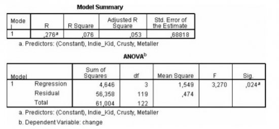
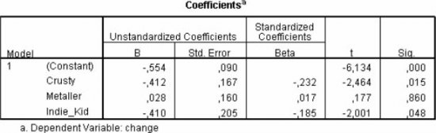
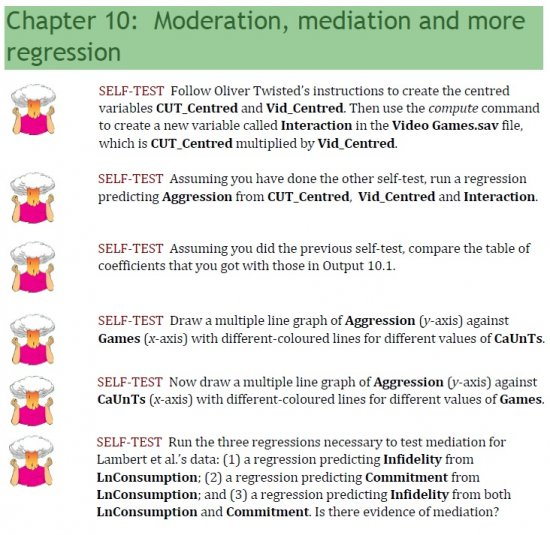
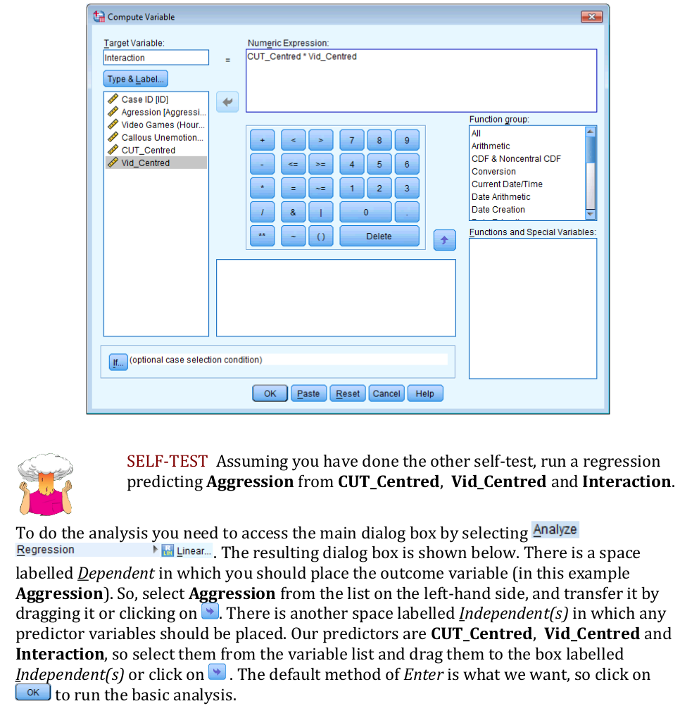
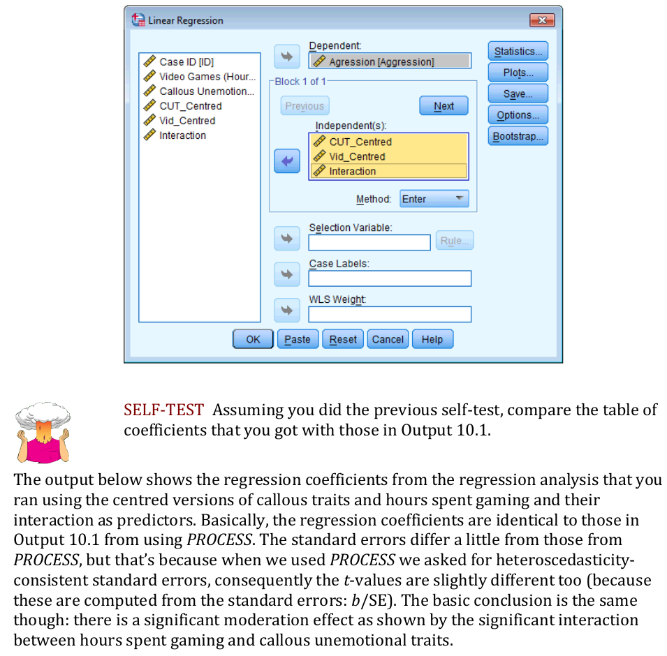
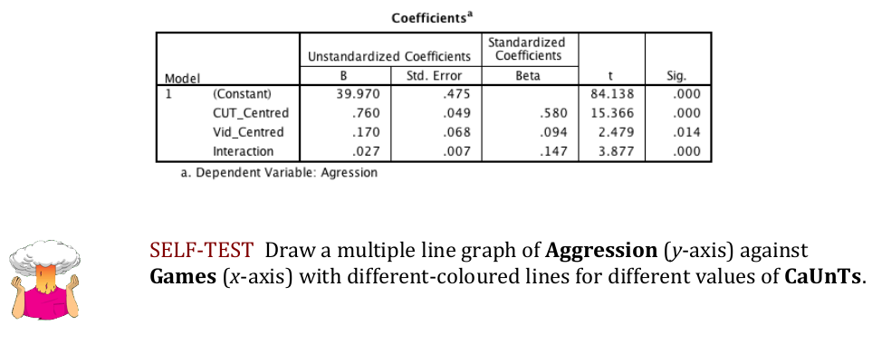
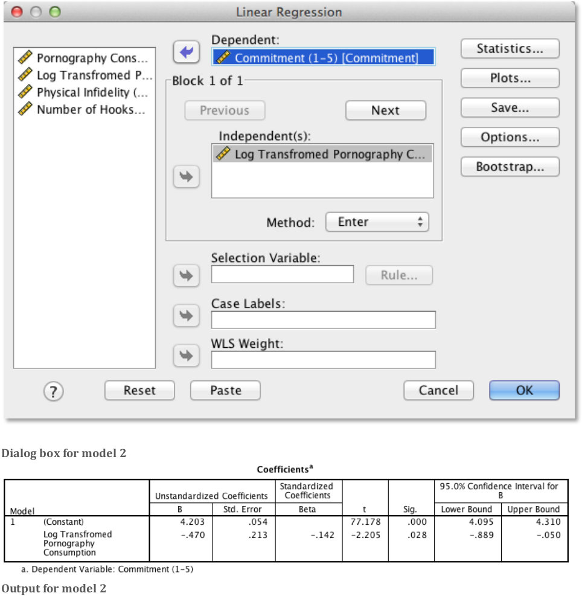

\vspace{20ex}

**Please prepare all exercises in this document for the tutorial meeting.**

Literature: Field (5th ed, 2018) Chapter 11


\newpage

# Chapter 11

## Regression with dummy variables


We analyzed the Glastonbury data from the file `GlastonburyDummy.sav`, which is explained in the Field book, section 11.5 (for 4th ed. see section 10.5). In the SPSS output below, we predict for a group of concert-goers, the change in hygiene (measured as the difference between a *before* and *after*-rating on a scale ranging from 0 = terrible smell to 5 = you smell delicious) during the three day during festival. The type of music they liked was a categorical predictor.

The predictor variable distinguishes between four groups:

1. people with no specific musical affiliation
2. “crusties” (fans of Folk music)
3. “metallers”
4. “indie kids” (fans of alternative rock).

The first group, “no musical affliliation”, was chosen as the baseline and the three remaining groups were coded as dummy variables: “crusty”, “metaller”, and “indie kid”.


```{r, echo=FALSE, fig.align="center",  out.width = '70%'}

```

```{r, echo=FALSE, fig.align="center",  out.width = '70%'}

```

\newpage

**(1A)**
For the following four subjects indicate with zeros and ones what their data would look like in SPSS:

| Subject | Change in Hygiene | Musical taste                | Dummy 1 (Cruty) | Dummy 2 (Metaller) | Dummy 3 (Indy kid) |
| ------- | ----------------- | ---------------------------- | --------------- | ------------------ | ------------------ |
| 1       | -.56              | No affiliation               |                 |                    |                    |
| 2       | -.68              | Folk (crusty)                |                 |                    |                    |
| 3       | -1.00             | Heavy metal                  |                 |                    |                    |
| 4       | -.21              | Alternative rock (indie kid) |                 |                    |                    |


**(1B)**
What null-hypothesis is tested with the F-test in the ANOVA table above?

**(1C)**
Report the $F$-test for the regression model using APA notation. What conclusion is justified based on this $F$-test?

**(1D)**
Write down the regression equation for the regression analysis above.

**(1E)**
For each $b$-coefficient (including the constant) write down its interpretation, including the $t$-test for each $b$-coefficient with its interpretation.

**(1F)**
If the “metaller” group would have been the reference group, what would have been the value of the constant in the regression equation?

**(1G)**
The researcher can decide which group is the reference group in the dummy coding; are the results of the regression analysis affected by this choice?


## Mediation and Moderation


```{r, echo=FALSE, fig.align="center",  out.width = '100%'}

```


\newpage
\appendix
# Answers

## Regression with dummy variables

**Answer 1A**

| Subject | Change in Hygiene | Musical taste                | Dummy 1 (Cruty) | Dummy 2 (Metaller) | Dummy 3 (Indy kid) |
| ------- | ----------------- | ---------------------------- | --------------- | ------------------ | ------------------ |
| 1       | -.56              | No affiliation               | 0               | 0                  | 0                  |
| 2       | -.68              | Folk (crusty)                | 1               | 0                  | 0                  |
| 3       | -1.00             | Heavy metal                  | 0               | 1                  | 0                  |
| 4       | -.21              | Alternative rock (indie kid) | 0               | 0                  | 1                  |

**Answer 1B**

* $H_0: \beta_\text{no affiliation} = \beta_\text{crusty} = \beta_\text{metaller}  = \beta_\text{indie kid} = 0$
* $H_\text{a}: \text{not } H_0$

or

* $H_0: R^2 = 0$ (in the population)
* $H_\text{a}: R^2 \neq 0$ (in the population)


**Answer 1C**

Overall, the model accounted for 7.6% of the variance in change in hygiene and is a significant fit of the data ($F(3,119) = 3.27, p = .024$).


**Answer 1D**

$\text{change in hygiene} = -.554 -.412\,\text{crusty} + .028\,\text{metaller} - .410\,\text{indie kid}$


**Answer 1E**

* In this analysis the constant is -.554, which indicates the average change in hygiene for the “no affiliation” group. This is a significant decrease in hygiene ($t(119) = -6.13, p < .001$).
* “No affiliation vs. crusty”, is a significant predictor of change in hygiene ($t(119) = -2.46, p < .05$), where the regression weight ($b = -.41$) indicates that the “crusty” group had an even larger decrease in hygiene, than the “no affiliation” group, namely $-.554 -.412 = -.966$.
* “No affiliation vs. metaller”, is not a significant predictor of change in hygiene ($t(119) = 0.17$, ns). This means that the “metaller” group had no significantly different decrease in hygiene when compared with the “no affiliation group”: $-.554 + .028 = -.526$
* “No affiliation vs. indie kid”, is a significant predictor of change in hygiene ($t(119) = -2.00, p < .05$), where the regression weight ($b = -.41$) indicates that the “indie kid” group had a larger decrease in hygiene, than the “no affiliation” group, namely $-.554 -.410 = -.964$.


**Answer 1F**

$-.554 + .028 = -.526$, which is de mean change in hygiene for the Metaller group.


**Answer 1G**

The results are affected only in the sense that the constant will always represent the mean of the reference group and the remaining regression coefficients represent the difference between the mean of reference group and the means of the respective dummy-groups. Other choice of reference groups, will results in the same $F$-test.

## Mediation and Moderation


```{r, echo=FALSE, fig.align="center",  out.width = '100%'}

```

```{r, echo=FALSE, fig.align="center",  out.width = '100%'}

```
```{r, echo=FALSE, fig.align="center",  out.width = '100%'}

```
```{r, echo=FALSE, fig.align="center",  out.width = '100%'}

```
```{r, echo=FALSE, fig.align="center",  out.width = '100%'}

```
```{r, echo=FALSE, fig.align="center",  out.width = '100%'}

```

\newpage
*Model 1: Predicting Infidelity from Consumption*

```{r, echo=FALSE, fig.align="center",  out.width = '80%'}

```

\newpage
*Model 2: Predicting Commitment from Consumption*

```{r, echo=FALSE, fig.align="center",  out.width = '80%'}

```


\newpage
*Model 3: Predicting Infidelity from Consumption and Commitment*

```{r, echo=FALSE, fig.align="center",  out.width = '80%'}

```

**Is there evidence for mediation?**

* Output for model 1 shows that pornography consumption significantly predicts infidelity, $b = 0.59, 95\%\,CI=[0.19, 0.98], t = 2.93, p = .004$. As consumption increases, physical infidelity increases also.
* Output for model 1for model 2 shows that pornography consumption significantly predicts relationship commitment, $b = 0.47, 95\%\,CI [ 0.89, 0.05], t = 2.21, p = .028$. As pornography consumption increases, commitment declines.
* Output for model 3 shows that relationship commitment significantly predicts infidelity, $b = 0.27, 95\%\,CI [ 0.39, 0.16], t = 4.61, p < .001$. As relationship commitment increases, physical infidelity declines.
* The relationship between pornography consumption and infidelity is stronger in model 1, $b = 0.59$, than in model 3, $b = 0.46$.

As such, the four conditions of mediation have been met.
