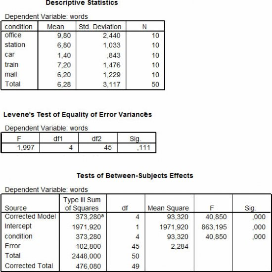
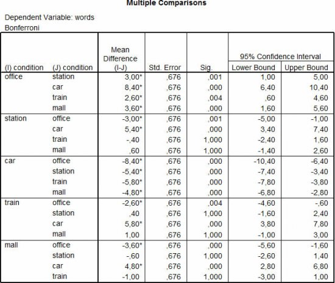
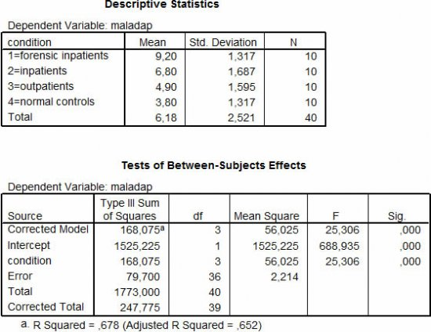
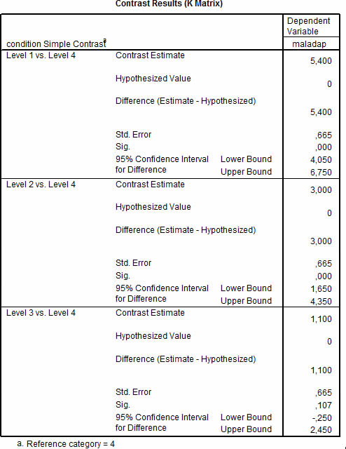
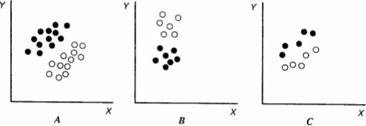
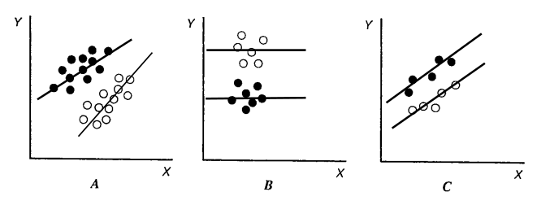

\vspace{20ex}

**Please prepare all exercises in this document for the tutorial meeting.**

Literature : Field (2013) Chapter 11, 12

The chapter numbers refer to the 4th edition of book "Discovering statistics using IBM SPSS Statistics" by Field. If you use the **5th edition** of the textbook, you find the corresponding chapter numbers in this table:

| **4th** edition | **5th** edition           |
| --------------- | ------------------------- |
| Chapter 11      | Chapter 12 (but not 12.9) |
| Chapter 12      | Chapter 13                |

\newpage

#  Chapter 11 (Field, 2013)

## ANOVA + Post Hoc tests/Multiple comparisons

In an experiment researchers examined the effect of noises on the clarity of (mobile) telephone calls. Of the 50 participants 10 persons were randomly assigned to each of five conditions. In these conditions noises were simulated corresponding to, respectively, an office, a station, a car, a train, and a shopping mall. Each person heard 20 words through a mobile phone. The dependent variable is the number of words that were understood correctly.

An ANOVA was performed, resulting in the following SPSS output:


```{r, echo=FALSE, fig.align="center",  out.width = '60%'}


```


**(1A)**
Sketch what data matrix looks like in SPSS.

**(1B)**
Specify the design and the level of control of this study and explain why ANOVA is the appropriate analysis.

**(1C)**
Describe the $H_0$ and $H_a$ associated with the $F$-test in this ANOVA table.

**(1D)**
Which assumption regarding ANOVA can be tested based on the above Output? What is your conclusion concerning this assumption?

**(1E)**
Suppose, all assumptions are met, what are your conclusions regarding the general H0 formulated in c. (also describe how much percent of the variation in scores on the dependent variable is explained by variation between conditions)?

**(1F)**
Which specific hypotheses concerning the different group means could be further tested?

**(1G)**
What is the name of these a posteriori formulated hypotheses?

**(1H)**
Test all hypotheses formulated in F. based on the Output above, and use $\alpha = .05$. (In SPSS the Bonferroni Correction is made by multiplying the p-value with the number of hypotheses tested. The values reported in the column “Sig.” in the above Table are corrected p-values).

**(1I)**
What is the usual way of making the Bonferroni correction and what is its purpose?

**(1J)**
Name 3 disadvantages of performing Multiple (or Post-Hoc) comparisons.

**(1K)**
Can you think of an alternative way of testing specific hypotheses concerning the differences in group means?

## ANOVA + Planned comparisons/planned contrasts

In a survey researchers examined the differences in maladaptive psychosocial functioning between different patient groups and normal controls. Four groups were investigated, defined by the factor “condition”, were:

* level 1 = forensic inpatients,
* level 2 = inpatients,
* level 3 = outpatients, and
* level 4 = normal controls.

In each group a random sample of 10 participants was investigated. The dependent variable was the score on a maladaptivity scale (ranging from 0, indicating the minimum level of maladaptivity to 10, indicating the maximum level of maladaptivity).

One of the research questions was whether each of the patient groups showed higher a level of maladaptivity than normal controls.

An ANOVA was performed, resulting in the following SPSS output:

```{r, echo=FALSE, fig.align="center",  out.width = '60%'}


```


**(2A)**
Sketch what data matrix looks like in SPSS.

**(2B)**
Specify the design and the level of control of this study and explain why ANOVA is the appropriate analysis.

**(2C)**
Describe the $H_0$ and $H_a$ associated with the $F$-test for “condition” in the ANOVA table.

**(2D)**
Suppose, all assumptions are met, what are your conclusions regarding the general H0 formulated in c. (also describe how much percent of the variation in scores on the dependent variable is explained by variation between conditions)?

**(2E)**
Which specific hypotheses concerning the different group means were further tested (specify the contrasts in terms of the contrast coefficients)?

**(2F)**
Check the contrast estimates (= contrast values) for the three contrasts in the table above; use the group means from the first table.

**(2G)**
Compute the $t$-values for each contrast; use the contrast value and the standard error (Std. Error) in the table above. Note that in the table above the $p$-value (Sig.) for each t-test, but not the $t$-value, was printed.

**(2H)**
Test all hypotheses formulated in question e based on the table above.

**(2I)**
Calculate the effect size for each contrast, $r_{contrast}$ (see Field, p. 474):

$$r_\text{contrast} = \sqrt{\frac{t^2}{t^2+ df}}$$


**(2J)**
What is your conclusion?

**(2K)**
Why would the researcher want to use these specific contrasts? Can you think of another meaningful type of contrasts for this study?


\newpage

# Chapter 12 (Field, 2013)

## ANCOVA, purpose and assumptions


**(3A)**
What is the purpose of analysis of covariance (ANCOVA)?

**(3B)**
Which assumptions have to be met in order to include a covariate in a (one-way) analysis of variance, such that the interpretation of the factor effect is valid?


## ANCOVA versus ANOVA

Consider the figures below, which show scores from an experimental group (black circles) and a control group (open circles) on a dependent variable Y, and a covariate X. Note that the independent variable is “group” (experimental, control).

When one conducts an ANOVA with Y as the dependent variable and group as the independent variable, one is interested only in the Y-scores (so the scores on X, although visible in the figures, are ignored). In that case the goal is to determine whether both groups have different means on Y.

When one conducts an ANCOVA, by including X as covariate, one can correct the group means for the influence of X.

```{r, echo=FALSE, fig.align="center",  out.width = '60%'}

```


**(4A)**
Which figure is least likely depicting data from a randomized experiment?

**(4B)**
Estimate the correlation between X and Y within the groups in Figure B.

**(4C)**
For which figure will ANCOVA show the smallest MSerror?

**(4D)**
Which figure shows a possible violation of the ANCOVA assumptions?

**(4E)**
In which figure(s) is the difference between the group means roughly equal to the difference between the adjusted group means?


\newpage\appendix

# Answers

## ANOVA + Post Hoc tests/Multiple comparisons

**Answer  1A**

| Subject | Condition | Words |
| ------- | --------- | ----- |
| 1       | Station   | 6     |
| 2       | Car       | 3     |
| ...     | ...       | ...   |


**Answer  1B**

*Design*

* dependent variable = the number of words that were heard correctly (“Words”; quantitative)
* between-subject factor = background noise (“Condition”; office, station, car, train, mall)

*Level of control*: This is an experiment, where the level of background noise is manipulated by the researcher, and the participants are randomly assigned to the experimental conditions.

An ANOVA is suited here because we want to compare various groups in terms of their mean on a quantitative variable


**Answer  1C**

* $H_0:  \mu_1 = \mu_2 = \mu_3 = \mu_4 = \mu_5$
* $H_a:$ at least two populations means differ significantly


**Answer  1D**

The assumption of homogeneous variances with Levene’s test that tests the
following hypothesis:

* $H_0: \sigma_1 = \sigma_2 = \sigma_3 = \sigma_4 = \sigma_5$
* $H_a:$ not all variances are equal (i.e. the different groups do not come from a population with the same variance).

The Levene’s test shows that, the observed differences between the group variances are not significant, thus the assumption is met. Furthermore, we have equal group sizes, thus even with a significant Levene’s test, our ANOVA $F$-test would have been fairly robust against a violation of the homogeneity assumption.


**Answer  1E**

ANOVA short report: An experiment was conducted to examine the effect of background noise on the clarity of mobile phone calls. Participants were assigned randomly to each of five conditions (office, station, car,train, mall). The dependent variable was the number of words each participants heard correctly.

A one-way ANOVA was conducted, which indicated that background noise had a significant effect on the clarity of mobile phone calls, $F(4,45) = 40.85, p < .001$. The proportion explained variance was $R^2 = .784$. Note: $R^2$ is not printed in the SPSS output above, but you can calculate it using the sum of squares.

$$ R^2 = \frac{SS_\text{Model}}{SS_\text{(Correct) Total}} = \frac{373.28}{476.080}=.784$$

Thus $78.4\%$ of the differences in clarity of the mobile phone calls is explained by various levels of background noise. This indicates a strong effect.


**Answer  1F**

The “specific hypotheses”, are all pairwise comparisons: 10 $t$-tests ($\frac{5\times4}{2} =10$)

* $H_0: \mu_1 = \mu_2$
* $H_0: \mu_1 = \mu_3$
* $H_0: \mu_1 = \mu_4$
* $\ldots$
* $H_0: \mu_4 = \mu_5$

SPSS shows all $(5\times4 =)$ 20 pairwise comparisons, e.g. $H_0: \mu_1 = \mu_2$ and also $H_0: \mu_2 = \mu_1$.


**Answer  1G**

Post Hoc tests or Multiple comparisons.


**Answer  1H**

All differences except for station and train, station and mall; and train and mall, are significant with alpha van 5% and Bonferroni corrected $p$-values.


**Answer  1I**

Usually the Bonferroni correction means that $\alpha$ is divided by the total number of specific tests. In this case alpha would be $\frac{.05}{10} = .005$. Thus, it becomes less likely that the null-hypothesis is rejected.

The goal of this correction, is that we keep the overall type I error rate (thus the chance that we make a type I error in at least one out of all tests) at 5%.


**Answer  1J**

* When hypotheses are not theory-based, the outcomes are not always interpretable or theoretically meaningful.
* The power for detecting a difference is smaller than when we use contrast tests, because of the correction for multiple testing, that is necessary.
* It does not allow for more complex follow up comparisons (e.g, control condition vs mean of two experimental conditions), only pairwise comparisons are made.


**Answer  1K**

On the basis of planned contrasts.


## ANOVA, Planned comparisons/planned contrasts

**Answer 2A**


| Subject | Condition            | maladap |
| ------- | -------------------- | ------- |
| 1       | Forensic inpatient   | 6       |
| 2       | inpatient            | 3       |
| ...     | ...                  | ...     |


**Answer 2B**

*Design:*

* outcome variable = maladaptivity score (“maladap”; quantitative)
* between-subjectfactor = patient group (“Condition”;forensic inpatients, inpatients, outpatients, and normal controls)

*Level of control:*

This is a survey study, so non-experimental.

Why ANOVA? Researchers are interested in differences between groups based on one quantitative outcome variable, furthermore, there is no covariate available.


**Answer  2C**

* $H_0:  \mu_1 = \mu_2 = \mu_3 = \mu_4 = \mu_5$
* $H_a:$ at least one difference is significant


**Answer  2D**

Short report: We conducted a 1-way ANOVA one the data of four different patient groups. Results indicated that the groups differed with respect to the average maladaptivity scores, $F(3,36) = 25.306, p < .001$. The proportion variance in maladaptivity that is explained by the differences between groups is .678, this is a large effect size.


**Answer  2E**

* $H_0: \psi_1:   \mu_1 - \mu_4 = 0$ (or $\mu_1 = \mu_4$)
* $H_0: \psi_2:   \mu_2 - \mu_4 = 0$
* $H_0: \psi_3:   \mu_3 - \mu_4 = 0$
* In all cases $H_a:  \psi>0$

\newpage
**Answer  2F**

* $contrast_1 = mean_1 - mean_4 = 9.2-3.8 = 5.4$
* $contrast_2 = mean_2 - mean_4 = 6.8-3.8 = 3.0$
* $contrast_3 = mean_3 - mean_4 = 4.9-3.8 = 1.1$


**Answer  2G**

* $t_\text{contrast 1} = \frac{contrast}{std. error} = \frac{5.4}{0.665} = 8.12$
* $t_\text{contrast 2} = \frac{contrast}{std. error} = \frac{3.0}{0.665} = 4.51$
* $t_\text{contrast 3} = \frac{contrast}{std. error} = \frac{1.1}{0.665} = 1.65$


**Answer  2H**

We divide the $p$-values by 2, because of the one-sided hypotheses. This results in
rejecting the first and the second, but not the third hypothesis.


**Answer 2I**

\begin{align*}
R_\text{contrast} &= \sqrt{\frac{t^2}{t^2+ df}} \text{ (see Field, p. 390)}\\
R_\text{contrast 1} &= \sqrt{\frac{8.12^2}{8.12^2+ 36}} = .80 \text{ (large effect size)} \\
R_\text{contrast 2} &= \sqrt{\frac{4.51^2}{4.51^2+ 36}} = .60 \text{ (large effect size)} \\
R_\text{contrast 3} &= \sqrt{\frac{1.65^2}{1.65^2+ 36}} = 27 \text{ (small to medium effect size)} \\
\end{align*}


**Answer  2J**

Simple contrasts showed that forensic inpatients have significantly higher maladpativity scores ($M = 9.20$), than normal controls ($M = 3.80$). Furthermore, “inpatients” inpatients have significantly higher maladpativity scores ($M = 6.80$) than normal controls.


**Answer  2K**

In this case, reversed Helmert contrasts (“Difference”), would be interesting as well. Helmert contrasts compare the fourth group to all previous groups; the third group to all previous groups etc. This type of contrast is interesting when there is a logical order in the groups.


\newpage

## ANCOVA, purpose and assumptions

**Answer  3A**

The main advantage of ANCOVA is that it reduces the $MS_{error}$, and therefore enhances the power of the $F$-test of the between-subject-factor. The $MS_{error}$ is reduced if the covariate is correlated with the dependent variable (and this correlation is approximately the same in each group), because, in that case the covariate explains part of the residual variance that was left in the regular ANOVA.

ANCOVA is most often not a valid method to correct for pre-existing differences between groups on the outcome variable. Because in experimental research groups are formed by random assignment, the groups should not differ on any covariate. Another way to avoid the problem of groups differing on the covariate is by matching on the covariate.


**Answer  3B**

Besides the usual ANOVA assumptions (independent observations, normally distributed errors in each group, homogenous variances across groups), we assume in ANCOVA:

1.  a linear relation between the covariate and the outcome variable
2. independence of the covariate and the treatment effect
3. homogeneity of regression slopes or parallel regression lines (with the covariate predicting the outcome variable) in all groups.
4. the covariate should be measured reliably.


## ANCOVA versus ANOVA

**Answer  4A**

Figure A, because the groups differ on the covariate X, while random assignment
is meant to make them equal on all confounding variables.


**Answer  4B**

About zero.


**Answer  4C**

Figure C, because it shows the strongest correlation within both groups between the covariate and the outcome. As a result the residuals in ANCOVA with X as covariate are substantially smaller than residuals in ANOVA without X as covariate. Thus, (a) the F-test for the bs-factor has more power and (b) the effect size for the bs-factor will be larger


**Answer  4D**

* Figure A: The regression lines are not parallel.
* Figure B: there is a zero correlation between the covariate X and the outcome Y. Including a covariate in the analysis reduces the degrees of freedom by one. When there is no reduction of error compared to ANOVA, the $MS_{error}$ will be even larger in ANCOVA.

**Answer  4E**

In Figures B and C. In both situations the groups have equal means on the covariate.

```{r, echo=FALSE, fig.align="center",  out.width = '60%'}

```

<!-- FIXME difficult to see this difference. Make clear figure A -->
