\vspace{20ex}

**Please prepare all exercises in this document for the tutorial meeting.**

Literature: Field (5th ed, 2018) Chapters 13 & 14


\newpage

# Chapter 13


## ANCOVA

Example: “A marketing manager for a certain well-known drinks manufacturer was interested in the therapeutic benefit of certain soft drinks for curing hangovers. He took 15 people out on the town one night and got them drunk. The next morning as they awoke, dehydrated and feeling as though they’d licked a camel’s sandy feet clean with their tongue, he gave five of them water to drink, five of them Lucozade, and the remaining five a leading brand of cola (this variable is called drink). He then measured how well they felt (on a scale from 0 = I feel like death to 10 = I feel really full of beans and healthy) two hours later (this variable is called well). He wanted to know which drink produced the greatest level of wellness.

However, he realized that it was important to control for how drunk the person got the night before, and so he measured this on a scale of 0 = as sober as a nun to 10 = flapping about like a haddock out of water on the floor in a puddle of their own vomit (this variable is called drunk).”

Below you find the SPSS output for this task, that is, the ANCOVA for the Hangover dataset ``Cure.sav''.

Preliminary analysis:

```{r, echo=FALSE, fig.align="center",  out.width = '60%'}
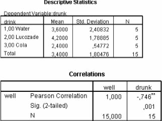
```

\newpage
ANCOVA main analysis:

```{r, echo=FALSE, fig.align="center",  out.width = '60%'}
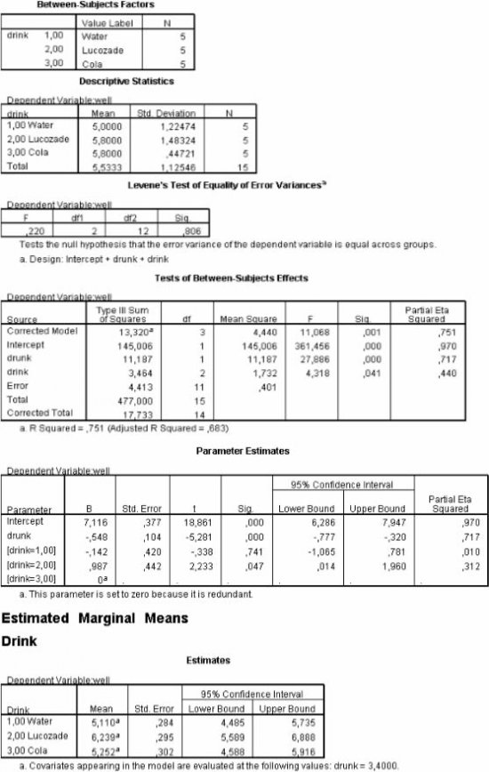
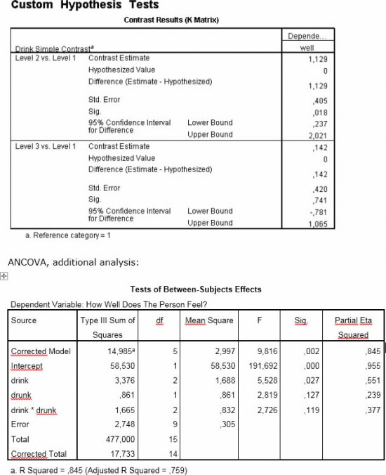
```


**(1A)**
What is the design of this study?

**(1B)**
Why would the researcher prefer ANCOVA to regular ANOVA in this study?

**(1C)**
Name a possible disadvantage of ANCOVA, given the information available in the above SPSS-output.

**(1D)**
Report the $F$-test that tests the assumption of homogenity of regression slopes. What is your conclusion concerning this assumption?

**(1E)**
Report the main effect of drink, include effect size.

**(1F)**
Look at the table with parameter estimates. Write down the regression equation for this analysis, and interpret the $b$-coefficients.

**(1G)**
Look at the table with planned contrast tests “Custom hypothesis tests”. Which two hypotheses are tested here? What is the name of this type of contrast test?

**(1H)**
Compute for each contrast the $t$-value and the $r$-effect*.

**(1I)**
Report (using APA norms) on the contrast tests of this example by Field.

$$r_\text{contrast} = \sqrt{\frac{t^2}{t^2+ df}}$$


# Chapter 14

## Two-way ANOVA


An experiment was conducted to investigate the effect of task difficulty and fairness of judgment on fear of failure. The rationale was that the more difficult a task was the more people would experience fear of failure. Furthermore, it was expected that an unfair judgment would lead to an external attribution of failure, and therefore to a decrease in fear of failure.  The independent variables were task difficulty (easy, moderate, and difficult) and fairness of judgment (fair, unfair).

Participants ($N = 24$) were randomly assigned to either one of the six experimental conditions ($n = 4$). In each condition participants had to complete a multiple choice knowledge test (which was either easy, moderate, or difficult) Participants received either a fair judgment of their test achievement or an unfair judgment (in the latter case the received a lower score than their actual score).

The dependent variable was a score on a fear of failure self report measure ($0 = \text{no fear of failure} - 100 = \text{maximal fear of failure}$).

The means and variances of each condition are presented in the table below:

```{r, echo=FALSE, fig.align="center",  out.width = '60%'}
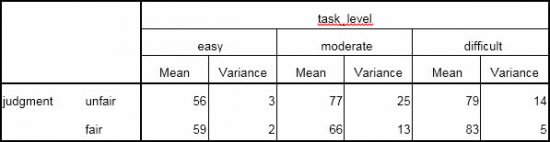
```

**(2A)**
Name two advantages of this two-way factorial design in comparison with conducting two separate one-way experiments: one with the factor “task level” and with the factor “fairness of judgment”.

**(2B)**
Which assumptions have to be met when we analyze this data with a two-way ANOVA?

**(2C)**
Draw a so-called interaction plot:  put task level on the horizontal axis, fear of failure on the vertical axis, and use separate lines for both levels of fairness of judgment. Interpret both main effects and the interaction effect based on this graph.

**(2D)**
The grand mean of fear of failure is 70. Compute $SS_M$ ($SS_\text{model}$) and $df_M$.

**(2E)**
Compute the Sums of Squares for both main effects ($SS_\text{task level}$ and $SS_\text{judment}$) with their degrees of freedom ($df_\text{task level}$ and $df_\text{judment}$).

**(2F)**
Describe in words what the interaction effect ($SS_{\text{task level} \times \text{judment}}$) represents. Compute $SS_{\text{task level} \times \text{judment}}$ using your answers from D and E.

**(2G)**
Describe in words what the residual sum of square ($SS_R$) represents. Compute $SS_R$ using the variances in the table above.

\newpage
**(2H)**
Make a complete ANOVA table for this example:

| Source                       | $SS$ | $df$ | $MS$ | $F$ | $p$ |
| ---------------------------- | ---- | ---- | ---- | --- | --- |
| Model                        |      |      |      |     |     |
| Task level                   |      |      |      |     |     |
| Judgment                     |      |      |      |     |     |
| Task level $\times$ judgment |      |      |      |     |     |
| Error (Residual)             |      |      |      |     |     |
| Total                        |      |      |      |     |     |

**(2I)**
Which effects are significant with $\alpha = .05$?


## Two-way ANOVA simple effects analysis

For the data in the previous exercise a simple effects analysis was done with the SPSS syntax (see for an explanation of a similar syntax command:

```{r, eval=FALSE}
  GLM fear_of_failure by judgement task_level
     /emmeans = tables(judgement*task_level)compare(judgement).
```

The output is printed in the table below.


```{r, echo=FALSE, fig.align="center",  out.width = '60%'}
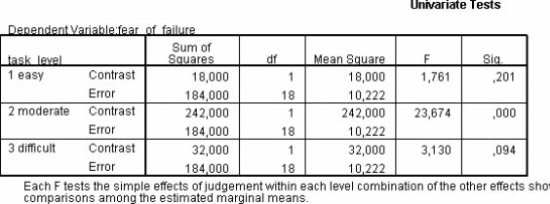
```

**(3A)**
Compared to the previous exercise, which additional hypotheses are tested in this simple effects analysis?

\newpage
**(3B)**
Indicate in the following interaction plot (see previous exercise 1B.), which differences among the means of the experimental conditions are tested in this simple effects analysis.

```{r, echo=FALSE, fig.align="center",  out.width = '40%'}
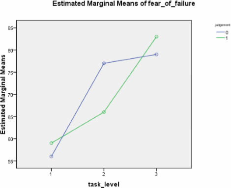
```

**(3C)**
Write down your conclusions for each F-test in the table above, also compute $r$-effect for each $F$:
$$r = \sqrt{\frac{F_\text{effect}}{F_\text{effect} + df_\text{error}}}$$


## Two-way ANOVA interaction plots

In a factorial two-way ANOVA, three effects can be present or not: two main effects and one interaction effect.

By making interaction graphs, depicting the group means (possibly with error bars), and connecting them with separate lines for each group, it is possible to interpret whether an effect is present or not.

Consider the eight interaction plots below (see next page), depicting the means from a $2\times 2$ ANOVA.


**(4A)**
Decide for each plot whether there is a main effect of factor $A\;(A_1,A_2)$, a main effect of factor $B\;(B_1,B_2)$, and/or an interaction effect?

**(4B)**
What would the advantage have been of plotting error bars for each mean?

\newpage

```{r, echo=FALSE, fig.align="center",  out.width = '70%'}
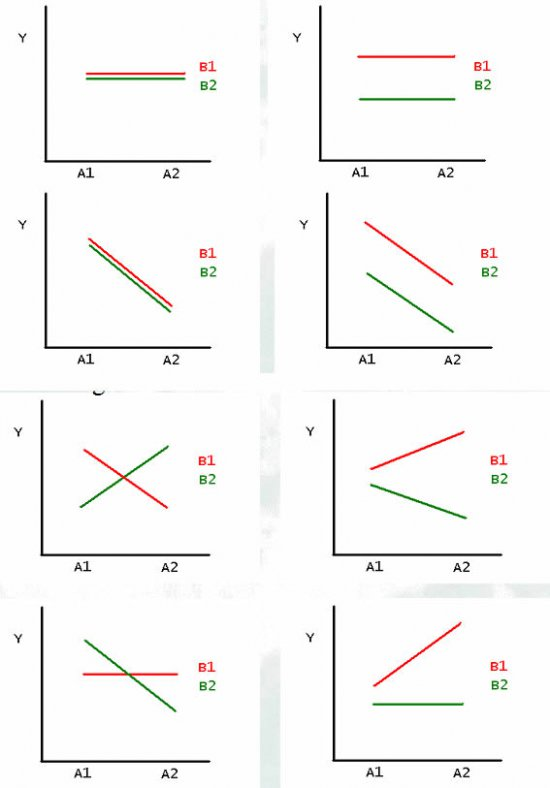
```


\newpage\appendix
# Answers

## ANCOVA


**Answer 1A**

The dependent variable is how well participants felt (on a scale from 0 = I feel
like death to 10 = I feel really full of beans and healthy) two hours after drinking
a specific drink (quantitative variable called well)

The independent variables are:

* The between-subjects factor: type of drink (qualitative variable, with categories:
water, lucozade, cola)
* The covariate: how drunk the participant was the night before (quantitative
variable called drunk)


**Answer 1B**

ANCOVA is preferred here because the researcher has measured how drunk people got, and he thinks this might be related to the dependent variable. The advantage of ANCOVA is that, when the covariate is significantly related to the dependent variable, the F-test for the effect of the between-subjects factor, has a smaller error, and therefore more power, than the F-test for the effect of the same between-subjects in a regular one-way ANOVA.

**Answer 1C**

According to Field, it is problematic when in an experiment (where participants are randomly assigned to conditions) the groups have significantly different means on the covariate. From the tables of means we see that participants, who were in the cola condition, were on average less drunk, as participants in the water and lucozade conditions. When this difference is significant (which is not the case her\footnote{A critical remark must be that when assumptions are checked with statistical tests and N is small, the test lacks statistical power. In such cases it is difficult to decide whether a violation cause reason for concern}) it means that the experimental effect (the effect of the drinks) is confounded with how drunk people got the night before. In other words: if we find a difference between the groups it is not clear whether this difference is due to the drink only, or due to the drink in combination with how drunk people got. ANCOVA is not the solution to this problem


**Answer 1D**

This is the $F$-test of the interaction effect between the bs-factor type of drink and the covariate drunk in the additional analysis: $F(2,9) = 2.73 , p > .05$, but $\eta_\text{partial}^2 = .38$, which is a large effect.

Thus, although the $F$-test is non-significant, we might have a problem with homogeneity of regression slopes, probably, since $N$ is small, the $F$-test lacks statistical power and $p > .05$. In such cases it is difficult to decide whether a violation cause reason for concern. We could investigate the assumption further by checking the scatterplot of the covariate “drunk” by outcome variable “well” with separate regression lines for the groups:

```{r, echo=FALSE, fig.align="center",  out.width = '60%'}
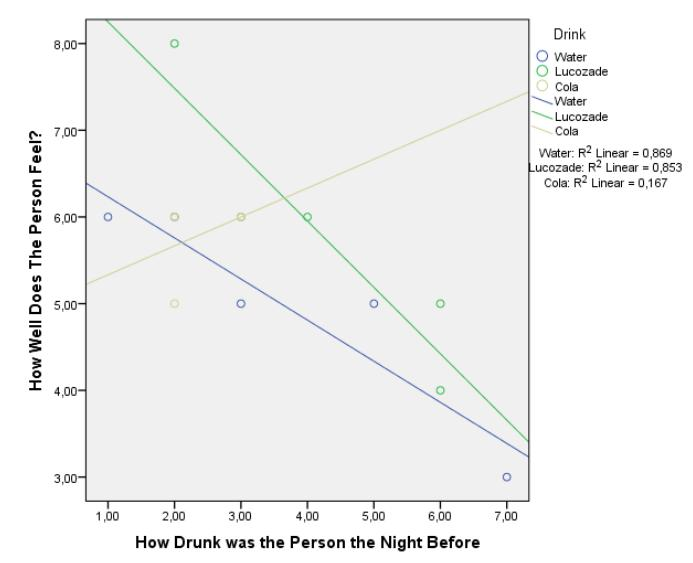
```

You can see that the regression lines in the above graph are not parallel, probably with a larger sample the interaction effect would have been significant. In practice ANOVA would be better here (and we should include the covariate Drunk as a factor by recoding in into a “low”, “medium”, “high” variable), and the discussion would be that the groups differ not only with respect to “drink” but also with respect to “drunk”, therefore it is impossible to interpret the “main effect ”of “drink” as the causal explanation for differences in wellbeing. Obviously in practice, there should have been more experimental control in creating comparable groups by including more seriously drunk people in the cola condition, and the factor Drunk could also be manipulated by explicitly including it as a factor in the design. We would analyse such design with factorial ANOVA.

*The answers below concern the output of ANCOVA; of course, reporting these results assumes that the assumptions are met. In reality you should have re-run your experiment due to incomparable groups or report ANOVA*


**Answer 1E**

There was a significant effect of the type of drink on how well the person felt after controlling for how drunk they were the night before, $F(2, 11) = 4.32, p < 0.05, \eta_\text{partial}^2 = .44$, which is a large effect.


**Answer 1F**

$$\text{well} = 7.116 - 0.548 \text{ drunk} - 0.142 \text{ drink dummy 1} + 0.987 \text{ drink dummy 2}$$

* drink dummy 1: water versus cola
* drink dummy 2: lucozade versus cola

**Answer 1G**

The contrast tests compare drink 2 (Lucozade) against drink 1 (water) as a first comparison, and drink 3 (cola) against drink 1 (water) as a second comparison. These results show that the Lucozade group felt significantly better than the water group (contrast 1, $p = .018$), but that the cola group did not differ significantly from the water group ($p = 0.741$). These results are consistent with the regression parameter estimates (in fact, note that contrast 2 is identical to the regression parameters for drink = 1 in the previous section).

**Answer 1H**

$$t_\text{contrast 1} = \frac{contrast\;estimate}{std\;error} = \frac{1.129}{0.405}=2.79$$
$$t_\text{contrast 1}= \frac{contrast\;estimate}{std\;error} = \frac{0.142}{0.42} = 0.34$$
These t-statistics use the df error from the main analysis (ANCOVA) as degrees of freedom, (in this case 11)

\begin{align*}
r_\text{contrast 1} &= \sqrt{\frac{2.79^2}{2.79^2+ 11}} = .64  \\
r_\text{contrast 2} &= \sqrt{\frac{0.34^2}{0.34^2+ 11}} = .10
\end{align*}


**Answer 1I**

Planned contrasts revealed that having Lucozade significantly improved how well you felt compared to having water, $t(11) = 2.79, p < .05, r = .64$, but having cola was no better than having water, $t(11) = 0.34  \text{ (n.s.)}, r = .10$. We can conclude that cola and water have the same effects on hangovers but that Lucozade seems significantly better at curing hangovers than cola.

\newpage

## Two-way ANOVA

**Answer 2A**

Two-way ANOVA allows for investigating the combined effect of both independent variables, that is their interaction effect. Furthermore, combining factors is more efficient, since the same respondents can be tested in a combination of conditions defined by both factors at the same time.

**Answer 2B**

The same as in one-way ANOVA:

Assumptions:

* independent observation
* normally distributed errors
* equal group variances (homogeneity of variances)

but: If the group sizes are roughly equal, and we have no outliers, and $DF_\text{error}$ is at least 20, than the $F$-test is robust against violations of the normality and homogeneity assumptions


**Answer 2C**

This results in the following plot:

```{r, echo=FALSE, fig.align="center",  out.width = '60%'}
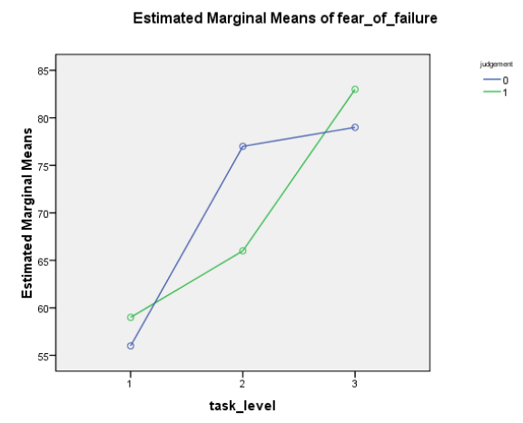
```


1. Main effect task level: on average, fear of failure increases with task level.
2. Main effect judgment: the means of both conditions of fairness of judgment must be derived from the plot; the difference is small.
3. Interaction effect task level $\times$ judgment: the lines are not parallel: there seems to be an interaction: compared to participants in the “fair” judgment condition, participants in the “unfair” judgment condition have, on average, a lower fear of failure score in the “easy” and the “difficult” task condition, but have a higher mean fear of failure score in the “moderate” task condition. Thus, the effect of fairness of judgment on fear of failure seems to depend on task difficulty.


**Answer 2D**

First we compute the marginal means:

|                      | Judgment Fair | Judgment Unfair | $M(\text{task})$ |
| -------------------- | ------------- | --------------- | ---------------- |
| Task easy            | 59            | 56              | 57.5             |
| Task moderate        | 66            | 77              | 71.5             |
| Task difficult       | 83            | 79              | 81               |
| $M(\text{judgment})$ | 69.33         | 70.67           | 70               |

$SS_\text{model} =$ the weighted sum of squared deviations of the six condition means from the grand mean, where the number of participants in each condition is used as weights.

\begin{align*}
SS_\text{model} &= \sum n_k(\overline{x}_k-\overline{x}_\text{grand})^2 \\
                &= 4(-11^2) +  4(-4^2) + 4(-13^2) + 4(-14^2) + 4(7^2) + 4(9^2) \\
                &= 2528 \\
                \\
df_\text{model} &= k-1 \qquad (k=\text{total number of conditions}) \\
                &= 6-1 = 5
\end{align*}

Note: $\overline{x}_k$ is the mean in each condition $k$


**Answer 2E**

$SS_\text{task level} =$ the weighted sum of squared deviations of the three condition means (within the factor task level) from the grand mean, where the number of participants in each condition is used as weights.

\begin{align*}
SS_\text{task level} &= \sum n_k(\overline{x}_k-\overline{x}_\text{grand})^2 \\
                &= 8(-12.5^2 ) + 8(1.5^2 ) + 8(11^2 ) = 2236 \\
                \\
df_\text{task level} &= k-1 \qquad (k=\text{number of conditions of task level}) \\
                &= 3-1 = 2
\end{align*}

Note: $\overline{x}_k$ is the mean in each condition $k$ of the factor task level


$SS_\text{judgment} =$ the weighted sum of squared deviations of both condition means (within the factor fairness of judgement) from the grand mean, where the number of participants in each condition is used as weights.

\begin{align*}
SS_\text{judgment} &= \sum n_k(\overline{x}_k-\overline{x}_\text{grand})^2 \\
                &= 12 (-0.67^2) + 12 (0.67^2 ) = 10.67 \\
                \\
df_\text{judgment} &= k-1 \qquad (k=\text{number of conditions of judgment}) \\
                &= 2-1 = 1
\end{align*}

Note: $\overline{x}_k$ is the mean in each condition $k$ of the factor judgment


**Answer 2F**

The interaction effect task level $\times$ judgment indicates whether the effect of fairness of judgment on fear of failure is dependent on task difficulty. The $SS_\text{interaction}$ can be derived as follows:

\begin{align*}
SS_\text{interaction} &= SS_\text{model} - SS_\text{task level} - SS_\text{judgment} \\
                      &= 2528-2236-10.67=281.33
\end{align*}


**Answer 2G**

$SS_\text{error}$ represents the amount of variation (individual differences) within each condition. This can be derived from the variances of the conditions:

For each group take the variance, multiply it with $N-1$; sum up the results:

\begin{align*}
SS_R = 3 &\times (4 - 1)\; + \\
25 &\times (4 - 1)\; + \\
14 &\times (4 - 1)\; + \\
2 &\times (4 - 1)\; + \\
13 &\times (4 - 1)\; + \\
5 &\times (4 - 1)\; = 186
\end{align*}

$$df_\text{error} = N-k = 24 - 6 = 18$$

*Note*: $k$ is number of conditions, $SS_R$ is short for $SS_\text{error}$ or $SS_\text{residual}$

\newpage

**Answer 2H**

| Source                       | $SS$   | $df$ | $MS$   | $F$    | $p$     |
| ---------------------------- | ------ | ---- | ------ | ------ | ------- |
| Model                        | 2528   | 5    | 505.6  | 48.94  | $<.001$ |
| Task level                   | 2236   | 2    | 1118   | 108.20 | $<.001$ |
| Judgment                     | 10.67  | 1    | 10.67  | 1.03   | n.s.    |
| Task level $\times$ judgment | 281.33 | 2    | 140.67 | 13.62  | $<.001$ |
| Error (Residual)             | 186    | 18   | 10.33  |        |         |
| Total                        | 2712   | 23   |        |        |         |


## Two-way ANOVA simple effects analysis


**Answer 3A**

Within each condition of the factor task difficulty the two means of the conditions of fairness of judgment are compared. Thus it tests the effect of fairness of judgment at individual levels of task difficulty.

**Answer 3B**

```{r, echo=FALSE, fig.align="center",  out.width = '60%'}
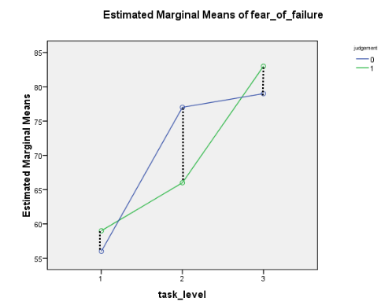
```


**Answer 3C**

For the participants who got either an easy, or a difficult task there was no significant difference in average fear of failure between those who got a “fair” and those who got an “unfair” judgment (respectively $F(1,18) = 1.76, p > .05, r = .30; F(1,18) = 3.13, p > .05, r = .38$), although we found moderate $r$ effects. For the participants who got a moderately difficult task there was a significant difference in average fear of failure between those who got a “fair” and those who got an “unfair” judgment ($F(1,18) = 23.67, p < .001, r = .75$), $r$ effect indicates a strong effect. When the task level was moderate, on average, participants
showed higher fear of failure in the “unfair” judgment condition; (partly, this contradicts the research hypothesis).


\newpage
## Factorial (Two-way) ANOVA interaction plots

**Answer 4A**

```{r, echo=FALSE, fig.align="center",  out.width = '80%'}
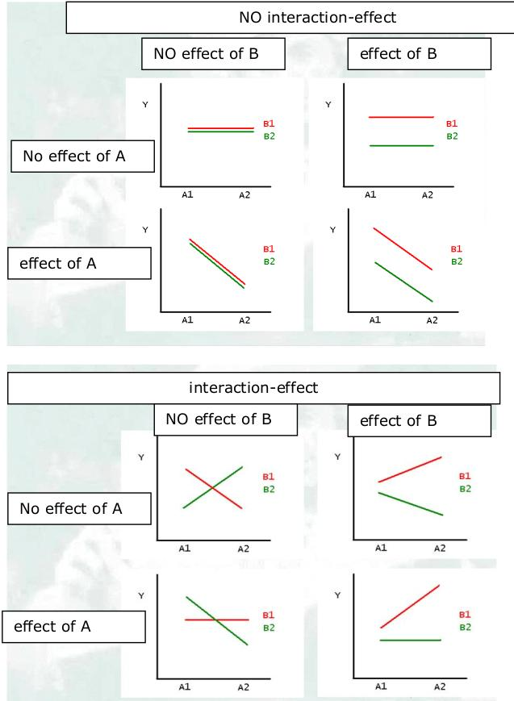
```


**Answer 4B**

Error bars charts show the Group means with their 95% confidence interval.

From Cumming and Finch (2005) we adopt the following three guidelines for the relationship between CIs and null hypothesis significance testing:

1. 95% CIs that just about touch end-to-end represent a p-value for testing $H_0: \mu_1 = \mu_2$ of approximately .01.
2. If there is a gap between the upper limit of one 95% CI and the lower limit of another then $p < .01$.
3. A $p$-value of .05 is represented by moderate overlap between the bars (approximately half the value of the margin of error)
