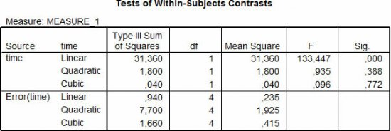
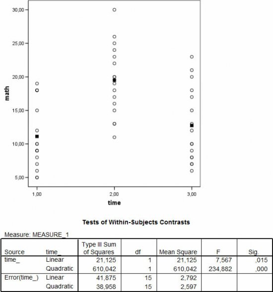
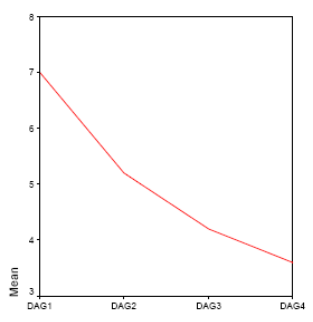

\vspace{20ex}

**Please prepare all exercises in this document for the tutorial meeting.**

Literature: Field (5th ed, 2018), Chapter 15: repeated measures ANOVA (completely within designs), Chapter 11


\newpage

# Chapter 15

## Within-subject designs

In a study design, factors can be observed between or within subjects.

**(1A)**
Define a between-subjects factor and a within-subjects factor.

**(1B)**
What are the advantages of a within-subjects design?

**(1C)**
What are the disadvantages of a within-subjects design?

**(1D)**
What is meant by the number of levels of a factor? What is an experimental condition in this context?

**(1E)**
Give an example of a factorial repeated measures ANOVA with two within-subjects factors.

**(1F)**
How many effects can be tested in two-way factorial repeated measures ANOVA?

**(1G)**
The main analysis tests the effects that you named in f.

Describe three follow-up strategies to further explore each of the effects that you named in f.


## Repeated measures ANOVA, univariate approach

**(2A)**
Which assumption is made in the univariate test statistics in GLM repeated measures, but not in multivariate test statistics in GLM repeated measures?

**(2B)**
When is the assumption referred to in a. NOT relevant to repeated measures ANOVA (the univariate approach)?

**(2C)**
Which Table in the SPSS output shows the main results of the repeated measures ANOVA?

**(2D)**
Which Table(s) in the SPSS output show(s) the follow-up tests (the tests that break down the general effects) for the repeated measures ANOVA?

**(2E)**
What does the value of epsilon ($\epsilon$) tell you? Why does SPSS print more than one epsilon-value in the output?

**(2F)**
Which *adjusted* $F$-tests are available in repeated measures ANOVA, and when should they be used?


\newpage

## Repeated measures ANOVA, follow-up: contrasts

Five randomly selected patients in an institution for mental health care were given behavioural therapy to diminish self-mutilation behavior, especially “cutting”. The training was given daily, for one hour. The dependent variable was the number of observed manifestations of “cutting”. The data are provided in the following table. The research question is whether the training was effective, that is whether there was a significant decrease in the unwanted behavior.

| Subject | Day 1 | Day 2 | Day 3 | Day 4 |
| ------- | ----- | ----- | ----- | ----- |
| 1       | 8     | 8     | 7     | 5     |
| 1       | 7     | 7     | 5     | 4     |
| 3       | 9     | 4     | 4     | 4     |
| 4       | 6     | 4     | 3     | 3     |
| 5       | 5     | 3     | 2     | 2     |


**(3A)**
Specify the design of the study and the level of control.

**(3B)**
Make a graph of the averages. Describe the development you see. How would you assess whether this development can statistically significant?

**(3C)**
One way to test the changes over time, is to perform a trend analysis. Define the 3 “polynomial” contrasts that can be tested here (Why is three the maximum number of contrasts?).

The testing of these contrasts resulted in the following SPSS output table:

```{r, echo=FALSE, fig.align="center",  out.width = '70%'}

```

**(3D)**
Write a “short report” based on the information above. Also compute the effect size for the contrast.

**(3E)**
Suppose the final moment of testing did not take place on day 4, but on day 7. Would the linear contrasts still be correct?


\newpage

## Repeated measures ANOVA, follow-up: contrasts

For 16 pupils in elementary school a math score is determined during one school year: the first math test is at the beginning of the school year, the second math test was in the middle of the school year and the final math test was at the end of the school year, before the summer holiday. The figure below shows the math scores of all 16 pupils on the 3 math tests, the mean scores on each test are depicted as black squares. Furthermore a table of contrast tests is given for a linear and a quadratic trend.

```{r, echo=FALSE, fig.align="center",  out.width = '70%'}

```

**(4A)**
Describe the score pattern in the figure above.

**(4B)**
Which of both trends (defined by the contrasts in the above table) fits the data best? Try to give an explanation for the pattern of mean scores from the information about this study.

**(4C)**
Write a “short report” based on the information above. Also compute the effect size for the contrast.

**(4D)**
Given the figure above, can you tell whether the pattern of the mean scores also represents the individual score patterns? What information would you need to be able to judge the individual score patterns?


\newpage\appendix
# Answers

## Within-subject designs

**Answer 1A**

* between-subjects factor: an independent categorical variable that defines experimental conditions or groups, with different participants in each condition or group.
* Within-subjects factor: an independent categorical variable that defines experimental conditions or measurements, with the same participants in each condition or at each measurement.


**Answer 1B**

A within-subjects design is more efficient: since all participants are in all conditions, we need less participants than in a between-subjects design. Furthermore, these designs have more statistical power, as, in general, the residuals are smaller than in a between-subjects design; residuals are smaller, because the effect of the experimental conditions can be evaluated within participants. In between-subject designs there are different participants in each condition, thus all participant variance is considered residual variance.

Finally, the participants are in all conditions, thus participant characteristics, such as gender, age, IQ, can never be an alternative explanation for the difference between condition means.

**Answer 1C**

The internal validity of within-subject designs can be threatened by practice effects, and boredom effects. The demand characteristics should not be too high (not to many different conditions). The order of the conditions that participants are subjected to should be randomized, so that the carry-over effects can be averaged out per condition. Randomization of the order of the conditions is called counterbalancing.


**Answer 1D**

The levels of the ws-factor define the experimental conditions or the
measurements of the dependent variable. The condition means are compared and
the differences among the means are tested with repeated measures ANOVA.

**Answer 1E**

Suppose, a researcher wants to evaluate the effectiveness of a math course. The outcome variable is the total number of correctly answered items in a math test. The ws-factors are time (pre, post, follow-up) and type of test item (multiplication or division). All participants make parallel versions of the math test consisting of both types of test items, at three points in time.

\newpage

**Answer 1F**

Three general tests: in this example we can test both main effects:

1. Time: do participants improve on their math skills?
2. Type of test item: do participants find one type of test item more difficult than the other type of test item?

And we test their interaction: Is the possible improvement in math skills dependent
on the type of test item?

**Answer 1G**

For significant main effects for factors with more than two levels we can conduct either Post Hoc pairwise comparison tests (in SPSS: compare main effects) or  planned contrasts.

For a significant interaction effect, we can use within subjects contrasts to compare the difference between two levels of one factor for two levels of the other factor (e.g., is the difference between pre- and post test the same for division items and multiplication items?). Furthermore, we can test the difference between two levels of one factor within each level of the other factor (e.g. is the difference between pre- and post test significant when we take only division items into account?). This type of analysis is called simple effects analysis.


## Repeated measures ANOVA, univariate approach

**Answer 2A**

The assumption of sphericity. Sphericity refers to the equality of variances of the
differences between various conditions of the ws-factor.
This assumption is not relevant when the ws-factor has only two conditions, because
in that case we have only one set of difference scores.

**Answer 2B**

“Tests of within subjects effects”


**Answer 2C**

The standard follow up contrasts are in the table “Test of within-subjects
contrasts”. NB these test use different estimates of the MSresidual based on the
variance of the difference scores for that specific combination.
Post Hoc pairwise comparisons are also available in the table called “Pairwise
comparisons”; these test use separate error terms as well.

**Answer 2D**

Epsilon is used to estimate the level of sphericity (homogeneity of variances of the
difference scores). The closer it is to 1 , the more homogeneous are the variances of
the difference scores. The lower limit is 1/k-1, where k equals the number of
conditions of the ws-factor. Huyn-Feldt is too optimistical, Greenhouse-Geisser is on
the conservative side (therefore the latter is recommended for more severe
violations of this assumption).

**Answer 2E**

Huyn-Feldt, Greenhouse-Geisser and the lower bound. Sphericity can be tested with Mauchly’s test, but during this course we always stress not to rely solely on $p$-values, but also to take into account the effect size and data exploration. I follow the rules of thumb presented in Field, which I think apply regardless of Mauchly’s test:

1. Epsilon close to 1 (or when in fact the corrected df’s are very close to the uncorrected $df$’s. resulting in all corrections producing the same $p$- values): \newline $\rightarrow$ **Uncorrected F (sphericity assumed)**
2. Mild departure from Sphericity: $.75 < \text{GG epsilon} < .95$: \newline $\rightarrow$ **Huynh-Feldt (HF) corrected $F$-test**
3. Strong departure from Sphericity: GG epsilon $< .75$: \newline $\rightarrow$ **Greenhouse-Geisser corrected $F$-test**

Alternative to G-G correction for strong departure from Sphericity: GG epsilon $<.70$: \newline $\rightarrow$ *Multivariate $F$-test*. This has more power, but can be only use if $N$ is not too small (rule of thumb: $N>k+10$)


## Repeated measures ANOVA, follow-up: contrasts


**Answer 3A**

* design: outcome variable= number of observed manifestations of cutting behavior ws-factor = time (day 1, 2, 3, 4)
* level of control: observational


**Answer 3B**

```{r, echo=FALSE, fig.align="center",  out.width = '40%'}

```

The trend is decreasing (7; 5.2; 4.2; 3.6), but it is described best as a diminishing decrease (subsequent differences are: 1.8; 1; 0.6). This could be tested by testing a linear polynomial, but also by combing a linear and quadratic trend (via SPSS Syntax)

\newpage

**Answer 3C**

The number of contrasts equals the number of conditions $- 1 \text{ (that is, } 4- 1 = 3)$
namely, linear, quadratic and cubic.

* Linear = constant decrease
* quadratic = an increase followed by a decrease (or reverse)
* cubic = an increase followed by a decrease, followed by an increase (or reverse).

Here: the linear trend is the only trend the makes sense given the pattern of the
observed means.

**Answer 3D**

Short report: A one-way repeated measures ANOVA was conducted with time as
within-subjects factor. The outcome variable was number of observed manifestations
of cutting behavior. The effect of daily training was evaluated based on polynomial
contrasts. A linear decreasing trend fitted the data, F(1,4) = 133.45 , p < .001, r =.97 ($r=\sqrt{\frac{F}{F+df_\text{error}}}$).


This indicates a significant decrease of the cutting behavior over time.

Since there was no control group we cannot conclude that the training caused this
decrease. We would have to repeat this study with a control group to control for all
kinds of biases that may explain this decrease (e.g., a positive effect of the extra
attention resulting from participating in the experiment).


**Answer 3E**

When it is a linear trend that you want to test (thus a constant decrease), you would have to run this analysis via the SPSS syntax and adjust the contrast coefficients for the unequal distances between the conditions.


## Repeated measures ANOVA, follow-up: contrasts

**Answer 4A**

The average score pattern is first increasing and then decreasing.

**Answer 4B**

The quadratic trend describes the average score pattern best, when you convert the F-values into effect sizes for both contrasts, you see that the effect size for the quadratic contrast is much larger than the effect size for the linear contrast (resp. $r = .97$ vs. $r = .58$).

An interpretation of the quadratic contrast could be that students do improve over
the year, but that at the end of the year test scores are lower because of end-of-the-
year fatigue or pre-summer-holiday-concentration problems.
The fact that the linear trend is significant indicates that the average at $t_3$ is still higher than the average at $t_1$.

**Answer 4C**

Short report: Contrasts demonstrated a quadratic trend of increasing math scores from the first test to the second test, and decreasing math scores from the second test to the third test ($F (1,15) = 234.88, p <.001, r = .97$); The linear contrasts demonstrated that there is significant gain in math score from the first to the third test ($F (1,15) = 7.567, p <.05, r = .58$).

**Answer 4D**

No and yes. You would need to connect the scores for each participant. The individual score-pattern do not necessarily follow the average score-pattern. Remember, that the degree to which the individual score patterns deviate from the average score pattern (i.e., the person $\times$ time interaction), is reflected in the  $MS_\text{residual}$. Since the $MS_\text{residual}$ is relatively small, we may conclude that the average score pattern is representative for the individual score patterns.
