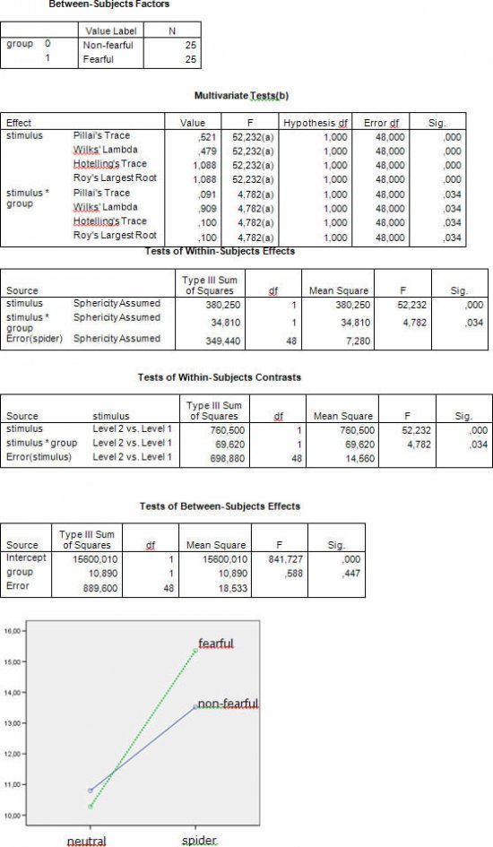
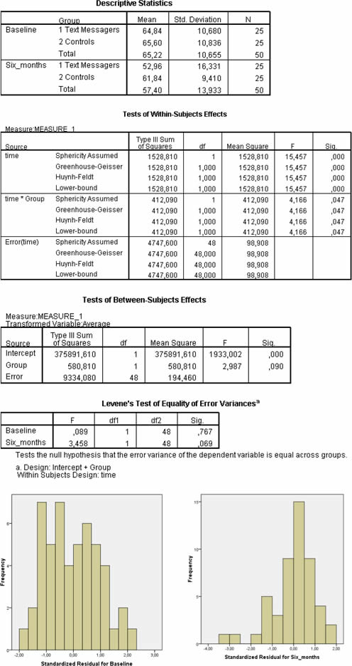

\vspace{20ex}

**Please prepare all exercises in this document for the tutorial meeting.**

Literature: Field (5th ed, 2018) Chapter 16: repeated measures ANOVA with one or more between-subjects factors


\newpage

# Chapter 15

## Repeated measures ANOVA and mixed design, follow-up: contrasts
Consider the following study by Mayer et al. (2006). To examine attention bias in phobic patients an experiment was conducted. ‘Twenty-five spider-fearful and 25 non-fearful participants were confronted with a series of pictures, in which sometimes a spider gradually appeared (…), and sometimes a neutral stimulus appeared. Participants had to indicate whenever they noticed a change in the picture’ (Mayer et al., 2006, p.1).

The presumption was that spider-fearful participants would notice spider-related changes more often than neural changes, and even more so than non-fearful participants. The dependent variable was the number of changes in a picture that a participant noticed.

The SPSS output on the next page.

**(1A)**
Write down the design of this study.

**(1B)**
Write down the null-hypotheses of this study for each effect.

**(1C)**
Which hypotheses can be tested with “Tests of Within-Subjects Effects”?

**(1D)**
Write a “short report” based on the information above. Also compute the effect size for the contrast:

$$r = \sqrt{\frac{F_\text{effect}}{F_\text{effect} + df_\text{residual}}}$$


**(1E)**
Interpret the interaction plot (take into account the significance of the relevant effects)


```{r, echo=FALSE, fig.align="center",  out.width = '70%'}

```

\newpage


## Mixed design I

Consider the following example.

A researcher wants to investigate the effectiveness of a new PC-based numeracy course. To this aim, subjects are randomly assigned to either one of two conditions: a PC-based training, and a traditional training. He conducts a pre-, post-, and follow-up measurement of the subjects’ performance on an arithmetic test. In this test, he includes three types of sums, “multiply”, “divide”, and “subtract”.
Research questions are whether the PC-based numeracy course improves students’ arithmetic skills, and whether this is more apparent on some type of sums, than on other types.

**(2A)**
Specify the design of the study and the level of control.

**(2B)**
Which type of ANOVA is most suited for the above study?

**(2C)**
How many effects are be tested in the main analysis?

**(2D)**
In total, how many paired comparisons are tested with the “tests of within-subjects contrasts”?

**(2E)**
How many Levene’s tests are performed to test the homogeneity of variances assumption?  For which groups do the Levene’s tests compare the variances?

**(2F)**
In d. and e. so noticed that the number of tests can be rather large in three-way designs. Name one advantage and one disadvantage of a more complex design.

**(2G)**
What strategy does Field recommend for interpreting/reporting the three-way interaction in this example?


\newpage

## Mixed design II

Example: "Text messaging is very popular among mobile phone owners, to the point that books have been published on how to write in text speak (BTW, hope u kno wat I mean by txt spk). One concern is that children may use this form of communication so much that it will hinder their ability to learn correct written English. One concerned researcher conducted an experiment in which one group of children was encouraged to send text messages on their mobile phones over a six-month period. A second group was forbidden from sending text messages for the same period. To ensure that kids in this latter group didn’t use their phones, this group was given armbands that administered painful shocks in the presence of microwaves (like those emitted from phones). There were 50 different participants: 25 were encouraged to send text messages and 25 were forbidden. The outcome was a score on a grammatical test (as a percentage) that was measured both before and after the experiment. The first independent variable was, therefore, text message use (text messagers versus controls) and the second independent variable was the time at which grammatical ability was assessed (before or after the experiment)."

The data are in the file `TextMessages.sav`. The main results from the data analysis (including the checking of assumptions) are given below.

See SPSS output on the next page.

**(3A)**
Specify the design of the study and the level of control.

**(3B)**
Which type of ANOVA was conducted and reported in the above?

**(3C)**
What are the assumptions of a two-way mixed ANOVA?

**(3D)**
What can you conclude about the assumptions based on all the information in the above?

**(3E)**
What can you conclude about the Time * Group interaction effect?

**(3F)**
Name a strategy to deal with the violation of assumptions.


```{r, echo=FALSE, fig.align="center",  out.width = '70%'}

```


\newpage\appendix
# Answers

## Repeated measures ANOVA and mixed design, follow-up: contrasts

**Answer 1A**

* Dependent variable: the number of changes in a picture that a participant noticed
* Within-subjects factor: stimulus (neutral, spider)
* Between-subjects factor: group (fearful, non-fearful)
* Measurements of the dependent variable: `number_neutral`, `number_spider`

Level of control: experimental/ quasi-experimental.

Some reserve the term experimental for those studies that manipulate all independent variables, instead of using subject variables to create the experimental groups. Here, the groups are based on the subject variable fear of spiders; manipulating fear of spiders experimentally (and randomly assigning participants to either a fear induction-condition, or a control condition) might be impossible for ethical reasons.

When drawing causal conclusions from an experiment which is a mix of manipulated (here: the within-subjects factor) and subject variables (here: group), one should be cautious: selecting participants who are high or low on fear does not guarantee that the two groups will be equivalent in other ways. In fact, they might be different from each other in several ways (e.g., in self-confidence) that could influence the outcome of the study.


**Answer 1B**

Group: $\mu_\text{non-fearfull} =\mu_\text{fearful}$

Stimulus: $\mu_\text{spider} =\mu_\text{neutral}$

Group $\times$ Stimulus:

* $\mu_\text{(non-fearfull, spider)} - \mu_\text{(non-fearfull, neutral)} =  \mu_\text{(fearful, spider)} -\mu_\text{(fearful, neutral)}$ or
* $\mu_\text{(non-fearfull, spider)} -  \mu_\text{(fearful, spider)} = \mu_\text{(non-fearfull, neutral)} -\mu_\text{(fearful, neutral)}$


**Answer 1C**

See table of “Tests of Within subjects contrasts”:

* main effect of ws-factor (stimulus) and
* interaction ws-factor with bs-factor (group).


**Answer 1D**

There are no differences between both groups (fearful, non-fearful) in terms of the average number of changes that were noticed by participants, $F(1,48) < 1, r = .11$. There was a strong, significant main effect of stimulus, $F(1,48) = 52.23, p < .001, r = .72$; on average the number of changes that were noticed by participants was larger when the stimulus was a spider.

The was a small, but significant Group $\times$ Stimulus interaction-effect $F(1,48) = 4.78, p < .05, r = .3$; the increase of the number of changes that were noticed when the stimulus was a spider compared to a neutral stimulus, was larger for fearful participants than for non-fearful participants.


**Answer 1E**

The main effect of group is non-significant, thus the average “profiles” (or “score patterns”) of spider-fearful vs non-fearful do NOT differ on average. However, the main effect of stimulus is significant, thus the average of both circles for the neutral stimulus is significantly lower than the average of both circles for the spider stimulus.

This means that the average number of changes that were noticed by participants was larger when the stimulus was a spider than when the stimulus was neutral. The average profile of the fearful participants (dotted line) is significantly steeper than the average profile of the non-fearful participants.


## Mixed design I

**Answer 2A**

* Dependent variable: arithmetic test score
* Within-subjects factors:
  * type of sums (multiply, divide, subtract)
  * time (pre-, post-, follow-up)
* Between-subjects factor: training (PC-based, traditional training)

level of control: experiment


**Answer 2B**

Three-way mixed ANOVA (see Field)


**Answer 2C**

The following effects that are tested first, in the “main analysis”

* main effects
  1. *Group (bs)*: PC vs. traditional
  2. *Sum-type (ws)*: multiply vs. divide vs. substract
  3. *Time (ws)*: pre- vs. post- vs. follow-up
* 2-way interaction effects
  4. *Group (bs) $\times$ Sum-type (ws)*:  the differences between PC and traditional compared among the three sum types
  5. *Group (bs) $\times$ Time(ws)*: the differences bteween Pc and traditional compared among the three test occasions
  6. *Sum-type (ws) $\times$ Time(ws)*:  the differences between the three sum types compared among the three test occations
* 3-way interaction effects
  7. *Group (bs) $\times$ Sum-type (ws) $\times$ Time(ws)*:  differences in the 2-way interaction Sum-type (ws) $\times$ Time(ws) between the two groups


**Answer 2D**

In the table with “tests of within subjects contrasts” the follow-up contrast-tests for the main effects of all ws-factors and for all interaction-effects with at least 1
ws-factor are given.

* The number of contrast-tests for a factor equals the number of levels of that
factor minus 1 $(N_\text{levels}-1)$ .
* The number of contrast-tests for an interaction effect between factors equals $(N_\text{levels factor 1}-1) \times (N_\text{levels factor 2}-1)$
* Or for a three-way interaction: $(N_\text{levels factor 1}-1) \times (N_\text{levels factor 2}-1) \times (N_\text{levels factor 3}-1)$.

In total we have $2 + 2 = 4$ contrasts for the main effects of both ws-factors,
$2 + 2 + 4 = 8$ contrasts for the three 2-way interaction-effects, and 4 for the 3-way
interaction, together: $16$


**Answer 2E**

Levene’s tests apply to the equality of the variances of the groups (that are distinguished by the bs-factor) for all measurements of the dependent variable. Here we have two groups, and $3 \times 3 = 9$ measurements of the outcome variable, thus 9 tests are reported.


**Answer 2F**

More complex designs, such as this three-way design, allow you to test more specific effects. For example, here we distinguish between different types of sums, so we can compare the effectiveness of the training not only in terms of general ability (arithmetics), but also in terms of specific abilities (e.g., multiplication). Disadvantageous is that you have many tests to report, which can make it difficult to give a clear interpretation of your results. Field recommends to be brief on most results and to reserve the most detail for the effects that actually matter. Statistically, a disadvantage of many tests is the increased risk on making a type I error. You could therefore choose a more stringent alpha (e.g. $\alpha = .01$).


**Answer 2G**

Inspect the interaction between the two ws-factors for both groups separately (see Field). Thus make an interaction plot of time vs. type of sum for the PC group and the traditional group.


## Mixed design II


**Answer 3A**

* Dependent variable: grammar test score
* Within-subjects factors: time (pre-, post-)
* Between-subjects factor: group (text messagers, controls)

level of control: experiment

**Answer 3B**

two-way mixed ANOVA


**Answer 3C**

assumptions two-way mixed ANOVA:
1. independent observations/residuals (for bs-factor)
2. homogeneity of variances (for bs-factor)
3. normality of residuals (for each level of the ws-factor)
4. (for ws-factor in general: sphericity, however as we compare only two measurements, sphericity does not apply)


**Answer 3D**

Checking assumptions two-way mixed ANOVA:

1. independent observations: it is hard to check this assumption; relevant questions are: were all children really independent, or are brother/sisters included in this experiment or may be children from the same class/school. When this is the case the observations might be correlated, which causes bias in the $F$-test of the bs-main effect and the bs-ws interaction effect (the true risk on making a type I error with these tests is larger than the usual 5%).
2. The assumption of homogeneous variances of the two groups on the baseline measurement of grammar scores and the post measurement of grammar scores has been met. Although we have a rather large $F$-value for the comparison at six months.
3. The distribution of residuals at Baseline is approximately normal, the distribution of residuals at Six months is skewed to the left, with one outlier ($\text{st. res.} < -3$).


**Answer 3E**

When the assumptions would have been met, the conclusion would have been: The time $\times$ group interaction was significant, $F(1, 48) = 4.17, p < .05, r = .28$, indicating that the change in grammar ability in the text message group was significantly different to the change in the control groups. These findings indicate that although there was a natural decay of grammatical ability over time (as shown by the controls) there was a much stronger effect when participants were encouraged to use text messages.

However, since outliers are present in the current analysis, the means on which the above conclusion is based, are not representative of the population means. After removal of the outliers, the effect may or may not be significant.


**Answer 3F**

In this case the recommended strategy would be to remove the outlier(s) and to
re-run the analysis, to see whether the effect remains.
