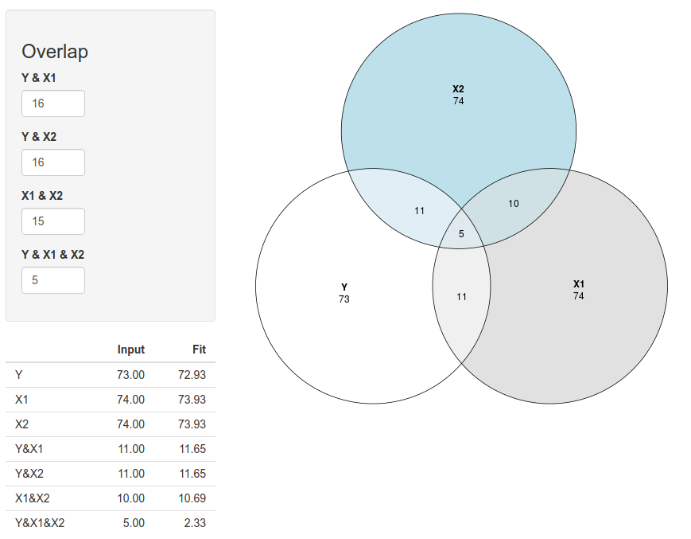

\vfill

Literature: 

* Field (4th ed):  Chapter 7 & 8
* Field (5th ed):  Chapter 8 & 9

\newpage

Earlier you learned how to calculate correlations between two variables.  This statistical approach can be expanded to the prediction of one variable from one or more other variables.  In this context, the variable to be predicted is referred to as the dependent variable, and the variable(s) used as the basis for prediction are referred to as the independent variable.

 
**Univariate regression**

In univariate regression (i.e., regression with one independent variable), one determines the parameters of the line that best describes the relationship between the two variables; more specifically, one determines the line that best fits the points in the scatterplot diagram depicting the relationship between the independent and dependent variables.  The ‘best fitting’ regression line is determined using the least squares method.

 
**Multivariate regression**

Here the focus lies on the prediction of a dependent variable based on multiple independent variables (or ‘predictors’).  In such multiple regression analyses, the researcher often needs to try out several possibilities (or ‘regression models’) in order to arrive at an adequate account of the data.

As we proceed with this topic, you will see that the magnitude and statistical significance of a given predictor variable are not constant.  Instead, these values depend on which other predictors are included in the regression model.

 
**Analysis of residuals**

After running a regression analysis, the first thing you need to do is look at the discrepancies between the regression line and the original data points in the scatterplot.  These discrepancies are referred to as the residuals.  By assessing whether the residuals meet several important conditions, you can evaluate whether your regression solution gives an adequate account of the data.

\newpage

# Bivariate relations & simple regression

**(1A)**
Open the data file ‘`skinfold.sav`'. Make a scatter plot of skinfold thickness (`LSKIN`) ($x$-axis) and body mass (`DEN`) ($y$-axis).

**(1B)**
Describe the relationship between skinfold and body mass:

* Linear or non-linear?
* Weak or strong?
* Positive or negative?

**(1C)**
Perform a regression analysis to predict body mass (`DEN`) from skinfold (`LSKIN`). What is the regression equation? What is the value of $R^2$ and what does this mean?

**(1D)**
Formulate the hypotheses concerning the regression coefficient.

**(1E)**
What is your conclusion concerning this hypotheses?

**(1F)**
Redo the analysis and save (use the Save option) the predicted values for body mass. Look up the new variable in the data editor.

**(1G)**
Make a scatter plot of skinfold thickness (`LSKIN`) ($x$-axis) and the predicted values for body mass ($y$-axis). Compare this scatterplot to the one created in a. Explain the difference between the two plot and include the term “residual” in this explanation.


# Regression analysis: checking linearity assumption

Open the data file '`MM02_060.SAV`', which is a fictive data set with four different dependent variables $Y1$ to $Y4$ and four predictor variables $X1$ to $X4$. The goal is to predict $Y1$ from $X1$, $Y2$ from $X2$, and so on.

**(2A)**
compute the correlations and regression coefficients for the 4 variable pairs $X1-Y1$ through $X4-Y4$. What do you notice about these results?


**(2B)**
Make scatter plots (including regression lines) for each of the four $X-Y$ variable pairs.

**(2C)**
Which of these regression lines provides a good description of the data?

**(2D)**
Compute the average and the standard deviation for all eight variables ($X1 - X4$, and $Y1 -Y4$).  Make a note of these values. What do you notice?  Could you have expected this based on your earlier findings?

**(2E)**
What important first step for all advanced types of data analysis is illustrated by this exercise?


# Regression analysis: checking assumptions concerning residuals

Open the data file '`STUDENT.SAV`'. We will now try to predict the variable Weight from the variable Height.

**(3A)**
Run an analysis in SPSS to predict Weight from Height.  Request  a plot of the standardized residuals (``*ZRESID``) versus the standardized predicted values of Weight (``*ZPRED``)

**(3B)**
Explain in what a residual is.  What conditions should the residuals in this analysis meet?

**(3C)**
In the output, find the information you need to define the regression equation.  Write down your findings.

**(3D)**
Now use the regression equation to predict the Weight of someone with a Height of 1.75 m.  How many kilograms could such a person be expected to weigh?

**(3E)**
What can you conclude based on the residuals plot? Write down your conclusions.

**(3F)**
To re-check your conclusions concerning the residuals, make a scatterplot for Height versus Weight, in which the regression line is also plotted. How can you verify your regression results using this diagram?


# Multiple regression & reporting results

Open the data file '`csdata.sav`'.

The goal of this study was to predict university students’ academic performance (Grade Point Average) from their prior academic performance (SAT test results & High School Grades). In the first two exercises, we will explore the data.  Then we will try out a number of models in order to determine the best basis for predicting (or describing) GPA.

 

**(4A)**
Make scatterplot diagrams for all 15 combnations of the variables Grade Point Average; High School Grades in Math, Science, & English; and SAT scores for Mathematics & Verbal Ability (`gpa`, `hsm`, `hss`, `hse`, `satm` and `satv`). 

**(4B)**
Based on these scatterplots, characterize the nature of each of the 15 bivariate associations between the 6 variables (& write down your answers):

* Linear or non-linear?
* Weak or strong?
* Positive of negative?

**(4C)**
Now calculate the 15 correlations between the same 6 variables. Compare these correlations with your findings in the previous exercise.

**(4D)**
Run an analysis to predict Grade Point Average from High School Grades for Math, Science, and English. Use the ‘Enter’ method. Request residual plots. Write down answers to the questions below, including all relevant statistical results.

* How should you interpret the information in the ANOVA table?
* How should you interpret the information in the regression Coefficients table?
* What is the regression equation?
* What is the model’s explained variance?
* Do the residuals satisfy the necessary conditions?

**(4E)**
Now run a second analysis, this time predicting Grade Point Average from the 2 types of sat scores (Math & Verbal Ability). Again, use the ‘Enter’ method. Write down answers to the questions below, including all relevant statistical results.

* How should you interpret the information in the regression Coefficients table?
* What is the regression equation?
* What is the model’s explained variance? How does it compare to the explained variance in the previous regression analysis?  What does this tell you?


**(4F)**
Now run a third analysis, this time predicting Grade Point Average from all 5 predictor variables (2 types of sat scores; 3 types of 3 High School Grades). Again, use the Enter method. Write down answers to the questions below, including all relevant statistical results.

* How should you interpret the information in the regression Coefficients table?
* What is the regression equation?
* What is the model’s explained variance? How does it compare to the explained variance in the previous two regression analyses?  What does this tell you?


\newpage
# Venn diagrams for proportion explained variance

In this exercise we are looking at the explained variance of the criterion $Y$ by two predictors $X1$ and $X2$ in a regression equation together, as well as the unique contribution by each predictor separately.

Remember:

* The proportion of explained variance of a variable $Y$ by another variable $X1$ can be computed as $r^2_{YX1}$ (i.e. the squared bivariate correlation between $Y$ and $X1$).The percentage of explained variance can be computed as $100\times r^2_{YX1}$
* The proportion of explained variance of a criterion $Y$ by two predictors $X1$ and $X2$ can be computed as $R^2_{YX1X2}$  (i.e. the squared multiple correlation between $Y$ and $X1$ and $X2$ together).


**Visualising the explained and unexplained variances with Venn-diagrams**

A way to display explained variance in a regression analysis is by drawing a Venn-diagram, where each variable is depicted with a circle and the proportion explained variance is displayed by the amount of overlap between two circles. The total amount of explained variance of the criterion $Y$ can be read off the Venn-diagram by looking at the part of the circle of $Y$ that overlaps with the predictors. When two circles do not overlap (0%), their corresponding variables are uncorrelated.

You can use the following website to draw Venn diagrams: [https://lindemann.shinyapps.io/venndiagram/](https://lindemann.shinyapps.io/venndiagram/). 


**(5A)**
What are the correlations for each pair of variables?

**(5B)**
Ensure that all values to relations are set to zero.

Suppose the correlation between $Y$ and $X1$ is $r=.40$. How much percent of the variance in $Y$ is explained by $X1$? Fill this value in in the corresponding field (value of $YX1$). What do you see?

**(5C)**
Suppose that $Y$ and $X2$ are correlated with $r=.40$, but $X2$ is uncorrelated with $X1$. How much percent of the variance in $Y$ is explained by $X2$? Fill this value in in the corresponding field (value of $YX2$).  What do you see?

**(5D)**
Suppose we would predict $Y$ from $X1$ and $X2$ in a multiple regression, what would be the value of $R^2$ (i.e. the squared multiple correlation between $Y$ and $X1$ and $X2$ together)?. 

<!-- What does 68 below mean? -->

**(5E)**
Given the correlations between $X1$ and $Y$ of $r=.40$ and between $X2$ and $Y$ of $r=.40$, what would happen to the total percentage of $Y$ by $X1$ and $X2$ together, when $X1$ and $X2$ were also correlated?


\newpage
\appendix

# Answers

## Bivariate relations & simple regression


**Answer 1A & 1B**

The relation between `LSKIN` and body mass is strong, linear, and negative .


**Answer 1C**

$DEN = 1.16 - 0.06 \times LSKIN$

$R^2 = .72$, thus $72\%$ of the variance in body mass is explained by skin fold thickness. This is indicative of a strong relationship.

Field describes rules of thumb for interpreting r-effect based on Cohen (1988, 1992):

* $r = .10$ (small effect $\rightarrow r^2 = .01$)
* $r = .30$ (medium effect $\rightarrow r^2 = .09$)
* $r = .50$ (large effect $\rightarrow r^2 = .25$)

Note that association is not enough evidence for a causal relationship; the use of the word “effect” implicated that one variable “has an effect” on the other variable. Note that in psychology experimental research is a necessary condition to establish causal relations.


**Answer 1D**

* $H_0: \beta_1 = 0$
* $H_a: \beta_1 \neq  0$

Note that since the hypotheses always refer to population values and not sample values, the Greek notation is used to stress that we are referring to the population. In this case our hypotheses concern the regression coefficient in the population. We estimate this coefficient based on a sample; in the sample the coefficient is referred to as $b$-value. The $b$-value can be standardized to Beta-values, but keep in mind that these Beta values are not the $\beta$'s in the hypotheses.


**Answer 1E**

The regression coefficient of `LSKIN` is significant ($t(90) = -15.23, p < .01$). From the $b$-value of `LSKIN` we can infer that an increase in skinfold thickness is associated with a decrease in body mass ($b = -.06$)


**Answer 1F**

By using the “SAVE” option a new variable (`PRE_1`) is created in the data-editor, try to check this.


\newpage
**Answer 1G**

The predicted values are a linear combination of the independent variable, and are thus perfectly correlated with this variable. The predicted values lie on a straight line, that is, the regression line. The observed (body mass) values are scattered around this line. The closer the observed values are to the line the better the prediction.


## Regression analysis: checking linearity assumption

The goal of this exercise is to show you how important it is to inspect a scatterplot of your variables, to decide whether or not your regression equation makes any sense describing the data. $R^2$ can be high even if the relation between the outcome and the predictor is not linear.


**Answer 2A**

De correlation for all pairs of $X-Y$ variables: $X1-Y1$, $X2-Y2$, $X3-Y3$, $X4-Y4$ equals .82. The $b$-values for the four regression analyses are also similar across analyses, namely $b_1 = 0.50$.


**Answer 2B & 2C**

Only for the relation between $Y1$ and $X1$, the (linear) regression equation is a good and representative model. For the relation between $X2$ and $Y2$ a quadratic function would be more representative; the relationship between $X3$ and $Y3$, and also $X4$ and $Y4$ should be computed after removing the outlier (in case of $X4$ and $Y4$ the correlation would be zero when the outlier would have been discarded).


**Answer 2D**

The means and standard deviation of $X1$ through $X4$, and $Y1$ through $Y4$ are equal too, so these measures alone do not tell you anything about the presence of outliers or other violations of the assumptions of regression analysis.


**Answer 2E**

Graphically, explore the univariate (histograms) and bivariate (scatterplots) distributions of your variables, before you conduct any statistical analysis.


## Regression analysis: checking assumptions concerning residuals

**Answer 3A & 3B**

The residual or error equals $Y_\text{observed} - Y_\text{predicted}$

**Answer 3C**: 
$weight = -51.33 + 66.63\times height$

**Answer 3D**:
65.27


\newpage

**Answer 3E**

The residual plot of the standardized predicted values (on the horizontal axis) against the standardized residuals (on the vertical axis) can be used to check the following assumptions of regression analysis:

1. Homogeneity of error variance across the entire range of predicted values (homoscedasticity) . This assumption is met when the points in the plot lie in a horizontal band around the zero-line.
2. Normally distributed errors. The mean of the errors is zero by definition, but we also check whether they are normally distributed around the mean of zero. This is the case when most points are close to the zero-line and there are approximately as many larger deviations above the zero-line, as there are below it.
3. Linearity of the relation between $Y$ and the predictor(s). This is the case when the pattern of points around zero does not have a systematically deviant shape (such as a curve or a wave)

In the current analysis we can conclude that

* the residuals have an approximately normal distribution
* the relation is approximately linear
* the error variance is approximately homogeneous; although for average predicted values we see some large residuals. When we look at the histogram of weight, we see that we have some outliers with respect to weight, which are apparently not the tallest people (since these people have average predicted weight, based on their heights.


**Answer 3F**

The residuals represent the distances of the points to the regression line. The variability of the dots around the regression represent thus the strength of the correlation.

If the correlation would be $r=1$, all residuals would be zero and all dots of the scatterplot would be exactly on the regression line.


## Multiple regression & reporting results


**Answer 4A & 4B**

These so-called matrix plot are not the pretties scatterplots. They are not very detailed. However they are useful to detect any serious violations of linearity and also to detect outliers. It is a “quick and dirty” way to scan for possible violations of the assumptions underlying regression analysis when one has several predictors. In the current analysis there are no serious violations of the assumptions, but we can see an outlier in the relation between the `SAT` variables and `HSM`, which we could inspect further to see if it biases our regression equation (later in the course we will discuss casewise diagnostics that are suited for this purpose).

\newpage
**Answer 4C**

All predictors, except `SATverbal` are significantly correlated with `GPA`. `HSmath` has the highest correlation with `GPA` and thus is the most important predictor given this set of predictors. 

Further, we notice that there is some redundancy among the predictors (given the predictors are correlated). In regression analysis the unique contribution of each predictor to explaining the variance in the dependent variable is determined.

**Answer 4D**

Short report: We conducted a regression analysis to predict Grade Point Average from the high school grades for respectively math, science and english. The proportion variance accounted for ($R^2 = .21$) was significantly more than zero, ($F(3,220) = 18.86, p <.01$). $R^2$ indicated a moderate to strong effect. Solely the high school grade for math was a significant predictor of GPA. The $b$-value indicated that, keeping all other predictors constant, higher math grades are associated with higher GPA ($b = 0.17$), and vice versa. Inspection of the residual plot and a histogram of the residuals shows that all assumptions have been met in this analysis.

**Answer 4E**

Short report: We conducted a regression analysis to predict Grade Point Average from the SAT scores for respectively math and verbal. The proportion variance accounted for ($R^2 = .06$) was significantly more than zero, ($F(2,221) = 7.48, p < .01$). $R^2$ indicated a weak to moderate effect. Solely the SAT score for math was a significant predictor of GPA ($t(221) = 3.44, p < .01$). The $b$-value indicated that, keeping all other predictor constant, higher math scores are associated with higher GPA ($b = 0.02$), and vice versa.


**Answer 4F**

We conducted a regression analysis to predict Grade Point Average from the high school grades for respectively math, science and english, as well as the SAT scores for respectively math and verbal. The proportion variance accounted for ($R^2 = .21$) was significantly more than zero, ($F(5,218) = 11.69, p < .001$). $R^2$ indicated a moderate to strong effect, but compared to model with only the high school grades, this model hardly has any incremental value. Thus the SAT scores do not add any unique information about GAP in addition to the high school grades. Solely the high school grade for math was a significant predictor of GPA ($t(218) = 3.72, p < .01$). The $b$-value indicated that, keeping all other predictor constant, higher math grades are associated with higher GPA ($b = 0.15$), and vice versa. 

During the next SPSS Session in exercise C2.2 you will learn how to combine the above analyses into one hierarchical regression analysis.


\newpage

## Venn diagrams for proportion explained variance


**Answer A**: All correlations are 0, because all relations are zero.

**Answer B**

$100 \times .40^2 = 16\%$. The circles of $Y$ and $X1$ overlap. 16% of the circles of $Y$ is covered by $X1$.


**Answer C**

$100 \times .40^2 = 16\%$. The circles of $Y$ and $X2$ overlap. 16% of the circles of $Y$ is covered by $X2$.


**Answer D**

$.16 + .16 = .32$. Together, $X1$ and $X2$ explain 32% of the variance of $Y$.


**Answer E**

When $X1$ and $X2$ would be correlated, the total percentage of explained variance of $Y$ would be less than 32%, because you would have to correct for the overlap between $X1$ and $X2$. When the circles of $X1$ and $X2$ overlap, there is less unique contribution of each predictor to the explained variance of $Y$. For example:

```{r, echo=FALSE, fig.align="center",  out.width = '90%'}

```

