\vfill

Literature: 

* Field (4th ed):  Chapter 8 & 10
* Field (5th ed):  Chapter 9 & 11

\newpage

# Multiple Regression Analysis: assumptions


Open the data file ‘`salary.sav`’. You will perform a short initial data analysis. 

Inspect the data matrix.

**(1A)**
How many cases are listed? Are there any missing values?

**(1b)**
Which variable(s) are quantitative (continuous), which are qualitative (categorical)?

Compute the frequencies on the qualitative variables.

**(1C)**
What are the frequencies of the response categories on the qualitative variable(s)? Is any of these frequencies remarkably low (less than 10% of the sample size)?

Compute the means and standard deviations  of the continuous variables. 

**(1D)**
In order to inspect the normality of the distribution of the continuous variables, plot histograms (with normal curve) of these variables.

**(1E)**
Are the continuous variables approximately normally distributed?

In order to inspect the linearity of the relations between the continuous variables, request a scatterplot matrix.


**(1F)**
Are all bivariate relations approximately linear? That is, is there any relation which is non-linear?

Compute the correlations between the quantitative variables.

**(1G)**
Are there any remarkably high/low values (i.e., close to 0, -1, or +1)?


# Multiple Regression Analysis: importance of predictors

This exercise continues with the data file ‘`salary.sav`’.

The researchers who gathered the data would like to see which variables are related to satisfaction with salary (`sat`).

Perform a multiple regression with `sat` as dependent and the variables `item1`, `item2`, and `sal` as predictors.

**(2A)**
Write out the regression formula. What is the predicted $R^2$? Which variable has the largest unstandardized B-weight?

**(2B)**
Which predictors seem relevant? Consider in your answer the standardized regression weights and their significance


**(2C)**
You will now get acquainted to the option in the regression window to specify multiple blocks of predictors.

Select the three predictors again for the first block (Method: Enter), select the predictor you consider the worst predictor in the second block and select as method ‘remove’. Check in the Statistics dialog box ‘R squared change’.

Did the $R^2$ change significantly after removing the predictor you indicated?

**(2D)**
What do you conclude concerning this variable?

**(2E)**
Is there another variable which could be removed? If your answer is ‘yes’, repeat the procedure described above.

**(2F)**
Interpret the regression weight(s) of the predictor(s) which seem to be related to salary satisfaction.


**(2G)**
Now, we will check the influence of the background variable `sex` and `age`.

Which one is qualitative? Why is a dummy coding not necessary?

Select the variables `sex` and `age.` (Block 1, method: Enter). Add in block 2 the best predictor of the three mentioned above (Method: Enter). First consider only the output of model 1.

**(2H)**
How large is the $R^2$ of the first model? What do you conclude on the effect of `age` and `sex` on `salary satisfaction`?

**(2I)**
Which of the two background variables seems most influential? Consider the standardized regression weights.

**(2J)**
Are younger or older people more satisfied with their salary, or is there no difference?

**(2K)**
Are men or women more satisfied with their salary, or is there no difference? Consider in your answer the coding of the `sex` variable! It may be useful to write out the regression formula for men and for women separately.

**(2L)**
Did the adding of the predictor change the $R^2$ significantly? What do you conclude on the effect of this variable on salary satisfaction?


# Multiple Regression Analysis with dummies

Some health researchers are interested in the relation between `weight` and `height` for healthy males. Data are available from professional soccer players all over the world. Open the file ‘`Soccer.sav`’.


Predict `weight` from `height` in a linear regression.

**(3A)**
Write down the regression equation.

**(3B)**
What do you think are the units of measurement of `weight` and `height`?

**(3C)**
A soccer player who is 1 cm taller than another, how much heavier (or lighter) is he predicted to be?


**(3D)**
Create dummy variables of the continent variable, use ‘`Europe`’ as the comparison category, that is, ‘`Europe`’ does not get a dummy variable.

Add the continent dummies to the predictor `height` in a second regression analysis (method: enter).

Is there an effect of continent on weight? Consider in your answer the change in $R^2$.

**(3E)**
Which continent accounts for most of the $R^2$ change?

**(3F)**
In comparison to European soccer players, how much heavier or lighter are soccer players of each of the other continents on average? Consider in your answer the regression weights of the dummy variables.


# Testing mediation and moderation models with MRA

This exercise will help to practice with Andrew Hayes `PROCESS` custom dialog box that wrap Preacher and Hayes mediation and moderation tools in a convenient menu in SPSS (analyze, regression, `PROCESS`).

When you do not find the `PROCESS` menu in your list of regression option like in the screen print below:

```{r, echo=FALSE, fig.align="center",  out.width = '100%'}
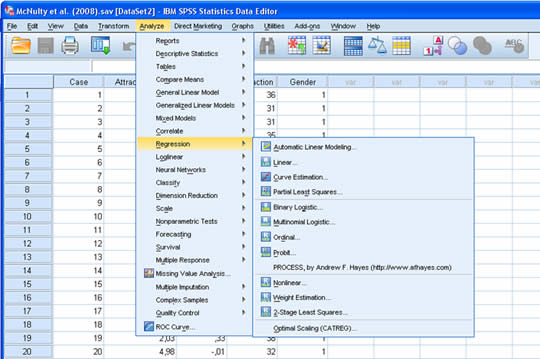
```


Follow the instructions below, to install this menu manually (note that you do not need to open SPSS as administrator for this to work):

```{r, echo=FALSE, fig.align="center",  out.width = '100%'}
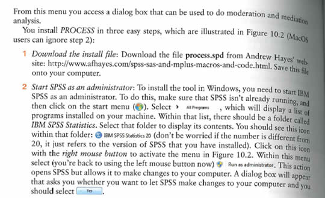
```
```{r, echo=FALSE, fig.align="center",  out.width = '100%'}
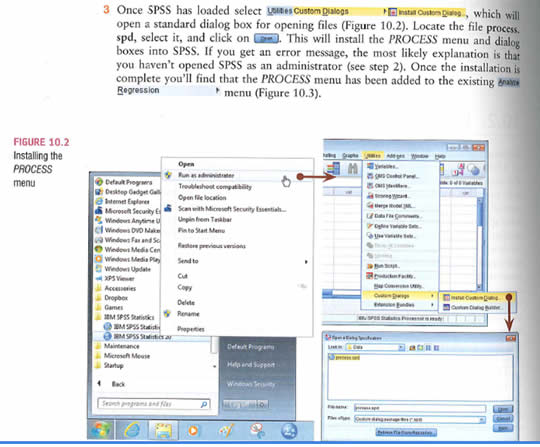
```


Once you successfully installed the PROCESS menu, you can start working on Smart Alex’tasks (Note that you'll need to shorten variable names that are longer than 8 characters).

<!--
If it doesn't work to install the program, please run it via the SPSS syntax. Follow the steps below:

First save both the process syntax file (process.sps) and the moderation (syntax_McNulty et al. (2008).sps) or mediation syntax file (syntax_Lambert et al (2012).sps). Use right click and "save link as ..." to download the files and save it on your PC.

 

(1) Open the dataset you want to analyze.

(2) Open the file “process.sps”, click in the menu “Run”, “All”.

DO NOT change anything in this syntax

This syntax is a macro it activates the process program in SPSS.

(3) Open the mediation or moderation syntax

 

Either click “Run”, “All” if you are working on the exercise of the SPSS computer session or, if you are working on the assignment, change the variable names in the syntax into the names of the data file you are analyzing.

 

When you get ERRORS with wording similar to: Error # 6819 in column 1024. Text: (End of Command)

The DEFINE command includes an invalid keyword specification.

Please CLOSE SPSS and start again.

-->


## Tasks 1 {-}

\textsl{McNulty et al. (2008) found a relationship between a person’s `Attractiveness` and how much `Support` they give their partner in newlyweds, where supposedly attractiveness is a predictor of support. Is this relationship moderated by gender (i.e., whether the data were from the husband or wife)? include a scatterplot with `Attractiveness` on the x-axis and `Support` on the y-axis, and use different markers (set markers by) for gender. In the Chart Editor, ask for separate regression lines for the groups. Interpret this graph. The data are in `McNulty et al. (2008).sav`.}


If you click on [*Options*] another dialog box will appear containing four useful options for moderation. Selecting 

1. Mean center for products centers the predictor and moderator for you; 
2. Heteroscedasticity-consistent SEs means we need not worry about having heteroscedasticity in the model; 
3. OLS/ML confidence intervals produces confidence intervals for the model, and I’ve tried to emphasize the importance of these throughout the book; and 
4. Generate data for plotting is helpful for interpreting and visualizing the simple slopes analysis. 

Talking of simple slopes analysis, if you click on [*Conditioning*], you can change whether you want simple slopes at ±1 standard deviation of the mean of the moderator (the default, which is fine) or at percentile points (it uses the 10th, 25th, 50th, 75th and 90th percentiles). Back in the main dialog box, click [*OK*] to run the analysis.

## Tasks 4 & 5  {-}

\textsl{Test whether the effect of pornography consumption (in this case `LnConsumption`)  on infidelity (number of `hook-ups`) is mediated by relationship `commitment`. Use the `PROCESS` tool to compute the parameters of the mediation model printed below, and estimate the indirect effect and its (Bias Corrected = default) 95\% confidence interval. The data are in `Lambert et al. (2012).sav`.}


\newpage
\appendix

# Answers

##  Multiple Regression Analysis: assumptions

**Answer 1A**

95 cases, no missing values

**Answer 1B**

* Qualitative variables: sex
* Quantitative variables: item1, item2, sat, age, sal

**Answer 1C**

Sex: man 55, woman 40, no.

**Answer 1D**

See output table:

```{r, echo=FALSE, fig.align="center",  out.width = '70%'}
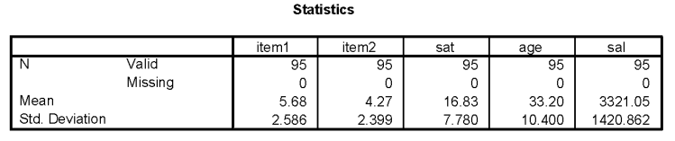
```


**Answer 1E**

* Item1, routine job: not really, since the uneven scores hardly occur
* Item2, secrecy salary: skewed to the right
* Sat, satisfaction salary: seems bimodal
* Age: almost normal, except that scores under 18 are missing
* Sal, salary: not normal, bit skewed to the right

\newpage

**Answer 1F**

```{r, echo=FALSE, fig.align="center",  out.width = '60%'}
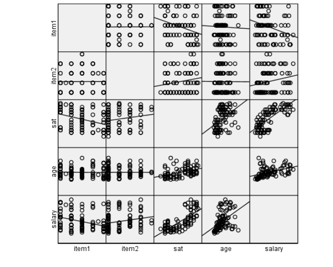
```

The relation between age and salary as well as the relation between age and
satisfaction has some curious outliers (some older people do not have a higher
salary). Some older people, probably the same ones are not as satisfied with their
salary as predicted by a linear line. The relation between salary and satisfaction is
curvilinear. Satisfaction does not grow as much for high salary increases as for low
salary increases.

**Answer 1G**

The correlations between the quantitative variables:

```{r, echo=FALSE, fig.align="center",  out.width = '80%'}
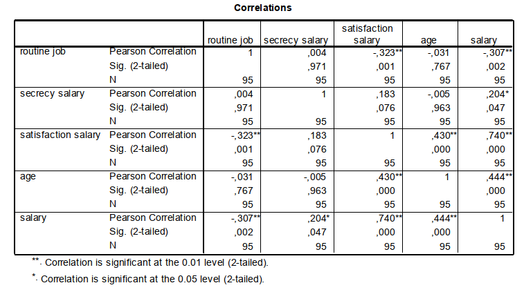
```

* Close to 0 (non-significant): item1 & item2, item1 & age, item2 & sat, item2 & age.
* Close to 1 (.80 or higher): none of the pairs of variables


## Multiple Regression Analysis: importance of predictors

**Answer 2A**

```{r, echo=FALSE, fig.align="center",  out.width = '60%'}
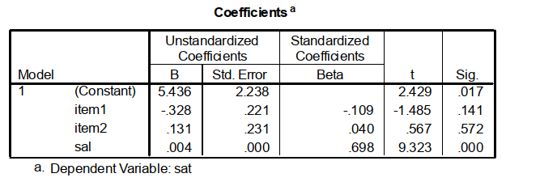
```

$\text{Predicted sat} = 5.4 -0.33\times\text{item1} + 0.13\times\text{item2} + 0.004\times\text{sal}$

$R^2 = .559$

Item1 has the largest (absolute) regression weight.

**Answer 2B**

Predictor(s) with significant regression weights: sal


**Answer 2C**

After removing item2: $R^2$ drops to .002 (0.2 percent), which is not a significant change in $R^2$.

**Answer 2D**

Conclusion: this variable (secrecy salary) can be removed safely without ending up with a regression equation which explains less variance in satisfaction with salary.

**Answer 2E**

 Yes, item1 (routine job). $R^2$ drops another .010, which is not a significant change.

**Answer 2F**

The only predictor left is salary. An increase of 1000 units (euro, dollar or guilder?)
in salary predicts an increase of $0.004\times 1000=4$ points of satisfaction. Proportion explained variance is .543.


**Answer 2G**

Sex is categorical, but since it has only two levels (male, female), only 1 dummy would be necessary. It does not matter whether you use 1 dummy, or 1 original categorical variable with only two possible values.

**Answer 2H**

Predictors in the models: age, sex in model 1; sal, age, sex in model 2.

The $R^2$ of model 1 is .281. The variables age and sex explain 28% of the variance of satisfaction, which is considered a strong effect.


**Answer 2I**

```{r, echo=FALSE, fig.align="center",  out.width = '60%'}
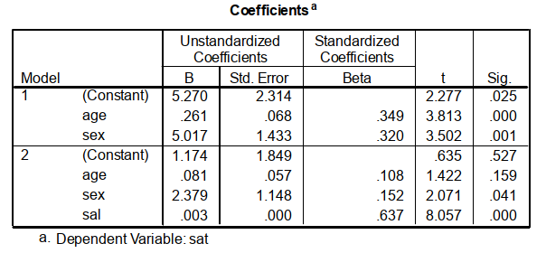
```

Given de standardized regression coefficients, age seems a bit more influential then sex, but the difference is small. Once salary is added, the relative importance switches.

**Answer 2J**

The regression weight of age is positive, which would suggest that older people are more satisfied than younger people. However, the regression weight does not significantly differ from 0, once salary is included as predictor. That is, no difference in satisfaction between younger and older people occurs at the population level, as far as this difference is not explained by salary.

**Answer 2K**

The regression weight of sex is positive and the response category man has a higher score than the response category woman. Consequently, men are on average 2.4 points more satisfied than women, if the effect is controlled for age and salary.

**Answer 2I**

```{r, echo=FALSE, fig.align="center",  out.width = '80%'}
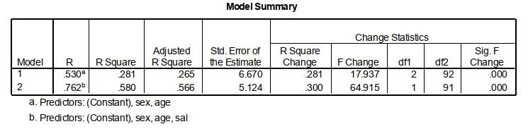
```

The adding of salary as predictor changed $R^2$ significantly ($F(1,91)=64.9, p<.001$)
from .281 to .580.

\newpage

## Multiple Regression Analysis with dummies

**Answer 3A**


```{r, echo=FALSE, fig.align="center",  out.width = '60%'}
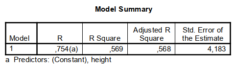
```

```{r, echo=FALSE, fig.align="center",  out.width = '80%'}
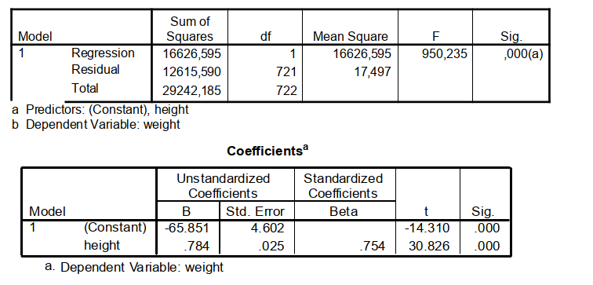
```

$\text{predicted weight} = -65.85 + .784\times\text{height}$

**Answer 3B**

The range of weight is about from 58 to 100, the range of height is from 160 to 200.
These ranges are common for adult males if weight is measured in kilograms and
height in centimeters.

**Answer 3C**

1 cm taller $\rightarrow .784\times 1=.784$ kilogram heavier

\newpage

**Answer 3D**

```{r, echo=FALSE, fig.align="center",  out.width = '80%'}
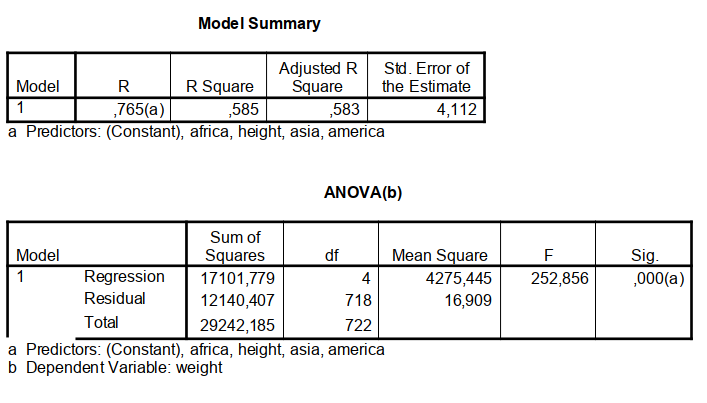
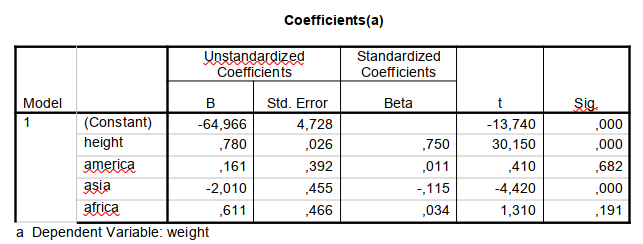
```

$R^2$ improved from .569 to .585, this analysis does not test whether this is a
significant improvement.

**Answer 3E**

The continent(s) with significant regression weights for their dummy variables: that
is, Asia.

**Answer 3F**

Asia differs on average in predicted weight from Europe by -2.01 kilograms, the other continents do not differ in predicted weight, since the dummy variables do not have significant regression weights.

Why from Europe? The predicted weight for $\text{Europe} = -64.966 + .780\times\text{height} + 0\times 0.161 + 0\times -2.010 + 0\times 0.611 = -64.966 + .780\times\text{height}$. We fill in zeros for all dummy variables since Europe is coded with zeros on all three dummy variables. The predicted weight for $\text{Asia} = -64.966 + .780\times\text{height} + 0\times 0.161 + 1\times -2.010 + 0\times 0.611 = -64.966 + .780\times\text{height} -  2.010 = -66.956 + .780\times\text{height}$, which is (on average) 2.01 kilograms lower than the predicted weight for Europe.


## Testing mediation and moderation models with MRA

Smart Alex’s Solutions (adapted from Field: [http://www.sagepub.com/field4e/study/smartalex.htm](http://www.sagepub.com/field4e/study/smartalex.htm))


### Task 1 {-}

To access the PROCESS dialog box in (see below) select [Analyze Regression $\rightarrow$ PROCESS]. The variables in your data file will be listed in the box labelled *Data File Variables*. Select the outcome variable (in this case `Support`) and drag it to the box labelled *Y variable*, or click on $[\rightarrow]$. Similarly, select the predictor variable (in this case `Attractiveness`) and drag it to the box labelled *X variable*. Finally, select the moderator variable (in this case `Gender`) and drag it to the box labelled *Moderator variable W*, or click on $[\rightarrow]$. This box is where you specify your moderator (you can have more than one, the second moderator can be put in the box labelled *Moderator variable Z*).


PROCESS can test 74 different types of model, and these models are listed in the drop-down box labelled `Model Number`. Simple moderation analysis is represented by model 1, but the default model is 4 in some versions of PROCESS (4 = mediation, which we’ll look at next). Therefore, activate this drop-down list and select $[1]$ if necessary. The rest of the options in this dialog box are for models other than simple moderation, so we’ll ignore them.

If you click on [Options] another dialog box will appear containing four useful options for moderation. Select: 

1. Mean center for products centres the predictor and moderator for you; 
2. Heteroscedasticity-consistent SEs means we need not worry about having heteroscedasticity in the model (select option HC3 for this analysis); 
3. OLS/ML confidence intervals produces confidence intervals for the model (in newer versions of PROCESS, confidence intervals are given by default and you will not have an option to select them), and I’ve tried to emphasize the importance of these throughout the book; and 
4. Generate data for plotting is helpful for interpreting and visualizing the simple slopes analysis. 

Talking of simple slopes analysis, under [Conditioning], you can change whether you want simple slopes at $\pm 1$ standard deviation of the mean of the moderator (the default, which is fine) or at percentile points (it uses the 10th, 25th, 50th, 75th and 90th percentiles). Back in the main dialog box, click [OK] to run the analysis.

```{r, echo=FALSE, fig.align="center",  out.width = '50%'}
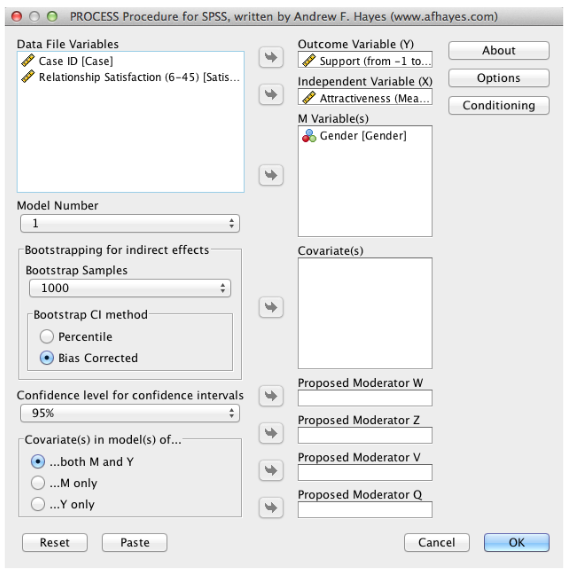
```

**Output 1**

```txt
**************************************************************************
Model = 1
    Y = Support
    X = Attracti
    M = Gender

Sample size
        164

**************************************************************************
Outcome: Support

Model Summary
          R       R-sq          F        df1        df2          p
      .2921      .0853     4.8729     3.0000   160.0000      .0029

Model
              coeff         se          t          p       LLCI       ULCI
constant      .2335      .0161    14.5416      .0000      .2018      .2652
Gender        .0239      .0321      .7440      .4580     -.0395      .0873
Attracti     -.0072      .0148     -.4852      .6282     -.0363      .0220
int_1         .1053      .0295     3.5677      .0005      .0470      .1636

Interactions:
 int_1    Attacti    X     Gender
```  
  
Output 1 is the main moderation analysis. We’re told the $b$-value for each predictor, the associated standard errors (which have been adjusted for heteroscedasticity because we asked for them to be). Each b is compared to zero using a $t$-test, which is computed from the beta divided by its standard error. The confidence interval for the $b$ is also produced (because we asked for it). Moderation is shown up by a significant interaction effect, and in this case the interaction is significant, $b = 0.105, 95\% CI=[0.047, 0.164], t = 3.57, p < .01$, indicating that the relationship between attractiveness and support is moderated by gender.


  
**Output 2**

```txt
*************************************************************************

Conditional effect of X on Y at values of the moderator(s)
     Gender     Effect         se          t          p       LLCI       ULCI
     -.5000     -.0598      .0202    -2.9549      .0036     -.0998     -.0198
      .5000      .0455      .0215     2.1177      .0357      .0031      .0879

Values for quantitative moderators are the mean and plus/minus one SD from mean
```

To interpret the moderation effect we can examine the simple slopes, which are shown in Output . Essentially, the table shows us the results of two different regressions: the regression for attractiveness as a predictor of support 

1. when the value for gender is $-.5$ (i.e., low). Because husbands were coded as zero, this represents the value for males; and 
2. when the value for gender is .5 (i.e., high). Because wives were coded as 1, this represents the female end of the gender spectrum. We can interpret these three regressions as we would any other: we’re interested the value of $b$ (called Effect  in the output), and its significance. 

From what we have already learnt about regression we can interpret the two models as follows:

1. When gender is low (male), there is a significant negative relationship between attractiveness and support, $b = -0.060, 95\% CI= [-0.100, -0.020], t = -2.95, p < .01$.
2. When gender is high (female), there is a significant positive relationship between attractiveness and support, $b = 0.05, 95\% CI= [0.003, 0.088], t = 2.12, p < .05$.

These results tell us that the relationship between attractiveness of a person and amount of support given to their spouse is different for men and women. Specifically, for women, as attractiveness increases the level of support that they give to their husbands increases, whereas for men, as attractiveness increases the amount of support they give to their wives decreases.

\newpage

**Reporting the results**

We can report the results in a table as follows:

```{r, echo=FALSE, fig.align="center",  out.width = '90%'}
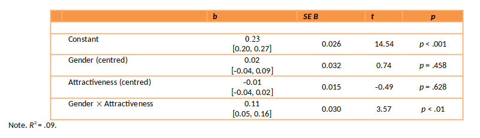
```

```{r, echo=FALSE, fig.align="center",  out.width = '70%'}
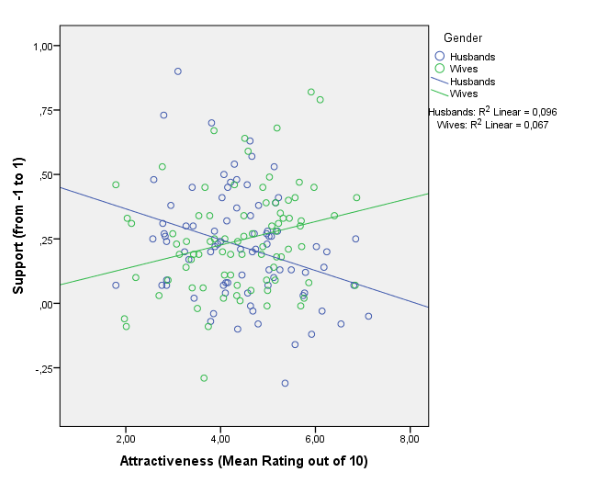
```


The graph above confirms that the direction of the relationship between attractiveness and support is different for men and women by the fact that the two regression lines slope in different directions. Specifically, for husbands (blue line) the relationship is negative (the regression line slopes downwards), whereas for wives (green line) the relationship is positive (the regression line slopes upwards). Additionally, the fact that the lines cross indicates an interaction effect (moderation). However, the points are fairly widely scattered round the regression lines, the interaction is significant but the model as a whole explains less than 10% ($R^2 = .09$) of the variation is support.

 In sum, we can conclude that the relationship between attractiveness and support is positive for wives (more attractive wives give their husbands more support), but negative for husbands (more attractive husbands give their wives less support than unattractive ones). Although they didn’t test moderation, this mimics the findings of McNulty et al. (2008).
 
\newpage

### Task 4 & 5 {-}


Test whether the effect of pornography consumption (in this case `LnConsumption`)  on infidelity (number of hook-ups) is mediated by relationship `commitment.` Use the PROCESS tool to compute the parameters of the mediation model printed below, and  estimate the indirect effect and its confidence interval. The data are in `Lambert et al. (2012).sav`.


```{r, echo=FALSE, fig.align="center",  out.width = '70%'}
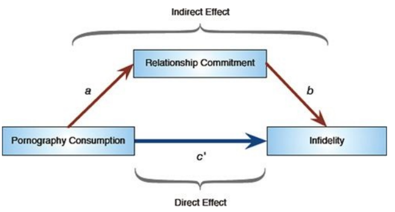
```


To access the dialog box shown below select [Analyze Regression $\rightarrow$ PROCESS]. The variables in your data file will be listed in the box labelled *Data File Variables*. Select the outcome variable (in this case `Hook_Ups`) and drag it to the box labelled *Y variable*, or click on $[\rightarrow]$. Similarly, select the predictor variable (in this case `LnConsumption`) and drag it to the box labelled *X variable*. Finally, select the mediator variable (in this case `Commitment`) and drag it to the box labelled *Mediator(s) M*, or click on $[\rightarrow]$. This box is where you specify any mediators (you can have more than one).

As I mentioned before, PROCESS can test many different types of models, and simple mediation analysis is represented by model 4. Therefore, make sure that $[4]$ is selected in the drop-down list under *Model Number*. Unlike moderation, there are other options in this dialog box that are useful: for example, to test the indirect effects we will use bootstrapping to generate a confidence interval around the indirect effect. By default PROCESS uses 5000 bootstrap samples, and will compute bias corrected and accelerated confidence intervals. These default options are fine, but just be aware that you can ask for percentile bootstrap confidence intervals instead.

If you click on [Options] another dialog box will appear containing four useful options for mediation. Selecting (1) *Effect Size* produces the estimates of the size of the indirect effect; (2) Total effect model produces the direct effect of the predictor on the outcome (in this case the regression of infidelity predicted from pornography consumption). None of the options under [Conditioning] apply to simple mediation models, so we can ignore this button and click [OK] to run the analysis.

```{r, echo=FALSE, fig.align="center",  out.width = '50%'}
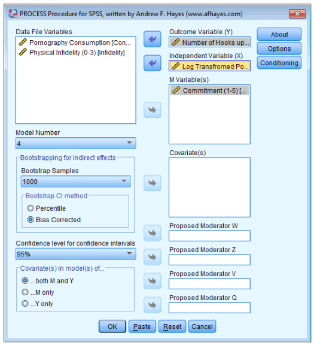
```


*Output 8*

```txt
**************************************************************************
Model = 4
    Y = Hook_Ups
    X = LnConsum
    M = Commitme

Sample size
        239

**************************************************************************
Outcome: Commitme

Model Summary
          R       R-sq          F        df1        df2          p
      .1418      .0201     4.8633     1.0000   237.0000      .0284

Model
              coeff         se          t          p
constant     4.2027      .0545    77.1777      .0000
LnConsum     -.4697      .2130    -2.2053      .0284

```

Output 8 shows the results of the regression of number of hook-ups predicted from both pornography consumption (path $c'$ in the mediation diagram) and commitment (path b in the mediation diagram). 

We can see that pornography consumption significantly predicts number of hook-ups even with relationship commitment in the model, $b = 1.28, t = 3.05, p = .003$; relationship commitment also significantly predicts number of hook-ups, $b = -0.62, t = -4.90, p < .001$. The $R^2$ value tells us that the model explains 14.0% of the variance in number of hook-ups. The negative $b$ for commitment tells us that as commitment increases, number of hook-ups declines (and vice versa), but the positive $b$ for consumptions indicates that as pornography consumption increases, the number of hook-ups increases also. These relationships are in the predicted direction.

*Output 10*
```txt
************************** TOTAL EFFECT MODEL ****************************
Outcome: Hook_Ups

Model Summary
          R       R-sq          F        df1        df2          p
      .2284      .0522    13.0449     1.0000   237.0000      .0004

Model
              coeff         se          t          p
constant     1.6296      .1114    14.6324      .0000
LnConsum     1.5731      .4356     3.6118      .0004
```

Output 10 shows the total effect of pornography consumption on number of hook-ups (outcome). 

You will get this bit of the output only if you selected *Total effect model*. The total effect is the effect of the predictor on the outcome when the mediator is not present in the model. When relationship commitment is not in the model, pornography consumption significantly predicts the number of hook-ups, $b = 1.57, t = 3.61, p < .001$. The $R^2$ value tells us that the model explains 5.22\% of the variance in number of hook-ups. As is the case when we include relationship commitment in the model, pornography consumption has a positive relationship with number of hook-ups (as shown by the positive b-value).


\newpage

*Output 11*

```txt
***************** TOTAL, DIRECT, AND INDIRECT EFFECTS ********************

Total effect of X on Y
     Effect         SE          t          p
     1.5731      .4356     3.6118      .0004

Direct effect of X on Y
     Effect         SE          t          p
     1.2811      .4201     3.0498      .0026

Indirect effect of X on Y
             Effect    Boot SE   BootLLCI   BootULCI
Commitme      .2920      .1572      .0310      .6591

Partially standardized indirect effect of X on Y
             Effect    Boot SE   BootLLCI   BootULCI
Commitme      .1904      .0962      .0189      .3894

Completely standardized indirect effect of X on Y
             Effect    Boot SE   BootLLCI   BootULCI
Commitme      .0424      .0215      .0043      .0889

Ratio of indirect to total effect of X on Y
             Effect    Boot SE   BootLLCI   BootULCI
Commitme      .1856      .2086      .0128      .5298

Ratio of indirect to direct effect of X on Y
             Effect    Boot SE   BootLLCI   BootULCI
Commitme      .2280     1.0581      .0052     1.0776

R-squared mediation effect size (R-sq_med)
             Effect    Boot SE   BootLLCI   BootULCI
Commitme      .0183      .0123      .0014      .0548

Preacher and Kelley (2011) Kappa-squared
             Effect    Boot SE   BootLLCI   BootULCI
Commitme      .0433      .0210      .0059      .0904
```

Output 11 is the most important part of the output because it displays the results for the indirect effect of pornography consumption on number of hook-ups (i.e. the effect via relationship commitment).

First, were told the effect of pornography consumption on the number of hook-ups in isolation (the total effect). Next, we’re told the effect of pornography consumption on the number of hook-ups when relationship commitment is included as a predictor as well (the direct effect). The first bit of new information is the *Indirect Effect of X* on Y, which in this case is the indirect effect of pornography consumption on the number of hook-ups. We’re given an estimate of this effect ($b = 0.292$) as well as a bootstrapped standard error and confidence interval. As we have seen many times before, 95\% confidence intervals contain the true value of a parameter in 95\% of samples. Therefore, we tend to assume that our sample isn’t one of the 5% that does not contain the true value and use them to infer the population value of an effect. In this case, assuming our sample is one of the 95\% that ‘hits’ the true value, we know that the true b-value for the indirect effect falls between 0.031 and 0.659. This range does not include zero, and remember that $b = 0$ would mean ‘no effect whatsoever’; therefore, the fact that the confidence interval does not contain zero means that there is likely to be a genuine indirect effect. Put another way, relationship commitment is a mediator of the relationship between pornography consumption and the number of hook-ups.

The rest of Output 11 you will see only if you selected Effect size; it contains various standardized forms of the indirect effect. In each case they are accompanied by a bootstrapped confidence interval. As with the unstandardized indirect effect, if the confidence intervals don’t contain zero then we can be confident that the true effect size is different from  ‘no effect’. In other words, there is mediation. All of the effect size measures have confidence intervals that don’t include zero, so whichever one we look at we can be fairly confident that the indirect effect is greater than ‘no effect’. Focusing on the most useful of these effect sizes, the standardized b for the indirect effect, its value is $b = .042, 95\% BCa\; CI=[.004, .089]$, and similarly, $\kappa^2 = .043, 95% BCa\; CI=[.006, .090]$. $\kappa^2$ is bounded to fall between 0 and 1, so we can interpret this as the indirect effect being about 4.3\% of the maximum value that it could have been, which is a fairly small effect. We might, therefore, want to look for other potential mediators to include in the model in addition to relationship commitment.


\newpage
**Reporting the Results of the Mediation Analysis**

Some people report only the indirect effect in mediation analysis, and possibly the Sobel test. However, I have repeatedly favoured using bootstrap confidence intervals, so you should report these, and preferably the effect size $\kappa^2$ and its confidence interval:

"There was a significant indirect effect of pornography consumption on the number of hook-ups though relationship commitment, $b = 0.292, 95\% BCa\;CI=[0.031, 0.659]$. This represents a relatively small effect,  $\kappa^2 = .043, 95\% BCa\; CI=[.006, .090]$."


