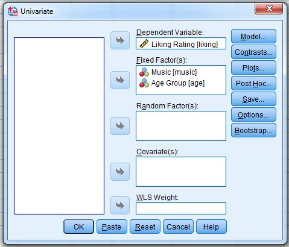
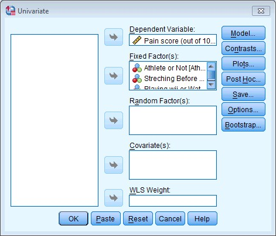
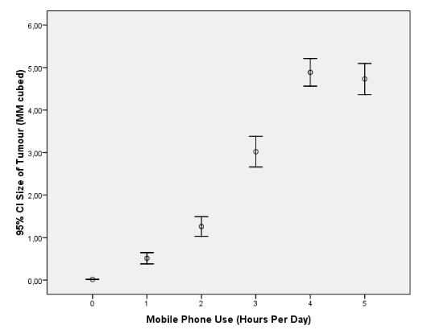
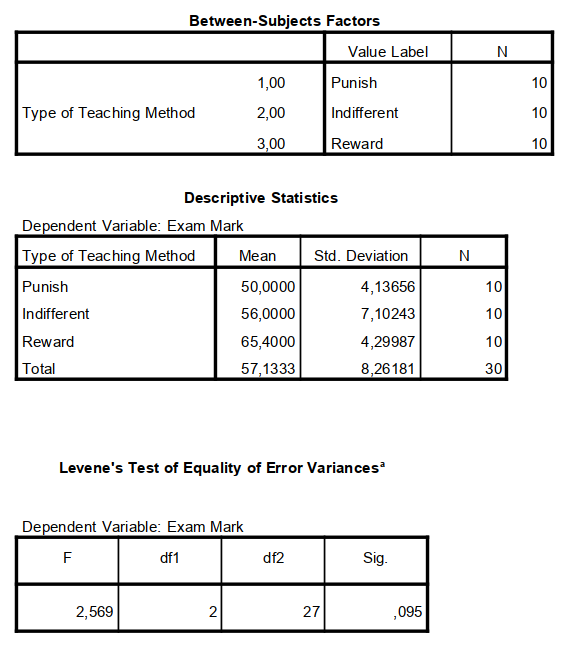
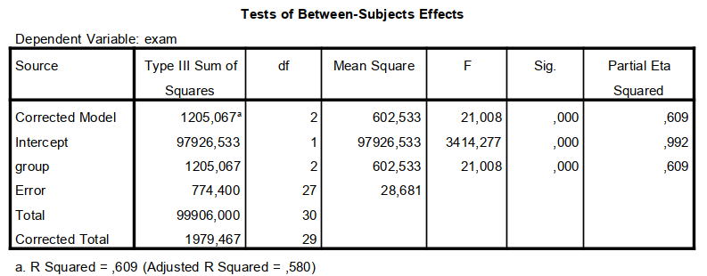
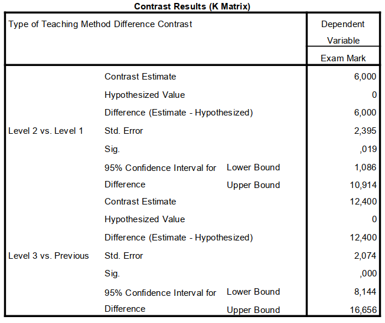
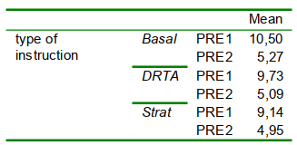
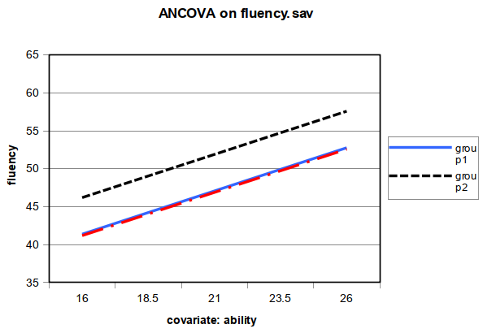
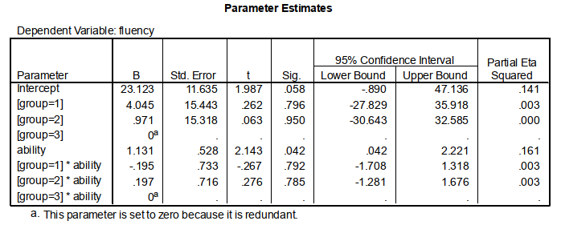
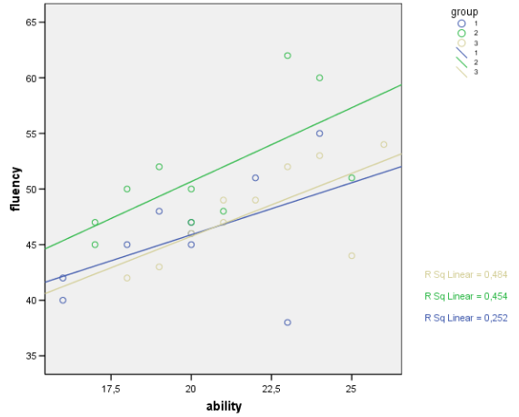

\vfill

Literature:

* Field (5th ed, 2018):  Chapter 12, 13 & 14

\newpage

# One-way ANOVA with Post Hoc tests

In the file ‘`Tumour.sav`’ are fictional data on 6 groups people who where exposed to either 0, 1, 2, 3, 4 or 5 hours of radiation from a mobile phone per day during 6 months. The dependent variable is the size of any tumour (in mm) close to the site of the phone antenna (just behind the ear).

**(1A)**
Make an error bar chart depicting the group means with their 95% confidence intervals.

**(1B)**
Conduct an analysis to investigate the effect of duration of radiation on tumour size. Check the homogeneity assumption in the Output.

**(1C)**
Test pair-wise differences between experimental conditions. Use the Games-Howell Post Hoc test (Why?). Interpret the results.


# One-way ANOVA with Contrast tests

In the file '`Teach.sav`' are the results of an experiment by Field on how different teaching methods affected students’ knowledge. The dependent variable is exam marks (percentage). The experimental conditions were

* ``punish'' (1; in this condition Andy hit students who performed poorly with a large cane),
* ``indifferent'' (2; in this conditions students were neither punished nor rewarded).
* ``reward'' (3; in this condition Andy encouraged students and rewarded good students with candy), and

Two predictions were made:

1. reward will produce the best learning.
2. punishment is worse than an indifferent approach.

**(2A)**
Conduct an analysis to investigate the effect of teaching methods on students’ knowledge. Check the homogeneity assumption in the Output.

**(2B)**
Repeat the analysis but now select the appropriate set of contrasts that test two predictions (use the table "Standard contrasts available in SPSS" in Field). Don’t forget to click “change” in the contrast menu. Interpret the results.


# ANCOVA

Open the file ‘`Reading.sav`’. These are data from a study of the effect of three different methods of instruction (`Basal`, `DRTA`, and `Strat`) on reading comprehension in children. Participants were given several reading comprehension tests before and after receiving the instruction. We will focus on the post-test score on the first reading test. Note that the number of mistakes is reported.

The researcher wants to test the effect of the instruction method on the first reading test (`post1`), correcting for pretest differences between children on reading test 1 (`pre1`) and reading test 2 (`pre2`).

**(3A)**
What is the factor, what are the covariates?

**(3B)**
Compute the correlations between the covariates and the dependent variable. Do you think the covariates will account for a lot of variance of the dependent variable?


**(3C)**
Run an analysis to test the effect of instruction method on reading comprehension (control for individual differences in pretest scores) Request unadjusted means (descriptives) and adjusted means (estimated marginal means) for each instruction method in the Options dialog box.

Do the adjusted means and unadjusted means differ substantially? What can you infer for the group means on the covariates?

**(3D)**
What do you conclude on the effect of instruction method on reading comprehension?


# ANCOVA II

Open the file ‘`fluency.sav`’. Perform an ANOVA with fluency as dependent variable and group as fixed factor. Also ask for  descriptive statistics and the homogeneity tests.

**(4A)**
Would you perform some post hoc tests after viewing the results? If yes, which one(s)? Consider in your answer the p-value of the overall test of the group effect, and the descriptives.


**(4B)**
Perform an ANOVA with `general ability` as dependent variable and `group` as fixed factor.

Give an interpretation of the results. Mention the proportion of explained variance in your answer. Consider in your answer the group means, the p-value of the overall test of the group effect, and relate this to $R^2$.

**(4C)**
Did the randomization of the researchers succeed with respect to general ability?

**(4D)**
What will happen to (i) the $MS_W$ and (ii) the adjusted means if we take general ability as a covariate in the ANOVA of fluency?


**(4E)**
Perform an ANCOVA  with `fluency` as dependent variable, `group` as fixed factor and `ability` as covariate. Also ask for  estimated marginal means (=adjusted means) for the factor group, and request parameter estimates.

Interpret the results and mention the proportion of explained variance. Consider in your answer the adjusted group means, the $p$-value of the effect of group, and the $p$-value of the effect of the covariate.

**(4F)**
Draw (on paper) the regression line for each of the groups. Plot the dependent variable on the Y-axis, and the covariate on the X-axis. Consider the ranges of both variables. Use the information in the table ‘parameter estimates’. Indicate the unadjusted group means and the adjusted group means in your graph.


**(4G)**
Repeat the analysis, now indicate in the ‘Contrast’ window that you would like Simple contrasts of the group factor.

Do the first and the second group differ significantly in adjusted means? Consider the difference between the adjusted group means, this is the ‘Contrast Estimate’, and the p-value of this difference. For interpretation purposes, also consider whether the value 0 lies in the 95% confidence interval of the difference between the group means.

**(4H)**
Do the first and the third group differ significantly in adjusted means?


**(4I)**
We will now check whether the assumption of homogeneity of regression is met.

Repeat the analysis but now include the interaction between the covariate and the factor. Request the parameter estimates again.

Try to write down the regression lines of `fluency` on `ability`, for each group, using the parameter estimates. Note that for each group, the intercept of the regression line is a sum of the overall intercept and the group effect, and the slope is listed as the B in the `group`$\times$`ability` rows.

**(4J)**
Is the interaction significant? Consider in your answer the $p$-value of the `group`$\times$`ability` effect in the table with the test of the between-subject effects.

**(4K)**
What does this imply for the assumption of homogeneity of regression?


# Factorial ANOVA

**Example 1**

\textsl{People’s musical tastes tend to change as they get older. My parents, for example, after years of listening to relatively cool music when I was a kid, subsequently hit their mid-forties and developed a worrying obsession with country and western music. This possibility worries me immensely because the future seems incredibly bleak if it is spent listening to Garth Brooks and thinking ‘oh boy, did I underestimate Garth’s immense talent when I was in my twenties’. So, I thought I’d do some research. I took two groups (`age`): young people (I arbitrarily decided that ‘young’ meant under 40 years of age) and older people (above 40 years of age). There were 45 people in each group, and I split each group into three smaller groups of 15 and assigned them to listen to Fugazi, ABBA or Barf Grooks (`music`). I got each person to rate it (`liking`) on a scale ranging from -100 (I hate this foul music) through 0 (I am completely indifferent) to +100 (I love this music so much I’m going to explode). The data are in the file `Fugazi.sav`, conduct a two-way independent ANOVA on them.}


To answer this question we need to conduct a 2 (`Music`: Fugazi vs. Abba vs. Barf Grooks) $\times$ 2 (`Age`: 40+ vs. 0-40) two-way independent ANOVA. Your completed dialog box should look like the figure below.

```{r, echo=FALSE, fig.align="center",  out.width = '40%'}

```


**Example 2**

\textsl{There are reports of increases in injuries related to playing Nintendo Wii} ([see http://ow.ly/ceWPj](http://ow.ly/ceWPj)). \textsl{These injuries were attributed mainly to muscle and tendon strains. A researcher hypothesized that a stretching warm-up before playing Wii would help lower injuries, and that athletes would be less susceptible to injuries because their regular activity makes them more flexible. She took 60 athletes and 60 non athletes (`Athlete`), half of them played Wii and half watched others playing as a control (`Wii`), and within these groups half did a 5-minute stretch routine before playing/watching whereas the other half did not (`Stretch`). The outcome was a pain score out of 10 (where 0 is no pain, and 10 is severe pain) after playing for 4 hours (`Injury`). The data are in the file '`Wii.sav`'. Conduct a three-way ANOVA to test whether athletes are less prone to injury, and whether the prevention programme worked.}

To answer this question we need to conduct a 2 (`Athlete`: athlete vs. non-athlete) $\times$ 2 (`Wii`: playing Wii vs. watching Wii) $\times$ 2(`Stretch`: stretching vs. no stretching) three-way independent ANOVA. Your completed dialog box should look like Figure.

To answer this question we need to conduct a 2 (`Athlete`: athlete vs. non-athlete) $\times$ 2 (`Wii`: playing Wii vs. watching Wii) $\times$ 2(`Stretch`: stretching vs. no stretching) three-way independent ANOVA. Your completed dialog box should look like Figure below.

```{r, echo=FALSE, fig.align="center",  out.width = '40%'}

```


\newpage
\appendix

# Answers

##  One-way ANOVA with Post Hoc tests


**Answer 1A**

Below is an alternative approach to plotting the means with 95% CI to the bar graph that Field reports. The graph below is a (simple) error bar graph.For Field’s answers to this exercise, see Canvas / Data Files “Answers exercise C3.1/Smart Alex task”

```{r, echo=FALSE, fig.align="center",  out.width = '60%'}

```


**Answer 1B & C**

Concerning violation of the homogeneity of variance assumption, you should know the following:

The variances of the residuals of all groups are compared statistically with Levene’s test. When this test results in $p < .05$ this means that the error variances are statistically not equal among the different groups. Criticism: the test is (dependent on the a.o. the sample size) sensitive to type I and type II errors.  Alternatively you could compute the variance ratio (see Field). A crude rule of thumb is that the largest variance may be (at most) twice the size of the smallest variance. Rule of thumb for dealing with heterogeneous variances: if you have equal group and normally distributed errors a violation of this assumption does not invalidate the statistical tests.

Otherwise you could bootstrap the AN(C)OVA results and report BCa 95\% CIs for the pairwise comparisons, instead of the CIs below that are based on the assumption that the t-distribution applies.

\newpage

## One-way ANOVA with Contrast tests

**Answer 2A**

```{r, echo=FALSE, fig.align="center",  out.width = '50%'}

```

For these data, the assumption of homogeneity of variance has been met,
Because the variance ratio is below 2. Furthermore, Levene’s test is non-significant.

```{r, echo=FALSE, fig.align="center",  out.width = '70%'}

```

The main ANOVA summary table shows us that because the observed significance value
is less than 0.05 we can say that there was a significant effect of teaching style on exam marks, with $\text{partial}\,\eta^2 = .61$\footnote{Cohen (1988) has presented some guidelines for small ($\text{partial}\,\eta^2 = .01$), medium ($\text{partial}\,\eta^2 = .09$), and large ($\text{partial}\,\eta^2=.25$) effects. These guidelines apply to experiments and social/clinical areas of psychology; larger values could be expected for non-experimental research, sociology, and the more physiological aspects of psychology.}, indicating a large effect size. However, at this stage we still do not know exactly what the effect of the teaching style was (we don’t know which groups differed).

\newpage
**Answer 2B**

Because there were specific hypotheses you need to choose the "difference" contrasts. The first contrast compares punishment against indifference. The second contrast compares reward against punishment and indifference.

```{r, echo=FALSE, fig.align="center",  out.width = '70%'}

```

$$r=\sqrt\frac{t^2}{t^2+df}\qquad (t=\frac{\text{contrast estimate}}{\text{std. error}})$$

The first contrast (and the descriptive statistics) tells us that the marks after punishment were significantly lower than after indifference (again, it’s significantly different because the value in the column labelled Sig. is less than 0.05). As such we could conclude that reward produces significantly better exam grades than punishment and indifference, and that punishment produces significantly worse exam marks than indifference.

The  $t$-test for the second contrast tells us that reward was significantly different from punishment and  indifference (it’s significantly different because the value in the column labelled Sig. is less than 0.05). Looking at the means, this tells us that the average mark after reward was significantly higher than the average mark for punishment and indifference combined.


## ANCOVA

**Answer 3A**

The between subjects factor is `group`. The covariates are `PRE1` and `PRE2.`

**Answer 3B**

The correlations between the DV `POST1` and the two covariates are .566 (`PRE1`) and .345 (`PRE2`), and the correlation between `PRE1` and `PRE2` is .335. Yes, given the correlations with the dependent variable, I think the covariates together will explain quite a bit of variance of the dependent variable, although there is some overlap between `PRE1` and `PRE2` ($r = .335$)

**Answer 3C**

|       | Unadjusted mean | Adjusted mean |
| ----- | --------------- | ------------- |
| Basal | 6.68            | 6.68          |
| DRTA  | 9.77            | 9.82          |
| Strat | 7.77            | 8.22          |


The adjusted and unadjusted group means differ somewhat, especially the difference between the Basal and Strat group has increased due to adjustment. So probably, the groups differ somewhat in average on the covariates, but not substantially:


```{r, echo=FALSE, fig.align="center",  out.width = '40%'}

```

\textsl{(This table with group means on the covaiate `PRE1` and `PRE2` is added for your information)}


**Answer 3C**

After controlling for individual differences in reading ability, the "method of instruction" has a significant influence on reading ability ($F(2,61)=12.7, p<.001$). The effect size for the main effect of “method of instruction” is large ($\eta_p^2=.293$).


## ANCOVA II

**Answer 4A**

The effect of group on fluency is significant only when $\alpha=.10$, not at $\alpha=.05$  ($F(2,27)=3.085, p=.062$). Although the sample means for the three groups on fluency are different (respectively 45.7, 51.2, and 47.9), this difference is not large enough to reject the null-hypothesis for this data. Considering these values, though, the lack of significance might be due to a low power (as a result of the relative small sample size, $N = 30$). Rather than performing Post Hoc tests I would gather more data, since the explained variance of fluency by the group differences in about $19\% (R^2 = \frac{153}{832} = .19$), which indicates a moderate to strong effect. A problem of performing Post Hoc tests after a non-significant $F$-test is to falsely reject the null-hypothesis
for the difference between two group means (due to capitalization on chance).

**Answer 4B**

The sample means for the three groups on ability are 19.8, 20.4, and 21.9. The groups do not differ significantly on ability ($F(2,27)=1.588, p =.223$). The proportion of explained variance by group is .105.


**Answer 4C**

Given that general ability was tested before the treatment, the randomization succeeded, because the groups do not differ (significantly)on average on ability.


**Answer 4D**

i. If ability correlates with fluency (within the groups), $MS_\text{error}$ will decrease.
ii. The effect on the adjusted means will be minimal, since the groups do not differ
(significantly) on the covariate (which is good).

*Note:* Adjusted means are the average predicted values when the people in all groups have an average score on the covariate. This adjustment of the group means is close to zero when the groups do not differ on the covariate in the first place.

**Answer 4E**

The adjusted group means on fluency are 46.7, 51.5, and 46.5 (i.e. the average predicted values when the people in all groups have an average score on ability, namely 20.7). Controlling for ability, the effect of group on fluency is significant with $\alpha=.05$ ($F(2,26)=5.03, p=.014)$. As $\text{partial}\,\eta_\text{group}^2=\frac{SS_\text{group}}{SS_\text{group} + SS_\text{error}}= 0.279$, the effect size is large. The covariate ability is significantly related to fluency ($F(1,26)=16.25, p<.000, \eta^2= 0.385$). The total proportion of explained variance ($R_\text{model}^2$) increased to .499.


**Answer 4F**

* *Group 1:* predicted fluency $= 22.961 + 1.139\times\text{ability} + 0.19\times 1 = 23.152 + 1.139\times\text{ability}$
* *Group 2:* predicted fluency $= 22.961 + 1.139\times\text{ability} + 5.01\times 1 = 27.969 + 1.139\times\text{ability}$
* *Group 3 (the reference group):* predicted fluency $= 22.961+ 1.139\times\text{ability}$

```{r, echo=FALSE, fig.align="center",  out.width = '60%'}

```

Note that the averages are not plotted in this figure. Please do so yourself.


**Answer 4G**

Yes, the difference between the first and second group in adjusted means equalled 4.8, which was significantly larger than 0 ($p=.01$). The null-hypothesis values of 0 is not in the 95\%-confidence interval of the difference, which was from 1.14 to 8.50.

**Answer 4H**

No, the difference between the first and third group in adjusted means equalled -0.191, which was not significantly smaller than 0 ($p= .92$). The 95\%-confidence interval of the difference included the value of 0.

**Answer 4I**

```{r, echo=FALSE, fig.align="center",  out.width = '80%'}

```

* *Group 1:* predicted fluency $= 23.123 + 4.045\times1 + (1.131-0.195)\times\text{ability} = 27.168 + 0.936\times\text{ability}$
* *Group 2:* predicted fluency $= 23.123 + 0.971 + (1.131+0.197)\times\text{ability} = 24.094 + 1.328\times\text{ability}$
* *Group 3:* predicted fluency $= 23.123 + 1.131\times\text{ability}$

For your information: the regression equations resulting from the above ANCVOA
output, are in fact the regression lines for predicting fluency from mental ability for
each group separately:

```{r, echo=FALSE, fig.align="center",  out.width = '60%'}

```


**Answer 4J**

Although these lines are not exactly parallel in the sample, you can see the the slopes of the regression lines for the three groups are very similar. The interaction of ability and group is not significant ($F(2,24)=.157, p=.86, \eta_p^2=.01$). That is, the assumption of homogeneity of regression is met.

**Answer 4K**

See, 4J. The assumption of homogeneity of regression is not violated. That is, the regression weight (slope) of ability has (approximately) the same value for each group.

*Note:* The answer of part 4F shows the “ideal” regression lines (with an average within group regression weight), that is, the regression lines ANCOVA uses within each group to estimate the adjusted means. In reality the regression lines can be slightly different (see 4F), but this is seen as sample fluctuations that must be ignored (at least when the interaction of ability and group is not significant, as it is here).


## Factorial ANOVA

You find the answers for this exercise at Canvas / Datasets / Computer session 3 / Solutions or at the [companion website](https://studysites.sagepub.com/field4e/study/smartalex/chapter13.pdf) of the Field book.
