\vfill

Literature: 

* Field (4th ed):  Chapter 14 & 15
* Field (5th ed):  Chapter 15 & 16

\newpage

**Contrasts in SPSS**

Warning: it is, in general, easier to understand contrasts conceptually, then to have SPSS test the contrast you are interested in.

SPSS has several modules to compute an ANOVA.  The options for specifying contrasts differ over these modules.


* **One-way ANOVA** (Analyze / Compare Means / One-way ANOVA) \newline One-way ANOVA offers the possibility to compute polynomial contrasts, self-defined contrasts, and a large variety of post hoc multiple comparisons.
* **GLM Univariate** (Analyze / General Linear Model / Univariate) \newline GLM Univariate can compute several kinds of contrasts (e.g. Helmert, difference, and polynomial), and the same large variety of post hoc multiple comparisons. In addition, pairwise comparisons with no (LSD), Bonferroni, or Sidak correction for multiple comparisons can be requested in the ‘Options’ dialog box. 
* **GLM Repeated measures** (Analyze / General Linear Model / Repeated Measures) \newline For designs with a WS-factor, GLM Repeated Measures has the option to request several kinds of contrasts\footnote{By using type III sum of squares in ANOVA (default option), for each contrast the unique contribution to the between variation is given. For correlated (i.e. non-orthogonal) contrasts this means that each contrast is adjusted for its correlations with the other contrasts. Thus, this option is recommended, when one wants to test non-orthogonal contrasts.} (e.g. Helmert, difference, and polynomial) for both the the WS-factor(s) and, if present, BS-factor(s). The post hoc multiple comparisons are only available for the BS-factors. The pairwise comparisons of the marginal means (LSD, Bonferroni, or Sidak corrected significance levels) are available for both WS- and BS-factors.


#  One within-subjects factor

Open the file ‘`Angle.sav`’. A psychologist investigates the visual detection of one object in a visual field with a large number of distractors. The dependent variable is the response time in ms. The factor that the psychologists manipulates is the location of the object. More precisely, it is the angle between the object and the center of the eye (yellow spot). In the condition ‘`angle0`’ the object is in the center of the visual field, in the condition ‘`anlge4`’ just outside the center of the visual field, and in the condition ‘`angle8`’ is it located even further from the center of the visual field. Ten subjects are presented with one presentation in each condition.

 
**(1A)**
Is there an effect of `angle` on the response times?

**(1D)**
Which test is appropriate to answer the question in A considering the observed value of epsilon ($\epsilon$).

**(1C)**
Test and interpret the relevant pairwise differences between the experimental conditions (take into account the ordering of the conditions).


# One within-subjects factor, one between-subjects factor

Open the file `‘Attitude.sav`’. The file contains data on the attitude of respondents concerning marriage, household duties and motherhood. The respondents have been questioned three times, with time lags of two years in between. Positive scores indicate a conservative attitude, negative scores indicate a liberal attitude. A score of 0 indicates a neutral attitude. Missing values are indicated with a dot.

The research questions are as follows:

1. Compared to people’s initial attitude, does their attitude toward marriage, household duties and motherhood change over time?.
2. Is there an effect of educational level on attitude?
3. Furthermore, if people’s attitude toward marriage, household duties and motherhood changes over time, is this change the same for the three groups with different educational levels? (interaction effect education x time)

Run the appropriate analyses to answer the research questions above.

**(2A)**
Which hypotheses are tested here?

**(2B)**
Are the main effects significant?

**(2C)**
Is the interaction effect significant?

**(2D)**
Try to interpret the interaction plot.

**(2E)**
Interpret the Within Subjects Contrast table. What can be concluded with respect to the univariate hypotheses formulated in a?

**(2F)**
Interpret the Post Hoc tests for the between subjects factor. Which groups of educational level differ significantly with respect to their (average) attitudes?


# Two within-subjects factors

The file ‘`problemchildren.sav`’ contains the scores of 164 children with behavioral problems. On four points in time, the number of problem situations in the last two days are recorded both for the home situation and for the school situation (at the beginning of the treatment, after 3 months of treatment, after 6 months of treatment, and after 12 months of treatment).

Research questions are:

1. In what way does the problem behavior develop over time?

2. Does this development of problem behavior over time differ between the home situation and the school situation?

**(3A)**
Write down the null-hypotheses.

**(3B)**
Which follow-up analyses seem appropriate here?

**(3C)**
What is your conclusion with respect the hypotheses formulated in i? (use a Bonferroni correction).

**(3D)**
Do children show more problem behaviour at home or at school?

**(3E)**
Is the main effect of '`time`' the same for both `situations` (i.e. the home situation and the school situation)? If not, use the contrasts to interpret the difference


# Two-way mixed ANOVA, assumptions

See Task 2 in Field (2013, Ch. 15), p. 621. 

Text messaging is very popular among mobile phone owners, to the point that books have been published on how to write in text speak. One concern is that children may use this form of communication so much that it will hinder their ability to learn correct written English. One concerned researcher conducted an experiment in which one group of children was encouraged to send text messages on their mobile phones over a six-month period. A second group was forbidden from sending text messages for the same period. To ensure that kids in this latter group didn’t use their phones, this group was given armbands that administered painful shocks in the presence of microwaves (like those emitted from phones). There were 50 different participants: 25 were encouraged to send text messages and 25 were forbidden. The outcome was a score on a grammatical test (as a percentage) that was measured both before and after the experiment. The first independent variable was, therefore, text message use (text messagers versus controls) and the second independent variable was the time at which grammatical ability was assessed (before or after the experiment). The data are in the file `TextMessages.sav`.


**(4A)**
Conduct the appropriate analysis.

**(4B)**
What are the main results of this analysis?

**(4C)**
What are the assumptions of this analysis?

**(4D)**
Check the statistical assumptions, by (i.) requesting homogeneity tests and (ii.) saving the standardized residuals. These standardized residuals are saved for each respondent in new variables. Make a histogram of these variables. 

What are your conclusions about (a) and (b)?

**(4E)**
One of the finding in d. was that the distribution of residuals at Six months was skewed to the left, with one outlier (st. res. $< -3$). Remove the outlier (via select cases) an re-run the analysis you did in A.

**(4F)**
 What is conclusion about the time*group interaction? Compare your answer with your answer in A.
 
 


\newpage
\appendix

# Answers

##  One within-subject factor


**Answer 1A & B**

We run a one-way repeated measures ANOVA, where we compare three conditions of “angle”. First we investigate whether sphericity holds, so that we can choose the appropriate F-test for the main effect of “angle”.

```{r, echo=FALSE, fig.align="center",  out.width = '90%'}
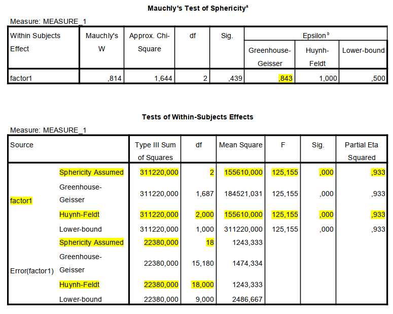
```

The sphericity assumption in repeated measures ANOVA is similar to the homogeneity of error variances assumption in ANOVA, but then for within-subject factors. When this assumption is violated it means that the standard F-test for the main effect of the within-subjects factor is not correct. 

Sphericity is measured with Epsilon. Different estimates of Epsilon exist, but we always inspect the Greenhous-Geisser (GG) epsilon. 

* When G-G Epsilon = 1 when the assumption is perfectly met. Values < 1 indicate some degree of violation.
* When G-G epsilon is $< .75$ we report the Greenhouse-Geisser corrected *F*-test for the main effect of the within-subjects factor. NB. the correction applies to the degrees of freedom and thus the *p*-value of the *F*-test.
* When G-G epsilon is $> .75$ we report the Huynh-Feldt (HF) corrected F-test for the main effect of the within-subjects factor. With the exception that when the H-F “correction” produces exactly the same (or nearly the same) results as the uncorrected F-test (sphericity assumed) we just report the uncorrected F-test

Here,  G-G epsilon $= .84$, but since the H-F corrected degrees of freedom are exactly the same as the uncorrected degrees of freedom, we report the uncorrected *F*-test (sphericity assumed. The F-test of the within-subjects effect indicated a significant effect of angle on response time $F(2,18)=125.2, p < .001$. The effect size is exceptionally large ($\eta_p^2=.93$).


**Answer 1C**

The relevant pairwise differences seem to be:

* condition `angle0` (the object is in the center of the visual field) versus, condition `angle4` (just outside the center of the visual field) and
* condition `angle4` versus condition ‘angle8’ (is it located even further from the center of the visual field).

Because of the ordering of the conditions it does not seem to be efficient to also test `angle0` versus `angle8`. This will save us one extra test and thus unnecessary inflation of type I error-rate.

Hypotheses can be tested with repeated contrasts, null hypotheses for angle (3 levels):

* $H_0\;\Psi_1: \mu_1 - \mu_2 = 0$
* $H_0\;\Psi_2: \mu_2 - \mu_3 = 0$


```{r, echo=FALSE, fig.align="center",  out.width = '90%'}
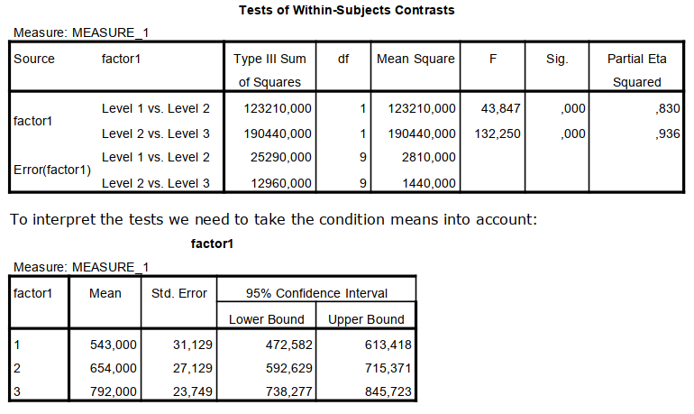
```

**Conclusions:** When the angle of the object to the participant increased, responses to the object were significantly slower $F(2,18)=125.16, p < .001, \eta_p^2= .93$.
*Repeated Contrasts* revealed that response time was higher for objects presented at a 4 degree angle compared to 0 degree angle; and response time was higher for objects presented at an 8 degree angle compared to 4 degree angle; resp. $F(1, 9) = 43.85, \eta_p^2 = .83; F(1, 9) = 132.25, \eta_p^2 = .94$.


## One within-subjects factor, one between-subjects factor

Open the file ‘`attitude.sav`’. The file. The file contains data on the attitude of respondents concerning marriage, household duties and motherhood. The respondents have been questioned three times, with time lags of two years in between. Positive scores indicate a conservative attitude, negative scores indicate a liberal attitude. A score of 0 indicates a neutral attitude. Missing values are indicated with a dot.

**Answer 2A**

Null-hypotheses for the research questions are as follows:

1. Compared to people’s initial attitude, does their attitude toward marriage, household duties and motherhood change over time? $$H_0: \mu_\text{time1} = \mu_\text{time2} = \mu_\text{time3}$$
2. Is there an effect of educational level on attitude? $$H_0: \mu_\text{low} = \mu_\text{medium} = \mu_\text{high}$$
3. Furthermore, if people’s attitude toward marriage, household duties and motherhood changes over time, is this change the same for the three groups with different educational levels? (interaction effect education $\times$ time). \newline $H_0$: the differences between the three groups of educational level (in the population) are the same for the three time points.


**Answer 2B & C**

This is a mixed ANOVA with ws-factor time and bs-factor educational level, dependent variable is conservative opinion (short).

```{r, echo=FALSE, fig.align="center",  out.width = '90%'}
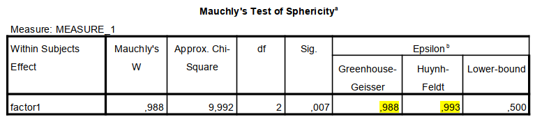
```

G-G epsilon is = .99 that is so close to 1, we report the uncorrected F-test for the main effect of the time and the (time*ed. level) interaction.

```{r, echo=FALSE, fig.align="center",  out.width = '90%'}
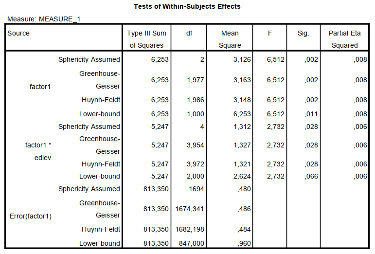
```

* The main effect of time on attitude was significant with a small effect size $F(2, 1694)=6.51, p = .002, \eta_p^2 = .01$)
* The interaction effect of time and educational level on attitude was also significant with a small effect size $F(4, 1694)=2.73, p = .028, \eta_p^2= .01$)

```{r, echo=FALSE, fig.align="center",  out.width = '90%'}
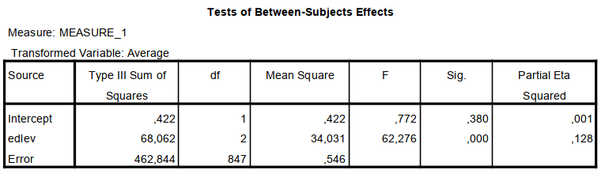
```

* The main effect of the BS factor educational level on the average attitude was significant with a moderate effect size $F(2, 847)=62.28, p < .001, \eta_p^2 = .13$). If you check the descriptives for the main effect of ed. level, you’ll find that on average people with lower level of education tend to have more conservation opinions.

\newpage

**Answer 2D**

```{r, echo=FALSE, fig.align="center",  out.width = '60%'}
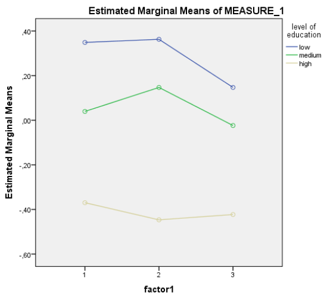
```


Mean attitude seemed to be more liberal for higher levels of education. Averaged over the three educational levels, the attitude seemed to be slightly more conservative from time 1 to time 2, and then get more liberal again for time 3. (you would have to test whether this is significant)

Considering the plot, the difference between high and medium education was larger at time 2 than at the other time points. Also, the difference between low and medium educated people was larger at time 1 than at the other time points. . (you would have to test whether this is significant)

```{r, echo=FALSE, fig.align="center",  out.width = '90%'}
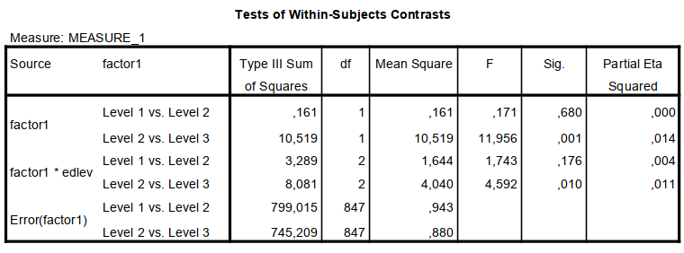
```

\newpage

**Answer 2E**

Given the ordering of the levels of the ws-factor I chose repeated contrasts. Averaged over all respondents, the difference in opinion between time 1 and 2 is not significant, but the difference in opinion between time 2 and 3 is significant with small effect size $F(1, 847)=11.96, p < .001,  \eta_p^2 = .01$.
 
The contrast tests for the interaction effect showed that showed that the difference in attitude between the three groups was significant with small effect size between time 2 and 3 $F(2, 847)=4.59, p = .011,  \eta_p^2= .01$, but not significant between time 1 and 2.

```{r, echo=FALSE, fig.align="center",  out.width = '90%'}
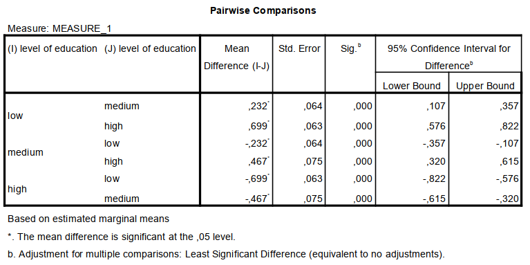
```

($t = \frac{\text{mean diff}}{{\text{std. error}}}$)

**Answer 2F**

The post hoc tests showed that all  three pairwise differences between the difference
ed-level groups are significant with p < .001. Thus even with a (Bonferroni correction for multiple testing differences would be significant). On average people with lower level of education tend to have more conservation opinions than people with medium educational level (mean difference $= 0.23$, $95\% CI=[0.11, 0.36], t(847) = 3.63, p < .001, r = .12$) and people with medium educational level are more conservative than people with higher educational level (mean difference $= 0.47$, $95\% CI=[0.32, 0.62], t(847) = 6.23, p < .001, r = .21$).

\newpage

##  Two within-subject factors

**Answer 3A**

Research questions are:

i. In what way does the problem behavior develop over time? $$H_0: \mu_\text{time1} = \mu_\text{time2} = \mu_\text{time3} = \mu_\text{time4}$$
ii. Does this development of problem behavior over time differ between the home situation and the school situation? (time $\times$ situation interaction) \begin{align*}H_0: \mu_\text{home} - \mu_\text{school time1} & = \mu_\text{home} - \mu_\text{school time2} \\ & = \mu_\text{home}-\mu_\text{school time3} \\ & = \mu_\text{home} - \mu_\text{school time4}\end{align*} In words: the difference between the home and school situation is the same for the four time points.

**Answer 3B**


The following follow-up strategy seems plausible (however other contrasts are also possible dependent on the research question):

* repeated contrasts, null hypotheses for time (4 levels)
  * $H_0\;\Psi_1: \mu_\text{time1} - \mu_\text{time2} = 0$ 
  * $H_0\;\Psi_2: \mu_\text{time2} - \mu_\text{time3} = 0$ 
  * $H_0\;\Psi_3: \mu_\text{time3} - \mu_\text{time4} = 0$ 
* repeated contrast, null hypothesis for time $\times$ situation (interaction)
  * $H_0\;\Psi_1: \mu_\text{home}-\mu_\text{school time1} = \mu_\text{home}-\mu_\text{school time2}$ 
  * $H_0\;\Psi_2: \mu_\text{home}-\mu_\text{school time2} = \mu_\text{home}-\mu_\text{school time3}$ 
  * $H_0\;\Psi_3: \mu_\text{home}-\mu_\text{school time3} = \mu_\text{home}-\mu_\text{school time4}$ 


**Answer 3C**


```{r, echo=FALSE, fig.align="center",  out.width = '90%'}
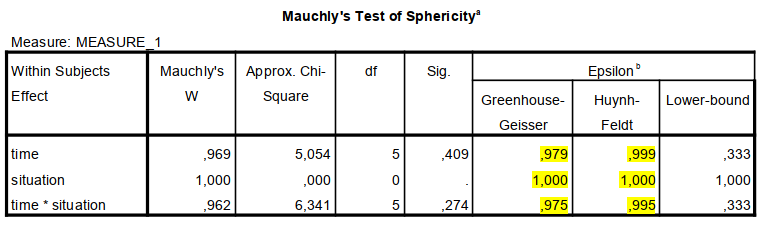
```

G-G epsilon are resp. $= .98$, 1.00, and .96 with corresponding H-F epsilon values so close to 1, that practically the H-F correction is meaningless. Hence we report the uncorrected *F*-test for the main effect of the time, the main effect of the situation, and the (time $\times$ situation) interaction.

```{r, echo=FALSE, fig.align="center",  out.width = '90%'}
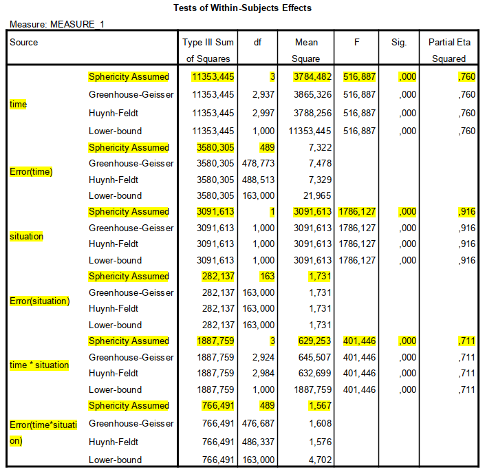
```
```{r, echo=FALSE, fig.align="center",  out.width = '90%'}
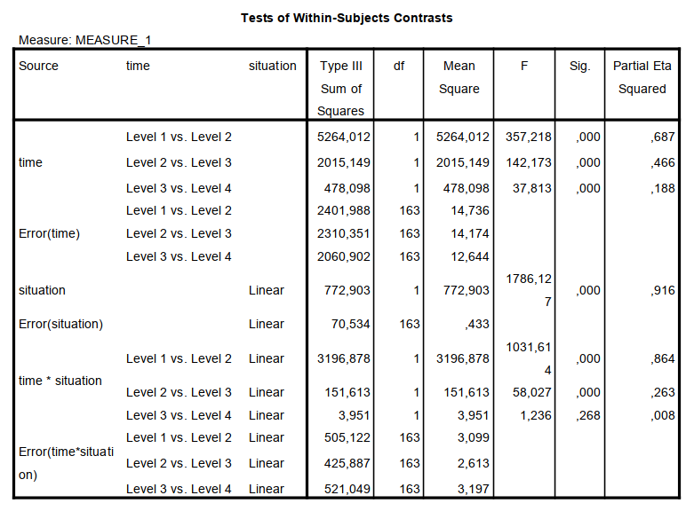
```
```{r, echo=FALSE, fig.align="center",  out.width = '60%'}
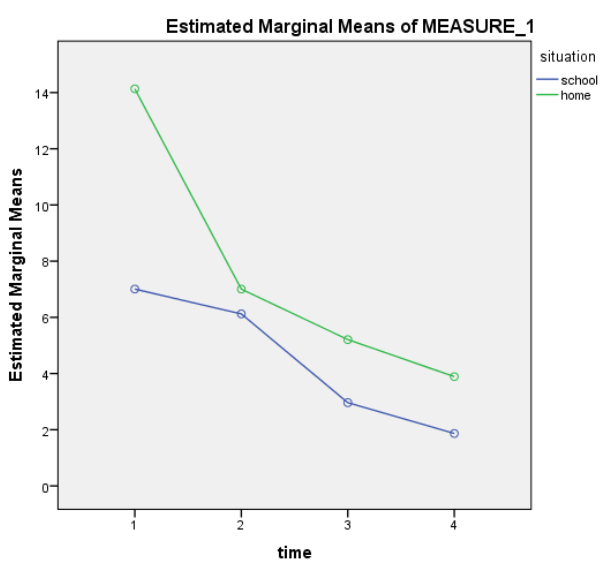
```


**(i.) In what way does the problem behavior develop over time?** $$H_0: \mu_\text{time1} = \mu_\text{time2} = \mu_\text{time3} = \mu_\text{time4}$$

On average over the home and school situation the problem behavior diminishes over time, $F(3,489)=516.89, p < .001, \eta_p^2 = .76$. 

Repeated Contrasts for ws-factor time revealed that problem behavior was higher for time 1 compared to time 2, problem behavior was higher for time 2 compared to time3, and problem behavior was higher for time 3 compared to time 4 ; resp. $F(1, 163) = 357.22, p < .001, \eta_p^2 = .69; F(1, 163) = 142.17, p < .001, \eta_p^2 = .47, F(1, 163) = 37.81, p < .001, \eta_p^2 = .19$.

**(ii.) Does this development of problem behavior over time differ between the home situation and the school situation? (time $\times$ situation interaction)** \begin{align*}H_0: \mu_\text{home} - \mu_\text{school time1} & = \mu_\text{home} - \mu_\text{school time2} \\ & = \mu_\text{home}-\mu_\text{school time3} \\ & = \mu_\text{home} - \mu_\text{school time4}\end{align*}

In general the development of problem behavior over time differs between the home situation and the school situation $F(3,489)=401.45, p < .001, \eta_p^2 = .71$.

*Repeated Contrasts* for the time $\times$ situation interaction revealed that the decrease in problem behavior from time 1 to time 2 was larger in the home situation than in the school situation, whereas the decrease in problem behavior from time 2 to time 3 was slightly larger in the school situation than in the home situation. Groups did not differ with respect to their decrease in problem behavior from time 3 to 4;  resp. $F(1, 163) = 1031.61, p < .001, \eta_p^2 = .86; F(1, 163) = 58.03, p < .001, \eta_p^2 = .26, F(1, 163) = 1.24, p = .27,\eta_p^2= .01$.

**Answer 3D**

In the graph we can see that on average children show more problem behavior at home than in school, the *F*-test for the ws-factor situation, shows that this difference is significant with large effect size $F(1, 163) = 1786.13, p < .001, \eta_p^2=.92$.

**Answer 3E**

No because the interaction effect is significant. For interpretation see C.


## Two-way mixed ANOVA, assumptions

**Answer 4A**

This is a two-way mixed ANOVA with ws-factor time (2 levels) and bs-factor group (two groups)

**Answer 4B**

The results show that the grammar ratings at the end of the experiment were significantly lower than those at the beginning of the experiment, $F(1, 48) = 15.46, p < .001$. The main effect of group on the grammar scores was non-significant, $F(1, 48) = 2.99$. This indicated that when the time at which grammar was measured is ignored, the grammar ability in the text message group was not significantly different to the controls. The time $\times$ group interaction was significant, $F(1, 48) = 4.17, p= .047, \eta_p^2 = .08$, with the interaction plot indicating that the change in grammar ability in the text message group was significantly larger than the change in the control groups.

```{r, echo=FALSE, fig.align="center",  out.width = '60%'}
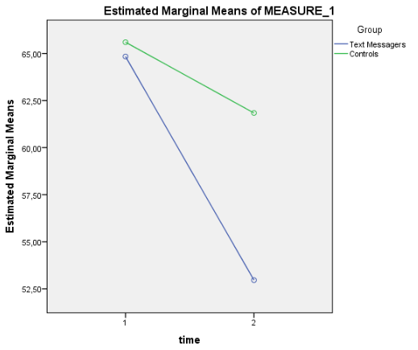
```


**Answer 4C**

* independent observations/residuals (for bs-factor)
* normality of observations/residuals
* homogeneity of variances (for bs-factor)

\newpage

**Answer 4D**

**(i.)** Save residuals and inspect the variances of the residuals for both groups separately

```{r, echo=FALSE, fig.align="center",  out.width = '60%'}
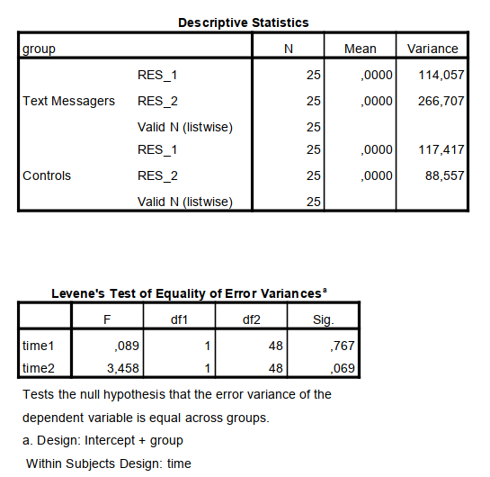
```

The assumption of homogeneous variances of the two groups on the baseline measurement of grammar scores and the post measurement of grammar scores has been met. However, we have a rather large *F*-value for the comparison at six months we see that group variances differ by a factor 3 which is just allowed. Since we have groups of equal size, the *F*-test is robust against violations.

**(ii.)**

```{r, echo=FALSE, fig.align="center",  out.width = '50%'}
knitr::include_graphics(c("picts/spss4_output15.png", 
                          "picts/spss4_output16.png",
                          "picts/spss4_output17.png", 
                          "picts/spss4_output18.png"))
```

The distribution of residuals at Baseline is approximately normal for both groups, the distribution of residuals at Six months is skewed to the left for the textmessagers group, with one outlier (st. res. $< -3$).

\newpage

**Answer 4E**

The way to ignore the respondent with standardized residual $< -3$ on the second dependent variable is to choose the following select cases command:

Now, run the two-way mixed ANOVA again.

**Answer 4F**

Results show that the interaction effect is not significant after removing the outlier from the analysis, $F(1, 47) = 3.13, p = .084, \eta_p^2= .06$.
