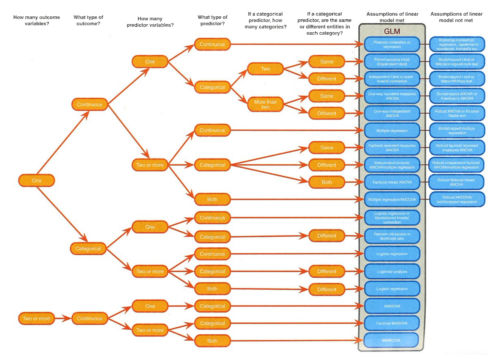
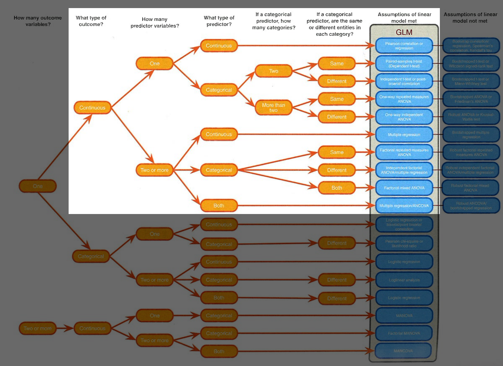

```{r echo=FALSE, message=FALSE}
library(knitr)
options(knitr.kable.NA = "")
```

---
class: small

# When shall I do what kind of analysis?

The last page in the Field book (5th ed.) depicts a decision tree and summarizes all 
questions that need to be addressed to make a decision.

Note, for this course we only look a some of the analyses in the Field book.

---

```{r, echo=FALSE, fig.align="center", out.width = '100%'}

```


---

```{r, echo=FALSE, fig.align="center", out.width = '100%'}

```

