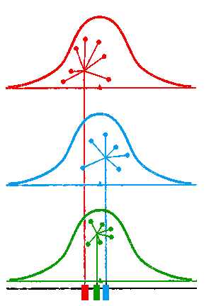
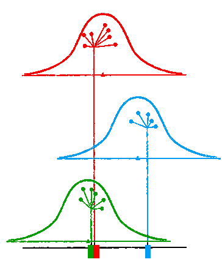
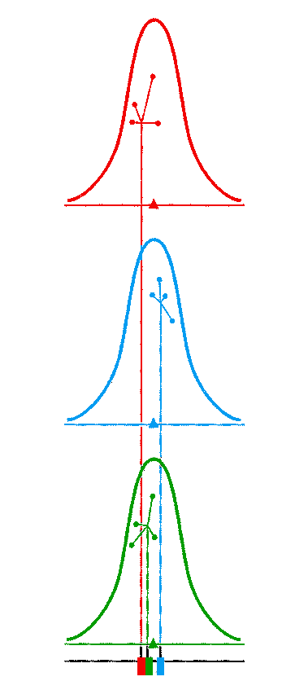
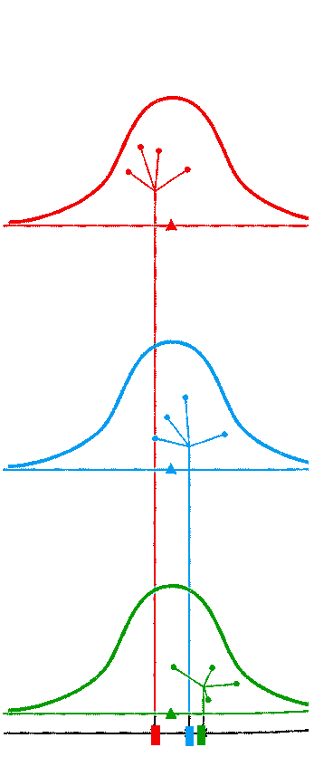

```{r echo=FALSE, message=FALSE}
library(knitr)
library(tidyverse)
library(eulerr)

source("styles/style_functions.R")
```

```{r formulars, echo=FALSE, message=FALSE}
formulars = list(
  ss_t = "$$\\text{SS}_\\text{T} =\\sum_{i=1}^N (x_i - \\bar x_\\text{grand})^2$$",
  ss_m = "$$\\text{SS}_\\text{M} = \\sum_{g=1}^k n_g\\, (\\bar x_g-\\bar x_\\text{grand})^2$$",
  ss_r = "$$\\text{SS}_\\text{R} = \\sum_{g=1}^k\\sum_{i=1}^n (x_{ig}-\\bar x_g)^2$$",
  df_t = "$$df_\\text{T} = N-1$$",
  df_m = "$$\\begin{align}df_\\text{M} &= k-1 \\newline &= \\text{n. groups} - 1\\end{align}$$",
  df_r = "$$\\begin{align}df_\\text{R} &= N-k \\newline &= df_\\text{T} - df_\\text{M}\\end{align}$$",
  ms_m = "$$MS_\\text{M} = \\frac{\\text{SS}_\\text{M}}{df_\\text{M}}$$",
  ms_r = "$$MS_\\text{R} = \\frac{\\text{SS}_\\text{R}}{df_\\text{R}}$$",
  f = "$$F = \\frac{MS_\\text{M}}{MS_\\text{R}}$$"
)
```

```{r manual ANVOVA functions, echo=FALSE, message=FALSE}
## example df
#df = data.frame( unemployed = c(3,2,1,1,4),
#               education   = c(5,2,4,2,3),
#               job        = c(7,4,5,3,6))

.long_df <- function(df) {
  df %>%
    mutate(Subject = 1:n()) %>%
    pivot_longer(cols = c(1:ncol(df)),
                 names_to = "Group",
                 values_to="DV")
}

## anova table
manual_anova <- function(df) {
  n_group = ncol(df)
  n = nrow(df)

  df_T = n_group*n -1
  df_M = n_group -1
  df_R = df_T-df_M

  all = unlist(df)
  m = unlist(df %>% summarise(across(everything(), mean)))
  SS_T = sum((all-mean(all))**2)
  SS_M = sum((m-mean(all))**2)*n
  SS_R = sum((df[1]-m[1])**2) +
    sum((df[2]-m[2])**2) +
    sum((df[3]-m[3])**2)

  MS_M = SS_M / df_M
  MS_R = SS_R / df_R
  F = MS_M / MS_R
  p = 1-pf(F, df_M, df_R)
  anova_tab = data.frame(Source=c("Model", "Residual", "Total"),
                         SS = c(SS_M, SS_R, SS_T),
                         df = c(df_M, df_R, df_T),
                         MS = c(MS_M, MS_R, NA),
                         F = c(F, NA, NA),
                         p = c(p, NA, NA)
  )

  latex_apa_stat = paste0("F(", df_M, ",", df_R, ")=", round(F,2),
                        ", \\; p=", round(p, 2))
  return(list(table=anova_tab, F=F, p=p, df=c(df_M, df_R),
              latex_apa_stat = latex_apa_stat))
}

## plotting

plot_anova_base = function(df, gray_dots=FALSE) {
  dfp = .long_df(df)
  rtn = ggplot(dfp, aes(x = Subject, y = DV)) +
    expand_limits(y=c(0,max(dfp$DV)), x=c(min(dfp$Subject)-0.5, max(dfp$Subject)+0.5)) +
    facet_grid(. ~ Group) +
    theme_bw() +
    theme(text = element_text(size = 28), legend.position="none")
  if (gray_dots) rtn + geom_point(aes(color = Group, shape=Group), colour="gray", size=6)
  else rtn + geom_point(aes(color = Group, shape=Group), size=6)
}

lines_grand_mean = function() {
  geom_segment(aes(x=min(Subject)-0.5, xend=max(Subject)+0.5,
                   y=mean(DV), yend=mean(DV)), colour="black", size=0.5)
}

lines_group_means = function(df) {
  tmp = .long_df(df) %>%
    group_by(Group) %>%
    summarise(y = mean(DV), yend = y,
              x = min(Subject)-0.5, xend=max(Subject)+0.5)
  geom_segment(data=tmp, mapping=aes(x=x, xend=xend,  y=y, yend=yend,
                                     colour=Group), size=1)
}

lines_ss_residuals <- function(df){
  tmp = .long_df(df) %>%
    group_by(Group) %>%
    mutate(y = mean(DV), yend = DV, x = Subject, xend=Subject)
  geom_segment(data=tmp, mapping=aes(x=x, xend=xend,  y=y, yend=yend),
               color="black",  linetype="twodash", size=2)
}

lines_ss_total <- function(df){
  tmp = .long_df(df) %>%
    mutate(y = mean(DV), yend = DV, x = Subject, xend=Subject)
  geom_segment(data=tmp, mapping=aes(x=x, xend=xend,  y=y, yend=yend),
               color="black",  linetype="twodash", size=2)
}

lines_ss_model <- function(df){
  tmp = .long_df(df) %>%
    mutate(grand_mean = mean(DV)) %>%
    group_by(Group) %>%
    mutate(y = mean(DV), yend = grand_mean, x = Subject, xend=Subject)
  geom_segment(data=tmp, mapping=aes(x=x, xend=xend,  y=y, yend=yend),
               color="black",  linetype="twodash", size=2)
}
```


class: bkg-logo

# Outline

* Basic theory: F-test
* ANOVA table
* ANOVA by Hand
* Effect size


<!-- - - - - - - - - - - - - - - - - - - - - - - - - - - - - - - - - - - (3) -->
---
class: small
# ANOVA: Comparing several group means


## Example: 
Is there, on average, a difference between youths who are 
1. **unemployed**,
2. participating in an **education program**, and 
3. in a **job** 
  
$\ldots$ in terms of **quality of life** (QL)? (see assignment)

--
`r vspace(20)`

* Null hypothesis: (2 types of notation)
  1. $H_0: \mu_1 = \mu_2 = \mu_3$ 
  2. $H_0: \beta_1 = \beta_2 = 0$ 

<!-- - - - - - - - - - - - - - - - - - - - - - - - - - - - - - - - - - - (4) -->
---
# ANOVA: Notation 2
`r vspace(20)`

follows from the GLM, which writes ANOVA as regression with dummies:

`r vspace(20)`

$$y_i = b_0 + b_1*\text{dummy}_{1i} + b_2 * \text{dummy}_{2i} + \epsilon_i$$

`r vspace(20)`

where several types of variable coding are possible depending on the specific research hypotheses.

<!-- - - - - - - - - - - - - - - - - - - - - - - - - - - - - - - - - - - (5) -->
---
# General ANOVA

### Step 1:  $F$-test
$$H_0:\; \mu_1 = \mu_2 = \mu_3$$
<br>

--
### Step 2: ANOVA Follow-up

.pull-left[
**Post-hoc tests**: <br>Pairwise comparisons, *t*-tests: 
$$\begin{align}
H_0:&\; \mu_1=\mu_2 \\
H_0:&\; \mu_2=\mu_3 \\
H_0:&\; \mu_1=\mu_3 
\end{align}$$
]

.pull-right[
**Contrasts**:<br> *t*-tests of **specific hypotheses** <br>e.g.:
$$\begin{align} 
H_0:&\; \mu_1 = \frac{\mu_2+\mu_3}{2} \\
H_0:&\; \mu_2=\mu_3
\\\end{align}$$
]

<!-- - - - - - - - - - - - - - - - - - - - - - - - - - - - - - - - - - - (6) -->
---
# Basic Principle of Analysis of Variances

.pull-left[
$$\begin{align} 
F &= {\text{MS}_{between} \over \text{MS}_{within}}\\[1ex]
 &= {\text{differences between group} \over \text{differences within groups} }\\[1ex]
 &= {\text{systematic var.} \over \text{error var.} }
\end{align}$$
]

--
.pull-right-clear[.small[
`r vspace(5)`

.emph[**Rational:**]

**If the $F$ ratio is substantially greater 1 (in that case $p < .05$), we conclude that the population means differ.**

]]

--

`r vspace(60)`

* $\text{MS}_{between}$ is also referred to as $\text{MS}_{Model}$ 
* $\text{MS}_{within}$ is also referred to as $\text{MS}_{Residual}$


<!-- - - - - - - - - - - - - - - - - - - - - - - - - - - - - - - - - - - (7) -->
---
class: center, small

.pull-left[
## $H_0$ is true

```{r, echo=FALSE, fig.align="center",  out.width = '350px', out.height= '450px'}

```

]

--

.pull-right[
## $H_0$ is **not** true 

```{r, echo=FALSE, fig.align="center",  out.width = '400px', out.height= '450px'}

```
]


<!-- - - - - - - - - - - - - - - - - - - - - - - - - - - - - - - - - - - (8) -->
---
class: center, small
## If $H_0$ is true

.pull-left[
Small variation **within groups**
```{r, echo=FALSE, fig.align="center",  out.width = '400px', out.height= '450px'}

```

Small variation **between group means**
]

--

.pull-right[
Large variation **within groups**
```{r, echo=FALSE, fig.align="center",  out.width = '400px', out.height= '450px'}

```

Large variation **between group means**
]


<!-- - - - - - - - - - - - - - - - - - - - - - - - - - - - - - - - - - - (9) -->
---
class: center, small

.pull-left[
## $H_0$ is true

```{r, echo=FALSE, fig.align="center",  out.width = '350px', out.height= '450px'}

```

Within-group and between-group variation approx. **equal**
]

.pull-right[
## $H_0$ is **no**t true 

```{r, echo=FALSE, fig.align="center",  out.width = '400px', out.height= '450px'}

```

Between-group variation is clearly **larger** than within-group variation
]

<!-- - - - - - - - - - - - - - - - - - - - - - - - - - - - - - - - - - - (10) -->
---
class: inverse, middle, center

# ANOVA by Hand

<!-- - - - - - - - - - - - - - - - - - - - - - - - - - - - - - - - - - - (11) -->
---

# ANOVA: Example

* Suppose we want to evaluate some interventions meant to improve quality of life (QL) in youths with intellectual disability, and we distinguish between:
  1. Unemployed (waiting list control)
  2. Educational program
  3. Job
  
  
* The Outcome/Dependent Variable (DV) was a self-report questionnaire score on a scale from 1 (poor QL) to 10 (high QL) after being two months in the program $(T1_\text{QL})$.

<!-- - - - - - - - - - - - - - - - - - - - - - - - - - - - - - - - - - - (12) -->
---
class: gray-rows

```{r echo=FALSE}
df = data.frame( unemployed = c(3,2,1,1,4),
                 education   = c(5,2,4,2,3),
                 job        = c(7,4,5,3,6))
all = unlist(df)

m = df %>% summarise(across(everything(), mean)) %>% unlist()
s = df %>% summarise(across(everything(), sd))  %>% unlist()
s2 = df %>% summarise(across(everything(), var)) %>% unlist()
```


# ANOVA: Data $(T1_\text{QL})$

.pull-left[
|           |  unempl.| education | job| 
|:---------:|:-------:|:---------:|:--:|
|           | 3 |   5 |  7 | 
|           | 2 |   2 |  4 | 
|           | 1 |   4 |  5 | 
|           | 1 |   2 |  3 | 
|           | 4 |   3 |  6 | 
|           |   |     |    | 
]

.pull-right[
]


<!-- - - - - - - - - - - - - - - - - - - - - - - - - - - - - - - - - - - (13) -->
---
class: gray-rows

```{r echo=FALSE}
df = data.frame( unemployed = c(3,2,1,1,4),
                 education   = c(5,2,4,2,3),
                 job        = c(7,4,5,3,6))
all = unlist(df)

m = df %>% summarise(across(everything(), mean)) %>% unlist()
s = df %>% summarise(across(everything(), sd))  %>% unlist()
s2 = df %>% summarise(across(everything(), var)) %>% unlist()
```


# ANOVA: Data $(T1_\text{QL})$

.pull-left[
|           |  unempl.| education | job| 
|:---------:|:-------:|:---------:|:--:|
|           | 3 |   5 |  7 | 
|           | 2 |   2 |  4 | 
|           | 1 |   4 |  5 | 
|           | 1 |   2 |  3 | 
|           | 4 |   3 |  6 | 
|           |   |     |    | 
| $\bar{X}$ | `r round(m[1], 3)` | `r round(m[2], 3)`   |  `r round(m[3], 3)` | 
| $s$       | `r round(s[1], 3)` | `r round(s[2], 3)`   |  `r round(s[3], 3)` | 
| $s^2$     | `r round(s2[1], 3)`| `r round(s2[2], 3)`  | `r round(s2[3], 3)` | 
]

.pull-right[
$$\begin{align}
\text{Grand mean} &=`r round(mean(all), 3)` \\[2ex]
\text{Grand SD}   &=`r round(sd(all), 3)` \\[2ex]
\text{Grand Variance} &=`r round(var(all), 3)`
\end{align}$$
]

<!-- - - - - - - - - - - - - - - - - - - - - - - - - - - - - - - - - - - (14) -->
---
class: gray-rows

# ANOVA: Data


```{r echo=FALSE, fig.width=12, fig.height=8, out.width = '75%'}
plot_anova_base(df)
```


<!-- - - - - - - - - - - - - - - - - - - - - - - - - - - - - - - - - - - (15) -->
---
# ANOVA: Grand Mean

```{r echo=FALSE, fig.width=12, fig.height=8, out.width = '75%'}
plot_anova_base(df) + lines_grand_mean()
```

`r posbox(400, 350, 800)`
.small[
$$\text{Grand mean} =`r round(mean(all), 3)`$$
]
`r end_posbox()`


<!-- - - - - - - - - - - - - - - - - - - - - - - - - - - - - - - - - - - (16) -->
---
# ANOVA: Group Means

```{r echo=FALSE, fig.width=12, fig.height=8, out.width = '75%'}
plot_anova_base(df) + lines_group_means(df)
```


<!-- - - - - - - - - - - - - - - - - - - - - - - - - - - - - - - - - - - (17) -->
---
# ANOVA: Total Sum of Squares

```{r echo=FALSE, fig.width=12, fig.height=8, out.width = '75%'}
plot_anova_base(df) + lines_grand_mean() 
```


<!-- - - - - - - - - - - - - - - - - - - - - - - - - - - - - - - - - - - (18) -->
---
# ANOVA: Total Sum of Squares

```{r echo=FALSE, fig.width=12, fig.height=8, out.width = '75%'}
plot_anova_base(df) + lines_grand_mean() + lines_ss_total(df)
```

-- 

`r posbox(400, 5, 800)`
.boxframed[
`r formulars$ss_t`
  
`r formulars$df_t`
]
`r end_posbox()`


<!-- - - - - - - - - - - - - - - - - - - - - - - - - - - - - - - - - - - (19) -->
---
# ANOVA: Model Sum of Squares

```{r echo=FALSE, fig.width=12, fig.height=8, out.width = '75%'}
plot_anova_base(df, gray_dots = T) + lines_group_means(df)
```


<!-- - - - - - - - - - - - - - - - - - - - - - - - - - - - - - - - - - - (20) -->
---
# ANOVA: Model Sum of Squares

```{r echo=FALSE, fig.width=12, fig.height=8, out.width = '75%'}
plot_anova_base(df, gray_dots = T) + lines_group_means(df)+ lines_grand_mean()
```


<!-- - - - - - - - - - - - - - - - - - - - - - - - - - - - - - - - - - - (21) -->
---
# ANOVA: Model Sum of Squares

```{r echo=FALSE, fig.width=12, fig.height=8, out.width = '75%'}
plot_anova_base(df, gray_dots = T) + lines_group_means(df) + lines_ss_model(df) + lines_grand_mean()
```

-- 

`r posbox(500, 5, 700)`
.boxframed[
`r formulars$ss_m`

`r formulars$df_m`
]
`r end_posbox()`

<!-- - - - - - - - - - - - - - - - - - - - - - - - - - - - - - - - - - - (22) -->
---
# ANOVA: Residual Sum of Squares


```{r echo=FALSE, fig.width=12, fig.height=8, out.width = '75%'}
plot_anova_base(df) + lines_group_means(df) + lines_ss_residuals(df) + lines_grand_mean()
```

-- 

`r posbox(500, 5, 700)`
.boxframed[
`r formulars$ss_r`

`r formulars$df_r`
]
`r end_posbox()`

<!-- - - - - - - - - - - - - - - - - - - - - - - - - - - - - - - - - - - (23) -->
---
class: gray-rows

# Results: ANOVA Table

```{r echo=FALSE, message=FALSE}
man_aov = manual_anova(df)
tmp = man_aov$table
tmp$F=c(NA, NA, NA)
tmp$p=tmp$F
tmp$MS=tmp$F
tmp$df=tmp$F
tmp$SS=tmp$F
options(knitr.kable.NA = '')
```

`r vspace(80)`
.pull-left[
```{r, echo=FALSE, results='markup'}
kable(tmp, align="lcc", digits = 2)
```
]

.pull-right[

]

<!-- - - - - - - - - - - - - - - - - - - - - - - - - - - - - - - - - - - (24) -->
---
class: gray-rows
# Results: ANOVA Table

.pull-left[
`r vspace(80)`
```{r, echo=FALSE, results='markup'}
tmp$SS = man_aov$table$SS
kable(tmp, align="lcc", digits = 2)
```
]

.pull-right[ .small[
`r formulars$ss_m`

`r formulars$ss_r`

`r formulars$ss_t`
]]

<!-- - - - - - - - - - - - - - - - - - - - - - - - - - - - - - - - - - - (25) -->
---
class: gray-rows
# Results: ANOVA Table

.pull-left[
`r vspace(80)`
```{r, echo=FALSE, results='markup'}
tmp$df = man_aov$table$df
kable(tmp, align="lcc", digits = 2)
```
]

.pull-right[.small[
`r formulars$df_m`
<br>
`r formulars$df_r`
<br>
`r formulars$df_t`
]]

<!-- - - - - - - - - - - - - - - - - - - - - - - - - - - - - - - - - - - (26) -->
---
class: gray-rows
# Results: ANOVA Table

.pull-left[
`r vspace(80)`
```{r, echo=FALSE, results='markup'}
tmp$MS = man_aov$table$MS
kable(tmp, align="lcc", digits = 2)
```
]

.pull-right[.small[
`r vspace(100)`

`r formulars$ms_m`
<br>
`r formulars$ms_r`
]]

<!-- - - - - - - - - - - - - - - - - - - - - - - - - - - - - - - - - - - (27) -->
---
class: gray-rows
# Results: ANOVA Table

.pull-left[
`r vspace(80)`
```{r, echo=FALSE, results='markup'}
tmp$F = man_aov$table$F
tmp$p = man_aov$table$p
kable(tmp, align="lcc", digits = 2)
```
]

.pull-right-clear[.big[
`r vspace(120)`

`r formulars$f`
]]

```{r eval=FALSE, echo=FALSE, message=FALSE}
# control analysis with afex
ldf = .long_df(df) %>%
        mutate(id=1:n())
afex::aov_ez(data=ldf, id="id", dv="DV", between = "Group")$Anova
```

--

`r vspace(20)`

There is at least one significant difference between the three groups with respect to the average quality of life, $$`r man_aov$latex_apa_stat`$$


<!-- - - - - - - - - - - - - - - - - - - - - - - - - - - - - - - - - - - (28) -->
---
class: middle, center
# Check out the Shiny-app
https://lindemann.shinyapps.io/ss-anova/

<!-- - - - - - - - - - - - - - - - - - - - - - - - - - - - - - - - - - - (29) -->
---
class: middle, center, inverse
# Effect sizes

<!-- - - - - - - - - - - - - - - - - - - - - - - - - - - - - - - - - - - (30) -->
---
# Effect Sizes in One-way ANOVAs

```{r, echo=FALSE}
ss_m = round(man_aov$table$SS[1], 2)
ss_t = round(man_aov$table$SS[3], 2)
eta = round(ss_m/ss_t, 2)
```

$$\eta^2 = R^2 = 
\frac{\text{SS}_\text{Model}}{\text{SS}_\text{Total}}; \qquad
R^2 = \frac{`r ss_m`}{`r ss_t`} = `r eta`$$

* proportion of variance accounted for rules of thumb:
  *	.01 = small effect
	* .06 = medium effect
	* .14 = large effect


<!-- - - - - - - - - - - - - - - - - - - - - - - - - - - - - - - - - - - (31) -->
---
class: gray-rows

## Conventions for Interpreting Effect Sizes by Cohen (1988)

`r vspace(50)`

|    effect     | $d$ | $R^2$ | $f^2$ | $\eta^2$ | $\omega^2$ | $r$ |
| ------------- | --- | ----- | ----- | -------- | ---------- | --- |
| small         | .20 | .01   | .02   | .01      | .01        | .10 |
| medium        | .50 | .06   | .15   | .06      | .06        | .30 |
| large         | .80 | .15   | .35   | .14      | .15        | .50 |

`r vspace(20)`

.small[
*Note*: There is only a convention for general $\eta^2$. For between subject designs, general and partial $\eta^2$ are identical. For within-subject designs, the values above are a bit too large for partial $\eta_\text{p}^2$.

Cohen, J. (1988). *Statistical power analysis for the behavioral sciences* (2nd edition).
]


<!-- - - - - - - - - - - - - - - - - - - - - - - - - - - - - - - - - - - (32) -->
---
# Venn diagram: ANOVA

* .emph2[46% of the variance] in Quality of life scores at T1 is explained by the difference among groups (the different programs)


.center[
```{r echo=FALSE, fig.width=3, fig.height=3, out.width = '40%'}
fit = euler(c(x=100, y=100, "x&y" = 46),
            input = "union", shape ="ellipse",
            control = list(extraopt = FALSE))
plot(fit,
     lty = c(1,2),
     quantities = c("a","","b"),
     fills = list(fill=c("#ad7fa8", "#EAEAEA", "#729fcf")),
     labels = c("T1-QL", "Groups"))

```
]

--

`r posbox(200, 400, 150)`
.large[
(a) $SS_\text{Residual}$
]
`r end_posbox()`

`r posbox(400, 210, 400)`
.large[
(b) $SS_\text{Model}$ or $SS_\text{Group}$
]
`r end_posbox()`

<!-- - - - - - - - - - - - - - - - - - - - - - - - - - - - - - - - - - - (33) -->
---
class: final-slide

# Thank you very much 

Oliver Lindemann


