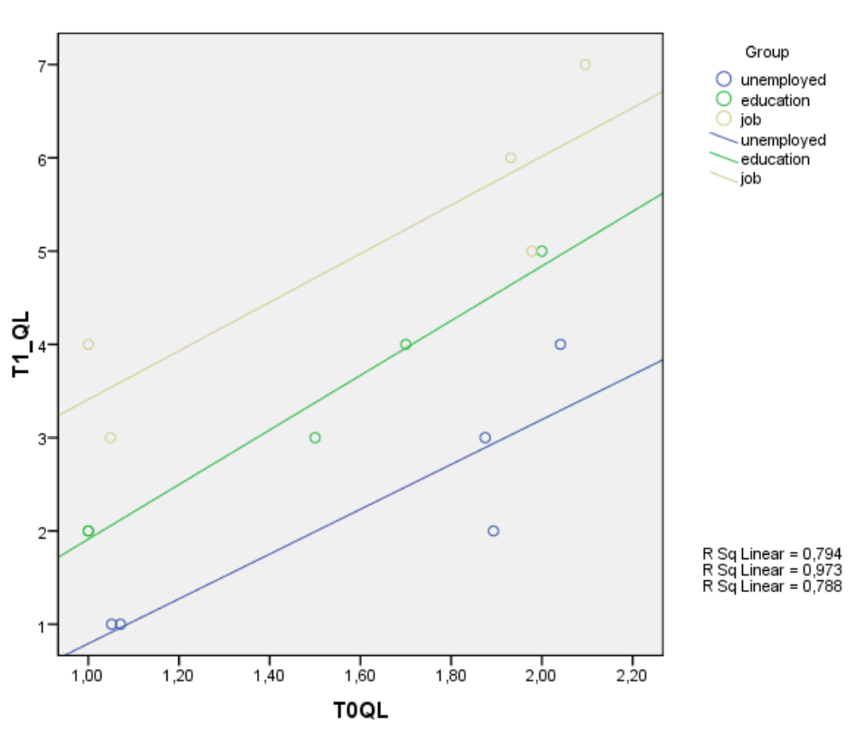
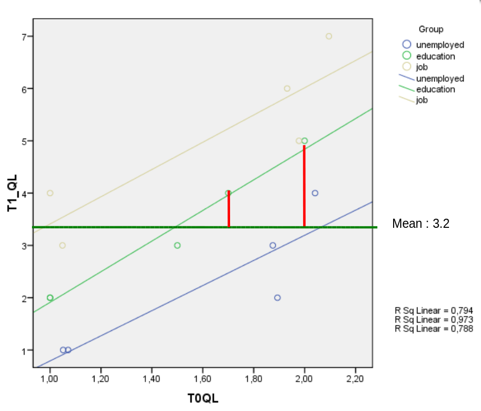
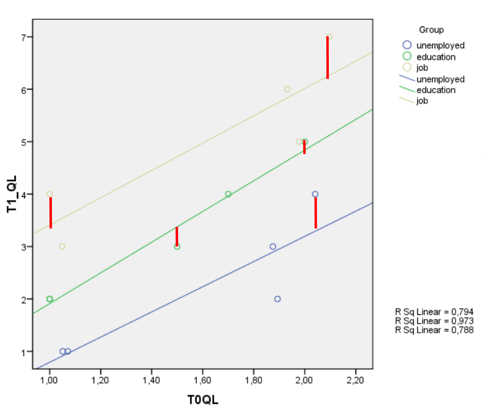
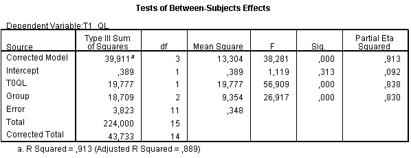
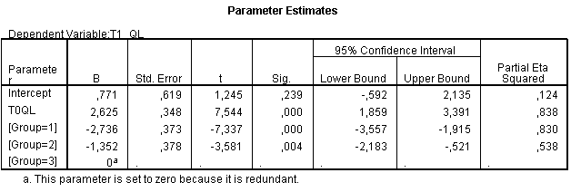
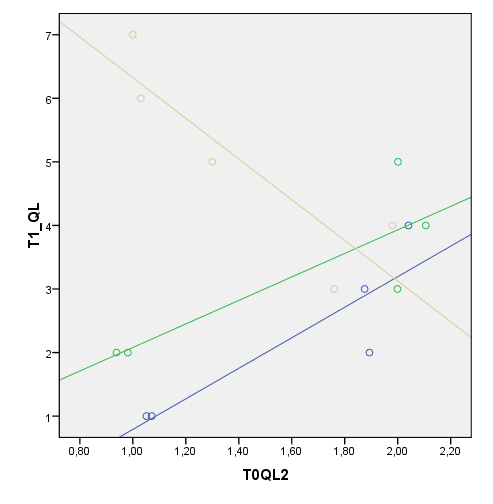

```{r echo=FALSE, message=FALSE}
library(knitr)
library(tidyverse)
library(eulerr)

source("styles/style_functions.R")
```

class: bkg-logo

# Outline

* ANOVA versus ANCOVA 
* Example ANCOVA, reporting results
* Assumptions in ANOVA and ANCOVA

<!-- - - - - - - - - - - - - - - - - - - - - - - - - - - - - - - - - - - (3) -->
---
class: bkg-logo

# ANCOVA: When And Why
--

* To test for differences between group means when we know that **another variables** affect the outcome variable. 

* *Example*: 
  * test the difference between the three groups in the QL scores at **T1** , 
  * when controlling for pre-existing Quality of life (**T0**).

`r vspace(10)`

* Advantage of ANCOVA
  * reducing error variance by removing another source of systematic variance (i.e., the covariate) from the dependent variable  
  * that is, increasing the power of the tests of the between-group effect


<!-- - - - - - - - - - - - - - - - - - - - - - - - - - - - - - - - - - - (4) -->
---
class: small
# Reducing Error Variance in ANCOVA


**ANOVA**

```{r echo=FALSE}
ven = euler(c(x=100, y=100, "x&y" = 30),
            input = "union", shape ="ellipse",
            control = list(extraopt = FALSE))
```

.pull-left[
```{r echo=FALSE, fig.width=3, fig.height=3, out.width = '85%'}
plot(ven,
     lty = c(1,2),
     quantities = c("residual","","model"),
     fills = list(fill=c("#fcaf3e", "#EAEAEA", "#729fcf")),
     labels = c("T1-QL", "Groups"))

```
]

.pull-right[
$$F = \frac{MS_\text{model}}{MS_\text{residual}}$$
`r vspace(29)`

The smaller $MS_\text{residual}$, the larger $F$

the more likely the group differences are significant
]


<!-- - - - - - - - - - - - - - - - - - - - - - - - - - - - - - - - - - - (5) -->
---
class: small
# Reducing Error Variance in ANCOVA

**With co-variate (ANCOVA)**

.pull-left[
```{r echo=FALSE, fig.width=3, fig.height=3, out.width = '95%'}
ven = euler(c(x=100, y=100, z=100, "x&y" = 26, "x&z"=30),
            input = "union", shape ="ellipse",
            control = list(extraopt = FALSE))
plot(ven,
     lty = c(1,2),
     quantities = c("residual", "", "", "model", ""),
     fills = list(fill=c("#fcaf3e", "#EAEAEA", "#4e9a06", "#729fcf", "#fcaf3e")),
     labels = c("T1-QL", "Groups", "TO-QL"))
```
]


<!-- - - - - - - - - - - - - - - - - - - - - - - - - - - - - - - - - - - (6) -->
---
class: small
# Reducing Error Variance in ANCOVA

**With co-variate (ANCOVA)**

.pull-left[
```{r echo=FALSE, fig.width=3, fig.height=3, out.width = '95%'}
ven = euler(c(x=100, y=100, z=100, "x&y" = 26, "x&z"=30),
            input = "union", shape ="ellipse",
            control = list(extraopt = FALSE))
plot(ven,
     lty = c(1,2),
     quantities = c("residual", "", "", "model", ""),
     fills = list(fill=c("#fcaf3e", "#EAEAEA", "#4e9a06", "#729fcf", "#fcf4e9")),
     labels = c("T1-QL", "Groups", "TO-QL"))
```
]

--

.pull-right[
$$F = \frac{MS_\text{model}}{MS_\text{residual}}$$

`r vspace(29)`

$SS_\text{residual}$ is **smaller**, because variance of $T1_{QL}$ within the groups is partly explained by $T0_{QL}$. 

$F$ for the group differences is thus **larger**.
]


<!-- - - - - - - - - - - - - - - - - - - - - - - - - - - - - - - - - - - (7) -->
---
class: small
layout: true

# Error Terms: Illustration

.right-column[
* Errors or residuals were computed in the ANOVA as the difference between a person's score and the group mean on $T1_{QL}$
*  Errors or residuals in ANCOVA are computed as the difference between a person's score and the group's regression line with $T0_{QL}$ as a predictor of $T1_{QL}$. 
* When $T0_{QL}$ and $T1_{QL}$ are correlated, the ANCOVA residuals are smaller
]


<!-- - - - - - - - - - - - - - - - - - - - - - - - - - - - - - - - - - - (8) -->
---
.left-column[
Data

```{r, echo=FALSE, fig.align="center", out.width = '80%'}

```
]

<!-- - - - - - - - - - - - - - - - - - - - - - - - - - - - - - - - - - - (9) -->
---
.left-column[
**ANOVA**
 

```{r, echo=FALSE, fig.align="center", out.width = '80%'}

```
]

<!-- - - - - - - - - - - - - - - - - - - - - - - - - - - - - - - - - - - (10) -->
---
.left-column[
**ANCOVA**: $T0_{QL}$ as co-variate

```{r, echo=FALSE, fig.align="center", out.width = '80%'}

```
]


<!-- - - - - - - - - - - - - - - - - - - - - - - - - - - - - - - - - - - (11) -->
---
layout: false
# Error terms: The math

Example: One-factorial ANOVA and ANCOVA with one covariate

`r vspace(20)`

$$\begin{align}
\text{ANOVA:} \quad y_i  =  b_0 & + b_1 \,\text{dummy}_{1i} + b_2 \, \text{dummy}_{2i} + \epsilon_i \\[3ex]
\text{ANCOVA:} \quad y_i  =  b_0 & + b_2\,\text{dummy}_{1i} + b_3 \, \text{dummy}_{2i} + \underline{b_1 \, \text{covariate}_{1i}} + \epsilon_i\\[3ex]
\end{align}$$

--
`r vspace(20)`

* If $b_1\neq 0$: $\text{VAR}(\epsilon_\text{ANOVA}) > \text{VAR}(\epsilon_\text{ANCOVA})$ 
* If the covariate explains additional variance, then the error variance of ANCOVA is smaller


<!-- - - - - - - - - - - - - - - - - - - - - - - - - - - - - - - - - - - (12) -->
---
# Error Variance Reduction in ANCOVA

Including a covariate results in error reduction only if:

1. the covariate is correlated with the outcome
2. this correlation is approximately equal for all groups
3. the covariate is measured with a reliable instrument


<!-- - - - - - - - - - - - - - - - - - - - - - - - - - - - - - - - - - - (13) -->
---
class: small
# ANCOA: Specifing Hypthoses

### Example: Quality of life


$$T1_{QL}  =  b_0  + \overbrace{b_1 \, T0_{QL}}^\text{covariate} + b_2\,\text{dummy}_{1i} + b_3 \, \text{dummy}_{2i}  + \epsilon_i$$

**General hypothesis**

* $H_0(\text{model}): \quad \beta_1 = \beta_2 =\beta_3 = 0 \quad \text{or} \quad  R^2=0$

**Specific hypotheses**

* $H_0(\text{groups}): \quad \beta_2 + \beta_3 = 0$
* $H_0(T0_{QL}): \quad \beta_1 = 0$

--
`r vspace(10)`

Note: The types of specific hypotheses define which dummy-coding is used; but the resulting $F$-value for group does not depend on which group is chosen as the reference group.


<!-- - - - - - - - - - - - - - - - - - - - - - - - - - - - - - - - - - - (14) -->
---
# SPSS Output

```{r, echo=FALSE, fig.align="center", out.width = '95%'}

```

<!-- - - - - - - - - - - - - - - - - - - - - - - - - - - - - - - - - - - (15) -->
---
# General Conclusion, Reporting Results

The treatment ("Group") and QL at $T0$ together explain 91% of the variance in QL at $T1$ $(R^2 = .91, F(3,11) = 38.28, p < .001)$.

The covariate, QL at T0 , was significantly related to QL at T1 on average over all groups, $F(1,11) = 56.91, p < .001, \text{partial } \eta^2 = .84$.

Groups have significantly different mean $T1_{QL}$ scores after controlling for $T0_{QL}$, $F(2,11) = 26.92, p < .001, \text{partial } \eta^2 = .83$.

--
`r vspace(10)`

*Remember*: The ANOVA main effect of group was $F=5.12$.


<!-- - - - - - - - - - - - - - - - - - - - - - - - - - - - - - - - - - - (16) -->
---
class: center, middle, inverse

# What else do we need to know?

Specific Hypotheses

<!-- - - - - - - - - - - - - - - - - - - - - - - - - - - - - - - - - - - (17) -->
---
# SPSS Output: Specific Conclusions

.align-right[.scriptsize[
Groups: 1 = unemployed, 2 = education,  3 = job
]]

```{r, echo=FALSE, fig.align="center", out.width = '95%'}

```


$$T1_{QL} = 0.77 + 2.63 \, T0_{QL} -2.74 \, \text{dummy}_1 -1.35 \, \text{dummy}_2$$


<!-- - - - - - - - - - - - - - - - - - - - - - - - - - - - - - - - - - - (18) -->
---
class: small
# Reporting Results of the $t$-tests 

After controlling for prior quality of life $(T0_{QL})$, the unemployed control group had a significantly lower level of QL after two months $(T1_{QL})$ than the group with a job $(b = -2.74, t(11) = -7.34, p < .001, \text{partial }\eta^2 = .83)$. 
	
Furthermore, the group in the educational program had a significantly lower level of QL after two months $(T1_{QL})$ than the group with a job $(b = -1.35 , t(11) = -3.58, p < .001, \text{partial }\eta^2 = .54)$. 

--
`r vspace(10)`

Do we know whether the difference between the "education" group and the "unemployed control group" is significant?

$\rightarrow$ For specific hypothesis compute contrast test (extra table in SPSS)	


<!-- - - - - - - - - - - - - - - - - - - - - - - - - - - - - - - - - - - (19) -->
---
class: center, middle, inverse

# Effect Sizes in multivarate ANOVA/ANCOVA

differences between $\eta^2$ and $\text{partial }\eta^2$


<!-- - - - - - - - - - - - - - - - - - - - - - - - - - - - - - - - - - - (20) -->
---
layout: true
# Effect Sizes in AN(C)OVA

```{r echo=FALSE, warning=FALSE}
ven = euler(c(x=100, y=100, z=100, "x&y" = 45, "x&z"=45, "y&z"= 45, "x&y&z"=25),
            input = "union", shape ="circle",
            control = list(extraopt = FALSE))
```


`r posbox(600, 50, 740)`
.small[
*Calculate per independent variable*
]
`r end_posbox()`

.pull-left[
$\eta^2_{X1} = {\text{SS}_{X1} \over \text{SS}_\text{total}}$
]

.pull-right-clear[
$\text{partial }\eta^2_{X1} = {\text{SS}_{X1} \over \text{SS}_{X1} + \text{SS}_\text{error}}$
]

<!-- - - - - - - - - - - - - - - - - - - - - - - - - - - - - - - - - - - (21) -->
---

`r vspace(60)`
Two parameter to calculate effect sizes in multivarate ANOVA designs


<!-- - - - - - - - - - - - - - - - - - - - - - - - - - - - - - - - - - - (22) -->
---
.pull-left[
```{r echo=FALSE, fig.width=3, fig.height=3, out.width = '70%'}
plot(ven,
     lty = c(1,2),
     quantities = c("factor", "covariate", "", "", "", "", ""),
     fills = list(fill=c("#aabbd9", "#F0F0F0", "#fcaf3e")),
     labels = c("X1", "X2", "DV"))
```
]

`r vspace(10)`
.tiny[
$X1$ and $X2$ can be any variable (categorical factor or covariate)
]

<!-- - - - - - - - - - - - - - - - - - - - - - - - - - - - - - - - - - - (23) -->
---
.pull-left[
```{r echo=FALSE, fig.width=3, fig.height=3, out.width = '70%'}
plot(ven,
     lty = c(1,2),
     quantities = c("", "", "SS total", "", "", "", ""),
     fills = list(fill=c("#aabbd9", "#F0F0F0", "#fcaf3e",
                         "#aabbd9", "#fcaf3e", "#fcaf3e",
                         "#fcaf3e")),
     labels = c("X1", "X2", "DV"))
```
]

<!-- - - - - - - - - - - - - - - - - - - - - - - - - - - - - - - - - - - (24) -->
---
.pull-left[
```{r echo=FALSE, fig.width=3, fig.height=3, out.width = '70%'}
plot(ven,
     lty = c(1,2),
     quantities = c("", "", "", "", "SS X1", "", ""),
     fills = list(fill=c("#aabbd9", "#F0F0F0", "#fcaf3e",
                         "#aabbd9", "#2ddac5",
                         "#fcaf3e", "#fcaf3e")),
     labels = c("X1", "X2", "DV"))
```
]


<!-- - - - - - - - - - - - - - - - - - - - - - - - - - - - - - - - - - - (25) -->
---
layout: true
# Effect Sizes in AN(C)OVA

`r posbox(600, 50, 740)`
.small[
*Calculate per independent variable*
]
`r end_posbox()`


.pull-left[
$\eta^2_{X1} = {\text{SS}_{X1} \over \text{SS}_\text{total}}$

```{r echo=FALSE, fig.width=3, fig.height=3, out.width = '70%'}
plot(ven,
     lty = c(1,2),
     quantities = c("", "", "", "", "", "", ""),
     fills = list(fill=c("#aabbd9", "#F0F0F0", "#fcaf3e",
                         "#aabbd9", "#2ddac5",
                         "#fcaf3e", "#fcaf3e")),
     labels = c("X1", "X2", "DV"))
```
]


<!-- - - - - - - - - - - - - - - - - - - - - - - - - - - - - - - - - - - (26) -->
---

.pull-right-clear[
$\text{partial }\eta^2_{X1} = {\text{SS}_{X1} \over \text{SS}_{X1} + \text{SS}_\text{error}}$

```{r echo=FALSE, fig.width=3, fig.height=3, out.width = '70%'}
plot(ven,
     lty = c(1,2),
     quantities = c("factor", "covariate", "", "", "", "", ""),
     fills = list(fill=c("#aabbd9", "#F0F0F0", "#fcaf3e")),
     labels = c("X1", "X2", "DV"))
```
]

<!-- - - - - - - - - - - - - - - - - - - - - - - - - - - - - - - - - - - (27) -->
---

.pull-right-clear[
$\text{partial }\eta^2_{X1} = {\text{SS}_{X1} \over \text{SS}_{X1} + \text{SS}_\text{error}}$

```{r echo=FALSE, fig.width=3, fig.height=3, out.width = '70%'}
plot(ven,
     lty = c(1,2),
     quantities = c("", "", "SS total", "", "", "", ""),
     fills = list(fill=c("#aabbd9", "#F0F0F0", "#fcaf3e",
                         "#aabbd9", "#fcaf3e", "#fcaf3e",
                         "#fcaf3e")),
     labels = c("X1", "X2", "DV"))
```
]


<!-- - - - - - - - - - - - - - - - - - - - - - - - - - - - - - - - - - - (28) -->
---

.pull-right-clear[
$\text{partial }\eta^2_{X1} = {\text{SS}_{X1} \over \text{SS}_{X1} + \text{SS}_\text{error}}$

```{r echo=FALSE, fig.width=3, fig.height=3, out.width = '70%'}
plot(ven,
     lty = c(1,2),
     quantities = c("", "", "SS error", "", "", "", ""),
     fills = list(fill=c("#aabbd9", "#F0F0F0", "#fcaf3e",
                         "#aabbd9", "#aabbd9", "#F0F0F0",
                         "#aabbd9")),
     labels = c("X1", "X2", "DV"))
```
]


<!-- - - - - - - - - - - - - - - - - - - - - - - - - - - - - - - - - - - (29) -->
---

.pull-right-clear[
$\text{partial }\eta^2_{X1} = {\text{SS}_{X1} \over \text{SS}_{X1} + \text{SS}_\text{error}}$

```{r echo=FALSE, fig.width=3, fig.height=3, out.width = '70%'}
plot(ven,
     lty = c(1,2),
     quantities = c("", "", "SS error", "", "SS X1", "", ""),
     fills = list(fill=c("#aabbd9", "#F0F0F0", "#fcaf3e",
                         "#aabbd9", "#fcaf3e", "#F0F0F0",
                         "#aabbd9")),
     labels = c("X1", "X2", "DV"))
```
]

<!-- - - - - - - - - - - - - - - - - - - - - - - - - - - - - - - - - - - (30) -->
---

.pull-right-clear[
$\text{partial }\eta^2_{X1} = {\text{SS}_{X1} \over \text{SS}_{X1} + \text{SS}_\text{error}}$

```{r echo=FALSE, fig.width=3, fig.height=3, out.width = '70%'}
plot(ven,
     lty = c(1,2),
     quantities = c("", "", "SS error", "", "SS X1", "", ""),
     fills = list(fill=c("#aabbd9", "#F0F0F0", "#fcaf3e",
                         "#aabbd9", "#2ddac5", "#F0F0F0",
                         "#aabbd9")),
     labels = c("X1", "X2", "DV"))
```
]


<!-- - - - - - - - - - - - - - - - - - - - - - - - - - - - - - - - - - - (31) -->
---
layout: false
class: center, middle, inverse

# Assumptions ANOVA / ANCOVA 

<!-- - - - - - - - - - - - - - - - - - - - - - - - - - - - - - - - - - - (32) -->
---
class: small
# Assumptions ANOVA 

1. .emph2[Independence] of observations
2. .emph2[Normality]: normally distributed errors (within each group)
3. .emph2[Homoscedasticity]: homogeneity of (error) variance 
  * equal group variances

--
`r vspace(20)`

## Outlier

As in regression analysis, check for outliers/influential cases. e.g.:
  * check the histogram of residuals for outliers
  * casewise diagnostics, Cook’s distances


<!-- - - - - - - - - - - - - - - - - - - - - - - - - - - - - - - - - - - (33) -->
---
# Steps: ANOVA

1. Measurement level of the variables
1. Check for outliers
1. Check assumptions
  * Normality (in each group!)
  * Homoscedasticity 
1. Check quality of prediction


<!-- - - - - - - - - - - - - - - - - - - - - - - - - - - - - - - - - - - (34) -->
---
class: small
# Assumptions ANCOVA

--

1. .emph2[Independence] of observations
2. .emph2[Normality]: normally distributed errors (within each group)
3. .emph2[Homoscedasticity]: homogeneity of (error) variance 
  * equal group variances `r vspace(30)`
--
4. .emph2[Reliability] of *covariates*
5. .emph2[Linearity]: linear relation between outcome and each *covariate*
6. .emph2[Homogeneity of regression slopes] between outcome and each *covariate*
7. .emph2[Independence of treatment and covariate]
  * all treatment groups have equal means on each *covariate*
8. .emph2[Multicollinearity] of *covariates*
  * only if multiple covariates exist
  * covarites should not correlate (see multiple regression) 

<!-- - - - - - - - - - - - - - - - - - - - - - - - - - - - - - - - - - - (35) -->
---
# Steps: ANCOVA

1. Measurement level of the variables
1. Check for outliers
1. Check assumptions
  * Normality (in each group!)
  * Homoscedasticity 
  * Linearity
  * Homogeneity of regression slopes
  * Independence of treatment and covariate
  * (maybe) Multicollinearity
1. Check quality of prediction


<!-- - - - - - - - - - - - - - - - - - - - - - - - - - - - - - - - - - - (36) -->
---
# Homogeneity of Regression Slopes

.center[
```{r, echo=FALSE, fig.align="center", out.width = '40%'}

```
]

Remember our example:
$$T1_{QL} = 0.77 + \underline{2.63 \, T0_{QL}} -2.74 \, \text{dummy}_1 -1.35 \, \text{dummy}_2$$


<!-- - - - - - - - - - - - - - - - - - - - - - - - - - - - - - - - - - - (37) -->
---
class: small
# Homogeneity of Regression Slopes

.pull-left[
```{r, echo=FALSE, fig.align="center", out.width = '100%'}

```
]

--

.pull-right[
For one group $T0_{QL}$ and $T1_{QL}$ are slightly negatively related, whereas in the other groups the relation is positive 

.emph[Problem]
 * ANCOVA estimates an average slope over the three groups. 
 * Estimated slope is not representation for any group

Solution: **multilevel linear model**

.tiny[.grey[Alternatively, you may report separate regression equations for the different groups or moderation analysis. However, these analyses does not address you actual hypothesis.]]
]

<!-- - - - - - - - - - - - - - - - - - - - - - - - - - - - - - - - - - - (38) -->
---
# Independence of Treatment and Covariate

--

All treatment groups should have approx. equal means on each covariate

.pull-left[
Independent 

```{r echo=FALSE, fig.align="center",  fig.width=3, fig.height=3, out.width = '80%'}
ven = euler(c(x=100, y=100, z=100, "x&y" = 26, "x&z"=30),
            input = "union", shape ="ellipse",
            control = list(extraopt = FALSE))
plot(ven,
     lty = c(1,2),
     quantities = c("", "", "", "", ""),
     fills = list(fill=c("#fcaf3e", "#EAEAEA", "#4e9a06", "#729fcf", "#fcf4e9")),
     labels = c("DV", "Treat.", "Covar."))

```
]

.pull-right[
Dependent 

```{r echo=FALSE, warning=FALSE, fig.align="center", fig.width=3, fig.height=3, out.width = '70%'}
ven = euler(c(x=100, y=100, z=100, "x&y" = 20, "x&z"=30, "y&z"=20, "x&y&z"=10),
            input = "union", shape ="circle",
            control = list(extraopt = FALSE))
plot(ven,
     lty = c(1,2),
     quantities = c("", "", "", "", ""),
     fills = list(fill=c("#fcaf3e", "#EAEAEA", "#4e9a06", "#729fcf", "#fcf4e9")),
     labels = c("DV", "Treat.", "Covar."))
```
]


<!-- - - - - - - - - - - - - - - - - - - - - - - - - - - - - - - - - - - (39) -->
---
layout: false
class: final-slide

# Thank you very much 

Oliver Lindemann

