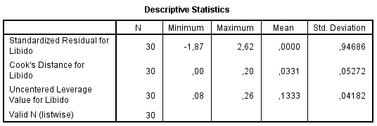
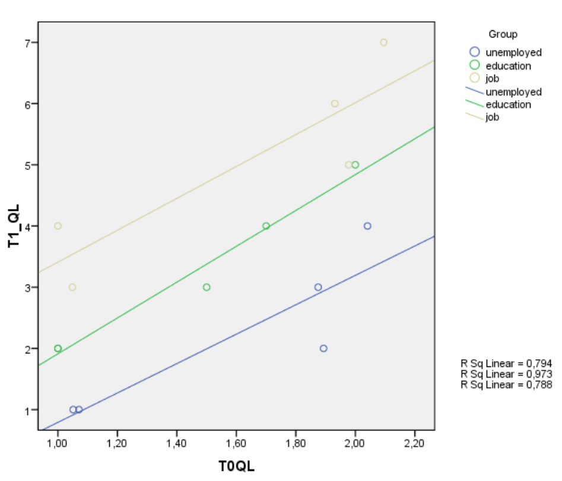
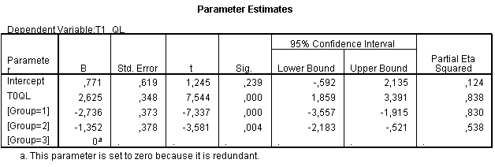
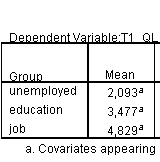

```{r echo=FALSE, message=FALSE}
library(knitr)
library(tidyverse)

source("styles/style_functions.R")
```

# Overview

* Example Steps of an ANCOVA
* Interpreting the Results
* Adjusted Means

<!-- - - - - - - - - - - - - - - - - - - - - - - - - - - - - - - - - - - (3) -->
---
class: bkg-logo
# Steps: ANCOVA

1. Measurement level of the variables
1. Check for outliers
1. Check Assumptions
  * Normality (in each group!)
  * Homoscedasticity 
  * Linearity
  * Homogeneity of regression slopes
  * Independence of treatment and covariate
  * (maybe) Multicollinearity
1. Check quality of prediction


<!-- - - - - - - - - - - - - - - - - - - - - - - - - - - - - - - - - - - (4) -->
---
# Steps: ANCOVA

1. Measurement level of the variables
1. .emph3[Check for outliers]
1. Check assumptions
  * Normality (in each group!)
  * Homoscedasticity 
  * Linearity
  * Homogeneity of regression slopes
  * Independence of treatment and covariate
  * (maybe) Multicollinearity
1. Check quality of prediction

<!-- - - - - - - - - - - - - - - - - - - - - - - - - - - - - - - - - - - (5) -->
---
# Check for Outliers

```{r, echo=FALSE, fig.align="center", out.width = '70%'}

```


<!-- - - - - - - - - - - - - - - - - - - - - - - - - - - - - - - - - - - (6) -->
---
class: small
# Check for Outliers

```{r, echo=FALSE, fig.align="center", out.width = '70%'}

```

Critical Leverage

$$\frac{2 \, (k+1)}{n} = \frac{2 \times 3}{30} = 0.20$$

$$\frac{3 \, (k+1)}{n} = \frac{2 \times 3}{30} = 0.30$$


<!-- - - - - - - - - - - - - - - - - - - - - - - - - - - - - - - - - - - (7) -->
---
# Steps: ANCOVA

1. Measurement level of the variables
1. Check for outliers
1. .emph3[Check assumptions]
  * .emph3[Normality (in each group!)]
  * Homoscedasticity 
  * Linearity
  * Homogeneity of regression slopes
  * Independence of treatment and covariate
  * (maybe) Multicollinearity
1. Check quality of prediction

<!-- - - - - - - - - - - - - - - - - - - - - - - - - - - - - - - - - - - (8) -->
---
class: small

# Normally distributed errors

If group variances are equal, we may check this assumptions overall (not per group).

In SPSS: save standardized residuals and make histogram (look also for outliers)

--
<hr>

.pull-left[
```{r, echo=FALSE, fig.align="center", out.width = '100%'}

```
]


.pull-right[
### Example

Not smooth because of small $N (=15)$, but no outliers, nor severe skewness

If group sizes are not too different and $N$ is not too small $(df_\text{residual} > 20)$, we can trust the $F$-test even if this assumption is violated 

But: always think about theoretical implications of severe volations
]


<!-- - - - - - - - - - - - - - - - - - - - - - - - - - - - - - - - - - - (9) -->
---
# Steps: ANCOVA

1. Measurement level of the variables
1. Check for outliers
1. .emph3[Check assumptions]
  * Normality (in each group!)
  * .emph3[Homoscedasticity]
  * Linearity
  * Homogeneity of regression slopes
  * Independence of treatment and covariate
  * (maybe) Multicollinearity
1. Check quality of prediction


<!-- - - - - - - - - - - - - - - - - - - - - - - - - - - - - - - - - - - (10) -->
---
class: small
# Homoscedasticity: Homogeneity of variances for ANCOVA

### Levene's Test

```{r, echo=FALSE, fig.align="center", out.width = '70%'}

```

* If $p >.05$ $\rightarrow$ no indication for unequal group variances
*  $F$-test is robust against a violation of the homoscedasticity assumption, if group sizes are equal and we have normally distributed errors in the groups:

* But, if group sizes are strongly unequal and the variances are unequal, AN(C)OVA $F$-test is biased
  * Largest variance in largest group $\rightarrow$  conservative test
  * Largest variance smallest group $\rightarrow$  liberal test

<!-- - - - - - - - - - - - - - - - - - - - - - - - - - - - - - - - - - - (11) -->
---
# Steps: ANCOVA

1. Measurement level of the variables
1. Check for outliers
1. .emph3[Check assumptions]
  * Normality (in each group!)
  * Homoscedasticity 
  * .emph3[Linearity]
  * Homogeneity of regression slopes
  * Independence of treatment and covariate
  * (maybe) Multicollinearity
1. Check quality of prediction


<!-- - - - - - - - - - - - - - - - - - - - - - - - - - - - - - - - - - - (12) -->
---
# Linearity

* Linear relation between outcome and covariate(s)
* Check this with the scatterplot of $T0_{QL}$ vs $T1_{QL}$, with different markers for the groups

```{r, echo=FALSE, fig.align="center", out.width = '40%'}

```


<!-- - - - - - - - - - - - - - - - - - - - - - - - - - - - - - - - - - - (13) -->
---
# Steps: ANCOVA

1. Measurement level of the variables
1. Check for outliers
1. .emph3[Check assumptions]
  * Normality (in each group!)
  * Homoscedasticity 
  * Linearity
  * .emph3[Homogeneity of regression slopes]
  * Independence of treatment and covariate
  * (maybe) Multicollinearity
1. Check quality of prediction

<!-- - - - - - - - - - - - - - - - - - - - - - - - - - - - - - - - - - - (14) -->
---
class: small
# Homogeneity of Regression Slopes

1. See parallel regression lines in previous scatterplot of $T0_{QL}$  vs $T1_{QL}$
2. We can test for violations of this assumption by 
  * repeating the **ANCOVA** and 
  * **including the interaction-effect** for $covariate \times group$. 

--
<hr>

```{r, echo=FALSE, fig.align="center", out.width = '70%'}

```

Here: not significant and small ES: OK


<!-- - - - - - - - - - - - - - - - - - - - - - - - - - - - - - - - - - - (15) -->
---
# Steps: ANCOVA

1. Measurement level of the variables
1. Check for outliers
1. .emph3[Check assumptions]
  * Normality (in each group!)
  * Homoscedasticity 
  * Linearity
  * Homogeneity of regression slopes
  * .emph3[Independence of treatment and covariate]
  * (maybe) Multicollinearity
1. Check quality of prediction


<!-- - - - - - - - - - - - - - - - - - - - - - - - - - - - - - - - - - - (16) -->
---
# Independence of Treatment and Covariate

All treatment groups have approximate equal means on each covariate

`r vspace(20)`

**Test via simple ANOVA**
* one-way ANOVA with treatment groups as factor and the covariate as dependent variable 
* if effect is **not** significant $\rightarrow$ not indication for mean differences


<!-- - - - - - - - - - - - - - - - - - - - - - - - - - - - - - - - - - - (17) -->
---
# Steps: ANCOVA

1. Measurement level of the variables
1. Check for outliers
1. .emph3[Check assumptions]
  * Normality (in each group!)
  * Homoscedasticity 
  * Linearity
  * Homogeneity of regression slopes
  * Independence of treatment and covariate
  * (maybe) .emph3[Multicollinearity]
1. Check quality of prediction

<!-- - - - - - - - - - - - - - - - - - - - - - - - - - - - - - - - - - - (18) -->
---
class: inverse, middle, center

# ANCOVA
# Interpreting the Results

<!-- - - - - - - - - - - - - - - - - - - - - - - - - - - - - - - - - - - (19) -->
---
# SPSS Results 1

```{r, echo=FALSE, fig.align="center", out.width = '85%'}
knitr::include_graphics("incl/spss_ancova.png")
```

<!-- - - - - - - - - - - - - - - - - - - - - - - - - - - - - - - - - - - (20) -->
---
# SPSS Results 2

```{r, echo=FALSE, fig.align="center", out.width = '85%'}

```


`r vspace(30)`

$$DV  =  b_0  +  b_1 \, \text{covariate} + b_2\,\text{dummy}_{1} + b_3 \, \text{dummy}_{2}$$

--

$$T1_{QL} = 0.77 + 2.63 \, T0_{QL} -2.74 \, \text{dummy}_1 -1.35 \, \text{dummy}_2$$


<!-- - - - - - - - - - - - - - - - - - - - - - - - - - - - - - - - - - - (21) -->
---
class: small
layout: true
# Interpreting the Regression Equation

$T1_{QL} = 0.77 + 2.63 \, T0_{QL} -2.74 \, \text{dummy}_1 -1.35 \, \text{dummy}_2$ 


<!-- - - - - - - - - - - - - - - - - - - - - - - - - - - - - - - - - - - (22) -->
---
.left-column[ 
```{r, echo=FALSE, fig.align="center", out.width = '80%'}

```
]
.right-column[ 
.emph[Group: job]
* reference group
* $\text{dummy}_1 = 0$ 
* $\text{dummy}_2 = 0$ 

$T1_{QL} = 0.77 + 2.63 \, T0_{QL}$ 

`r vspace(20)`
$b_1 = 2.63$: slope of reference group
]

<!-- - - - - - - - - - - - - - - - - - - - - - - - - - - - - - - - - - - (23) -->
---
.left-column[ 
```{r, echo=FALSE, fig.align="center", out.width = '80%'}

```
]
.right-column[ 
.emph[Group: unemployed]
* $\text{dummy}_1 = 1$ 
* $\text{dummy}_2 = 0$ 

$T1_{QL} = 0.77 + 2.63 \, T0_{QL} -2.74$ 

]


<!-- - - - - - - - - - - - - - - - - - - - - - - - - - - - - - - - - - - (24) -->
---
.left-column[ 
```{r, echo=FALSE, fig.align="center", out.width = '80%'}

```
]
.right-column[ 
.emph[Group: unemployed]
* $\text{dummy}_1 = 1$ 
* $\text{dummy}_2 = 0$ 

$T1_{QL} = 0.77 + 2.63 \, T0_{QL} -2.74$ 
`r vspace(20)`
$b_2 = -2.74$: 
  * $T1_{QL}$ is lower
]

<!-- - - - - - - - - - - - - - - - - - - - - - - - - - - - - - - - - - - (25) -->
---

.left-column[ 
```{r, echo=FALSE, fig.align="center", out.width = '80%'}
knitr::include_graphics("incl/ancova_equation5.png")
```
]
.right-column[ 
.emph[Group: education]
* $\text{dummy}_1 = 0$ 
* $\text{dummy}_2 = 1$ 

$T1_{QL} = 0.77 + 2.63 \, T0_{QL} -1.35$ 
`r vspace(20)`

$b_3 = -1.35$: 
  * $T1_{QL}$ is lower
]

<!-- - - - - - - - - - - - - - - - - - - - - - - - - - - - - - - - - - - (26) -->
---
layout: false
# Interpreting Main Effects 

$H_0: \quad \mu_1^\text{adj} = \mu_2^\text{adj} = \mu_3^\text{adj}$

--
`r vspace(20)`

$F$-test with $p<.05$:

"Is there a difference in the mean quality of life $(T1_{QL})$ between young adults who are (1) unemployed (2) participating in an education program and (3) in a job $\ldots$ 

$\ldots$ .emph3[after] controlling for quality of life at $T0$."


<!-- - - - - - - - - - - - - - - - - - - - - - - - - - - - - - - - - - - (27) -->
---
layout: false
# Adjusted Means

The $b$-values represent the mean difference of the group in the dependent variable .emph3[adjusted for the covariate(s)].  


SPSS depicts this adjusted means in the table "*Estimated Marginal Means*".

```{r, echo=FALSE, fig.align="center", out.width = '20%'}

```

<!-- - - - - - - - - - - - - - - - - - - - - - - - - - - - - - - - - - - (28) -->
---
class: small, bkg-logo
# Compute Adjusted Means

To calculate the adjusted mean, include the mean of the covariate $(T0_{QL} = 1.54)$ in the regression equation:

$$T1_{QL} = 0.77 + 2.63 \, T0_{QL} -2.74 \, \text{dummy}_1 -1.35 \, \text{dummy}_2$$

--
`r vspace(10)`

$$\begin{align}
\text{Job }T1_{QL}  &=  0.77 + 2.63 \times 1.543 -2.74 \times 0 -1.35 \times 0\\
              &= 0.77 + 2.63 \times 1.54  \\
              & = \underline{4.83} \\[3ex]
\text{Unempl. }T1_{QL}  &=  0.77 + 2.63 \times 1.543 -2.74 \times 1 -1.35 \times 0 = \underline{2.09} \\[3ex]
\text{Edu. }T1_{QL}  &=  0.77 + 2.63 \times 1.543 -2.74 \times 0 -1.35 \times 1 = \underline{3.48} 
\end{align}$$


<!-- - - - - - - - - - - - - - - - - - - - - - - - - - - - - - - - - - - (29) -->
---
layout: false
class: final-slide

# Thank you very much 

Oliver Lindemann

