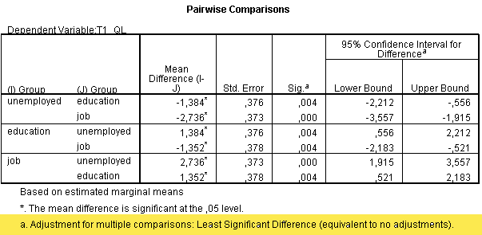
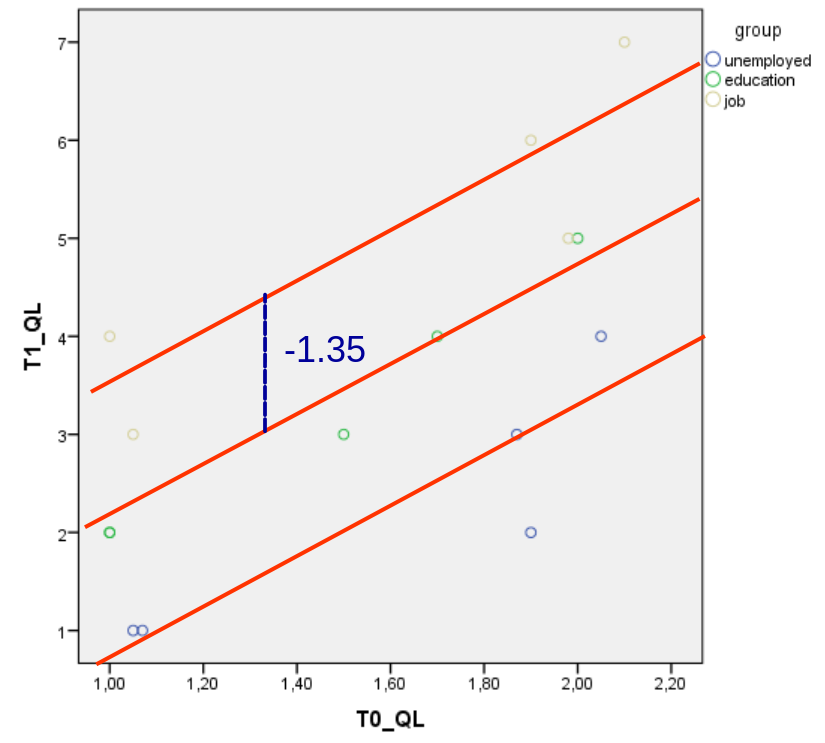
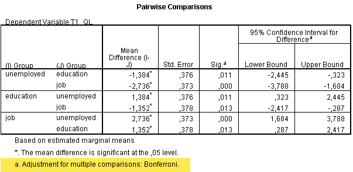
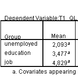
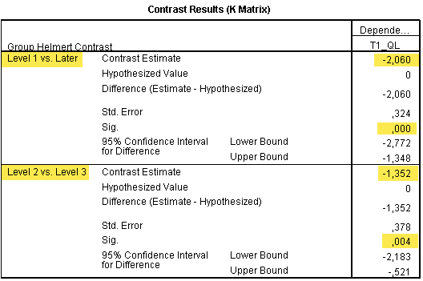

```{r echo=FALSE, message=FALSE}
library(knitr)
library(tidyverse)
source("styles/style_functions.R")
```


class: small, bkg-logo

# Follow-up tests: Which group differ from each other?

* Main Effect: $\quad H_0: \quad \mu_1= \mu_2 = \mu_3$

* Analysing the pattern of the effect 


.pull-left[
### Post-hoc tests
* all pairwise comparisons
* $t$-tests

$$\begin{align}
H_0:\quad & \mu_1 = \mu_2\\
H_0:\quad &\mu_1 = \mu_3 \\
H_0:\quad &\mu_2 = \mu_3 
\end{align}$$

]
.pull-right[
### Contrast tests
* specific hypotheses
* $t$-tests (-like)

$$\begin{align}
H_0:\quad & \mu_1 = \frac{\mu_2+\mu_3}{2}\\
H_0:\quad &\mu_2 = \mu_3
\end{align}$$

.align-right[
*(example)]*
]

<!-- - - - - - - - - - - - - - - - - - - - - - - - - - - - - - - - - - - (3) -->
---
# Post Hoc Tests: Multiple Comparisons

If you have no specific hypotheses, you can simply do .emph2[multiple pairwise comparisons]. The number of comparisons per factor:
$$k = \frac{N_\text{tests} \times (N_\text{tests}-1)}{2}$$
--

* *Example*: 5 groups $\rightarrow\;\frac{5\times 4}{2} = 10$ pairwise comparisons.

<hr>
## Problem:  $\alpha$-error accumulation
  * inflated overall type I error rate
  * $\alpha_\text{acc} = 1-(1-\alpha)^{N_\text{tests}}$
  * Example: $\alpha_\text{acc} = 1-(1-0.05)^5 = 0.27$

<!-- - - - - - - - - - - - - - - - - - - - - - - - - - - - - - - - - - - (4) -->
---
# Post Hoc Tests Recommendations

## No Correction
* pairwise t-tests
* preferably **Least significant difference (LSD)** 
* report number of tests 

`r vspace(10)`

## More conservative tests
* adjust $\alpha$
* **Bonferroni correction**: $\quad\text{Bonferroni }\alpha = {\alpha \over N_\text{tests}}$
  * in SPSS: $\quad p = p\times N_\text{tests}$

--
* In case of unequal variances: may use **Games-Howell**

<!-- - - - - - - - - - - - - - - - - - - - - - - - - - - - - - - - - - - (5) -->
---
class: small
# Post Hoc Test Output, LSD

```{r, echo=FALSE, fig.align="center", out.width = '75%'}

```

--
<hr>
The pairwise $t$-tests would have **less power**:
.align-right[
$t=\frac{\text{diff}}{SE_\text{diff}} = \frac{-1.352}{0.378} = -3.58, \quad df = df_\text{residual}=11 \rightarrow p<.01$
]

<!-- - - - - - - - - - - - - - - - - - - - - - - - - - - - - - - - - - - (6) -->
---
class: small
# Example: Remember the Regression Equation

$$T1_{QL} = 0.77 + 2.63 \, T0_{QL} -2.74 \, \text{dummy}_1 -1.35 \, \text{dummy}_2$$ 
.left-column[ 
```{r, echo=FALSE, fig.align="center", out.width = '80%'}

```
]

.right-column[ 
.emph[Group: education]
* $\text{dummy}_1 = 0$ 
* $\text{dummy}_2 = 1$ 

`r vspace(20)`

$b_3 = -1.35$: 
]

<!-- - - - - - - - - - - - - - - - - - - - - - - - - - - - - - - - - - - (7) -->
---
# Post Hoc Test: Bonferroni Correction
```{r, echo=FALSE, fig.align="center", out.width = '75%'}

```

--
.small[
$$\text{Bonferroni }p = 3 \times .003637=.011$$
]

<!-- - - - - - - - - - - - - - - - - - - - - - - - - - - - - - - - - - - (8) -->
---
# Contrast tests: Planned comparisons

* Planned comparisons are $k-1$ specific hypotheses $(k = \text{number of groups})$ aimed to test .emph2[a priori formulated hypotheses].

* The variability explained by the model is broken down further to test specific 
hypotheses about which groups might differ.

* Advantage: we limit the number of follow-up tests to $k -1$, thus we keep the overall type I error rate $(\alpha)$ under control.

<!-- - - - - - - - - - - - - - - - - - - - - - - - - - - - - - - - - - - (9) -->
---
class: small
# Types of Contrast Tests

* .emph[Simple]: Compares the mean of each level to the mean of a specified level. This type of contrast is useful when there is a control group. You can choose the first or last category as the reference.
* .emph[Repeated]: Compares the mean of each level (except the last) to the mean of the subsequent level.
* .emph[Deviation]: Compares the mean of each level (except a reference category) to the mean of all of the levels (grand mean). The levels of the factor can be in any order. 
* .emph[Helmert]: Compares the mean of each level of the factor (except the last) to the mean of all subsequent levels.

--
  * .emph2[Reverse Helmert]  or .emph2[Difference]: Compares the mean of each level (except the first) to the mean of previous levels.

--
* .emph[Polynomial]: Compares the linear effect, quadratic effect, cubic effect, and so on. The first degree of freedom contains the linear effect across all categories; the second degree of freedom, the quadratic effect; and so on. These contrasts are often used to estimate polynomial trends.

<!-- - - - - - - - - - - - - - - - - - - - - - - - - - - - - - - - - - - (10) -->
---
class: small
# Helmert contrasts

* Hypothesis A: 
  * $T1_{QL}$ *unemployed* (1) differs from *education* (2) and *job* (3)

$$H_0:\quad \mu_1 = \frac{\mu_2+\mu_3}{2}$$
$$H_1:\quad \mu_1 \neq \frac{\mu_2+\mu_3}{2}$$
* Hypothesis B: 
  * $T1_{QL}$ *education* (2) differs from *job* (3).
$$H_0:\quad \mu_2 = \mu_3$$
$$H_1:\quad \mu_2 \neq \mu_3$$

<!-- - - - - - - - - - - - - - - - - - - - - - - - - - - - - - - - - - - (11) -->
---
# Helmert contrast: Example

## Contrast Estimates 

.left-column[
* First contrast: 
  * $H_0: \mu_1 = \frac{\mu_2+\mu_3}{2}$
  * $2.093 - \frac{3.477 + 4.829}{2} = -2.06$
  
`r vspace(20)`

* Second contrast: 
  * $H_0: \mu_2 =\mu_3$
  * $3.477-4.829=-1.35$
]

.right-column[
```{r, echo=FALSE, fig.align="center", out.width = '60%'}

```
]

<!-- - - - - - - - - - - - - - - - - - - - - - - - - - - - - - - - - - - (12) -->
---
class: small
# Contrast tests, SPSS Output


.left-column[
```{r, echo=FALSE, fig.align="center", out.width = '100%'}

```

]
--

.right-column[

$$\begin{align}
t &= \frac{\text{contrast estimate}}{SE_\text{contrast}} \\
  & = \frac{-2.06}{0.324} = -6.36, \\
df & = df_\text{resid.} = 11, \\
p &<.001 
\end{align}$$

`r vspace(20)`

$$\begin{align}
t &=  \frac{-1.352}{0.378} = -3.58, \\
df & = df_\text{resid.} = 11, \\
p &<.01 
\end{align}$$

]

<!-- - - - - - - - - - - - - - - - - - - - - - - - - - - - - - - - - - - (13) -->
---
# Effect size for contrasts
.left-column[
$$r_\text{contrast} = \sqrt{\frac{t^2}{t^2+df}}$$

]

.right-column-clear[.small[
Cohen's conventions:
* $.1 =$ small
* $.3 =$ medium
* $.5 =$ large
]]


`r vspace(20)`

### Example
$r_\text{contrast 1} = \sqrt{\frac{-6.36^2}{-6.36^2+11}}=.89, \qquad r_\text{contrast 2} = \sqrt{\frac{-3.58^2}{-3.58^2+11}}=.74$


<!-- - - - - - - - - - - - - - - - - - - - - - - - - - - - - - - - - - - (14) -->
---
class: small, bkg-logo
# Reporting Follow-up Tests

Planned contrasts revealed that, after controlling for prior quality of life $(T0_{QL})$, the unemployed control group had a significantly lower level of $QL$ after two months $(T1_{QL})$ than both intervention groups, $t(11) = -6.36, p < .001, r = .89$. 	

Furthermore, the group in the educational program had a significantly lower level of $QL$ after two months $(T1_{QL})$ than the group that got a job, $t(11) = -3.58, p < .01, r = .74$. 


<!-- - - - - - - - - - - - - - - - - - - - - - - - - - - - - - - - - - - (15) -->
---
class: final-slide

# Thank you very much 

Oliver Lindemann

