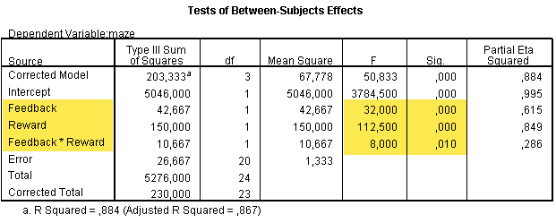
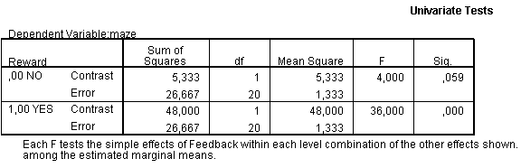

```{r echo=FALSE, message=FALSE}
library(knitr)
library(tidyverse)
source("styles/style_functions.R")


## plot functions

anova_puzzle_data<- function() {
  # calc cells  (which I just have) from marginal means in Joran's presentation.
  # it results however not a clear pattern --> tweaking graph

  m_no_factor_b = 13.2
  m_factor_b = 15.8
  m_no_factor_a = 12.0
  m_factor_a = 17.0
  gm = mean(c(m_no_factor_b, m_factor_b, m_no_factor_a, m_factor_a))
  solved = c(m_no_factor_b * m_no_factor_a/gm,    m_no_factor_b * m_factor_a/gm,
             m_factor_b * m_no_factor_a/gm,    m_factor_b * m_factor_a/gm)

  solved = c(10.92414, 15.47586, 12.07586, 19.52414)
  data.frame(Reward=rep(c("No", "Yes"), 2),
             Feedback=rep(c("No", "Yes"), each=2),
             y=solved) %>%
    mutate(factor_a = Reward,
           factor_b = Feedback)
}

anova_puzzle_fig <- function(df) {
  # anova_puzzle_fig(anova_puzzle_data())
  fig = ggplot(df, aes(x=factor_a, y=y, group=factor_b)) +
    geom_line(aes(color=factor_b), size=1)+
    geom_point(aes(color=factor_b), size=3) +
    theme_linedraw() +
    theme(axis.text = element_text(size = 11),
          panel.grid.major.y=element_line(colour = "darkgrey"),
          panel.grid.major.x=element_blank())

  # Axis
  fig = fig +
    scale_y_continuous(name="Solved Puzzle", breaks = seq(10,20, by=1),
                     minor_breaks = seq(10,20, by=1),
                     limits=c(10, 20)) +
    scale_x_discrete(name="Reward", labels=c("No", "Yes"))

  # add legend labels
  labels = df %>%
    filter(factor_a == "Yes") %>%
    mutate(label = case_when(
      factor_b == "No" ~ "No Feedback",
      factor_b == "Yes" ~ "Feedback"
    ))

  fig = fig +
    geom_text(size = 4, aes(label = label, color = factor_b),
              nudge_x = 0.1, hjust = 0, data = labels) +
    guides(color = "none")

  return(fig)
}

add_vrange <- function(x, y1, y2, gap=0, point_scale=1,
                       lwd=2, colour="purple", alpha=0.4) {
  # add vertical range (with mean point to ggplot)
  ymin = min(c(y1,y2)) + gap
  ymax = max(c(y1,y2)) - gap

  if (point_scale==0) {
    annotate("segment", x = x, xend = x, y = ymin,  yend = ymax,
             colour = colour, size=lwd, alpha=alpha)
  } else {
    annotate("pointrange", x = x, y = mean(c(y1, y2)),
             ymin = ymin,  ymax = ymax,
             lwd=lwd, colour = colour,
             fatten=point_scale, alpha=alpha)
  }
}


add_hrange <- function(y, x1, x2, gap=0, point_scale=1,
                       lwd=2, colour="purple", alpha=0.6) {
  # add horizontal range (with mean point to ggplot)
  xmin = min(c(x1,x2)) + gap
  xmax = max(c(x1,x2)) - gap

  if (point_scale==0) {
    annotate("segment", x = xmin, xend = xmax, y = y,  yend = y,
             colour = colour, size=lwd, alpha=alpha)
  } else {
    annotate("pointrange", y = y, x = mean(c(x1, x2)),
             xmin = xmin,  xmax = xmax,
             lwd=lwd, colour = colour,
             fatten=point_scale, alpha=alpha)
  }
}
```


class: small, bkg-logo

# Factorial ANOVA

### Benefits of Factorial Designs

1. Multiple .emph2[main effects] in one analysis
  * Examine effects of several independent categorical variables (factors)
  * e.g. experimental conditions, different groups
2. .emph2[Interactions] between two variables/factor
  * Is the effects of factor depend on the another factor?
  * Interaction effects need to be considered when interpret main effects! 

--
`r vspace(20)`

### Example

The effect of feedback and rewards on success in solving 	"maze-puzzles".

<!-- - - - - - - - - - - - - - - - - - - - - - - - - - - - - - - - - - - (3) -->
---
# ANOVA Results (Example)

.right-column[.small-table[
|   | Reward No | Reward Yes |
|------|------------|------------|
| Feedback No | 10.92 | 15.46 |
| Feedback  Yes | 12.08 | 19.52 |
]]

<!-- - - - - - - - - - - - - - - - - - - - - - - - - - - - - - - - - - - (4) -->
---
# ANOVA Results (Example)

.left-column[
```{r echo=FALSE, fig.align="center", fig.width=4.7, fig.height=4, out.width = '100%'}
df = anova_puzzle_data()
puzzle_fig = anova_puzzle_fig(df)
puzzle_fig
```
]

.right-column[.small-table[
|   | Reward No | Reward Yes |
|------|------------|------------|
| Feedback No | 10.92 | 15.46 |
| Feedback  Yes | 12.08 | 19.52 |
]]


<!-- - - - - - - - - - - - - - - - - - - - - - - - - - - - - - - - - - - (5) -->
---
class: small
# ANOVA Results (Example)

```{r, echo=FALSE, fig.align="center", out.width = '70%'}

```


* .emph[Main effect Feedback]: Giving accurate feedback on performance enhances achievements compared to not giving feedback
* .emph[Main effect Reward]: Rewarding success enhances participants’ achievement compared to not rewarding success;
* .emph[Interaction Feedback x Reward]: the effect of rewards depends on feedback or the effect of feedback depends on reward


<!-- - - - - - - - - - - - - - - - - - - - - - - - - - - - - - - - - - - (6) -->
---
layout: true
class: small 
# Interpreting: Main effects


<!-- - - - - - - - - - - - - - - - - - - - - - - - - - - - - - - - - - - (7) -->
---

.left-column[
```{r echo=FALSE, fig.align="center", fig.width=4.7, fig.height=4, out.width = '100%'}
puzzle_fig
```
]

.right-column[.small-table[
### Main effect Feedback
The difference between feedback and no feedback is significant $F(1,20) = 32.00, p < .001$, $\text{partial }\eta^2 = .62$
]]

<!-- - - - - - - - - - - - - - - - - - - - - - - - - - - - - - - - - - - (9) -->
---

.left-column[
```{r echo=FALSE, fig.align="center", fig.width=4.7, fig.height=4, out.width = '100%'}
m = c(mean(c(df$y[1], df$y[2])),
      mean(c(df$y[3], df$y[4])))
puzzle_fig + add_vrange(0.6, m[1], m[2], gap = 0.2, lwd = 2, point_scale=0) +
            add_vrange(1.5,  m[1], m[1], point_scale=1.5) + # points
            add_vrange(1.5,  m[2], m[2], point_scale=1.5) + # points
           geom_hline(yintercept=m,  color="gray")
          
```
]

.right-column[.small-table[
### Main effect Feedback
The difference between feedback and no feedback is significant $F(1,20) = 32.00, p < .001$, $\text{partial }\eta^2 = .62$
]]


<!-- - - - - - - - - - - - - - - - - - - - - - - - - - - - - - - - - - - (8) -->
---

.left-column[
```{r echo=FALSE, fig.align="center", fig.width=4.7, fig.height=4, out.width = '100%'}
m = c(mean(c(df$y[1], df$y[3])),
      mean(c(df$y[2], df$y[4])))
puzzle_fig + add_vrange(0.6, m[1], m[2], gap = 0.2, lwd = 2, point_scale=0) +
            add_vrange(1,  m[1], m[1], point_scale=1.5) + # points
            add_vrange(2,  m[2], m[2], point_scale=1.5) + # points
             geom_hline(yintercept=m,  color="gray")
```
]

.right-column[.small-table[
### Main effect Reward
The difference between reward and no reward is significant $F(1,20) = 112.50, p < .001$, $\text{partial }\eta^2 = .85$
]]


<!-- - - - - - - - - - - - - - - - - - - - - - - - - - - - - - - - - - - (10) -->
---
class: small
layout: true
# Interpreting Two-Way Interaction

<!-- - - - - - - - - - - - - - - - - - - - - - - - - - - - - - - - - - - (11) -->
---

.left-column[
```{r echo=FALSE, fig.align="center", fig.width=4.7, fig.height=4, out.width = '100%'}
puzzle_fig
```
]

.right-column[]


<!-- - - - - - - - - - - - - - - - - - - - - - - - - - - - - - - - - - - (12) -->
---

.left-column[
```{r echo=FALSE, fig.align="center", fig.width=4.7, fig.height=4, out.width = '100%'}
puzzle_fig + add_vrange(1, df$y[1], df$y[3], gap = 0.2, lwd = 2, point_scale=0)
```
]

.right-column[
Simple main effect *Feedback* in the condition **Reward: No**
]

<!-- - - - - - - - - - - - - - - - - - - - - - - - - - - - - - - - - - - (13) -->
---

.left-column[
```{r echo=FALSE, fig.align="center", fig.width=4.7, fig.height=4, out.width = '100%'}
puzzle_fig + add_vrange(2, df$y[2], df$y[4], gap = 0.2, lwd = 2, point_scale=0)
```
]

.right-column[
Simple main effect *Feedback* in the condition **Reward: Yes**
]


<!-- - - - - - - - - - - - - - - - - - - - - - - - - - - - - - - - - - - (14) -->
---

.left-column[
```{r echo=FALSE, fig.align="center", fig.width=4.7, fig.height=4, out.width = '100%'}
puzzle_fig + 
  add_vrange(2, df$y[2], df$y[4], gap = 0.2, lwd = 2, point_scale=0,  alpha=1) +
  add_vrange(1, df$y[1], df$y[3], gap = 0.2, lwd = 2, point_scale=0,  alpha=1)
```
]

.right-column[
* difference in the simple main effects
* "The effect of feedback is stronger in the condition with reward."
* "The difference between feedback and no feedback is significantly larger in the reward yes condition, $F(1,20) = 8.00$, $p < .05$, $\text{partial }\eta^2 = .29$.
]

<!-- - - - - - - - - - - - - - - - - - - - - - - - - - - - - - - - - - - (15) -->
---

.left-column[
```{r echo=FALSE, fig.align="center", fig.width=4.7, fig.height=4, out.width = '100%'}
puzzle_fig 
```
]

.right-column[
**Alternative**

Interactions can be interpreted from different perspectives.

]


<!-- - - - - - - - - - - - - - - - - - - - - - - - - - - - - - - - - - - (16) -->
---

.left-column[
```{r echo=FALSE, fig.align="center", fig.width=4.7, fig.height=4, out.width = '100%'}
puzzle_fig + 
  add_vrange(0.6, df$y[3], df$y[4], gap = 0.2, lwd = 2, point_scale=0) +   geom_hline(yintercept=c(df$y[3], df$y[4]),  color="darkgray")
```
]

.right-column[
**Alternative**

Simple main effect *Reward* in the condition **Feedback: Yes**
]

<!-- - - - - - - - - - - - - - - - - - - - - - - - - - - - - - - - - - - (17) -->
---

.left-column[
```{r echo=FALSE, fig.align="center", fig.width=4.7, fig.height=4, out.width = '100%'}
puzzle_fig + 
  add_vrange(0.7, df$y[1], df$y[2], gap = 0.2, lwd = 2, point_scale=0) +   geom_hline(yintercept=c(df$y[1], df$y[2]),  color="darkgray")
```
]

.right-column[
**Alternative**

Simple main effect *Reward* in the condition **Feedback: No**
]

<!-- - - - - - - - - - - - - - - - - - - - - - - - - - - - - - - - - - - (18) -->
---

.left-column[
```{r echo=FALSE, fig.align="center", fig.width=4.7, fig.height=4, out.width = '100%'}
puzzle_fig + 
  add_vrange(0.7, df$y[1], df$y[2], gap = 0.2, lwd = 2, point_scale=0, alpha=1) + 
  add_vrange(0.6, df$y[3], df$y[4], gap = 0.2, lwd = 2, point_scale=0, alpha=1)
```
]

.right-column[
**Alternative**

Simple main effect *Reward* in the condition **Feedback: Yes**
]


<!-- - - - - - - - - - - - - - - - - - - - - - - - - - - - - - - - - - - (19) -->
---
layout: true
class: small
# Interactions Affect the Interpretation of Main Effects

<!-- - - - - - - - - - - - - - - - - - - - - - - - - - - - - - - - - - - (20) -->
---

--
.left-column[
```{r echo=FALSE, fig.align="center", fig.width=4.7, fig.height=4, out.width = '100%'}
df$y[2] = df$y[1]-0.3
puzzle_fig2 = anova_puzzle_fig(df)
puzzle_fig2
```
]
.right-column[
### Modified Example

]

<!-- - - - - - - - - - - - - - - - - - - - - - - - - - - - - - - - - - - (21) -->
---

.left-column[
```{r echo=FALSE, fig.align="center", fig.width=4.7, fig.height=4, out.width = '100%'}
m = c(mean(c(df$y[1], df$y[3])),
      mean(c(df$y[2], df$y[4])))
puzzle_fig2 + add_vrange(0.6, m[1], m[2], gap = 0.2, lwd = 2, point_scale=0) +
            add_vrange(1,  m[1], m[1], point_scale=1.5) + # points
            add_vrange(2,  m[2], m[2], point_scale=1.5) + # points
             geom_hline(yintercept=m,  color="gray")

```
]

.right-column[
### Modified Example
* let's say there is a significant main effect *reward*
]

<!-- - - - - - - - - - - - - - - - - - - - - - - - - - - - - - - - - - - (22) -->
---

.left-column[
```{r echo=FALSE, fig.align="center", fig.width=4.7, fig.height=4, out.width = '100%'}
puzzle_fig2 
```
]

.right-column[
### Modified Example
* let's say there is a significant main effect *reward*
`r vspace(10)`
* But you can't say simple: "Reward improves the performance"
* Reward has **no** effect at all, if there is no feedback
]
             
<!-- - - - - - - - - - - - - - - - - - - - - - - - - - - - - - - - - - - (23) -->
---
layout: false
class: small
# Follow-up Analyses 

.left-column[
```{r echo=FALSE, fig.align="center", fig.width=4.7, fig.height=4, out.width = '100%'}
puzzle_fig 
```
]

.right-column[
## Simple effects analysis
* difference in the simple main effects
* exploring the pattern with 

]

<!-- - - - - - - - - - - - - - - - - - - - - - - - - - - - - - - - - - - (24) -->
---
class: small
layout: false
# Simple effects analysis

`r posbox(550, 20, 650)`
.small[
```
GLM maze BY Feedback Reward
  /EMMEANS=TABLES(Reward*Feedback)compare(Feedback) .
```
]
`r end_posbox()`

```{r, echo=FALSE, fig.align="center", out.width = '70%'}

```


* The difference between feedback and no feedback is **not** significant in the no reward condition $F(1,20) = 4.00, p = .059$.
* The difference between feedback and no feedback is significant in the condition reward yes $F(1,20) = 36.00, p < .001$.

<!-- - - - - - - - - - - - - - - - - - - - - - - - - - - - - - - - - - - (25) -->
---
layout: false
class: final-slide

# Thank you very much 

Oliver Lindemann

