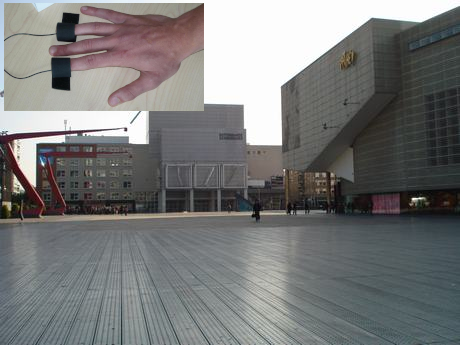
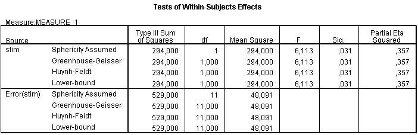

```{r echo=FALSE, message=FALSE}
library(knitr)
library(tidyverse)
source("styles/style_functions.R")

options(knitr.kable.NA = "")
```

```{r why_rm_anova, echo=FALSE, message=FALSE}
why_data = read_csv("incl/voices_music.csv") %>%
  pivot_longer(cols = -Subject, names_to="Condition", values_to="RT") %>%
  mutate(Subject=as.factor(Subject),
         Condition=fct_relevel(Condition, "Silence", "Voices", "Music"),
         RT = RT/60)

why_rm_anova_plot <- function(d, black=FALSE, size=4) {
  plt = ggplot(d, aes(Condition, RT)) +
  theme_linedraw() +
  theme(axis.text = element_text(size = 12),
        panel.grid.major.y=element_line(colour = "darkgrey"),
        panel.grid.major.x=element_blank())

  if (black) {
    plt + geom_point(shape=16, size = size,
               mapping = aes(group = Subject),
               color = "black")
  } else {
    plt + geom_point(shape=16,
                   mapping = aes(group = Subject,
                                 color = Subject),
                   size=size)
  }
}

add_lines <- function(data, subjects=NA, lwd=1.5) { # for why_rm_anova
  if (is.na(subjects[1]))
    d = data
  else
    d = filter(data, Subject %in% subjects)
  geom_line(d, mapping = aes(group = Subject, color = Subject), lwd=lwd)
}

add_vrange <- function(x, y1, y2, gap=0, point_scale=1,
                       lwd=2, colour="purple", alpha=0.4) {
  # add vertical range (with mean point to ggplot)
  ymin = min(c(y1,y2)) + gap
  ymax = max(c(y1,y2)) - gap

  if (point_scale==0) {
    annotate("segment", x = x, xend = x, y = ymin,  yend = ymax,
             colour = colour, size=lwd, alpha=alpha)
  } else {
    annotate("pointrange", x = x, y = mean(c(y1, y2)),
             ymin = ymin,  ymax = ymax,
             lwd=lwd, colour = colour,
             fatten=point_scale, alpha=alpha)
  }
}


add_hrange <- function(y, x1, x2, gap=0, point_scale=1,
                       lwd=2, colour="purple", alpha=0.6) {
  # add horizontal range (with mean point to ggplot)
  xmin = min(c(x1,x2)) + gap
  xmax = max(c(x1,x2)) - gap

  if (point_scale==0) {
    annotate("segment", x = xmin, xend = xmax, y = y,  yend = y,
             colour = colour, size=lwd, alpha=alpha)
  } else {
    annotate("pointrange", y = y, x = mean(c(x1, x2)),
             xmin = xmin,  xmax = xmax,
             lwd=lwd, colour = colour,
             fatten=point_scale, alpha=alpha)
  }
}

```

# Overview

* introduction repeated measures ANOVA
* RM-ANOVA by hand
* sphericity assumption for repeated measures


<!-- - - - - - - - - - - - - - - - - - - - - - - - - - - - - - - - - - - (3) -->
---

# When GLM Repeated Measures?

* For all designs with at least 1 within subject-factor
* within-subject factor: a variable that defines several conditions for all participants
  * *For example*: the same outcome  (e.g. reaction time) is measured repeatedly (neutral picture, picture with a spider), so we have different variables in SPSS
* **Goal**: compare the means of the different conditions

<!-- - - - - - - - - - - - - - - - - - - - - - - - - - - - - - - - - - - (4) -->
---

# Advatages of Within-subjects Designs

## Sensitivity
* Unsystematic variance is reduced, because between participant variation is taken out of the $SS_\text{residual}$
* $\rightarrow$ More sensitive to experimental effects 
* $\rightarrow$ .emph2[higher statistical power]

## Economy
* Less participants are needed.
* But, be careful of demand characteristic, carry-over effects.
* Counterbalance the order of the conditions


<!-- - - - - - - - - - - - - - - - - - - - - - - - - - - - - - - - - - - (5) -->
---
class: center, small

.pull-left[
## $H_0$ is true

```{r, echo=FALSE, fig.align="center",  out.width = '350px', out.height= '450px'}
knitr::include_graphics("incl/anova_small_between_var.png")
```

Within-group and between-group variation approx. **equal**
]

--

.pull-right[
## $H_0$ is not true 


```{r, echo=FALSE, fig.align="center",  out.width = '400px', out.height= '450px'}
knitr::include_graphics("incl/anova_large_between_var.png")
```

Between-group variation is clearly **larger** than within-group variation
]


<!-- - - - - - - - - - - - - - - - - - - - - - - - - - - - - - - - - - - (6) -->
---
layout: true 
# Understanding One-Way Repeated-Measures ANOVA

.pull-left[
**Example**: We compare the mean reaction times of subjects under three conditions:

1. Silence
2. listening to voices 
3. Listening to music  

### What is the error of this model?
Note: observations are .emph2[not] independent
]


<!-- - - - - - - - - - - - - - - - - - - - - - - - - - - - - - - - - - - (7) -->
---

.pull-right[
```{r echo=FALSE, fig.align="center", fig.width=4.7, fig.height=4, out.width = '100%'}
why_rm_anova_plot(why_data, black = TRUE)
```
]


<!-- - - - - - - - - - - - - - - - - - - - - - - - - - - - - - - - - - - (8) -->
---

.pull-right[
```{r echo=FALSE, fig.align="center", fig.width=4.7, fig.height=4, out.width = '100%'}
plt = why_rm_anova_plot(why_data)
plt
```
]

<!-- - - - - - - - - - - - - - - - - - - - - - - - - - - - - - - - - - - (9) -->
---
.pull-right[
```{r echo=FALSE, fig.align="center", fig.width=4.7, fig.height=4, out.width = '100%'}
plt + add_lines(why_data, subject=10)
```
]

<!-- - - - - - - - - - - - - - - - - - - - - - - - - - - - - - - - - - - (10) -->
---
.pull-right[
```{r echo=FALSE, fig.align="center", fig.width=4.7, fig.height=4, out.width = '100%'}
plt + add_lines(why_data, subject=8)
```
]

<!-- - - - - - - - - - - - - - - - - - - - - - - - - - - - - - - - - - - (11) -->
---
.pull-right[
```{r echo=FALSE, fig.align="center", fig.width=4.7, fig.height=4, out.width = '100%'}
plt + add_lines(why_data, subject=1)
```
]

<!-- - - - - - - - - - - - - - - - - - - - - - - - - - - - - - - - - - - (12) -->
---

.pull-right[
```{r echo=FALSE, fig.align="center", fig.width=4.7, fig.height=4, out.width = '100%'}
plt + add_lines(why_data, subject=4)
```
]

<!-- - - - - - - - - - - - - - - - - - - - - - - - - - - - - - - - - - - (13) -->
---

.pull-right[
```{r echo=FALSE, fig.align="center", fig.width=4.7, fig.height=4, out.width = '100%'}
plt + add_lines(why_data, lwd=0.5)
```
]

<!-- - - - - - - - - - - - - - - - - - - - - - - - - - - - - - - - - - - (14) -->
---

.pull-right[
```{r echo=FALSE, fig.align="center", fig.width=4.7, fig.height=4, out.width = '100%'}
m = why_data %>% 
  group_by(Condition) %>% 
  summarise(RT = mean(RT)) %>%
  mutate(Subject="mean")
plt + add_lines(why_data, lwd=0.5) + geom_line(m,  color = "black", mapping = aes(group = Subject), lwd=2) 
```
]


<!-- - - - - - - - - - - - - - - - - - - - - - - - - - - - - - - - - - - (15) -->
---
layout: false
# Partitioning of variance

* The individual differences between participants in average reaction time are .emph2[not] of interest in within-subjects designs

* We focus on .emph2[within-participant] variability. This is broken down into two parts:
  1. .emph2[Systematic variation]: caused by the experimental manipulation (the **average response-pattern**)
  2. .emph2[Unsystematic variation]: for each participant his deviation from the average response-pattern 


<!-- - - - - - - - - - - - - - - - - - - - - - - - - - - - - - - - - - - (16) -->
---
class: small
layout: false
# Systematic Variance: Effect of Manipulation

.pull-left[
```{r echo=FALSE, fig.align="center", fig.width=4.7, fig.height=4, out.width = '100%'}
plt = why_rm_anova_plot(why_data, size=2) +
  geom_hline(yintercept=mean(m$RT)) +  
  geom_line(m,  color = "black", mapping = aes(group = Subject), lwd=1) 
plt
```
]
.pull-right[]

<!-- - - - - - - - - - - - - - - - - - - - - - - - - - - - - - - - - - - (17) -->
---
class: small
# Systematic Variance, Effect of Manipulation

.pull-left[
```{r echo=FALSE, fig.align="center", fig.width=4.7, fig.height=4, out.width = '100%'}
# add_vrange <- function(x, y1, y2, gap=0)
plt + add_vrange(1, mean(m$RT), m$RT[1], alpha=1, colour="red", point_scale=0) +
  add_vrange(2, mean(m$RT), m$RT[2], alpha=1, colour="red", point_scale=0) +
  add_vrange(3, mean(m$RT), m$RT[3], alpha=1, colour="red", point_scale=0)
```
]

.pull-right[
### $SS_\text{model}$
* Difference of condition means differ from the grand mean 
* $\rightarrow$ effect of manipulation.
]


<!-- - - - - - - - - - - - - - - - - - - - - - - - - - - - - - - - - - - (18) -->
---
layout: false
class: small
#  Residuals: Within-Participant Variation

.pull-left[
```{r echo=FALSE, fig.align="center", fig.width=4.7, fig.height=4, out.width = '100%'}
plt + add_lines(why_data, subject=9)
```
]

.pull-right[
## $SS_\text{residual}$
How representative is the average response-pattern for each participant?
]


<!-- - - - - - - - - - - - - - - - - - - - - - - - - - - - - - - - - - - (19) -->
---
class: small
layout: true
# Residuals: Within-Participant Variation

.pull-right[
## $SS_\text{residual}$
How representative is the average response-pattern for each participant?

Subject pattern follows mean pattern:

.emph3[Small residuals]
]

<!-- - - - - - - - - - - - - - - - - - - - - - - - - - - - - - - - - - - (20) -->
---

.pull-left[
```{r echo=FALSE, fig.align="center", fig.width=4.7, fig.height=4, out.width = '100%'}
sdf = filter(why_data, Subject==9) # subject df
mm = m %>% mutate(RT = RT - mean(RT) + mean(sdf$RT) ) 
plt + geom_line(mm,  color = "grey", mapping = aes(group = Subject), lwd=1) +
  add_lines(why_data, subject=9)
```
]

<!-- - - - - - - - - - - - - - - - - - - - - - - - - - - - - - - - - - - (21) -->
---

.pull-left[
```{r echo=FALSE, fig.align="center", fig.width=4.7, fig.height=4, out.width = '100%'}
plt + geom_line(mm,  color = "grey", mapping = aes(group = Subject), lwd=1) +
  add_lines(why_data, subject=9) +
  add_vrange(1, sdf$RT[1], mm$RT[1], alpha=1, colour="red", point_scale=0) +
  add_vrange(2, sdf$RT[2], mm$RT[2], alpha=1, colour="red", point_scale=0) +
  add_vrange(3, sdf$RT[3], mm$RT[3], alpha=1, colour="red", point_scale=0) 
  
```
]


<!-- - - - - - - - - - - - - - - - - - - - - - - - - - - - - - - - - - - (22) -->
---
layout: true
class: small
# Residuals: Within-Participant Variation


.pull-right[
## $SS_\text{residual}$
How representative is the average response-pattern for each participant?

Subject pattern does **not** follows mean pattern:

.emph3[Large residuals]
]

<!-- - - - - - - - - - - - - - - - - - - - - - - - - - - - - - - - - - - (23) -->
---

.pull-left[
```{r echo=FALSE, fig.align="center", fig.width=4.7, fig.height=4, out.width = '100%'}
sdf = filter(why_data, Subject==4) # subject df
mm = m %>% mutate(RT = RT - mean(RT) + mean(sdf$RT) ) 
plt + geom_line(mm,  color = "grey", mapping = aes(group = Subject), lwd=1) +
  add_lines(why_data, subject=4)
```
]

<!-- - - - - - - - - - - - - - - - - - - - - - - - - - - - - - - - - - - (24) -->
---

.pull-left[
```{r echo=FALSE, fig.align="center", fig.width=4.7, fig.height=4, out.width = '100%'}
plt + geom_line(mm,  color = "grey", mapping = aes(group = Subject), lwd=1) +
  add_vrange(1, sdf$RT[1], mm$RT[1], alpha=1, colour="red", point_scale=0) +
  add_vrange(2, sdf$RT[2], mm$RT[2], alpha=1, colour="red", point_scale=0) +
  add_vrange(3, sdf$RT[3], mm$RT[3], alpha=1, colour="red", point_scale=0) +
  add_lines(why_data, subject=4)
```
]

<!-- - - - - - - - - - - - - - - - - - - - - - - - - - - - - - - - - - - (25) -->
---
class: small
layout: false
# Residuals: Within-Participant Variation

.pull-left[
```{r echo=FALSE, fig.align="center", fig.width=4.7, fig.height=4, out.width = '100%'}
why_rm_anova_plot(why_data, size=2)  + add_lines(why_data, lwd=0.5)
```
]


.pull-right[
## $SS_\text{residual}$

How parallel are the individual response-patterns to the average pattern?
* pooled .emph3[variance of differences]     
  * $\sigma_{\text{Silence}-\text{Voices}}$, $\sigma_{\text{Voices}-\text{Music}}$,   $\sigma_{\text{Silence}-\text{Music}}$ 
* or the "interaction participant $\times$ condition"

.emph[Important]: Differences between persons' means are .emph3[not] error variance
* If all response-pattern are parallel: $SS_\text{residual}=0$
]


<!-- - - - - - - - - - - - - - - - - - - - - - - - - - - - - - - - - - - (26) -->
---
layout:false
class: middle, center, inverse

#  RM-ANOVA by Hand


<!-- - - - - - - - - - - - - - - - - - - - - - - - - - - - - - - - - - - (27) -->
---
layout:false
# Example RM ANOVA

.left-column[
### Study on Agoraphobia

* For 4 participant we measure their Fear-score 
in 3 different situations (or conditions)
* "within-subject factor":
  1. Written description of open space
  2. Video of open space
  3. When actually in an open space
  
Is there a difference between these situations?
]

.right-column[
```{r, echo=FALSE, fig.align="center", out.width = '90%'}

```
`r vspace(5)`
```{r, echo=FALSE, fig.align="center", out.width = '50%'}

```
]


<!-- - - - - - - - - - - - - - - - - - - - - - - - - - - - - - - - - - - (28) -->
---
# Example: Anxiety Data
.small-table[
| Person  | Text | Video | Real |
| :------ | ---- | ----- | ---- |
| Anna    | 6    | 6     | 9    |
| Belinda | 7    | 9     | 11   |
| Clara   | 4    | 9     | 8    |
| Dorien  | 3    | 4     | 8    |
]

<!-- - - - - - - - - - - - - - - - - - - - - - - - - - - - - - - - - - - (29) -->
---
class: small
# Example: Anxiety Data
.small-table[
| Person  | Text | Video | Real |       Person Mean |
| :------ | ---- | ----- | ---- | ----------------: |
| Anna    | 6    | 6     | 9    |                 7 |
| Belinda | 7    | 9     | 11   |                 9 |
| Clara   | 4    | 9     | 8    |                 7 |
| Dorien  | 3    | 4     | 8    |                 5 |
]

<!-- - - - - - - - - - - - - - - - - - - - - - - - - - - - - - - - - - - (30) -->
---
class: small
# Example: Anxiety Data

```{r formulars, echo=FALSE}
.endline <- function(result) {
  if (is.na(result))
    result = "\\text{?}"
  paste0(" \\\\[1ex] &= ", result, "\\\\[3ex]\n")
}

ss_total <- "\\sum (\\text{Scores} - \\text{Grand mean})^2"
ss_between <- "\\sum (\\text{Person mean} - \\text{Grand mean})^2"
ss_within <- "\\sum (\\text{Scores} - \\text{Person mean})^2"
ss_model <- "\\sum ( \\Delta \\text{Group mean} - \\text{Grand mean})^2"

ss_formulars <- function(display_ss_model=TRUE, result_total=NA, result_between=NA,
                                result_within=NA, result_model=NA) {
  rtn = paste0("$$\\small\\begin{align}\n",  
                    "SS_\\text{total} &=", ss_total, .endline(result_total),
                    "SS_\\text{between} &=", ss_between, .endline(result_between),
                    "SS_\\text{within} &=", ss_within, .endline(result_within))
  if (display_ss_model)     
        rtn = paste0(rtn, "SS_\\text{Model} &=", 
                     ss_model, .endline(result_model))
  
  paste0(rtn, "\\end{align}$$")
}
```

.small-table[
| Person  | Text | Video | Real | Person Mean |
| :------ | ---- | ----- | ---- | ----------: |
| Anna    | 6    | 6     | 9    |           7 |
| Belinda | 7    | 9     | 11   |           9 |
| Clara   | 4    | 9     | 8    |           7 |
| Dorien  | 3    | 4     | 8    |           5 |
| $--$    | $--$ | $--$  | $--$ |        $--$ |
|         |      |       |      |      $GM=7$ |
]

--

`r vspace(20)`
###  $SS_\text{total}$
Variation of all individual scores around the overall mean

$$\small\begin{align}
SS_\text{total} &= `r ss_total` \\
  &= (6-7)^2+(9-7)^2+(7-7)^2 \ldots \\ &= 66 \\[3ex]
df_\text{total} &= N-1\\
\end{align}$$


<!-- - - - - - - - - - - - - - - - - - - - - - - - - - - - - - - - - - - (31) -->
---
class:small
# RM-ANOVA: Sum of Squares

.pull-left[
`r image("incl/ss_within_anova.png", width="100%")`
]

.pull-right-clear[
* The individual differences between participants in average reaction time are NOT of interest in within-subjects designs

* We focus on **within-participant** variability. This is broken down into two parts:
  1. Systematic variation: caused by the experimental manipulation (**the average response-pattern**)
  2. Unsystematic variation: for each participant his deviation from the average response-pattern
]

<!-- - - - - - - - - - - - - - - - - - - - - - - - - - - - - - - - - - - (32) -->
---
class:small
# RM-ANOVA: Sum of Squares
.pull-left[
`r image("incl/ss_within_anova.png", width="100%")`
]

.pull-right-clear[
`r ss_formulars(result_total=66)`
]


<!-- - - - - - - - - - - - - - - - - - - - - - - - - - - - - - - - - - - (33) -->
---
layout: true
class: small
# RM-ANOVA: Sum of Squares

.pull-left[.small-table[
| Person  | Text | Video | Real | Person Mean |
| :------ | ---- | ----- | ---- | ----------: |
| Anna    | 6    | 6     | 9    |           7 |
| Belinda | 7    | 9     | 11   |           9 |
| Clara   | 4    | 9     | 8    |           7 |
| Dorien  | 3    | 4     | 8    |           5 |
| $--$    | $--$ | $--$  | $--$ |        $--$ |
|         |      |       |      |      $GM=7$ |
]]

.pull-right-clear[
`r image("incl/ss_within_anova.png", width="60%")`
]

`r vspace(2)`

---

### $SS_\text{between}$

Variation of .emph2[person means] around .emph2[overall mean]:

$$\small\begin{align}
SS_\text{between} &= `r ss_between` \\
  &=  3\times (7-7)^2 + 3\times (9-7)^2 + 3\times (7-7)^2 + 3\times (5-7)^2 \\&= 24\\[2ex]
df_\text{between} &= N_\text{persons} -1\\
\end{align}$$


---
### $SS_\text{within}$
Variation of .emph2[person scores] around his/her mean (.emph2[person mean]):
$$\small\begin{align}
SS_\text{within} &= `r ss_within` \\
  &=  (6-7)^2 + (6-7)^2 + (9-7)^2 + \ldots + (3-5)^2 + (4-5)^2 + (8-5)^2 \\&= 42\\[2ex]
df_\text{within} &= n(k-1)
\end{align}$$


<!-- - - - - - - - - - - - - - - - - - - - - - - - - - - - - - - - - - - (36) -->
---
layout: false
class: small
# RM-ANOVA: Sum of Squares

.pull-left[.small-table[
| Person             | Text | Video | Real | Person Mean |
| :----------------- | ---- | ----- | ---- | ----------: |
| Anna               | 6    | 6     | 9    |           7 |
| Belinda            | 7    | 9     | 11   |           9 |
| Clara              | 4    | 9     | 8    |           7 |
| Dorien             | 3    | 4     | 8    |           5 |
| $--$               | $--$ | $--$  | $--$ |        $--$ |
| *Condition means:* | $5$  | $7$   | $9$  |      $GM=7$ |
]]

.pull-right-clear[
`r image("incl/ss_within_anova.png", width="60%")`
]
`r vspace(1)`
### $SS_\text{model}$

Variation of .emph2[condition means] (or treatment means) around  .empoh2[grand mean]:

$$\small\begin{align}
SS_\text{model} &= `r ss_model` \\
  &=  4\times(5-7)^2 +  4\times(7-7)^2 + 4\times(9-7)^2  \\&= 32\\[2ex]
df_\text{model} &= k-1
\end{align}$$


<!-- - - - - - - - - - - - - - - - - - - - - - - - - - - - - - - - - - - (37) -->
---
layout: true
class:small
# RM-ANOVA: Sum of Squares
.pull-left[
`r image("incl/ss_within_anova.png", width="100%")`
]

<!-- - - - - - - - - - - - - - - - - - - - - - - - - - - - - - - - - - - (38) -->
---
.pull-right-clear[
$$\begin{align}
SS_\text{total} &=  66 \\[2ex]
SS_\text{between} &=  24 \\[2ex]
SS_\text{within} &=  42 \\[2ex]
SS_\text{model} &=  32 
\end{align}$$

`r vspace(20)`
$$SS_\text{residual} = \text{?}$$

]

<!-- - - - - - - - - - - - - - - - - - - - - - - - - - - - - - - - - - - (39) -->
---
.pull-right-clear[
$$\begin{align}
SS_\text{total} &=  66 \\[2ex]
SS_\text{between} &=  2 \\[2ex]
SS_\text{within} &=  42 \\[2ex]
SS_\text{model} &=  32
\end{align}$$

`r vspace(20)`
$$\begin{align}
SS_\text{residual} &= SS_\text{within} - SS_\text{model} \\[1ex]
  &= 42-32\\[1ex]
 &= 10
\end{align}$$
]

<!-- - - - - - - - - - - - - - - - - - - - - - - - - - - - - - - - - - - (40) -->
---
layout:false
class: small
#  RM-ANOVA result in SPSS

```{r, echo=FALSE, fig.align="center", out.width = '80%'}

```

`r vspace(30)`

.emph[Effect size:] $\quad\eta^2_\text{partial} =\frac{SS_\text{model}}{SS_\text{model} + SS_\text{residual}} \qquad \qquad \eta^2_\text{partial} =\frac{294}{294+529}=0.357$

<!-- - - - - - - - - - - - - - - - - - - - - - - - - - - - - - - - - - - (41) -->
---
layout: false
class: middle, center, inverse

#  Sphericity Assumption

<!-- - - - - - - - - - - - - - - - - - - - - - - - - - - - - - - - - - - (42) -->
---
# Sphericity

.pull-left[
```{r echo=FALSE, fig.align="center", fig.width=4.7, fig.height=4, out.width = '100%'}
d = filter(why_data, Subject != 4, Subject != 3)
why_rm_anova_plot(d, size=2)  + add_lines(d, lwd=0.5)
```
]

.pull-right-clear[
Error term in univariate $F$-test is the interaction person $\times$ ws-factor

* Here sphericity is met, the strength of the interaction effect is homogeneous across conditions
* Sphericity: variability of slopes is homogeneous
across all levels of the ws-factor
]

<!-- - - - - - - - - - - - - - - - - - - - - - - - - - - - - - - - - - - (43) -->
---
# Sphericity

Variance homogeneity of the **differences**

$$\text{variance}_{\text{A}-\text{B}} \approx \text{variance}_{\text{B}-\text{C}} \approx  \text{variance}_{\text{A}-\text{C}}$$

`r vspace(20)`

Sphericity is measured with Epsilon $(\epsilon)$. 
* Field recommends to inspect the Greenhous-Geisser (GG epsilon) epsilon. 
* If GG epsilon $= 1$ the assumption is perfectly met. 
* GG epsilon $< 1$ indicate some degree of violation

<!-- - - - - - - - - - - - - - - - - - - - - - - - - - - - - - - - - - - (44) -->
---
# What if Sphericity is violated?

* If this assumption is violated it means that the standard $F$-test for the main effect of the within-subjects factor is .emph3[not] correct. 

* Correction Methods multiply $df$ by their estimate of Epsilon to obtain corrected F-test.

<!-- - - - - - - - - - - - - - - - - - - - - - - - - - - - - - - - - - - (45) -->
---
class: small
# Rules of Thumb for Sphericity Corrections

## Mild violation only
* $.75 < \text{GG epsilon} < .95$
*  .emph3[Huynh-Feldt correction]

## Strong violation only

* $\text{GG epsilon} < .75$
* .emph3[Greenhouse-Geisser correction]
* Alternative: Multivariate $F$-test MANOVA (more power), but only if $N$ is not too small $(N > k + 10)$

## No Violation
* GG Epsilon close to 1 
* Uncorrected $F$ (.emph3[sphericity assumed])

<!-- - - - - - - - - - - - - - - - - - - - - - - - - - - - - - - - - - - (46) -->
---
layout: false
class: final-slide

# Thank you very much 

Oliver Lindemann

