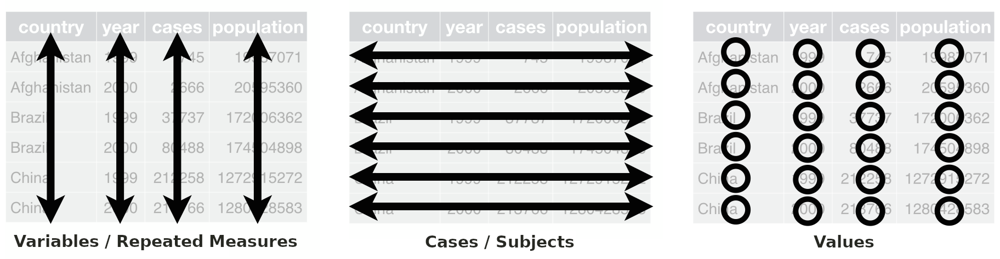
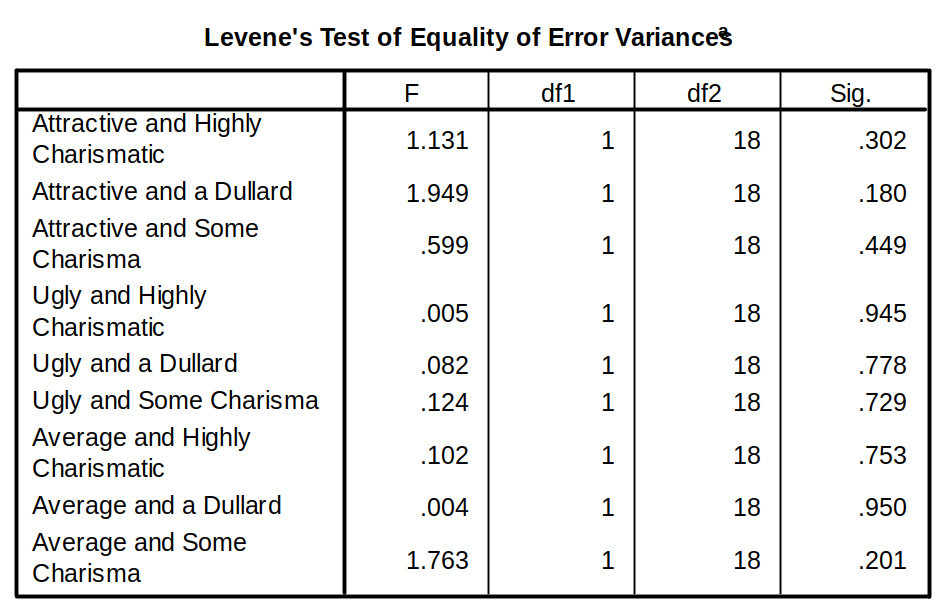
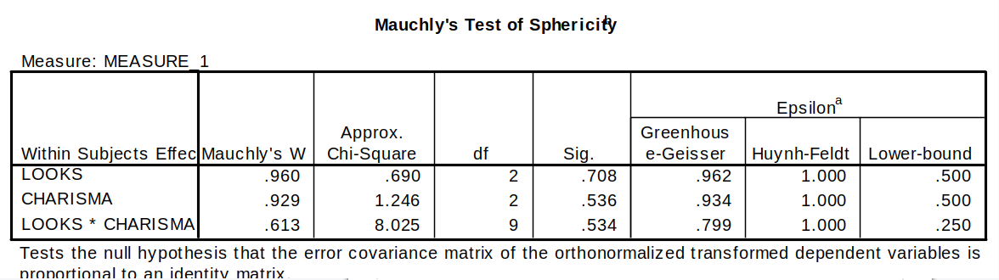
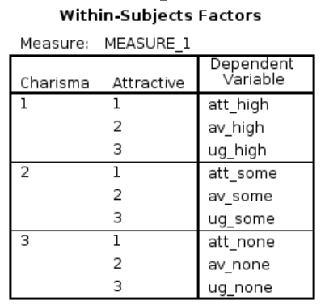
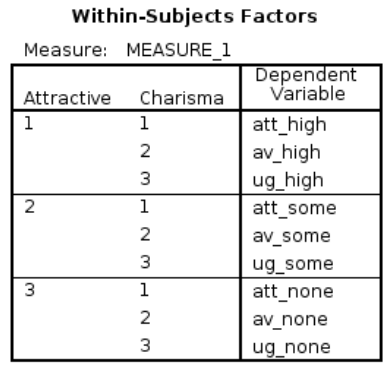
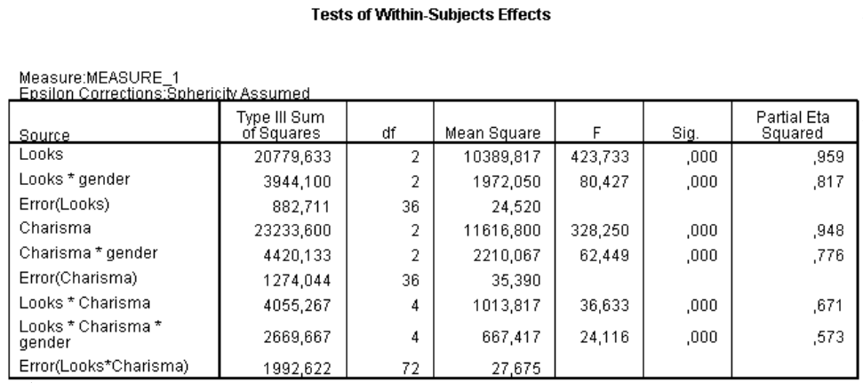
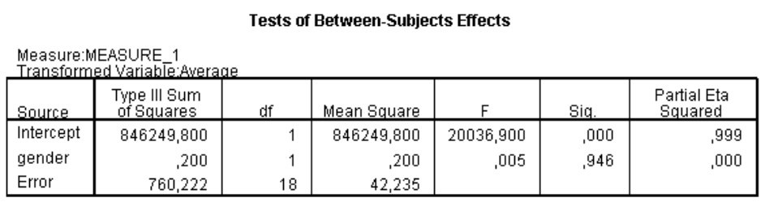

```{r echo=FALSE, message=FALSE}
library(knitr)
library(tidyverse)
source("styles/style_functions.R")

options(knitr.kable.NA = "")
```

# Overview

* Mixed designs
* Interpreting multifactorial (three-way) ANOVAs


---
# Mixed Designs

* A design with at least one within-subjects factor and at least one between-subjects factor

* Basically, we are comparing groups of participants in terms of their average response-patterns over several measurements.

* Theoretically this adds nothing new, it just combines aspects of factorial ANOVA with aspects of repeated measures ANOVA

* Practically this means you have to report your outcomes systematically to not “drown” in the results.


---
# Example: Speed Dating

Is the personality (charisma) or the looks more important?

* WS-factor 1 .emph2[*Looks*]: Attractive, Average, Ugly
* WS-factor 2 .emph2[*Charisma*]: High Charisma, Some Charisma, No Charisma
* BS-factor .emph2[*Gender*]: Male, Female


* Dependent Variable (*DV*): .emph2[Rating of the date]
  * $100 \rightarrow$ *"The prospective date was perfect!"*
  * $0 \rightarrow$  *"I'd rather date my own father/mother*"

---
# Seven General Effects

.pull-left[
## Main effects
* *Looks*
* *Charisma*
* *Gender*

### Two-way interactions
* *Looks* $\times$ *Charisma*
* *Looks* $\times$ *Gender*
* *Charisma* $\times$ *Gender*
]

.pull-right[
## Three-Way Interactions
* *Looks* $\times$ *Charisma* $\times$ *Gender*
]


---
layout: false
class: middle, center, inverse
## Excusus

# Tidy Data for Between- and Within-Subject Analyses 

---
# Structuring Tabluar Data
SPSS requires a particular structure of the data

* .emph2[Variables/repeated measures] have to be in different .emph2[columns].
* .emph2[Cases/subjects] have to be in different .emph2[rows].


```{r, echo=FALSE, fig.align="center", out.width = '70%'}

```

`r vspace(20)`
<hr>

Tabular data that are well structured and in good shape for data analysis are called .emph3[tidy data] (Wickham, 20141). 


---
class: small
layout: true
# Example: Three-way ANOVA Design

```{r,message=FALSE, warning=FALSE, echo=FALSE}
df = read_csv("incl/LooksOrPersonality.csv") %>%
  rename(charisma=personality) %>%
  mutate(subject_id = as_factor(subject_id),
         charisma = as_factor(charisma),
         looks = as_factor(looks))

tab_looks_pers <- function(df) {
  tab_df = df %>% 
      pivot_wider(names_from = c(looks, charisma), 
                         values_from = preference) %>%
      select(-subject_id)
  
  kable(tab_df, align="cccccccccc",
      col.names = c("Looks Charisma", "attract. high", "average high", "ugly high",
                    "attract. some", "average some", "ugly some",
                    "attract. none", "average none", "ugly none"))  
}

```

---
.left-column[.compact-table[
```{r,  echo=FALSE}
tab_looks_pers(df)
```
]]

---

.left-column[.compact-table[
```{r,  echo=FALSE}
tmp = mutate(df, preference=ifelse(charisma=="high", preference, NA))
tab_looks_pers(tmp)
m_high = round(mean(tmp$preference, na.rm=TRUE), 2)
```
]]

.right-column[
### Main Effect Charisma
* $M_\text{high} = `r m_high`$
]

---

.left-column[.compact-table[
```{r,  echo=FALSE}
tmp = mutate(df, preference=ifelse(charisma=="some", preference, NA))
tab_looks_pers(tmp)
m_some = round(mean(tmp$preference, na.rm=TRUE), 2)
```
]]

.right-column[
### Main Effect Charisma
* $M_\text{high} = `r m_high`$
* $M_\text{some} = `r m_some`$
]

---

.left-column[.compact-table[
```{r,  echo=FALSE}
tmp = mutate(df, preference=ifelse(charisma=="none", preference, NA))
tab_looks_pers(tmp)
m_none= round(mean(tmp$preference, na.rm=TRUE), 2)
```
]]

.right-column[
### Main Effect Charisma
* $M_\text{high} = `r m_high`$
* $M_\text{some} = `r m_some`$
* $M_\text{none} = `r m_none`$
]

---
.left-column[.compact-table[
```{r,  echo=FALSE}
tmp = mutate(df, preference=ifelse(looks=="att", preference, NA))
tab_looks_pers(tmp)
m_att = round(mean(tmp$preference, na.rm=TRUE), 2)
```
]]

.right-column[
### Main Effect Charisma
* $M_\text{high} = `r m_high`$
* $M_\text{some} = `r m_some`$
* $M_\text{none} = `r m_none`$

### Main Effect Looks
* $M_\text{att} = `r m_att`$
]

---

.left-column[.compact-table[
```{r,  echo=FALSE}
tmp = mutate(df, preference=ifelse(looks=="av", preference, NA))
tab_looks_pers(tmp)
m_av = round(mean(tmp$preference, na.rm=TRUE), 2)
```
]]

.right-column[
### Main Effect Charisma
* $M_\text{high} = `r m_high`$
* $M_\text{some} = `r m_some`$
* $M_\text{none} = `r m_none`$

### Main Effect Looks
* $M_\text{att} = `r m_att`$
* $M_\text{av} = `r m_av`$
]

---

.left-column[.compact-table[
```{r,  echo=FALSE}
tmp = mutate(df, preference=ifelse(looks=="ug", preference, NA))
tab_looks_pers(tmp)
m_ug = round(mean(tmp$preference, na.rm=TRUE), 2)
```
]]

.right-column[
### Main Effect Charisma
* $M_\text{high} = `r m_high`$
* $M_\text{some} = `r m_some`$
* $M_\text{none} = `r m_none`$

### Main Effect Looks
* $M_\text{att} = `r m_att`$
* $M_\text{av} = `r m_av`$
* $M_\text{ug} = `r m_ug`$
]

---
.left-column[.compact-table[
```{r,  echo=FALSE}
tmp = mutate(df, preference=ifelse(gender=="female", preference, NA))
tab_looks_pers(tmp)
m_female= round(mean(tmp$preference, na.rm=TRUE), 2)
```
]]

.right-column[
### Main Effect Gender (between)
* $M_\text{female} = `r m_female`$
]

---
.left-column[.compact-table[
```{r,  echo=FALSE}
tmp = mutate(df, preference=ifelse(gender=="male", preference, NA))
tab_looks_pers(tmp)
m_male= round(mean(tmp$preference, na.rm=TRUE), 2)
```
]]

.right-column[
### Main Effect Gender (between)
* $M_\text{female} = `r m_female`$
* $M_\text{male} = `r m_female`$
]

---
.left-column[.compact-table[
```{r,  echo=FALSE}
tmp = mutate(df, preference=ifelse(gender=="female" & charisma=="high", preference, NA))
tab_looks_pers(tmp)
m_female_high= round(mean(tmp$preference, na.rm=TRUE), 2)
```
]]

.right-column[
### Interaction *Gender* $\times$ *Charisma*
* $M_\text{(female, high)} = `r m_female_high`$
]


---
.left-column[.compact-table[
```{r,  echo=FALSE}
tmp = mutate(df, preference=ifelse(gender=="female" & charisma=="some", preference, NA))
tab_looks_pers(tmp)
m_female_some= round(mean(tmp$preference, na.rm=TRUE), 2)
```
]]

.right-column[
### Interaction *Gender* $\times$ *Charisma*
* $M_\text{(female, high)} = `r m_female_high`$
* $M_\text{(female, some)} = `r m_female_some`$
]


---
.left-column[.compact-table[
```{r,  echo=FALSE}
tmp = mutate(df, preference=ifelse(gender=="female" & charisma=="none", preference, NA))
tab_looks_pers(tmp)
m_female_none= round(mean(tmp$preference, na.rm=TRUE), 2)
```
]]
.right-column[
### Interaction *Gender* $\times$ *Charisma*
* $M_\text{(female, high)} = `r m_female_high`$
* $M_\text{(female, some)} = `r m_female_some`$
* $M_\text{(female, none)} = `r m_female_none`$
]


---
.left-column[.compact-table[
```{r,  echo=FALSE}
tmp = mutate(df, preference=ifelse(gender=="male" & charisma=="high", preference, NA))
tab_looks_pers(tmp)
m_male_high= round(mean(tmp$preference, na.rm=TRUE), 2)
```
]]
.right-column[
### Interaction *Gender* $\times$ *Charisma*
* $M_\text{(female, high)} = `r m_female_high`$
* $M_\text{(female, some)} = `r m_female_some`$
* $M_\text{(female, none)} = `r m_female_none`$
 `r vspace(20)`
* $M_\text{(male, high)} = `r m_male_high`$
]

---
.left-column[.compact-table[
```{r,  echo=FALSE}
tmp = mutate(df, preference=ifelse(gender=="male" & charisma=="some", preference, NA))
tab_looks_pers(tmp)
m_male_some= round(mean(tmp$preference, na.rm=TRUE), 2)
```
]]
.right-column[
### Interaction *Gender* $\times$ *Charisma*
* $M_\text{(female, high)} = `r m_female_high`$
* $M_\text{(female, some)} = `r m_female_some`$
* $M_\text{(female, none)} = `r m_female_none`$
 `r vspace(20)`
* $M_\text{(male, high)} = `r m_male_high`$
* $M_\text{(male, some)} = `r m_male_some`$
]

---
.left-column[.compact-table[
```{r,  echo=FALSE}
tmp = mutate(df, preference=ifelse(gender=="male" & charisma=="none", preference, NA))
tab_looks_pers(tmp)
m_male_none= round(mean(tmp$preference, na.rm=TRUE), 2)
```
]]
.right-column[
### Interaction *Gender* $\times$ *Charisma*
* $M_\text{(female, high)} = `r m_female_high`$
* $M_\text{(female, some)} = `r m_female_some`$
* $M_\text{(female, none)} = `r m_female_none`$
 `r vspace(20)`
* $M_\text{(male, high)} = `r m_male_high`$
* $M_\text{(male, some)} = `r m_male_some`$
* $M_\text{(male, none)} = `r m_male_none`$
]

---

.left-column[.compact-table[
```{r,  echo=FALSE}
tmp = mutate(df, preference=ifelse(gender=="female" & looks=="ug" & charisma=="high", preference, NA))
tab_looks_pers(tmp)
m_female_high_att = round(mean(tmp$preference, na.rm=TRUE), 2)
```
]]

.right-column[
### Three way-Interactions
* $M_\text{(female, high, att)} = `r m_female_high_att`$
* $M_\text{(female, some, att)} = \ldots$
* $M_\text{(female, none, att)} = \ldots$
* $M_\text{(male, high, att)} = \ldots$
* $\ldots$
* $M_\text{(female, high, av)} = \ldots$
* $\ldots$
* $M_\text{(male, high, av)} = \ldots$
* $\ldots$
* $M_\text{(female, high, ug)} = \ldots$
* $\ldots$
* $M_\text{(male, high, uy)} = \ldots$
]

---
layout: false
class: middle, center, inverse
# Assumptions
# Mixed ANOVA

---
# Assumptions mixed ANOVA

.pull-left[
## Between subject ANOVA
1. Normality assumption <br>in each group
2. Homoscedasticity
]

.pull-right[
## Repeated measures ANOVA

1. Normality assumption <br>for each repeated measure
2. Sphericity ('Circularity')
]

---
# Homoscedasticity for BS-Factor(s)

### Homogeneity of variance between groups
* **ANOVA**:  equal variance for all repeated measures together
* **Follow-up tests**: equal variance for each repeated measures separately

--

```{r, echo=FALSE, fig.align="center", out.width = '55%'}

```

---
class: small
# Sphericity for WS-Factor(s)

```{r, echo=FALSE, fig.align="center", out.width = '80%'}

```

Since we observe no violations of sphericity (i.e., GG-epsilon $> .75$) and Mauchly’s tests are non-significant, we choose the unadjusted univariate tests.

--
<hr>

### Remarks about $\chi^2$-test and value of epsilon

.pull-left[
If $N$ is **large**:
Mauchly's test $(\chi^2)$ will be significant even though G-G epsilon is very close to 1
]
.pull-right[
If $N$ is **small**: Mauchly’s test $(\chi^2)$ will be non-significant even though G-G epsilon deviates from 1. 

]  

---
# Illustration Sphericity for $F$-test of Looks

```{r sphericity_plot, echo=FALSE, message=FALSE, fig.align="center", fig.width=4.7, fig.height=4, out.width = '50%'}
df = df %>%
    mutate(looks = recode(looks, 
                          "att"= "attractive",
                          "av" = "average",
                          "ug" = "ugly"))
plotdata = df %>% 
  group_by(subject_id, looks) %>%
  summarise(preference = mean(preference))
        
plt = ggplot(plotdata, aes(looks, preference)) +
  theme_linedraw() +
  theme(axis.text = element_text(size = 12),
        panel.grid.major.y=element_line(colour = "darkgrey"),
        panel.grid.major.x=element_blank())  + 
  geom_point(shape=16, size=2,
             mapping = aes(group = subject_id, 
                                     color = subject_id)) +
  geom_line(mapping = aes(group = subject_id, color = subject_id),
            linewidth=0.4)
plt
```

---
# Illustration Sphericity for $F$-test of Looks
.pull-left[
```{r echo=FALSE, fig.width=4.7, fig.height=4, out.width = '100%'}
plt +  theme(legend.position = "none") +
  geom_line(data=filter(plotdata, looks != "ugly"),
            mapping = aes(group = subject_id, color = subject_id), linewidth=2)
```
]

.pull-right[
```{r echo=FALSE, fig.width=4.7, fig.height=4, out.width = '100%'}
plt +  theme(legend.position = "none") +
  geom_line(data=filter(plotdata, looks != "attractive"),
            mapping = aes(group = subject_id, color = subject_id), linewidth=2)
```
]

Variability of slopes is homogeneous across all levels of the WS-factor


---
layout: false
class: middle, center, inverse
# Interpreting Outcome
# 3 $\times$ 3 $\times$ 2 Mixed ANOVA


---
# Check Correctness of Condition Mapping in SPSS


.pull-left[
Correct mapping

```{r, echo=FALSE, fig.align="center", out.width = '80%'}

```

]

.pull-right[
.emph3[Incorrect] mapping

```{r, echo=FALSE, fig.align="center", out.width = '80%'}

```
]


---
# Within-Subjects Effects
```{r, echo=FALSE, fig.align="center", out.width = '80%'}

```

---
# Between-Subjects Effects
```{r, echo=FALSE, fig.align="center", out.width = '70%'}

```


---
class: small
# Interaction Gender $\times$ Looks

```{r echo=FALSE, message=FALSE}
plotdata = df %>%
  group_by(gender, looks) %>%
  summarise(preference = mean(preference))

plt = ggplot(plotdata, aes(looks, preference)) +
  theme_linedraw() +
  theme(axis.text = element_text(size = 12),
        panel.grid.major.y=element_line(colour = "darkgrey"),
        panel.grid.major.x=element_blank()) + 
  geom_point(shape=16, mapping = aes( color = gender), size=4) +
  geom_line(mapping = aes(group = gender, color = gender), linewidth=1)
```

.left-column[
```{r echo=FALSE, fig.align="center", fig.width=4.7, fig.height=4, out.width = '90%'}
plt
```
]
.right-column-clear[
There was a significant two-way interaction effect between Gender and Looks $F(2, 36) = 80.43$, $p < .001$.
]


---
class: small
# Interaction Gender $\times$ Charisma

```{r echo=FALSE, message=FALSE}
plotdata = df %>%
  group_by(gender, charisma) %>%
  summarise(preference = mean(preference))

plt = ggplot(plotdata, aes(charisma, preference)) +
  theme_linedraw() +
  theme(axis.text = element_text(size = 12),
        panel.grid.major.y=element_line(colour = "darkgrey"),
        panel.grid.major.x=element_blank()) + 
  geom_point(shape=16, mapping = aes( color = gender), size=4) +
  geom_line(mapping = aes(group = gender, color = gender), linewidth=1)
```

.left-column[
```{r echo=FALSE, fig.align="center", fig.width=4.7, fig.height=4, out.width = '90%'}
plt
```
]
.right-column-clear[
There was a significant two-way interaction effect between Gender and Charisma $F(2, 36) = 62.45$, $p < .001$.
]


---
class: small
# Interaction Looks $\times$ Charisma

```{r echo=FALSE, message=FALSE}
plotdata = df %>%
  group_by(looks, charisma) %>%
  summarise(preference = mean(preference))

plt = ggplot(plotdata, aes(charisma, preference)) +
  theme_linedraw() +
  theme(axis.text = element_text(size = 12),
        panel.grid.major.y=element_line(colour = "darkgrey"),
        panel.grid.major.x=element_blank()) + 
  geom_point(shape=16, mapping = aes( color = looks), size=4) +
  geom_line(mapping = aes(group = looks, color = looks), linewidth=1)
```

.left-column[
```{r echo=FALSE, fig.align="center", fig.width=4.7, fig.height=4, out.width = '90%'}
plt
```
]
.right-column-clear[
There was a significant two-way interaction effect between Looks and Charisma $F(4, 72) = 36.63$, $p < .001$.
]

---
class: small
# Three-way Interaction Looks $\times$ Charisma $\times$ Gender

```{r echo=FALSE, message=FALSE}
plotdata = df %>%
  group_by(looks, charisma, gender) %>%
  summarise(preference = mean(preference))

plt = ggplot(plotdata, aes(charisma, preference)) +
  theme_linedraw() +
  theme(axis.text = element_text(size = 12),
         strip.text.x  = element_text(size = 12, face="bold"),
        panel.grid.major.y=element_line(colour = "darkgrey"),
        panel.grid.major.x=element_blank()) + 
  geom_point(shape=16, mapping = aes( color = looks), size=4) +
  geom_line(mapping = aes(group = looks, color = looks), linewidth=1) +
  facet_grid(. ~ gender)
```

```{r echo=FALSE, fig.align="center", fig.width=8, fig.height=4, out.width = '100%'}
plt
```

---
class: small
# Three-way Interaction Looks $\times$ Charisma $\times$ Gender

```{r echo=FALSE, fig.align="center", fig.width=8, fig.height=4, out.width = '50%'}
plt
```

There was a significant three-way interaction effect between Gender and Looks and Charisma $F(4, 72) = 24.12, p < .001$.
* For **women** charisma is more important: when a date is charismatic, women will show a high interest regardless of his looks and vice versa.
* For **men** looks are more important: when a date is attractive, men will show a high interest regardless of charisma and vice versa


---
layout: false
class: final-slide

# Thank you very much 

Oliver Lindemann

