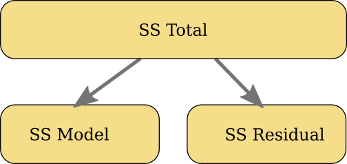
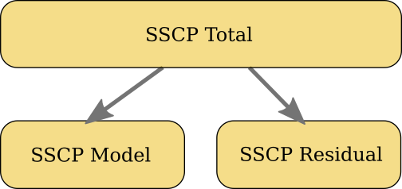
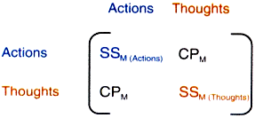
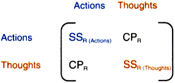
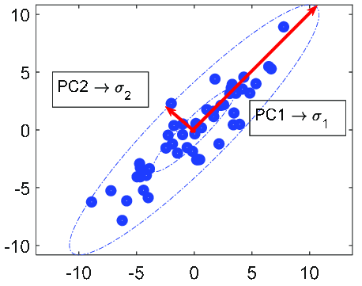
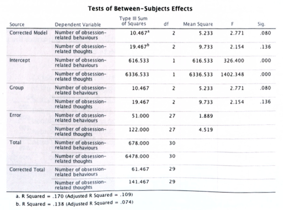
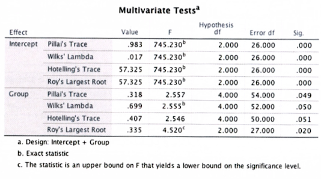

```{r echo=FALSE, message=FALSE}
library(knitr)
library(tidyverse)
source("styles/style_functions.R")

options(knitr.kable.NA = "")
```


class:small
# Univariate vs. Multivariate ANOVA

`r vspace(50)`

$$\begin{align}
\textbf{univariate ANOVA} \\
DV &\leftarrow \text{Factors: }  IV_1, IV_2, \ldots \\[4ex]
\textbf{multivariate ANOVA} \\
DV_1, DV_2, \ldots &\leftarrow \text{Factors: }  IV_1, IV_2, \ldots
\end{align}$$

---
# Example
Effect of psychotherapy on obsessive compulsive disorder (**ODC**)

* Independent variable (factor group)
  * cognitive behavior theory (**CBT**)
  * behavior therapy (**BT**)
  * control group, No treatment (**NT**)


* .emph3[Two] dependent variables:
  1. obsession-related behavior (**Actions**)
  2. obsession-related cognition (**Thoughts**)

---
class: small
# Example Data 

```{r,message=FALSE, warning=FALSE, echo=FALSE}
dv1 = tibble(CBT=c(5,5,4,4,5,3,7,6,6,4), 
             BT = c(4,4,1,1,4,6,5,5,2,5),
             NT = c(4,5,5,4,6,4,7,4,6,5)
            )

dv2 = tibble(CBT=c(14,11,16,13,12,14,12,15,16,11), 
             BT = c(14,15,13,14,15,19,13,18,14,17),
             NT = c(13,15,14,14,13,20,13,16,14,18)
            )
```

.pull-left[
.center[*DV1: Actions*]
```{r,  echo=FALSE}
kable(dv1, align="cccc")
```
]

.pull-right[
.center[*DV2: Thoughts*]
```{r,  echo=FALSE}
kable(dv2,align="cccc")
```
]

---
# Illustration: Two Univariate Distributions

```{r echo=FALSE, message=FALSE}
df = iris %>%
  mutate("Variable A" = Sepal.Length,
         "Variable B" = Sepal.Width,
         Therapy=factor(Species, labels = c("PT-1","PT-2","PT-3"))      
         ) %>%
  filter(Therapy !="PT-3")

plotA = ggplot(df, aes(x = `Therapy`, y = `Variable A`)) +
  theme_linedraw() +
  theme(plot.title = element_text(size = 18),
        axis.text = element_text(size = 12),
        legend.position = "none",
        panel.grid.major.y=element_line(colour = "darkgrey"),
        panel.grid.major.x=element_blank()) +
  geom_point(aes(color = Therapy), size=3, alpha=0.6) +
  scale_y_continuous(limits = c(3, 8)) + 
  ggtitle("Variable A")

plotB = ggplot(df, aes(x = `Therapy`, y = `Variable B`)) +
  theme_linedraw() +
  theme(plot.title = element_text(size = 18),
        axis.text = element_text(size = 12),
        legend.position = "none",
        panel.grid.major.y=element_line(colour = "darkgrey"),
        panel.grid.major.x=element_blank()) +
  geom_point(aes(color = Therapy), size=3, alpha=0.6) +
  scale_y_continuous(limits = c(1, 5)) +
  ggtitle("Variable B")
```

.pull-left[
```{r echo=FALSE, fig.align="center", fig.width=4.7, fig.height=4, out.width = '100%'}
plotA 
```
]
.pull-right[
```{r echo=FALSE, fig.align="center", fig.width=4.7, fig.height=4, out.width = '100%'}
plotB 
```
]

---
# Illustration: Two Univariate Distributions

.pull-left[
```{r echo=FALSE, fig.align="center", fig.width=4.7, fig.height=4, out.width = '100%'}
overlap = c(max(filter(df, Therapy=="PT-1")$`Variable A`), 
            min(filter(df, Therapy=="PT-2")$`Variable A`))
plotA + geom_hline(yintercept=overlap,  color = "darkblue", linetype = 2)

```
]
.pull-right-clear[
```{r echo=FALSE, fig.align="center", fig.width=4.7, fig.height=4, out.width = '100%'}
overlap = c(max(filter(df, Therapy=="PT-2")$`Variable B`), 
            min(filter(df, Therapy=="PT-1")$`Variable B`))
plotB + geom_hline(yintercept=overlap,  color = "darkblue", linetype = 2)
```
]

Strong overlap in both variable

---
# Multivariate Distribution  of A & B

```{r echo=FALSE}
plotAB = ggplot(df, aes(x = `Variable A`, y = `Variable B`)) +
  theme_linedraw() +
  theme(plot.title = element_text(size = 18),
        axis.text = element_text(size = 12),
        panel.grid.major.y=element_line(colour = "darkgrey"),
        panel.grid.major.x=element_blank()) +
  geom_point(aes(color = Therapy), size=3, alpha=0.6) +
  scale_x_continuous(limits = c(3, 8)) +
  scale_y_continuous(limits = c(1, 5)) + 
  ggtitle("A & B")
```

```{r echo=FALSE, fig.align="center", fig.width=5.7, fig.height=4, out.width = '70%'}
plotAB 
```

---
# Multivariate Distribution of A & B
```{r echo=FALSE, fig.align="center", fig.width=5.7, fig.height=4, out.width = '70%'}
plotAB + geom_path(data=tibble(x = c(4,7.15), y=c(2.1, 4.5)), aes(x=x, y=y), 
                       color="darkblue", linetype = 2)
```

---
layout: false
class: middle, center, inverse

# Theory of MANOVA

---
class: small
# Principle of MANOVA 

### Remember Univariate ANOVA

`r vspace(30)`

.left-column[
* Decomposition the .emph3[Variance] of $DV$
  * Model: .emph2[Systematic variance] explained by factors $(IV_1, IV_2, \ldots)$
  * Residual: .emph2[Unsystematic variance], Error Variance
]
.right-column[
```{r, echo=FALSE, fig.align="center", out.width = '100%'}

```
]

---
class: small
# Principle of MANOVA 

.left-column[
* Decomposition the .emph3[Variances and Covariances] of $DV_1, DV_2, \ldots$
  * Model: .emph2[Systematic variance] explained by factors $(IV_1, IV_2, \ldots)$
  * Residual: .emph2[Unsystematic variance], Error Variance
]
.right-column[
```{r, echo=FALSE, fig.align="center", out.width = '100%'}

```
]

`r vspace(20)`

--

* Variance-Covariance Matrix (Example: $X, Y, Z$):

$$\small\mathbf{M} = \left[ 
{\begin{array}{ccc}
    \text{VAR}(X) & \text{COV}({X,Y}) & \text{COV}({X,Z}) \\
    \text{COV}({Y,X}) & \text{VAR}(Y) &  \text{COV}({Z, Y}) \\
    \text{COV}({Z,X}) &  \text{COV}({Z,Y}) & \text{VAR}(Z) 
\end{array} }
\right]$$


---
# Sum of Square and Cross-Product Matrix (SSCP)

## Total SSCP $(\mathbf{T})$

```{r, echo=FALSE, fig.align="center", out.width = '400px'}

```

---
class: small
# Sum of Square and Cross-Product Matrix (SSCP)

.pull-left[
## Model SSCP matrix  $(\mathbf{H})$
Systematic variance 
`r vspace(20)`

```{r, echo=FALSE, fig.align="left", out.width = '350px'}

```

]
--
.pull-right[
## Residual SSCP matrix  $(\mathbf{E})$
Unsystematic variance 
`r vspace(20)`

```{r, echo=FALSE, fig.align="center", out.width = '350px'}

```
]


---
class: small
layout: false
# Calculating Cross-Products 

See lecture on ANOVA for formulars of $\text{SS}_\text{T}$, $\text{SS}_\text{M}$ and $\text{SS}_\text{R}$
--

$$\begin{align}
\text{CP}_\text{T} &= \sum_{i=1}^n\big( x_{i\text{(Action)}} - \overline{X}_\text{grand(Action)}\big)\, \big( x_{i\text{(Thoughts)}} - \overline{X}_\text{grand(Thoughts)}\big) \\[2ex]
\text{CP}_\text{M} &= \sum_{g=1}^k n \Big[ \big( \overline{X}_{g\text{(Action)}} - \overline{X}_{\text{grand(Action)}}\big) \big( \overline{X}_{g\text{(Thoughts)}} - \overline{X}_{\text{grand(Thoughts)}}\big) \Big] \\[2ex]
\text{CP}_\text{R} &= \sum_{i=1}^n\big( x_{i\text{(Action)}} - \overline{X}_\text{group(Action)}\big)\, \big( x_{i\text{(Thoughts)}} - \overline{X}_\text{group(Thoughts)}\big) \\[4ex]
\text{CP}_\text{R} &= \text{CP}_\text{T} - \text{CP}_\text{M} 
\end{align}$$


---
class:small
layout: false
## Total SSCP matrix $(\mathbf{T})$

$$\begin{align}
\mathbf{T} &= \left[ 
 {\begin{array}{ll}
    \text{SS}_\text{T (Action)} & \text{CP}_\text{T}    \\
    \text{CP}_\text{T}  & \text{SS}_\text{T (Thoughts)}  
\end{array}}
\right] \\ 
&=  \left[ 
 {\begin{array}{rr}
    61.47 & 5.47    \\
    5.47 & 141.47 
\end{array}}
\right]
\end{align}$$


---
class:small
layout: false
## Model SSCP matrix $(\mathbf{H})$

$$\begin{align}
\mathbf{H} &= \left[ 
 {\begin{array}{ll}
    \text{SS}_\text{M (Action)} & \text{CP}_\text{M}    \\
    \text{CP}_\text{M}  & \text{SS}_\text{M (Thoughts)}  
\end{array}}
\right] \\ 
&= \left[ 
 {\begin{array}{rr}
    10.47 & -7.53  \\
    -7.53 & 19.47 
\end{array}}
\right]
\end{align}$$

--

## Residual SSCP matrix $(\mathbf{E})$

$$\begin{align}
\mathbf{E} &= \left[ 
 {\begin{array}{ll}
    \text{SS}_\text{R (Action)} & \text{CP}_\text{R}    \\
    \text{CP}_\text{R}  & \text{SS}_\text{R (Thoughts)}  
\end{array}}
\right]\\ 
&= \left[ 
 {\begin{array}{rr}
    51 & 13  \\
    13 & 122 
\end{array}}
\right]
\end{align}$$


---
class:small


# Decomposing Variability
`r vspace(30)`

$$\begin{align}
\mathbf{T} &= \mathbf{H} + \mathbf{E} \\[2ex]
& = \left[ {\begin{array}{rr} 10.47 & -7.53  \\ -7.53 & 19.47 \end{array}} \right] + \left[ {\begin{array}{rr} 51 & 13  \\ 13 & 122 \end{array}} \right] \\[2ex] 
&=  \left[ {\begin{array}{rr} 61.47 & 5.47    \\ 5.47 & 141.47 \end{array}} \right]
\end{align}$$


---
layout: false
class: small
# $\mathbf{HE}^{-1}$: Multivariate Analogue of $F$

.left-column[
## Multivariate ANOVA
Ratio of 
* systematic SSCP $(\mathbf{H})$ and 
* unsystematic SSCP $(\mathbf{E})$ 

$$\mathbf{H}\times\mathbf{E}^{-1}$$
]

.right-column-clear[
Remember the test statistics of .emph[univariate] ANOVA: 

$F = \frac{\text{systematic}}{\text{unsystematic}} = \frac{\text{MS}_\text{M}}{\text{MS}_\text{R}}$
]

`r vspace(30)`

--

<hr>
### Example

$$\mathbf{E}^{-1} = \left[ 
 {\begin{array}{rr}
    0.0202 & -0.0021  \\
    -0.0021 & 0.0084
\end{array}}
\right]; \qquad
\mathbf{HE}^{-1}= \left[ 
 {\begin{array}{rr}
    10.47 & -7.53  \\
    -7.53 & 19.47 
\end{array}}
\right]$$

---
class: small
# Discriminant Function Variates

--

.pull-left[
Extracting independent dimensions
* Principle components 
* Eigenvectors $(\sigma_1, \sigma_2)$


`r vspace(20)`


### Crucial Advantage
* Variates are orthogonal
* thus, all cross-products are zero
]

.pull-right[
```{r, echo=FALSE, fig.align="center", out.width = '90%'}

```
]

---
class: small
# Discriminant Function Variates

$b$-paramter are calculates by calculating .emph2[eigenvectors] of $\mathbf{HE}^{-1}$

$$\begin{align}
V_{1i} &= b_0 + b_1\,\text{Outcome 1}_{i} + b_2\,\text{Outcome 2}_{i} \\
   &= b_0 + b_1\,\text{Actions}_{i} + b_2\,\text{Thoughts}_i \\
\end{align}$$

## Example

$$\begin{align}
V_{1i} &= 0.603\,\text{Actions}_{i} - 0.335\,\text{Thoughts}_i \\
V_{2i} &= 0.423\,\text{Actions}_{i} + 0.339\,\text{Thoughts}_i \\
\end{align}$$

<!-- TODO: How many variates?  -->

---
class: small
# Discriminant Function Variates

* calculate the variate scores for each subject and 
* the SSCP matrices $(H, T, HE^{-1})$ for variate scores
  * all cross-products are zero  $(\text{all CP}=0)$, because variate are orthogonal
  * $\rightarrow$ all off-diagonals are zero
  * that simplifies the analysis

$$\text{Example:}\qquad \mathbf{HE}^{-1}_\text{variate} = \left[ 
 {\begin{array}{cc}
    0.335 & 0  \\
    0 & 0.073 
\end{array}}
\right]$$

`r vspace(20)`

--


Values on the diagonal are called .emph[Eigenvalues] $(\lambda)$: 
$$\lambda_1 = 0.335; \quad \lambda_2 = 0.073$$

---
class: small
# Multivariate Test Statistics

.pull-left[
### Pillai-Bartlett trace 
$$V = \sum_{i=1}^s\frac{\lambda_i}{1+\lambda_i}$$

### Hotelling's $T^2$
$$T = \sum_{i=1}^s \lambda_i$$
]

.pull-right[

### Wilks' lambda $(\Lambda)$
$$\Lambda = \prod_{i=1}^s\frac{1}{1+\lambda_i}$$

### Roy's largest root
$$\Theta = \lambda_\text{largest}$$

]


---
# $V, T, \Lambda \text{ or }\Theta$: Which parameter shall I use?

* Parameters differ only very little, especially for small and moderate sample sizes


* If groups differences are concentrated on the first variate, 
  * **Roy's statistics** and **Hotelling's trace** have the most power
* otherwise **Pillai trace** and **Wilks' lambda** are more powerfull


* All four tests are robust against violation of normality
* Roy's statistics is not robust against violation of covariance homogeneity


---
# Assumptions MANOVA

1. .emph2[Multivariate Normality]
2. .emph2[Homogeneity of Covariance Matrices]
  * not only the variance between groups have to be roughly equal, but also the 
  correlation among the dependent variables


---
layout: false
class: middle, center, inverse

# Some SPSS

---
# Between Subject Effect: Multiple Univariate ANOVAs

```{r, echo=FALSE, fig.align="center", out.width = '70%'}

```

---
class: small
# MANOVA test statistics

```{r, echo=FALSE, fig.align="center", out.width = '70%'}

```

"Using Wilks' statistic, there was a significant effect of therapy on the 
number of obsessive thoughts and behaviours, $\Lambda = 0.70$, 
$F(4, 52) = 2.56$, $p=.05$."

---
class: small
# Follow-up

* .emph2[Discriminat analysis] to further analyses the patter of the effect 

<!-- TODO: MANOVA as approach to rmANOVA -->

---
layout: false
class: final-slide

# Thank you very much 

Oliver Lindemann

