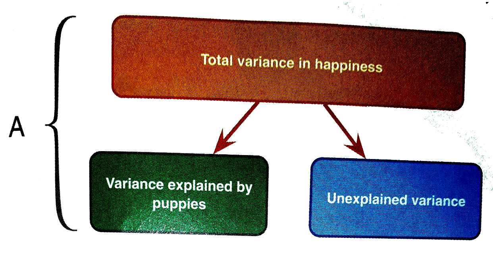

## Example

Puppy therapy data: (Field 5\textsuperscript{th} edition, page 576)


* *DV*: **Happiness**
* *IV*: **Dose**
    1. control
    2. 15 minutes puppy therapy
    3. 30 minutes puppy therapy
    \pause
* *Covariate*: **Puppy love** 
    * love of puppies 0--7


## Assumptions  ANCOVA

* Independent observations
* Normally distributed errors
* Homogeneity of variances (equal group variances) 
  * also called **Homoscedasticity**

\vfil\pause
  
plus:

* Linear relation between dependent variable and covariate
* Homogeneity of regression slopes
* Independence of treatment and covariate 
  * all treatment groups have equal means on the covariate


## Steps 

1. Measurement level of the variables
2. Check for outliers
3. Normality Assumption (in each group)
4. Linearity (in each group)
5. Homoscedasticity Assumption
6. Homogeneity of Regression
7. Multicollinearity (if multiple covariates)
8. Check Analysis Result

## Steps 

1. Measurement level of the variables
2. Check for outliers
3. Normality Assumption (in each group)
4. Linearity (in each group)
5. Homoscedasticity Assumption
6. Homogeneity of Regression
7. Multicollinearity (if multiple covariates)
    * **Independence of experimental manipulation and covariate!**
8. Check Analysis Result


## 

```{r, echo=FALSE, fig.align="center",  out.width = '70%'}

```


## 

```{r, echo=FALSE, fig.align="center",  out.width = '70%'}
knitr::include_graphics("picts/ancova_assumtion_2.png")
```

\pause\vfill

```{r, echo=FALSE, fig.align="center",  out.width = '60%'}
knitr::include_graphics("picts/ancova_assumtion_3.png")
```


