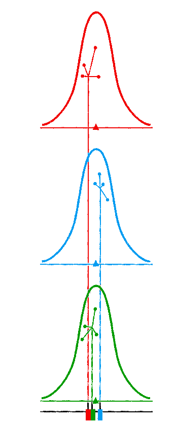
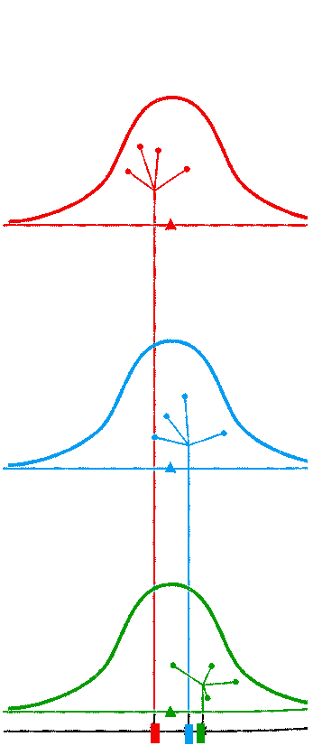

```{r echo=FALSE}
library(knitr)
vspace <- function(px) {
  paste0("<p style='padding-top: ", px, "px;'></p>\n")
}
```


# Outline

* ANOVA
  * Basic theory: F-test, ANOVA table, effect size
* ANOVA versus ANCOVA 
* Example ANCOVA, reporting results
* Assumptions in AN(C)OVA


<!-- - - - - - - - - - - - - - - - - - - - - - - - - - - - - - - - - - - (2) -->
---
# ANOVA                                                              

`r vspace(20)`

* Comparing several group means
  *  *Assignment*: Is there, on average, a difference between youths who are 
      1. unemployed, 
      2. participating in an education program, and 
      3. in a job in terms of quality of life (QL)? 

--

`r vspace(20)`

* Null hypothesis: (2 types of notation)
  1. $H_0: \mu_1 = \mu_2 = \mu_3$ 
  2. $H_0: \beta_1 = \beta_2 = 0$ 

<!-- - - - - - - - - - - - - - - - - - - - - - - - - - - - - - - - - - - (3) -->
---
# ANOVA: Notation 2
`r vspace(20)`

follows from the GLM, which writes ANOVA as regression with dummies:
`r vspace(20)`
$$Y = b_0 + b_1*\text{dummy}_1 + b_2 * \text{dummy}_2$$
`r vspace(20)`

where several types of dummy-coding are possible depending on the specific research hypotheses.

<!-- - - - - - - - - - - - - - - - - - - - - - - - - - - - - - - - - - - (4) -->
---
# General ANOVA

## Step 1:  $F$-test
$$H_0:\; \mu_1 = \mu_2 = \mu_3$$
<br>

--
## Step 2: ANOVA Follow-up

.pull-left[
**Post-hoc tests**: <br>Pairwise comparisons, *t*-tests: 
$$\begin{align}
H_0:&\; \mu_1=\mu_2 \\
H_0:&\; \mu_2=\mu_3 \\
H_0:&\; \mu_1=\mu_3 
\end{align}$$
]

.pull-right[
**Contrasts**:<br> *t*-tests of **specific hypotheses** <br>e.g.:
$$\begin{align} 
H_0:& \mu_1 = \frac{\mu_2+\mu_3}{2} \\
H_0:& \mu_2=\mu_3
\\\end{align}$$

]

<!-- - - - - - - - - - - - - - - - - - - - - - - - - - - - - - - - - - - (5) -->
---
# Basic Principle of Analysis of Variances

.pull-left[
$$\begin{align} 
F &= {\text{MS}_{between} \over \text{MS}_{within}}\\[1ex]
 &= {\text{differences between group} \over \text{differences within groups} }\\[1ex]
 &= {\text{systematic var.} \over \text{error var.} }
\end{align}$$
]

--
.pull-right[.small[
`r vspace(5)`

.eur-color[**Rational:**]

**If the $F$ ratio is substantially greater 1 (in that case $p < .05$), we conclude that the population means differ.**]]

--

`r vspace(60)`

* $\text{MS}_{between}$ is also referred to as $\text{MS}_{Model}$ 
* $\text{MS}_{within}$ is also referred to as $\text{MS}_{Residual}$


<!-- - - - - - - - - - - - - - - - - - - - - - - - - - - - - - - - - - - (6) -->
---
class: center, small

## If $H_0$ is true

.pull-left[
Small variation **within groups**
```{r, echo=FALSE, fig.align="center",  out.width = '400px', out.height= '450px'}

```

Small variation **between group means**
]

--

.pull-right[
Large variation **within groups**
```{r, echo=FALSE, fig.align="center",  out.width = '400px', out.height= '450px'}

```

Large variation **between group means**
]


<!-- - - - - - - - - - - - - - - - - - - - - - - - - - - - - - - - - - - (7) -->
---
class: center, small

.pull-left[
## $H_0$ is true

```{r, echo=FALSE, fig.align="center",  out.width = '400px', out.height= '450px'}

```

Within- and between-group variation are approximately **equal**
]

--

.pull-right[
## $H_0$ is not true 


```{r, echo=FALSE, fig.align="center",  out.width = '400px', out.height= '450px'}

```

Between-group variation is clearly **larger** than within-group variation
]


<!-- - - - - - - - - - - - - - - - - - - - - - - - - - - - - - - - - - - (8) -->
---

# ANOVA by Hand

* Suppose we want to evaluate some interventions meant to improve quality of life (QL) in unemployed youths with intellectual disability, and we distinguish between:
  1. Unemployed (waiting list control)
  2. Educational program
  3. Job
  
  
* The Outcome/Dependent Variable (DV) was a self-report questionnaire score on a scale from 1 (poor QL) to 10 (high QL) after being two months in the program (T1QL).

<!-- - - - - - - - - - - - - - - - - - - - - - - - - - - - - - - - - - - (9) -->
---
class: gray-rows
# The Data

```{r echo=FALSE}
df = data.frame(I = c("","","","",""),
                 unemployed = c(3,2,1,1,4),
                 eduction   = c(5,2,4,2,3),
                 job        = c(7,4,5,3,6))

m = c(mean(df$unemployed), mean(df$eduction), mean(df$job))
s = c(sd(df$unemployed), sd(df$eduction), sd(df$job))
s2 = c(var(df$unemployed), var(df$eduction), var(df$job))
all = c(df$unemployed, df$eduction, df$job)
```

.pull-left[
|           |  unempl.| education | job| 
|:---------:|:-------:|:---------:|:--:|
|           | 3 |   5 |  7 | 
|           | 2 |   2 |  4 | 
|           | 1 |   4 |  5 | 
|           | 1 |   2 |  3 | 
|           | 4 |   3 |  6 | 
|           |   |     |    | 
| $\bar{X}$ | `r round(m[1], 3)` | `r round(m[2], 3)`   |  `r round(m[3], 3)` | 
| $s$       | `r round(s[1], 3)` | `r round(s[2], 3)`   |  `r round(s[3], 3)` | 
| $s^2$     | `r round(s2[1], 3)`| `r round(s2[2], 3)`  | `r round(s2[3], 3)` | 
]

.pull-right[
$$\begin{align}
\text{Grand mean} &=`r round(mean(all), 3)` \\[2ex]
\text{Grand SD}   &=`r round(sd(all), 3)` \\[2ex]
\text{Grand Variance} &=`r round(var(all), 3)`
\end{align}$$
]

<!-- - - - - - - - - - - - - - - - - - - - - - - - - - - - - - - - - - - (10) -->
---
class: gray-rows

# Results: ANOVA Table
```{r, echo=FALSE}

res_tab = data.frame(Source=c("Model", "Residual", "Total"),
                     SS = c(20.14, 23.60, 43.74),
                     df = c(2, 12, 13),
                     MS = c(10.067, 1.967, NA),
                     F = c("$5.12^{*}$", NA, NA)
                     )
tmp = res_tab
tmp$F=c(NA, NA, NA)
tmp$MS=tmp$F
tmp$df=tmp$F
tmp$SS=tmp$F
options(knitr.kable.NA = '')
```

`r vspace(80)`
```{r, echo=FALSE, results='markup'}
kable(tmp, align="lcc")
```


<!-- - - - - - - - - - - - - - - - - - - - - - - - - - - - - - - - - - - (11) -->
---
class: gray-rows
# Results: ANOVA Table
`r vspace(80)`
```{r, echo=FALSE, results='markup'}
tmp$SS = res_tab$SS
kable(tmp, align="lcc")
```

<!-- - - - - - - - - - - - - - - - - - - - - - - - - - - - - - - - - - - (12) -->
---
class: gray-rows
# Results: ANOVA Table
`r vspace(80)`
```{r, echo=FALSE, results='markup'}
tmp$df = res_tab$df
kable(tmp, align="lcc")
```

<!-- - - - - - - - - - - - - - - - - - - - - - - - - - - - - - - - - - - (13) -->
---
class: gray-rows
# Results: ANOVA Table
`r vspace(80)`
```{r, echo=FALSE, results='markup'}
tmp$MS = res_tab$MS
kable(tmp, align="lcc")
```

<!-- - - - - - - - - - - - - - - - - - - - - - - - - - - - - - - - - - - (14) -->
---
class: gray-rows
# Results: ANOVA Table
`r vspace(80)`
```{r, echo=FALSE, results='markup'}
tmp$F = res_tab$F
kable(tmp, align="lcc")
```

--
`r vspace(20)`

There is at least one significant difference between the three groups with respect to the average quality of life, $$F(2,11) = 5.12, p < .05\;.$$

<!-- - - - - - - - - - - - - - - - - - - - - - - - - - - - - - - - - - - (15) -->
---
class: middle, center, inverse

# Any questions?


